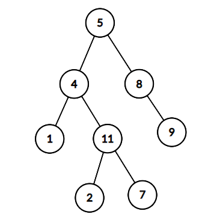
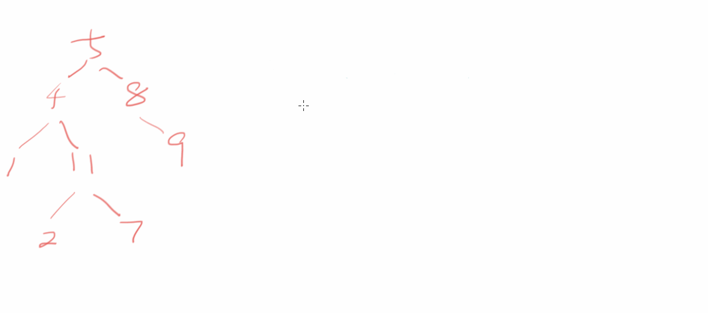

# 二叉树中和为某一值的路径
[[toc]]

## 0.题目
给定一个二叉树root和一个值 sum ，判断是否有从根节点到叶子节点的节点值之和等于 sum 的路径。
1. 该题路径定义为从树的根结点开始往下一直到叶子结点所经过的结点
2. 叶子节点是指没有子节点的节点
3. 路径只能从父节点到子节点，不能从子节点到父节点
4. 总节点数目为n
例如：
给出如下的二叉树， sum=22 sum=22



返回true，因为存在一条路径 5→ 4→ 11→ 25→4→11→2的节点值之和为 22

数据范围：
1.树上的节点数满足 0 < n < 100000≤n≤10000
2.每 个节点的值都满足 |val| < 1000∣val∣≤1000

要求：空间复杂度 O(n)，时间复杂度 O(n)
进阶：空间复杂度 O(树的高度)，时间复杂度 O(n)

## 2.思路



## 3.代码
```java
package learn.note.algorithm.binarytree;

/**
 * @Author Wang WenLei
 * @Date 2022/3/12 11:01
 * @Version 1.0
 **/
public class Bm29_HasPathSum {
    public static void main(String[] args) {
        TreeNode tree = CreateTree.createTree();

        boolean b = hasPathSum(tree, 1);
        System.out.println(b);
    }

    public static boolean hasPathSum (TreeNode root, int sum) {
        return hasPathSum(root,sum,0);
    }

    public static boolean hasPathSum (TreeNode root, int sum, int add) {
        if (root == null) {
            return false;
        }
        add += root.val;
        boolean b = hasPathSum(root.left, sum,add);
        if (b) {
            return true;
        }

        if (add == sum && root.left == null && root.right == null) {
            return true;
        }
        if (add < sum && root.left == null && root.right == null) {
            add -= root.val;
        }
        boolean c = hasPathSum(root.right,sum,add);
        if (c) {
            return true;
        }
        return false;
    }
}
```
