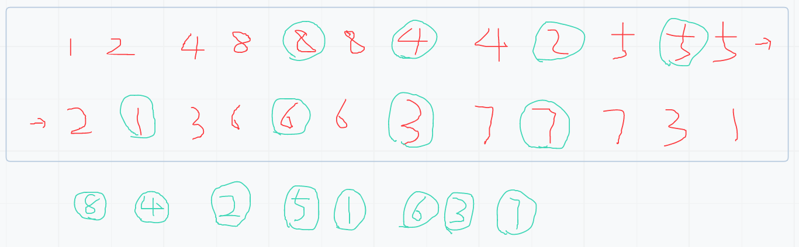
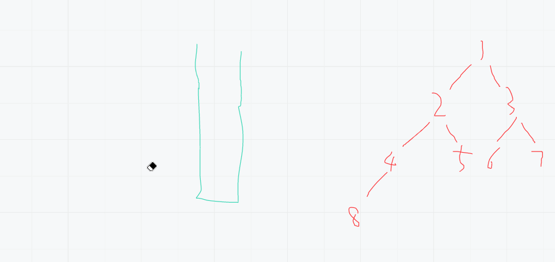

# （二）二叉树之中序遍历
[[toc]]
## 0.前言
先左结点再结点最后右结点，每个结点如此形成的顺序为中序遍历。
## 1.递归遍历
### 1.1思路
依照递归结构，在第二区域输出即为中序遍历。



### 1.2代码
```java
package learn.note.algorithm.binarytree;

import java.util.ArrayList;
import java.util.List;
import java.util.Stack;

/**
 * @author WangWenLei
 * @DATE: 2022/3/9
 **/
public class Main {
    public static TreeNode createTree () {
        TreeNode node1 = new TreeNode(1);
        TreeNode node2 = new TreeNode(2);
        TreeNode node3 = new TreeNode(3);
        TreeNode node4 = new TreeNode(4);
        TreeNode node5 = new TreeNode(5);
        TreeNode node6 = new TreeNode(6);
        TreeNode node7 = new TreeNode(7);
        TreeNode node8 = new TreeNode(8);

        node1.left = node2;
        node1.right = node3;
        node2.left = node4;
        node2.right = node5;
        node3.left = node6;
        node3.right = node7;
        node4.left = node8;

        return node1;
    }

    public static void main(String[] args) {
        TreeNode root = createTree();
        int[] ints = inorderTraversal(root);
        System.out.println(ints);
    }

    /**
     * 中序遍历-递归
     * @param root 根节点
     * @return 所有节点的数组
     */
    public static int[] inorderTraversal (TreeNode root) {
        List<TreeNode> list = new ArrayList<>();
        inorderTraversal(root,list);
        int [] data = new int[list.size()];
        for (int i = 0 ; i < list.size() ; i++) {
            data[i] = list.get(i).val;
        }
        return data;
    }

    public static void inorderTraversal (TreeNode root, List<TreeNode> list) {
        if (root == null) {
            return;
        }
        inorderTraversal(root.left,list);
        list.add(root);
        inorderTraversal(root.right,list);
    }
}
```

## 2.非递归遍历
### 2.1思路
1. 抓住一个结点，一直找到左结点的最深处，每一个都进栈
2. 弹出就打印
3. 把右结点的整棵树按照如上流程周而复始




### 2.2代码
```java
/**
    * 中序遍历-非递归
    * @param root 根节点
    * @return 所有节点的数组
    */
public static int[] inorderTraversalNotRecursion (TreeNode root) {
    List<TreeNode> list = new ArrayList<>();
    if (root == null) {
        return new int[] {};
    }
    Stack<TreeNode> stack = new Stack<>();
    TreeNode cur = root;
    while (!stack.empty() || cur != null) {
        if (cur != null) {
            stack.push(cur);
            cur = cur.left;
        } else {
            cur = stack.pop();
            // 弹出就打印
            list.add(cur);
            // 结点移动到右结点上去周而复始，让右树重复操作
            cur = cur.right;
        }
    }
    int [] data = new int[list.size()];
    for (int i = 0 ; i < list.size() ; i++) {
        data[i] = list.get(i).val;
    }
    return data;
}
```

### 2.3 Coding遇到的问题点
1. 头结点放入的时机：把头结点放入栈中的时机成为周而复始的一部分，每一次都是一个头结点，注意非null
2. 深入到左树最深层后怎么切换到右树：栈中放入当前结点，而不是放左结点或右结点。用左结点或右结点替换当前结点达到移动的目的。
3. 切换右树如何完成周而复始：每一次都当做是一个头结点处理，用左结点或右结点替换当前结点达到移动的目的，完成周而复始。
