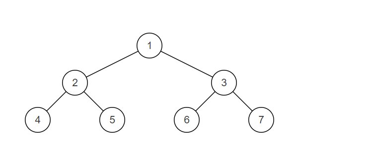
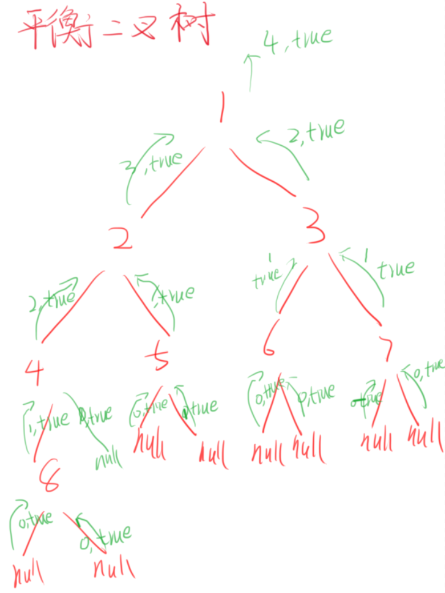

# 判断二叉树是否是平衡二叉树
[[toc]]
## 0.题目
输入一棵节点数为 n 二叉树，判断该二叉树是否是平衡二叉树。
在这里，我们只需要考虑其平衡性，不需要考虑其是不是排序二叉树
平衡二叉树（Balanced Binary Tree），具有以下性质：它是一棵空树或它的左右两个子树的高度差的绝对值不超过1，并且左右两个子树都是一棵平衡二叉树。
样例解释：



样例二叉树如图，为一颗平衡二叉树
注：我们约定空树是平衡二叉树。
数据范围：n \le 100n≤100,树上节点的val值满足 0 ≤n ≤ 1000
要求：空间复杂度O(1)，时间复杂度 O(n)

输入描述：
输入一棵二叉树的根节点
返回值描述：
输出一个布尔类型的值


示例1
```
输入：
{1,2,3,4,5,6,7}
返回值：
true
```

示例2
```
输入：
{}
返回值：
true
```

## 1.思路
### 1.1罗列可能性
通过左右子树信息什么条件才使二叉树是平衡二叉树成立。
1. 左子树是平衡二叉树
2. 右子树是平衡二叉树
3. |左子树 - 右子树| <= 1

3个条件同时成立则这个结点构成的树是平衡二叉树

### 1.2构建返回体
左树：
1. 左树是否是平衡二叉树
2. 左树高度

右树：
1. 右树是否是平衡二叉树
2. 右树高度

两边一样则返回体有2个参数，是否是平衡二叉树，高度。

### 1.3返回参数求解逻辑
是否是平衡二叉树：(左子树是平衡二叉树 && 右子树是平衡二叉树 && |左子树 - 右子树| <= 1)
高度：
1. 叶子结点下面，空节点返回高度为0
2. 根据后续遍历特性，从底向上遍历，所以得到左右子树最大值向上递增1，即可得到每层的高度



## 2.代码
```java
public class Bm36_IsBalanced {
    public static void main(String[] args) {
        TreeNode tree = CreateTree.createTree();
        IsBalanced_Solution(tree);
    }

    public static boolean IsBalanced_Solution(TreeNode root) {
        return isBalanced(root).isBalanced;
    }

    public static IsBalanced isBalanced(TreeNode root) {
        if (root == null) {
            return new IsBalanced(true,0);
        }

        IsBalanced left = isBalanced(root.left);
        IsBalanced right = isBalanced(root.right);
        boolean is = left.isBalanced && right.isBalanced && (Math.abs(left.height - right.height) <= 1);
        int height = Math.max(left.height,right.height) + 1;
        return new IsBalanced(is,height);
    }

    public static class IsBalanced {
        public boolean isBalanced;
        public int height;
        public IsBalanced(boolean isBalanced, int height) {
            this.height = height;
            this.isBalanced = isBalanced;
        }
    }
}
```
