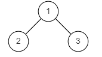
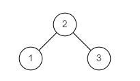

# 判断二叉树是否是搜索二叉树
[[toc]]
## 0.题目
给定一个二叉树根节点，请你判断这棵树是不是二叉搜索树。

二叉搜索树满足每个节点的左子树上的所有节点均小于当前节点且右子树上的所有节点均大于当前节点。

例：

图1

图2

示例1
```
输入：
{1,2,3}
返回值：
false
说明：
如题面图1 
```
示例2
```
输入：
{2,1,3}
返回值：
true
说明：
如题面图2 
```

## 1.思路

## 2.代码
```java
package learn.note.algorithm.binarytree;

public class Bm34_IsValidBST {

    public static void main(String[] args) {
        TreeNode tree = CreateTree.createTree();
        boolean validBST = isValidBST(new TreeNode(2));

    }

    public static boolean isValidBST (TreeNode root) {
        Node resport = resport(root);
        return resport.isBST;
    }

    public static Node resport (TreeNode root) {
        if (root == null) {
            return new Node(Integer.MAX_VALUE,Integer.MIN_VALUE,true);
        }

        Node left = resport(root.left);
        Node right = resport(root.right);
        boolean isBst = (left.max < root.val) && (right.min > root.val);
        return new Node(Math.min(Math.min(root.val,left.min),right.min),Math.max(Math.max(root.val,left.max),right.max),(left.isBST && right.isBST && isBst));
    }

    public static class Node {
        Integer min;
        Integer max;
        boolean isBST;

        public Node(Integer min,Integer max,boolean isBST) {
            this.min = min;
            this.max = max;
            this.isBST = isBST;
        }
    }
}
```
