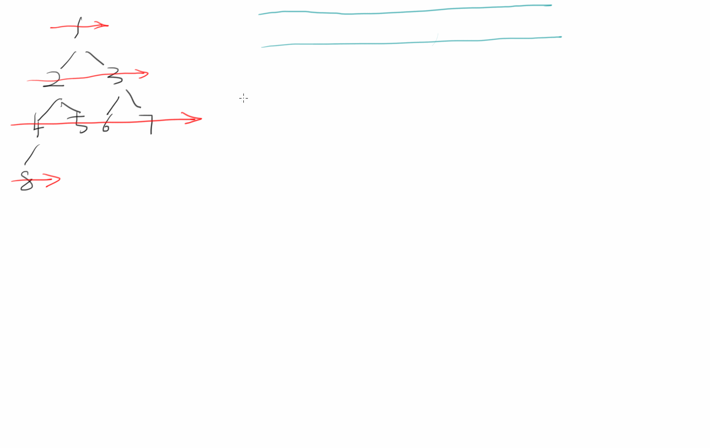

# 二叉树的层序遍历

## 0.题目
描述
给定一个二叉树，返回该二叉树层序遍历的结果，（从左到右，一层一层地遍历）
例如：
给定的二叉树是{3,9,20,#,#,15,7},
该二叉树层序遍历的结果是
[
[3],
[9,20],
[15,7]
]
提示:
0 <= 二叉树的结点数 <= 1500

示例1
```
输入：
{1,2}

返回值：
[[1],[2]]
```

示例2
```
输入：
{1,2,3,4,#,#,5}

返回值：
[[1],[2,3],[4,5]]
```

## 1.使用哈希表
### 1.1思路



### 1.2代码
```java
package learn.note.algorithm.binarytree;

import java.util.*;

/**
 * @Author Wang WenLei
 * @Date 2022/3/10 23:45
 * @Version 1.0
 **/
public class LevelOrder {
    public static TreeNode createTree () {
        TreeNode node1 = new TreeNode(1);
        TreeNode node2 = new TreeNode(2);
        TreeNode node3 = new TreeNode(3);
        TreeNode node4 = new TreeNode(4);
        TreeNode node5 = new TreeNode(5);
        TreeNode node6 = new TreeNode(6);
        TreeNode node7 = new TreeNode(7);
        TreeNode node8 = new TreeNode(8);

        node1.left = node2;
        node1.right = node3;
        node2.left = node4;
        node2.right = node5;
        node3.left = node6;
        node3.right = node7;
        node4.left = node8;

        return node1;
    }

    public static void main(String[] args) {
        TreeNode tree = createTree();
        ArrayList<ArrayList<Integer>> arrayLists = levelOrder(tree);
        System.out.println(arrayLists);
    }

    public static ArrayList<ArrayList<Integer>> levelOrder (TreeNode root) {
        if (root == null) {
            return new ArrayList<>();
        }
        Queue<TreeNode> queue = new LinkedList<>();
        int curLevel = 1;
        int curCount = 0;
        Map<TreeNode,Integer> map = new HashMap<>();
        ArrayList<Integer> list = new ArrayList<>();
        ArrayList<ArrayList<Integer>> lists = new ArrayList<>();
        queue.add(root);
        map.put(root,curLevel);
        while (!queue.isEmpty()) {
            TreeNode poll = queue.poll();
            Integer integer = map.get(poll);
            if (integer == curLevel) {
                curCount ++;
                list.add(poll.val);
            } else {
                curLevel ++;
                lists.add(list);
                list = new ArrayList<>();
                list.add(poll.val);
            }
            if (poll.left != null) {
                queue.add(poll.left);
                map.put(poll.left,curLevel + 1);
            }
            if (poll.right != null) {
                queue.add(poll.right);
                map.put(poll.right,curLevel + 1);
            }
        }
        if (!list.isEmpty()) {
            lists.add(list);
        }
        return lists;
    }
}
```

## 2.使用几个变量
### 2.1思路

### 2.2代码