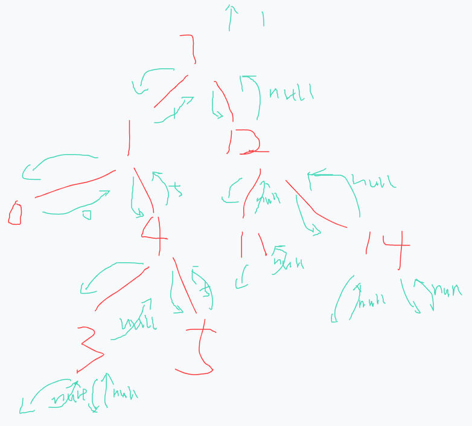

# 在二叉树中找到两个结点的最近公共祖先
[[toc]]
## 0.题目

## 1.递归解法
### 1.1原理



### 1.2.代码
```java
public class Bm38_LowestCommonAncestor {
    public static void main(String[] args) {
        TreeNode tree = CreateTree.createTree();
        lowestCommonAncestor(tree,2,3);
    }

    public static int lowestCommonAncestor (TreeNode root, int o1, int o2) {
        return commonAncestor (root, o1, o2).val;
    }

    public static TreeNode commonAncestor (TreeNode root, int o1, int o2) {
        if (root == null || root.val == o1 || root.val == o2) {
            return root;
        }
        TreeNode left = commonAncestor(root.left,o1,o2);
        TreeNode right = commonAncestor(root.right,o1,o2);
        if (left == null) {
            return right;
        }
        if (right == null) {
            return left;
        }
        return root;
    }
}
```

## 2.非递归解法
宽度遍历，保存走过元素所有的父节点

```java
    public static Integer commonAncestorNo (TreeNode root ,int o1,int o2) {
        if (root == null) {
            return Integer.MAX_VALUE;
        }
        Queue<TreeNode> queue = new LinkedList<>();
        Map<Integer,Integer> map = new HashMap<>();

        queue.add(root);
        map.put(root.val,Integer.MAX_VALUE);
        while (!map.containsKey(o1) || !map.containsKey(o2)) {
            TreeNode poll = queue.poll();
            if (poll != null && poll.left != null) {
                map.put(poll.left.val,poll.val);
                queue.add(poll.left);
            }

            if (poll != null && poll.right != null) {
                map.put(poll.right.val,poll.val);
                queue.add(poll.right);
            }
        }
        Set<Integer> set = new HashSet<>();
        while (map.containsKey(o1)) {
            set.add(o1);
            o1 = map.get(o1);
        }
        // 不在o1的路径上，就去找它的父，直到找到一个在o1路径上的，那这个就是
        while (!set.contains(o2)) {
            o2 = map.get(o2);
        }
        return o2;
    }
```
