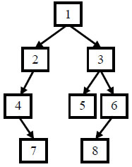
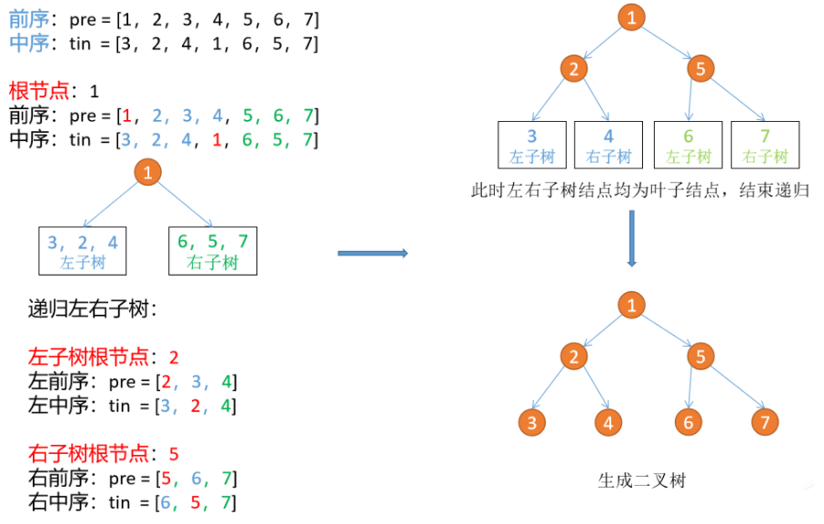

# 重建二叉树
[[toc]]
## 0.题目
给定节点数为 n 的二叉树的前序遍历和中序遍历结果，请重建出该二叉树并返回它的头结点。
例如输入前序遍历序列{1,2,4,7,3,5,6,8}和中序遍历序列{4,7,2,1,5,3,8,6}，则重建出如下图所示。



提示:
1.vin.length == pre.length
2.pre 和 vin 均无重复元素
3.vin出现的元素均出现在 pre里
4.只需要返回根结点，系统会自动输出整颗树做答案对比
数据范围：n≤2000，节点的值 −10000≤val≤10000
要求：空间复杂度 O(n)，时间复杂度 O(n)
示例1
输入：
[1,2,4,7,3,5,6,8],[4,7,2,1,5,3,8,6]
返回值：
{1,2,3,4,#,5,6,#,7,#,#,8}
说明：
返回根节点，系统会输出整颗二叉树对比结果，重建结果如题面图示    
示例2
输入：
[1],[1]
返回值：
{1}
示例3
输入：
[1,2,3,4,5,6,7],[3,2,4,1,6,5,7]
返回值：
{1,2,5,3,4,6,7}

## 1.思路

根据中序遍历和前序遍历可以确定二叉树，具体过程为：

根据前序序列第一个结点确定根结点
根据根结点在中序序列中的位置分割出左右两个子序列
对左子树和右子树分别递归使用同样的方法继续分解
例如：
前序序列{1,2,3,4,5,6,7} = pre
中序序列{3,2,4,1,6,5,7} = in

1. 根据当前前序序列的第一个结点确定根结点，为 1
2. 找到 1 在中序遍历序列中的位置，为 in[3]
3. 切割左右子树，则 in[3] 前面的为左子树， in[3] 后面的为右子树
4. 则切割后的左子树前序序列为：{3,2,4}，切割后的左子树中序序列为：{6,5,7}；切割后的右子树前序序列为：{2,3,4}，切割后的右子树中序序列为：{5,6,7}
5. 对子树分别使用同样的方法分解



## 2.代码
```java
public TreeNode reConstructBinaryTree(int [] pre,int [] vin) {
    if (pre == null || pre.length == 0) {
        return  null;
    }
    if (vin == null || vin.length == 0) {
        return  null;
    }
    TreeNode root = new TreeNode(pre[0]);
    for (int i = 0 ; i < vin.length ; i++) {
        if (vin[i] == pre[0]) {
            root.left = reConstructBinaryTree(Arrays.copyOfRange(pre,1,i + 1),Arrays.copyOfRange(vin,0,i));
            root.right = reConstructBinaryTree(Arrays.copyOfRange(pre,i + 1,pre.length),Arrays.copyOfRange(vin,i + 1,vin.length));
            break;
        }
    }
    return root;
}
```
