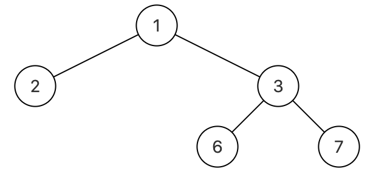

# 序列化二叉树
[[toc]]
## 0.题目
请实现两个函数，分别用来序列化和反序列化二叉树，不对序列化之后的字符串进行约束，但要求能够根据序列化之后的字符串重新构造出一棵与原二叉树相同的树。

二叉树的序列化(Serialize)是指：把一棵二叉树按照某种遍历方式的结果以某种格式保存为字符串，从而使得内存中建立起来的二叉树可以持久保存。序列化可以基于先序、中序、后序、层序的二叉树等遍历方式来进行修改，序列化的结果是一个字符串，序列化时通过 某种符号表示空节点（#）

二叉树的反序列化(Deserialize)是指：根据某种遍历顺序得到的序列化字符串结果str，重构二叉树。

例如，可以根据层序遍历的方案序列化，如下图:



层序序列化(即用函数Serialize转化)如上的二叉树转为"{1,2,3,#,#,6,7}"，再能够调用反序列化(Deserialize)将"{1,2,3,#,#,6,7}"构造成如上的二叉树。

当然你也可以根据满二叉树结点位置的标号规律来序列化，还可以根据先序遍历和中序遍历的结果来序列化。不对序列化之后的字符串进行约束，所以欢迎各种奇思妙想。

数据范围：节点数 n \le 100n≤100，树上每个节点的值满足 0≤val≤150
要求：序列化和反序列化都是空间复杂度 O(n)，时间复杂度 O(n)

示例1
```
输入：
{1,2,3,#,#,6,7}
返回值：
{1,2,3,#,#,6,7}
说明：
如题面图   
```
示例2
```
输入：
{8,6,10,5,7,9,11}
返回值：
{8,6,10,5,7,9,11}
```

## 1.按题意层序遍历的序列化和反序列化

```java
package learn.note.algorithm.binarytree;

import java.util.LinkedList;
import java.util.Queue;

/**
 * @author WangWenLei
 * @DATE: 2022/3/22
 **/
public class Bm39_Serialize {
    public static void main(String[] args) {
        TreeNode tree = CreateTree.createTree();
        String s = Serialize(tree);
        System.out.println(s );
        TreeNode deserialize = Deserialize(s );
        System.out.println(deserialize);
    }

    public static String Serialize(TreeNode root) {
        if (root == null) {
            return "#";
        }
        String left = Serialize1(root.left);
        String right = Serialize1(root.right);
        return root.val + "_" + left + "_" + right;
    }

    public static TreeNode Deserialize(String str) {
        if (str == null || str.isEmpty() || str.trim().isEmpty()) {
            return null;
        }
        if ("#".equals(str)) {
            return null;
        }
        String[] s = str.split("_");
        TreeNode tree  = new TreeNode(Integer.parseInt(s[0]));
        TreeNode cur = tree;
        Stack<TreeNode> stack = new Stack<>();
        stack.add(cur);
        for(int i = 1 ; i < s.length ; i++) {
            if ("#".equals(s[i])) {
                TreeNode pop = null;
                if ("#".equals(s[i - 1])) {
                    pop = stack.pop();
                } else {
                    pop = cur;
                }
                cur = pop.right;
                if (pop.right == null) {
                    cur = pop;
                }
            } else {
                if ("#".equals(s[i - 1])) {
                    cur.right = new TreeNode(Integer.parseInt(s[i]));
                    cur = cur.right;
                } else {
                    cur.left = new TreeNode(Integer.parseInt(s[i]));
                    cur = cur.left;
                }
                stack.add(cur);
            }
        }
        return tree;
    }
}

```

## 2.先序遍历的序列化和反序列化
```java
package learn.note.algorithm.binarytree;

import java.util.LinkedList;
import java.util.Queue;
import java.util.Stack;

/**
 * @author WangWenLei
 * @DATE: 2022/3/22
 **/
public class Bm39_Serialize {
    public static void main(String[] args) {
        TreeNode tree = CreateTree.createTree();
        String s = Serialize(tree);
        System.out.println(s );
        TreeNode deserialize = Deserialize(s );
        System.out.println(deserialize);
    }

    public static String Serialize(TreeNode root) {
        if (root == null) {
            return "#";
        }
        Queue<TreeNode> queue = new LinkedList<>();
        queue.add(root);
        StringBuilder str = new StringBuilder();
        while (!queue.isEmpty()) {
            TreeNode poll = queue.poll();
            if (poll != null) {
                str.append("_").append(poll.val);
            } else {
                str.append("_#");
            }
            if (poll != null) {
                queue.add(poll.left);
                queue.add(poll.right);
            }
        }
        return str.toString().substring(1);
    }
    public static TreeNode Deserialize(String str) {
        if (str == null || str.isEmpty() || str.trim().isEmpty()) {
            return null;
        }
        if ("#".equals(str)) {
            return null;
        }
        String[] s = str.split("_");
        TreeNode tree  = new TreeNode(Integer.parseInt(s[0]));
        Queue<TreeNode> queue = new LinkedList<>();
        queue.add(tree);
        for(int i = 1 ; i < s.length - 1 ; i += 2) {
            TreeNode poll = queue.poll();
            if (poll != null) {
                if (!"#".equals(s[i])) {
                    poll.left = new TreeNode(Integer.parseInt(s[i]));
                    queue.add(poll.left);
                }

                if (!"#".equals(s[i + 1])) {
                    poll.right = new TreeNode(Integer.parseInt(s[i + 1]));
                    queue.add(poll.right);
                }
            }
        }
        return tree;
    }
}

```
