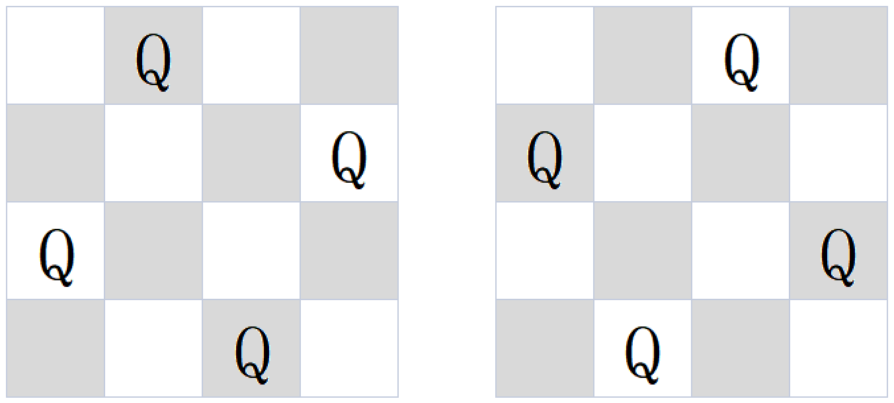

# N皇后问题
[[toc]]

## 题目
N 皇后问题是指在 n * n 的棋盘上要摆 n 个皇后，
要求：任何两个皇后不同行，不同列也不在同一条斜线上，
求给一个整数 n ，返回 n 皇后的摆法数。

数据范围: 1≤n≤9



## 解题思路


## 解题思路学习
[2小时27分24秒左神讲算法](https://www.bilibili.com/video/BV13g41157hK?p=10&vd_source=fd5e0f3c8528dd8670e2db083a720f67)

## 解题代码
```java
import java.util.*;

public class Solution {
    public int Nqueen (int n) {
        if (n <= 0) {
            return 0;
        }
        if (n == 1) {
            return 1;
        }
        int sign [] = new int[n];
        return despose(sign,0);
    }
    
    private int despose(int sign [],int h) {
        if (h == sign.length) {
            return 1;
        }
        int res = 0;
        for (int i = 0 ; i < sign.length ; i ++) {
            if (isVaild(sign,i,h)) {
                sign[h] = i;
                res += despose(sign,h + 1);
            }   
        }
        return res;
    }
    
    private boolean isVaild(int sign [],int w,int h) {
        for (int i = 0 ; i < h ; i++) {
            if (sign[i] == w || Math.abs(w - sign[i]) == Math.abs(h - i)) {
                return false;
            }
        }
        return true;
    }
}
```
