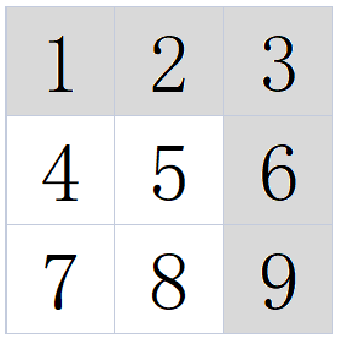

# 矩阵最长路径
[[toc]]
## 描述
给定一个 n 行 m 列矩阵 matrix ，矩阵内所有数均为非负整数。 你需要在矩阵中找到一条最长路径，使这条路径上的元素是递增的。并输出这条最长路径的长度。

这个路径必须满足以下条件：

1. 对于每个单元格，你可以往上，下，左，右四个方向移动。 你不能在对角线方向上移动或移动到边界外。
2. 你不能走重复的单元格。即每个格子最多只能走一次。

数据范围：1≤n,m≤1000，0≤matrix[i][j]≤1000

进阶：空间复杂度 O(nm)O(nm) ，时间复杂度 O(nm)O(nm)

例如：当输入为[[1,2,3],[4,5,6],[7,8,9]]时，对应的输出为5，

其中的一条最长递增路径如下图所示：



## 解题思路

1. 出口：进入路径最后一个点后，四个方向要么是矩阵边界，要么没有递增的位置，路径不能再增长，返回上一级。
2. 返回值：每次返回的就是本级之后的子问题中查找到的路径长度加上本级的长度。
3. 本级任务：每次进入一级子问题，先初始化后续路径长度为0，然后遍历四个方向（可以用数组表示，下标对数组元素的加减表示去往四个方向），
进入符合不是边界且在递增的邻近位置作为子问题，查找子问题中的递增路径长度。因为有四个方向，所以最多有四种递增路径情况，因此要维护当级子问题的最大值。

## 代码实现
```java
import java.util.*;

public class Solution {
    public int solve (int[][] matrix) {
        if (matrix == null) {
            return 0;
        }
        if (matrix.length == 1 && matrix[0].length == 1) {
            return 1;
        }
        int sign[][] = new int[matrix.length + 1][matrix[0].length + 1];
        int res = 0;
        for(int i = 0; i < matrix.length; i++)
            for(int j = 0; j < matrix[0].length; j++)
                //更新最大值
                res = Math.max(res, dispose(matrix, sign, i, j));
        
        return res;
    }
    
    private int [][] dirs = new int [][]{{0,-1},{0,1},{1,0},{-1,0}};
    private int dispose(int[][] matrix,int sign[][],int i,int j) {
        if (sign[i][j] != 0) {
            return sign[i][j];
        } else {
            sign[i][j] ++;
            for (int k = 0 ; k < 4 ; k++) {
                int nexti = i + dirs[k][0];
                int nextj = j + dirs[k][1];
                if(nexti < matrix.length && nexti >= 0 && 
                   nextj < matrix[0].length && nextj >= 0 && 
                   matrix[nexti][nextj] > matrix[i][j]
                  ) {
                    sign[i][j] = Math.max(sign[i][j],dispose(matrix,sign,nexti,nextj) + 1);
                }
            }
            return sign[i][j];
        }
    }
}
```
