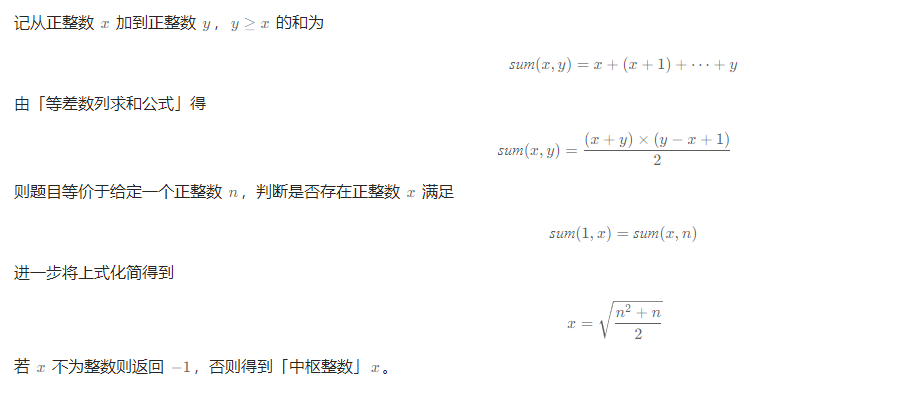

# 找出中枢整数
[[toc]]

题目来自力扣

## 0.描述

给你一个正整数 n ，找出满足下述条件的 中枢整数 x ：

1 和 x 之间的所有元素之和等于 x 和 n 之间所有元素之和。
返回中枢整数 x 。如果不存在中枢整数，则返回 -1 。题目保证对于给定的输入，至多存在一个中枢整数。

示例 1：
> 输入：n = 8
> 
> 输出：6
> 
> 解释：6 是中枢整数，因为 1 + 2 + 3 + 4 + 5 + 6 = 6 + 7 + 8 = 21 。

示例 2：

> 输入：n = 1
> 
> 输出：1
> 
> 解释：1 是中枢整数，因为 1 = 1 。

示例 3：
> 输入：n = 4
> 
> 输出：-1
> 
> 解释：可以证明不存在满足题目要求的整数。


提示：

> 1 <= n <= 1000

## 1.简单实现

### 1.1简单实现思路


### 1.2简单实现代码

```java
class Solution {
    public int pivotInteger(int n) {
        if (n <= 0) {
            return -1;
        }
        if (n == 1) {
            return 1;
        }
        int sum = 0;
        for (int i = 1; i <= n; i++) {
            sum += i;
        }

        int cur = 0;

        for (int i = 1; i <= n; i++) {
            cur += i;
            if (cur == sum) {
                return i;
            }
            sum -= i;
        }
        return -1;
    }
}
```

### 1.3复杂度

时间复杂度：O(n)

空间复杂度：O(1)仅使用常量空间。


## 数学实现

### 2.1思路



### 2.2代码

```java
class Solution {
    public int pivotInteger(int n) {
        int t = (n * n + n) / 2;
        int x = (int) Math.sqrt(t);
        if (x * x == t) {
            return x;
        }
        return -1;
    }
}
```


