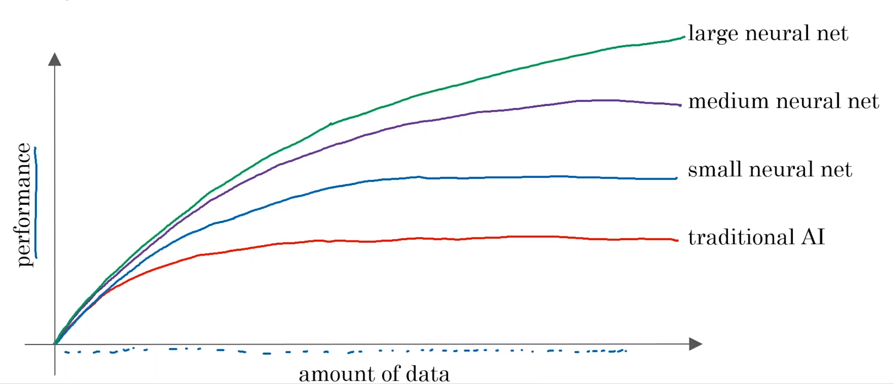
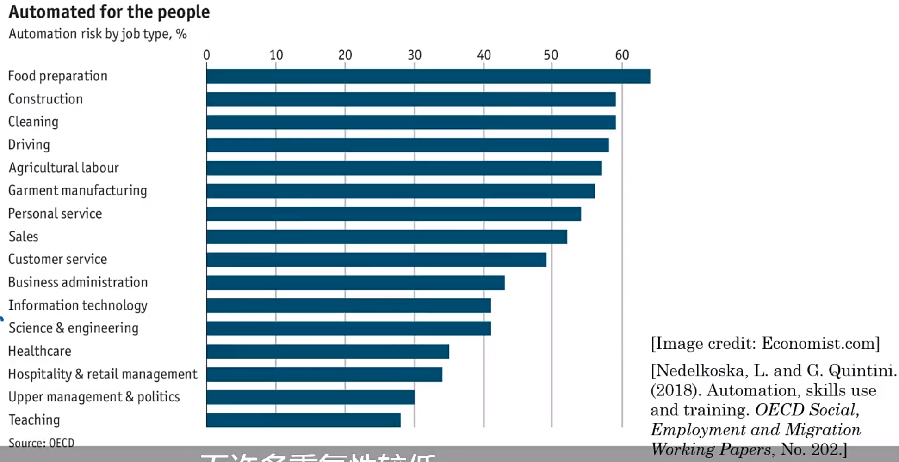

很难想想有哪个行业，咋接下来几年里，人工智能不能对它产生巨大的影响。

# 什么是AI

## AI有两个独立的概念
* ANI(artificial narrow intelligence,弱人工智能)：智能音响、自动驾驶、网络搜索，AI在农业领域或工厂中的应用。单方面成果。但当找到合适的技巧，这可能是非常有价值的。
* AGI(artificial general intelligence,强人工智能)：这是构建AI的目标，他们可以做任何人类能做到的事情，甚至超过人类智能的事和其他，任何人类都做不到的事。

AI的发展得益于一项重要的工具和技术——机器学习

## 什么是机器学习
最常用的机器学习类型，是一种学习如何从A得到B的人工智能，即输入到输出的映射，这种机器学习被称为监督学习（Supervised Learning）
现在2023年十几年前就提出概念，为什么监督学习技术直到现在才发展起来？
* 横轴对应你所拥有的针对某项任务的数据量，在许多行业里，得益于互联网和计算机的兴起，可用数据量在过去的几十年里有了巨量的增长，许多信息得以数字化的形式存储下来，而不再是存储于传统的纸张，因此我们能够获取的数据越来越多
* 纵坐标轴代表人工智能系统的性能

性能与数据量之间的关系：

* 传统人工智能（）：随着数据量提升，性能会逐渐提升。但是当数据量超过一定范围后性能提升并不明显。例如语音识别系统，数据量再增多系统也无法识别地更准确
* 小型神经网络（small neural net）：趋势更长久
* 中等规模的神经网络（medium neural net）：
* 大型神经网络（large neural net）：

由上可以得出影响发展起来的因素，需要大规模的数据、能够训练大型神经网络
超级计算机的发展包含摩尔定律现象、专用处理器的发展（例如图像处理器GPU,Graphics Processing Units）

> 希望你能开始思考，如何能将机器学习应用于你的公司或者行业中

## 什么是数据
数据集：
从A到B的数据的集合。包含A、B

如何获取数据集？
1. 手动标记，可能是几十万。手动标记是同时获取A、B的有效方法
2. 通过观察用户行为或其他类型行为。例如电子商务网站不同物品会有不同的价格观察用户是否购买了产品。工厂运行一台大型机器想要预测是否即将坏掉或故障
3. 从网站上下载或者从合作伙伴那里获取，互联网上有非常非常多的数据集可以免费下载，从计算机视觉或图像数据集到自动驾驶汽车数据集到语音识别数据集、医学成像数据集以及其他很多。因此，如果你的应用需要某一类型的数据，只需要遵守许可和版权的规则，便可直接从网上下载

数据常见的误用
1. 错误思考数据的方式，产生数据就丢给AI团队，AI团队能够及早反馈需要，建立的更好相互促进
2. 很多的数据不一定有用，数据多确实比数据少好，但不要以为有很多数据AI团队就能奇迹般的使他们变得有价值。不要只是为了获取数据而过度投资，除非同时雇佣了一个AI团队来研究这些数据，他们可以帮助指引你去思考哪些数据是有价值的。

数据是散乱的，有一句话”垃圾进垃圾出“，如果数据质量差，那么AI学习不出准确的结果

AI团队需要去解决如何清理数据，如何处理不正确的标签和缺少值的数据。
数据还有很多类型：
图片、视频、文本（人们很容易理解这类非结构化数据）、
表格里的结构化数据
处理非结构化数据要比处理结构化数据要难一些，但无论哪种类型的数据AI都能表现出色。

认真考虑如何获取数据，是一个好的人工智能公司的关键成分。
人工智能公司会建立统一的数据仓库，来提升公司综合利用所有不同数据的能力。如果有50个不同的数据库，那么让一个工程师去50个地方去获取数据，然后综合所有数据进行判断分析，并且得出结论，这集合是不可能的。
自动化

> MLE（机器学习工程师）人工智能公司新岗位

变得擅长人工智能不是神秘的魔法过程，相反的有一个系统的进程。能让很多公司，基本上任何大公司变得擅长人工智能

## 五步人工智能转换手册
推荐给想要有效运用人工智能的公司
1. 启动试点项目获得势头，只需要几个小项目让你对人工智能可以做什么，不可以做什么有更好的了解。并让你体验一下做人工智能项目是什么感觉。这个可以再公司内部做或者外包给一个团队去做
2. 在公司内部建立一个人工智能团队
3. 对团队提供广泛的人工智能培训，这些培训不仅仅提供给工程师，也要提供给项目经理、部门领导和高级管理人员，同时还需要培训他们如何思考人工智能（将会对人工智能有一个更加深刻的理解）
4. 发展你的AI战略
5. 制定一个人工智能策略是十分重要和内外部沟通一致。所有的相关人员，从员工、顾客到投资人都将清楚的知道公司是如何在人工智能兴起中找到前行方向的，人工智能在软件行业提供巨大的价值

## 机器学习能做什么不能做什么
看看数据，看看输入A和输出B，然后直观的思考这些数据能否用在AI上

> 有些CEO会对AI有些不合理的期待，要求工程师做一些AI技术还达不到的事情。造成这样的困扰，是因为媒体和有些学术文献只报道有关使用AI成功的案例，我们会看到一系列成功的故事，但不会报道有些失败的案例

2条经验来判断项目是否可行，是否是一个机器学习的问题。
1. 机器只学习一个“简单的概念”（可以理解成只需要1s或几秒的思考就能的出一个结论）
2. 有大量数据可用会让机器学习更可行。这里数据时输入A和输出B的映射关系

具备判断这个能力可能需要一些AI成功和失败的真实例子。

 
## 开始一个AI项目

### AI项目的工作流程
构建一个AI项目有些感觉

机器学习项目工作流程
第一步收集数据
第二部训练模型，利用机器学习，来学习A映射到B
第三步“派送”模型，一小群使用或很多使用者。不准确的数据回收去维护和更新模型

数据科学项目工作流程
收集数据
分析数据
提出假设和开展行动

### 学会如何选择一个AI项目
考虑具体的人工智能项目时发现，思考如何让AI自动化具体任务，比自动化工作岗位要有用
Think about automating tasks rather than automating jobs.
在所有需要执行的具体任务中，是否能找出一个或几个能使用机器学习进行自动化任务？

驱动业务价值的主要因素有哪些？
有时找到人工智能方案或数据科学方案来增强增强这些因素是十分有价值的。

你的公司或业务中有哪些主要痛点？
这些痛点中有一些可以用AI来解决，有些不能。但了解痛点对找到人工智能项目很有帮助

即使没有大量的数据，也可取的进展的建议（拥有更多数据更好的），小型数据集也有进展。需要的数据量跟问题本身息息相关。与AI工程师或AI专家聊聊会帮助你更好的找到方向。在一开始时不要因为没有很多数据就放弃。  

AI系统能达到什么样的性能 95% 99%？
多少数据能达到这样的性能？有办法获取这么多数据吗？
系统开发需要多长时间？多少人员

很多AI项目为降低成本来推动价值，如：自动执行一些程序，在系统上挤出更高的效率

决定自己亲自建立还是向比人购买，这是IT世界中一个老问题。机器学习项目可以让企业内部做或外包给别人做。
与机器学习项目不同数据科学项目通常在内部完成

最后，在每个行业中，如果有些东西是有行业标准的话，应该避免构建他们。
构建与购买问题的一个共同答案，构建对你来说非常专业或他们将允许你构建独特的防御优势，但如果需要的是具有特殊的行业标准的，那应该购买而不是内部建造它，对你更有效率。

> 不要跟火车冲刺赛跑
> Don't sprint in front of a train

我们生活在一个资源有限、时间有限、数据有限、工程资源有限的世界里，所有希望能把这些资源集中在我们最独特的项目上，以此带来最大的收益。

### 学会如何组织数据和团队

> 鼓励去学习一个或两个机器学习或深度学习、数据科学的网络课程，这样基本上能够有足够的知识去开始合理地尝试去推动这类型的项目

项目能够提供一个验收标准的话，这对人工智能团队起到很大的帮助。
有一组可以用来测量模型表现的数据集，这样才能知道模型是否达到了性能标准（例如：95%的准确率），不需要太大，可能1000数量级——测试集
如果咨询数据专家，他会给出多少数据来测量模型是否达到95%的准确率
思考验收标准是否是统计数据的方式体现出来

数据分为：训练集、测试集

期待准确率100%的思维陷阱
1. 机器学习科技在现在是非常强大的但仍有局限性，他们无法做所有的事情。试图解决一个对当前机器学习技术而言十分困难的问题
2. 数据不足，训练数据不够的话，要得到一个高准确率会是比较困难的
3. 数据混乱、模棱两可的数据：清除标记错误的数据、找到专家就一些不明确标签得出更一致的结论
希望既能通过技术调研有能通过商业调研的并且不必要达到100%准确率的项目

## 构建人工智能系统所使用的工具

机器学习框架
* TensorFlow
* PyTorch
* Keras
* MXNet
* CNTK
* Caffe
* PaddlePaddle
* Scikit-learn
* R
* Weka
网站上自由发布文章，出版物
* Arxiv
开源代码
* GitHub

CPU：计算机的计算处理器
GPU：图形处理单元

云部署、本地部署、边端部署

## 复杂的人工智能产品的研究案例
A映射到B是一个大而且复杂的项目或项目的一部分
### 智能音响
1. 触发识别词
2. 语音识别
3. 意图识别
4. 执行
这样的模型有时被人们称为人工智能管道
4个团队来专注做事很常见的

### 自动驾驶汽车
1. 汽车会接收各种各样的传感器作为输入。汽车探测、行人探测可以通过机器学习来完成
2. 运动规划软件
3. 舵机转动角度、加速、减速、油门

汽车学习、行人探测使用监督学习，不同的传感器
行为探测
## 建立人工智能团队的路线图
角色和承担的责任
软件工程师：软件开发
机器学习工程师：写一些软件用于生成A到B的映射，或者用于创建其他机器学习算法。他们会收集数据，用于训练一个神经网络或训练一个深度学习算法，并且一直迭代以确保学习算法可以持续提供准确的输出
机器学习研究员：负责开发机器学习的前沿技术，机器学习和AI仍在迅速地发展。因此盈利、非盈利公司都有机器学习研究员来负责扩展新技术，会发表论文，也有些专门做研究少专注于发表论文。
应用机器学习科学家：介于上面两者之间，会同时做一点前后两者都有的工作内容
数据分析师：定义不明确有争议，监测数据并分析数据背后的意义，向决策者展示这些数据分析得出的见解和点子，帮助驱动商业决策。
数据工程师：整理数据、组织数据，确保数据安全地保存并很容易读取，以一种很经济的方式
AI产品经理：帮助判断什么是可行且有价值的，在AI领域需要做这样的决策，需要学习新的技能从而才能决策什么是可行且有价值的
## 人工智能转型手册
1. 开展公司试点项目来获得势头，逐渐了解做一个AI项目大概是怎么一回事
2. 建立公司内部的AI团队
3. 提供广泛的人工智能培训，对团队提供广泛的人工智能培训，这些培训不仅仅提供给工程师，也要提供给项目经理、部门领导和高级管理人员，同时还需要培训他们如何思考人工智能（将会对人工智能有一个更加深刻的理解）
4. 发展你的AI战略，制定一个人工智能策略是十分重要
5. 对内外部关于你公司AI的宣传，内外部沟通一致。所有的相关人员，从员工、顾客到投资人都将清楚的知道公司是如何在人工智能兴起中找到前行方向的，人工智能在软件行业提供巨大的价值

他们不是最优价值的项目，但有成功的势头。6-12个月就能展示成效的项目会是很好的，这样就能让整个转型很快的动起来。第一或第二个项目既可以是公司内部做也可以是外包的，如果还没有一个大型的内置AI团队，也行建议外包一些甚至所有人工智能项目，这样就能更快地获得专业知识技术并且更快地开始转型的势头。
超过了一定的时间点，需要建立内部的AI团队，来开展一系列长期的或更多的AI项目

建立团队，团队出人员去支撑不同的业务部门（也叫作矩阵组织）

CAIO（首席人工智能官）

### AI陷阱
1. 不要指望AI能解决所有问题
2. 不要只雇佣2-3个机器学习工程师，只依靠他们为你的公司提供使用用例。机器学习工程师是稀缺资源，应该让工程师与业务人才交流，并让他们跨职能地工作。往往工程师与商业人才一起工作时才可以选择最有价值和可行的项目
3. 不要指望AI项目一次就能成功
4. 不要指望传统的计划流程，在没有变化的情况下应用。应该和AI团队合作，以建立有意义的时间估计、里程碑、KPI或指标。与AI项目相关的时间线估计、里程碑、KPI或指标的类型与非AI项目相关的内容略有不同
5. 不要以为你需要超级厉害的AI工程师才能开始一个项目。相反，继续建立团队并开始与团队合作，你可能会开始意识到当今世界上有许多AI工程师。其中包括许多主要从网络课程中学习的人，
## 开始建立人工智能项目的第一步

1. 与其一人单干不如从公司或私人朋友中找到一些和你一起学习AI知识。组成阅读小组，来阅读一些有关AI的材料
2. 基于这些学习开始头脑风暴一些项目，没有项目或过于小的项目，从小项目开始然后取得成功，比从大项目开始结果失败要好。很多项目其实可以由你自己或者与你的朋友完成。学习过机器学习的网络课，这完全足以让你们开始去做许多有潜力有价值的AI项目。
3. 雇佣一些ML/DS去帮助做
4. 招聘或任命一个AI领导（VP AI，CAIO，etc.），只有几名机器学习人员或数据科学家时还不需要。
5. 与CEO讨论视图实施AI转型的计划的可能性。询问CEO如果公司在AI方面变得很强，这是否能够产生更多的价值。如果答案是肯定的，那么这就是一个很好的里有，去促使公司实施AI转型工作。

## 主要人工智能应用概览

深度学习的主要成就之一在于计算机视觉
* 图像分类和物体识别
	- 面部识别技术
	- 物体检测：是否有物体出现在一个图像里
	- 图像分割技术：画出十分精准的边界
	- 寻迹：对视频的应用
- 自然语言处理NPL：AI理解自然语言的能力
	- 情绪识别技术（倍受关注）
	- 信息检索(Information retrieval)
	- 实体识别(Name entity recognition)：例如找到一个句子中人名、地名、公司、电话号、姓名、国籍
	- 解析和语音部分标注技术
- Speech、软件处理音频数据
	- 语音识别：触发词检测或唤醒词检测
	- Speaker ID，声纹
	- 语音合成技术，也被称为文本至语音或TTS）
- 机器人技术：例如自动驾驶汽车
- 结构化数据领域

非监督学习
聚类（Clustering），最著名

迁移学习
强化学习
生成对抗网络
知识图谱：与知识图谱相关的论文数量对比它所产生的实际经济价值非常不对称

## AI与社会

人工智能与道德的牵连，所有要保证我们用人工智能所做的工作都是合乎道德的

有偏见的数据，如何让AI系统变得不那么有偏见

某些人故意愚弄你的AI系统。保证AI不暴露与这种攻击之下，即AI的对抗性攻击

* 深度学习视频篡改技术（DeepFakes）
* 破坏民主和隐私（undermining of democracy and privacy）
* 虚假评论
* 欺诈与反欺诈

* 社会的基本保障
* 建立终身学习意识
* 正确的法律

deeplearning.ai

