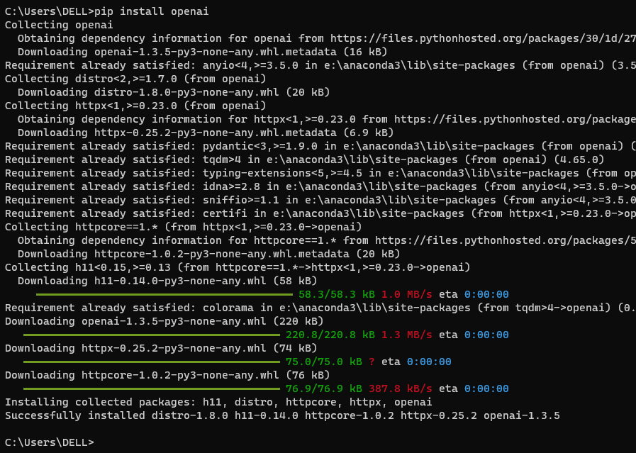

# 提示工程教程

## 使用准则
工程师如何高效编写提示
尽量自己试试，以便积累经验，了解输入和输出的提示是什么样子

1. 写出清晰而具体的指示：如果输出太长，要求简短回复。如果输出太简单，要求专家级写作。如果您不喜欢该格式，展示您希望看到的格式。模型越少猜测你想要什么，你就越有可能得到它。
2. 提供参考文本：为这些模型提供参考文本可以帮助以更少的捏造来回答
3. 将复杂的任务拆分为更简单的子任务
4. 给模型思考时间：在回答之前提供“思维链”，可以帮助模型更可靠推理出正确答案
5. 使用外部工具
6. 系统地测试更改

使用OpenAI Python库来访问OpenAI
安装OpenAI Python库
```python
pip install openai
```



导入OpenAI Python库

