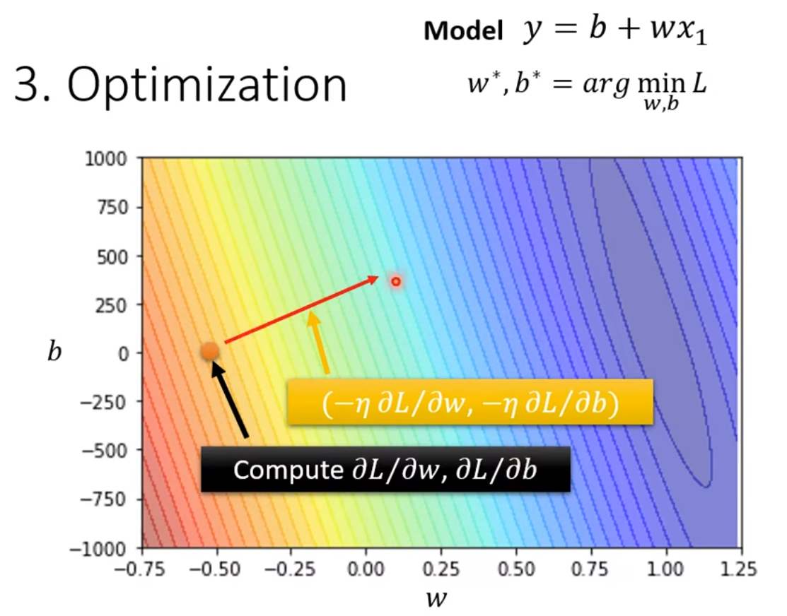
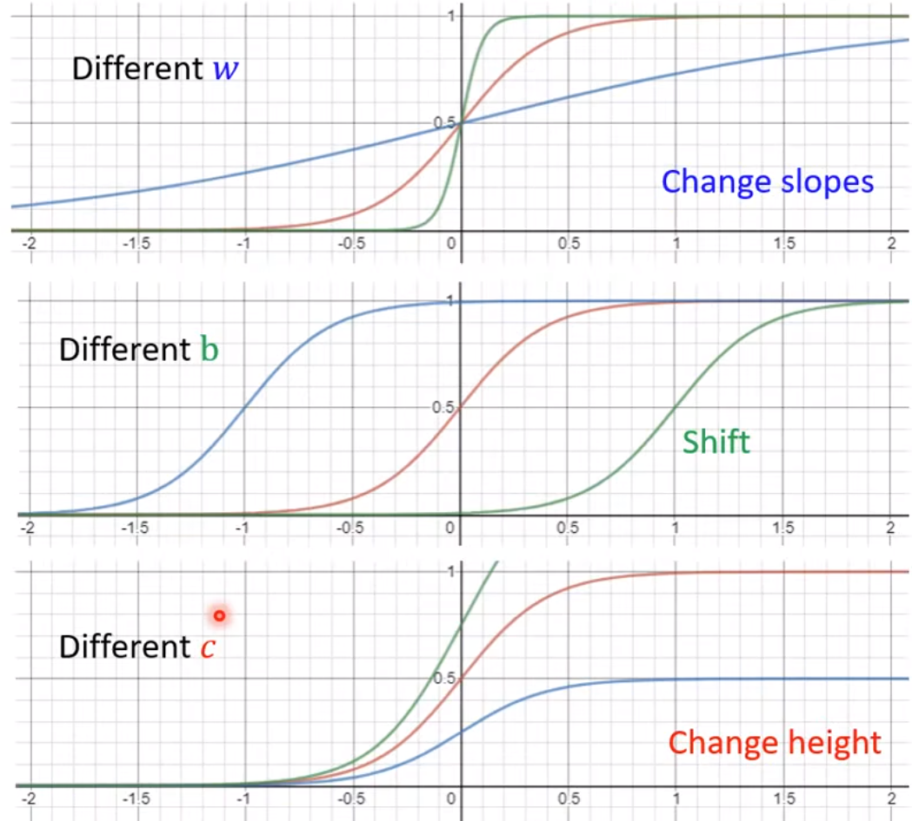
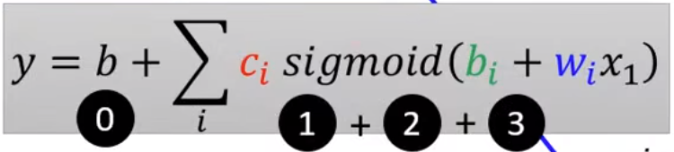
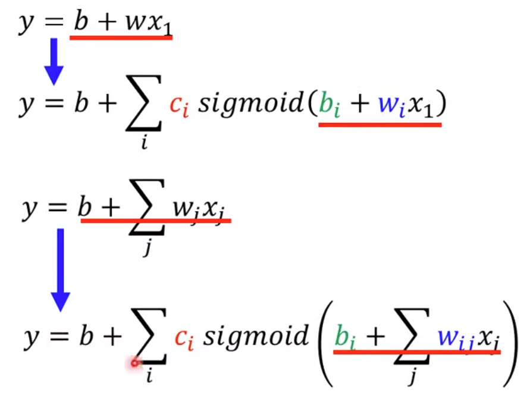
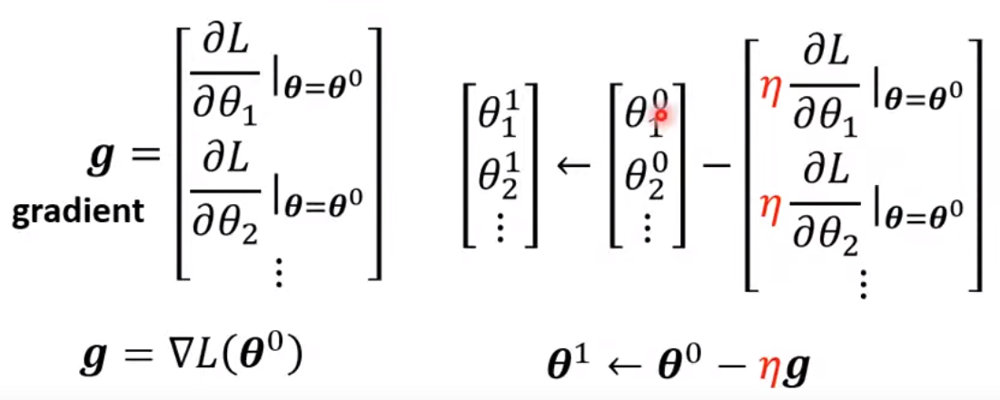

# 机器学习基本概念
第一步：找到一个未知的函数式，已知大量变化的x和大量结果y
第二部：定义一个 Loss from Training Data：用来评估函数好坏的参数，是自己定义的一个函数。可以是计算结果平均差值（MAE），可以是平均平方差值（MSE）。
 * 最佳化：Gradient Descent
	 * 学习比率：learning rate
	 * 局部最优解、全局最优解、

第三步：Optimization

 
Linear models（线性模型）：$y=b + wx_1$
piecewise Linear Curves（分段线性曲线）：可以用sigmoid函数表示如下：
$$
y = c\frac{1}{1 + e^{-(b+wx_1)}} = c*sigmoid(b+wx_1)
$$
不同的改变，会有不同的效果

得到分段线性曲线公式

同步转化：

Optimization of new Model

把所有的数据L分成多个Batch，每组Batch生成一个gradient，所有的Batch都update一次称为一个epoch（纪元、时代）

Sigmoid->ReLU
ReLU：Rectified Linear Unit： $c\; max(0,b+wx_1)$

这个公式有一个统称叫Activation function

Neuron（神经元），很多Neuron就是Neural Network（神经网络）
hidden layer，很多hidden layer就是 Deep。最终就是Deep Learning

overfitting