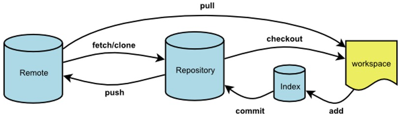

# git pull 与 git fetch 的区别


## 一张图说明



## 简单的概括

git fetch是将远程主机的最新内容拉到本地，用户在检查了以后决定是否合并到工作本机分支中。

而git pull 则是将远程主机的最新内容拉下来后直接合并，即：git pull = git fetch + git merge，这样可能会产生冲突，需要手动解决。

## 说明

git fetch 相当于是从远程获取最新到本地，不会自动merge，如下指令：

```
git fetch orgin master //将远程仓库的master分支下载到本地当前branch中

git log -p master  ..origin/master //比较本地的master分支和origin/master分支的差别

git merge origin/master //进行合并
```

也可以用以下指令：

```
git fetch origin master:tmp //从远程仓库master分支获取最新，在本地建立tmp分支

git diff tmp //將當前分支和tmp進行對比

git merge tmp //合并tmp分支到当前分支
```

git pull：相当于是从远程获取最新版本并merge到本地

`git pull origin master`

git pull 相当于从远程获取最新版本并merge到本地

在实际使用中，git fetch更安全一些


文章抄录于：[GIT fetch 和 pull之间的区别_fetch和pull区别-CSDN博客](https://blog.csdn.net/a734797702/article/details/123812717)