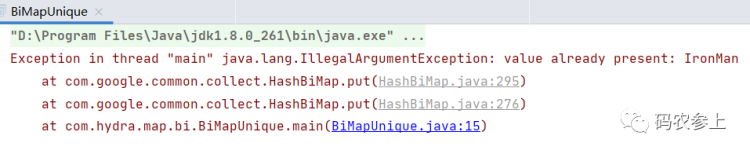
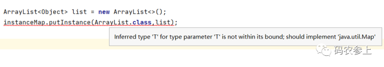

# Guava中这些Map的骚操作，让我的代码量减少了50%

Guava是google公司开发的一款Java类库扩展工具包，内含了丰富的API，涵盖了集合、缓存、并发、I/O等多个方面。使用这些API一方面可以简化我们代码，使代码更为优雅，另一方面它补充了很多jdk中没有的功能，能让我们开发中更为高效。

今天Hydra要给大家分享的就是Guava中封装的一些关于Map的骚操作，在使用了这些功能后，不得不说一句真香。先引入依赖坐标，然后开始我们的正式体验吧~

```xml
<dependency>
    <groupId>com.google.guava</groupId>
    <artifactId>guava</artifactId>
    <version>30.1.1-jre</version>
</dependency>
```

## Table - 双键Map

java中的Map只允许有一个key和一个value存在，但是guava中的Table允许一个value存在两个key。Table中的两个key分别被称为rowKey和columnKey，也就是行和列。（但是个人感觉将它们理解为行和列并不是很准确，看作两列的话可能会更加合适一些）

举一个简单的例子，假如要记录员工每个月工作的天数。用java中普通的Map实现的话就需要两层嵌套：

```java
Map<String,Map<String,Integer>> map=new HashMap<>();
//存放元素
Map<String,Integer> workMap=new HashMap<>();
workMap.put("Jan",20);
workMap.put("Feb",28);
map.put("Hydra",workMap);

//取出元素
Integer dayCount = map.get("Hydra").get("Jan");
```

如果使用Table的话就很简单了，看一看简化后的代码：

```java
Table<String,String,Integer> table= HashBasedTable.create();
//存放元素
table.put("Hydra", "Jan", 20);
table.put("Hydra", "Feb", 28);

table.put("Trunks", "Jan", 28);
table.put("Trunks", "Feb", 16);

//取出元素
Integer dayCount = table.get("Hydra", "Feb");
```

我们不需要再构建复杂的双层Map，直接一层搞定。除了元素的存取外，下面再看看其他的实用操作。

### 1、获得key或value的集合

```java
//rowKey或columnKey的集合
Set<String> rowKeys = table.rowKeySet();
Set<String> columnKeys = table.columnKeySet();

//value集合
Collection<Integer> values = table.values();
```

分别打印它们的结果，key的集合是不包含重复元素的，value集合则包含了所有元素并没有去重：

```
[Hydra, Trunks]
[Jan, Feb]
[20, 28, 28, 16]
```

### 2、计算key对应的所有value的和

以统计所有rowKey对应的value之和为例：

```java
for (String key : table.rowKeySet()) {
    Set<Map.Entry<String, Integer>> rows = table.row(key).entrySet();
    int total = 0;
    for (Map.Entry<String, Integer> row : rows) {
        total += row.getValue();
    }
    System.out.println(key + ": " + total);
}
```

打印结果：

```
Hydra: 48
Trunks: 44
```

### 3、转换rowKey和columnKey

这一操作也可以理解为行和列的转置，直接调用Tables的静态方法transpose：

```java
Table<String, String, Integer> table2 = Tables.transpose(table);
Set<Table.Cell<String, String, Integer>> cells = table2.cellSet();
cells.forEach(cell->
    System.out.println(cell.getRowKey()+","+cell.getColumnKey()+":"+cell.getValue())
);
```

利用cellSet方法可以得到所有的数据行，打印结果，可以看到row和column发生了互换：

```
Jan,Hydra:20
Feb,Hydra:28
Jan,Trunks:28
Feb,Trunks:16
```

### 4、转为嵌套的Map

还记得我们在没有使用Table前存储数据的格式吗，如果想要将数据还原成嵌套Map的那种形式，使用Table的rowMap或columnMap方法就可以实现了：

```java
Map<String, Map<String, Integer>> rowMap = table.rowMap();
Map<String, Map<String, Integer>> columnMap = table.columnMap();
```

查看转换格式后的Map中的内容，分别按照行和列进行了汇总：

```json
{Hydra={Jan=20, Feb=28}, Trunks={Jan=28, Feb=16}}
{Jan={Hydra=20, Trunks=28}, Feb={Hydra=28, Trunks=16}}
```

## BiMap - 双向Map

在普通Map中，如果要想根据value查找对应的key，没什么简便的办法，无论是使用for循环还是迭代器，都需要遍历整个Map。以循环keySet的方式为例：

```java
public List<String> findKey(Map<String, String> map, String val){
    List<String> keys=new ArrayList<>();
    for (String key : map.keySet()) {
        if (map.get(key).equals(val))
            keys.add(key);
    }
    return keys;
}
```

而guava中的BiMap提供了一种key和value双向关联的数据结构，先看一个简单的例子：

```java
HashBiMap<String, String> biMap = HashBiMap.create();
biMap.put("Hydra","Programmer");
biMap.put("Tony","IronMan");
biMap.put("Thanos","Titan");
//使用key获取value
System.out.println(biMap.get("Tony"));

BiMap<String, String> inverse = biMap.inverse();
//使用value获取key
System.out.println(inverse.get("Titan"));
```

执行结果，：

```
IronMan
Thanos
```

看上去很实用是不是？但是使用中还有几个坑得避一下，下面一个个梳理。

### 1、反转后操作的影响

上面我们用inverse方法反转了原来BiMap的键值映射，但是这个反转后的BiMap并不是一个新的对象，它实现了一种视图的关联，所以对反转后的BiMap执行的所有操作会作用于原先的BiMap上。

```java
HashBiMap<String, String> biMap = HashBiMap.create();
biMap.put("Hydra","Programmer");
biMap.put("Tony","IronMan");
biMap.put("Thanos","Titan");
BiMap<String, String> inverse = biMap.inverse();

inverse.put("IronMan","Stark");
System.out.println(biMap);
```

对反转后的BiMap中的内容进行了修改后，再看一下原先BiMap中的内容：

```json
{Hydra=Programmer, Thanos=Titan, Stark=IronMan}
```

可以看到，原先值为IronMan时对应的键是Tony，虽然没有直接修改，但是现在键变成了Stark。

### 2、value不可重复

BiMap的底层继承了Map，我们知道在Map中key是不允许重复的，而双向的BiMap中key和value可以认为处于等价地位，因此在这个基础上加了限制，value也是不允许重复的。看一下下面的代码：

```java
HashBiMap<String, String> biMap = HashBiMap.create();
biMap.put("Tony","IronMan");
biMap.put("Stark","IronMan");
```

这样代码无法正常结束，会抛出一个IllegalArgumentException异常：



如果你非想把新的key映射到已有的value上，那么也可以使用forcePut方法强制替换掉原有的key：

```java
HashBiMap<String, String> biMap = HashBiMap.create();
biMap.put("Tony","IronMan");
biMap.forcePut("Stark","IronMan");
```

打印一下替换后的BiMap：

```json
{Stark=IronMan}
```

顺带多说一句，由于BiMap的value是不允许重复的，因此它的values方法返回的是没有重复的Set，而不是普通Collection：

```java
Set<String> values = biMap.values();
```

## Multimap - 多值Map

java中的Map维护的是键值一对一的关系，如果要将一个键映射到多个值上，那么就只能把值的内容设为集合形式，简单实现如下：

```java
Map<String, List<Integer>> map=new HashMap<>();
List<Integer> list=new ArrayList<>();
list.add(1);
list.add(2);
map.put("day",list);
```

guava中的Multimap提供了将一个键映射到多个值的形式，使用起来无需定义复杂的内层集合，可以像使用普通的Map一样使用它，定义及放入数据如下：

```java
Multimap<String, Integer> multimap = ArrayListMultimap.create();
multimap.put("day",1);
multimap.put("day",2);
multimap.put("day",8);
multimap.put("month",3);
```

打印这个Multimap的内容，可以直观的看到每个key对应的都是一个集合：

```json
{month=[3], day=[1, 2, 8]}
```

### 1、获取值的集合

在上面的操作中，创建的普通Multimap的get(key)方法将返回一个Collection类型的集合：

```java
Collection<Integer> day = multimap.get("day");
```

如果在创建时指定为ArrayListMultimap类型，那么get方法将返回一个List：

```java
ArrayListMultimap<String, Integer> multimap = ArrayListMultimap.create();
List<Integer> day = multimap.get("day");
```

同理，你还可以创建HashMultimap、TreeMultimap等类型的Multimap。

Multimap的get方法会返回一个非null的集合，但是这个集合的内容可能是空，看一下下面的例子：

```java
List<Integer> day = multimap.get("day");
List<Integer> year = multimap.get("year");
System.out.println(day);
System.out.println(year);
```

打印结果：

```
[1, 2, 8]
[]
```

### 2、操作get后的集合

和BiMap的使用类似，使用get方法返回的集合也不是一个独立的对象，可以理解为集合视图的关联，对这个新集合的操作仍然会作用于原始的Multimap上，看一下下面的例子：

```java
ArrayListMultimap<String, Integer> multimap = ArrayListMultimap.create();
multimap.put("day",1);
multimap.put("day",2);
multimap.put("day",8);
multimap.put("month",3);

List<Integer> day = multimap.get("day");
List<Integer> month = multimap.get("month");

day.remove(0);//这个0是下标
month.add(12);
System.out.println(multimap);
```

查看修改后的结果：

```json
{month=[3, 12], day=[2, 8]}
```

### 3、转换为Map

使用asMap方法，可以将Multimap转换为Map<K,Collection>的形式，同样这个Map也可以看做一个关联的视图，在这个Map上的操作会作用于原始的Multimap。

```java
Map<String, Collection<Integer>> map = multimap.asMap();
for (String key : map.keySet()) {
    System.out.println(key+" : "+map.get(key));
}
map.get("day").add(20);
System.out.println(multimap);
```

执行结果：

```
month : [3]
day : [1, 2, 8]
{month=[3], day=[1, 2, 8, 20]}
```

### 4、数量问题

Multimap中的数量在使用中也有些容易混淆的地方，先看下面的例子：

```java
System.out.println(multimap.size());
System.out.println(multimap.entries().size());
for (Map.Entry<String, Integer> entry : multimap.entries()) {
    System.out.println(entry.getKey()+","+entry.getValue());
}
```

打印结果：

```
4
4
month,3
day,1
day,2
day,8
```

这是因为size()方法返回的是所有key到单个value的映射，因此结果为4，entries()方法同理，返回的是key和单个value的键值对集合。但是它的keySet中保存的是不同的key的个数，例如下面这行代码打印的结果就会是2。

```java
System.out.println(multimap.keySet().size());
```

再看看将它转换为Map后，数量则会发生变化：

```java
Set<Map.Entry<String, Collection<Integer>>> entries = multimap.asMap().entrySet();
System.out.println(entries.size());
```

代码运行结果是2，因为它得到的是key到Collection的映射关系。

## RangeMap - 范围Map

先看一个例子，假设我们要根据分数对考试成绩进行分类，那么代码中就会出现这样丑陋的if-else：

```java
public static String getRank(int score){
    if (0<=score && score<60)
        return "fail";
    else if (60<=score && score<=90)
        return "satisfactory";
    else if (90<score && score<=100)
        return "excellent";
    return null;
}
```

而guava中的RangeMap描述了一种从区间到特定值的映射关系，让我们能够以更为优雅的方法来书写代码。下面用RangeMap改造上面的代码并进行测试：

```java
RangeMap<Integer, String> rangeMap = TreeRangeMap.create();
rangeMap.put(Range.closedOpen(0,60),"fail");
rangeMap.put(Range.closed(60,90),"satisfactory");
rangeMap.put(Range.openClosed(90,100),"excellent");

System.out.println(rangeMap.get(59));
System.out.println(rangeMap.get(60));
System.out.println(rangeMap.get(90));
System.out.println(rangeMap.get(91));
```

在上面的代码中，先后创建了[0,60)的左闭右开区间、[60,90]的闭区间、(90,100]的左开右闭区间，并分别映射到某个值上。运行结果打印：

```
fail
satisfactory
satisfactory
excellent
```

当然我们也可以移除一段空间，下面的代码移除了[70,80]这一闭区间后，再次执行get时返回结果为null：

```
rangeMap.remove(Range.closed(70,80));
System.out.println(rangeMap.get(75));
```

## ClassToInstanceMap - 实例Map

ClassToInstanceMap是一个比较特殊的Map，它的键是Class，而值是这个Class对应的实例对象。先看一个简单使用的例子，使用putInstance方法存入对象：

```java
ClassToInstanceMap<Object> instanceMap = MutableClassToInstanceMap.create();
User user=new User("Hydra",18);
Dept dept=new Dept("develop",200);

instanceMap.putInstance(User.class,user);
instanceMap.putInstance(Dept.class,dept);
```

使用getInstance方法取出对象：

```java
User user1 = instanceMap.getInstance(User.class);
System.out.println(user==user1);
```

运行结果打印了true，说明了取出的确实是我们之前创建并放入的那个对象。

大家可能会疑问，如果只是存对象的话，像下面这样用普通的Map<Class,Object>也可以实现：

```java
Map<Class,Object> map=new HashMap<>();
User user=new User("Hydra",18);
Dept dept=new Dept("develop",200);
map.put(User.class,user);
map.put(Dept.class,dept);
```

那么，使用ClassToInstanceMap这种方式有什么好处呢？

首先，这里最明显的就是在取出对象时省去了复杂的强制类型转换，避免了手动进行类型转换的错误。其次，我们可以看一下ClassToInstanceMap接口的定义，它是带有泛型的：

```java
public interface ClassToInstanceMap<B> extends Map<Class<? extends B>, B>{...}
```

这个泛型同样可以起到对类型进行约束的作用，value要符合key所对应的类型，再看看下面的例子：

```java
ClassToInstanceMap<Map> instanceMap = MutableClassToInstanceMap.create();
HashMap<String, Object> hashMap = new HashMap<>();
TreeMap<String, Object> treeMap = new TreeMap<>();
ArrayList<Object> list = new ArrayList<>();

instanceMap.putInstance(HashMap.class,hashMap);
instanceMap.putInstance(TreeMap.class,treeMap);
```

这样是可以正常执行的，因为HashMap和TreeMap都集成了Map父类，但是如果想放入其他类型，就会编译报错：



所以，如果你想缓存对象，又不想做复杂的类型校验，那么使用方便的ClassToInstanceMap就可以了。