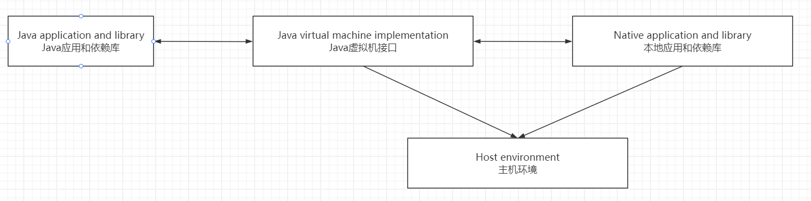
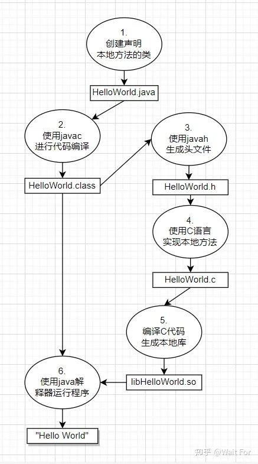

# JNI技术

## 1. 介绍
JNI（Java Native Interface，Java本地接口）是Java平台中的一个强大特性。应用程序可以通过JNI把C/C++代码集成进Java程序中。

通过JNI，开发者在利用Java平台强大功能的同时，又不必放弃对原有代码的投资；因为JNI是Java平台定义的规范接口，当程序员向Java代码集成本地库时，只要在一个平台中解决了语言互操作问题，就可以把该解决方案比较容易的移植到其他Java平台中。

### 1.1. Java平台和主机环境

Java平台(Java Platform)的组成：Java VM和Java API。Java应用程序使用Java语言开发，然后编译成与平台无关的字节码(.class文件)。Java API由一组预定义的类组成。任何组织实现的Java平台都要支持：Java编程语言，虚拟机，和API。

平台环境: 操作系统，一组本机库，和CPU指令集。本地应用程序，通常依赖于一个特定的平台环境，用 C、C++等语言开发，并被编译成平台相关的二进制指令，目标二进制代码在不同OS间一般不具有可移植性。

Java平台(Java VM和Java API)一般在某个平台下开发。比如，Sun 的Java Runtime Environment(JRE)支持类Unix和Windows平台。Java平台做的所有努力，都为了使程序更具可移植性。

### 1.2. JNI的角色

当Java平台部署到本地系统中，有必要做到让Java程序与本地代码协同工作。 部分是由于遗留代码(保护原有的投资)的问题(一些效率敏感的代码用C实现，但现在Java VM的执行效率完全可信赖)，工程师们很早就开始以C/C++为基础构建Java应用，所以，C/C++代码将长时间的与 Java 应用共存。JNI 让你在利用强大 Java 平台的同时，使你仍然可以用其他语言写程序。作为Java VM 的一部分，JNI是一套双向的接口，允许Java与本地代码间的互操作。



作为双向接口，JNI支持两种类型本地代码：本地库和本地应用。

- 用本地代码实现Java中定义的native method接口，使Java调用本地代码；
- 通过JNI你可以把Java VM嵌到一个应用程序中，此时Java平台作为应用程序的增强，使其可以调用Java类库。

 JNI不只是一套接口，还是一套使用规则。Java语言有"native"关键字，声明哪些方法是用本地代码实现的。翻译的时候，对于"native method"，根据上下文意思做了不同处理，当native method指代Java中用"native"关键字修饰的那些方法时，不翻译；而当代码用C/C++实现的部分翻译成了本地代码。
 
在应用中嵌入Java VM的方法，是用最少的力量，为应用做最强扩展的不二选择，这时你的应用程序可以自由使用Java API的所有功能。

### 1.3. JNI的影响

当Java程序集成了本地代码，它将丢掉Java的一些好处。

首先，脱离Java后，可移植性问题你要自己解决，且需重新在其他平台编译链接本地库。

第二，要小心处理JNI编程中各方面问题和来自C/C++语言本身的细节性问题，处理不当，应用将崩溃。

一般性原则：做好应用程序架构，使native methods定义在尽可能少的几个类里。

**优势和缺点**
优点：
* 方便地将 Java 类连接到本地代码，充分利用底层操作系统的功能；
* 支持编写高性能的本地代码，以提高某些关键任务的执行效率；
* 加强了跨平台开发的能力，可以充分利用本地特性，实现更复杂的功能需求。

缺点：
* 使用 JNI 需要额外的学习成本，包括 JNI 编程规范、内存管理等方面的知识；
* 开发人员需要维护 Java 类和本地代码之间的正确映射关系，增加了一定的复杂性。

### 1.4. JNI的使用场景

一典型的解决方案是，Java程序与本地代码分别运行在不同的进程中。采用进程分置最大的好处是：一个进程的崩溃，不会立即影响到另一个进程。

但是，把Java代码与本地代码置于一个进程有时是必要的。 如下：

- Java API可能不支某些平台相关的功能。比如，应用程序执行中要使用Java API不支持的文件类型，而如果使用跨进程操作方式，即繁琐又低效；
- 避免进程间低效的数据拷贝操作；
- 多进程的派生：耗时、耗资源(内存)；
- 用本地代码或汇编代码重写Java中低效方法。

总之，如果Java必须与驻留同进程的本地代码交互，请使用JNI。

## 2. 开始

本节用Hello World示例领略JNI编程。

### 2.1. 总览

准备过程：

1. 创建一个类(HelloWorld.java)；
2. 使用 javac 编译该类；
3. 利用 javah -jni 产生头文件；
4. 用本地代码实现头文件中定义的方法；
5. Run。



### 2.2. 声明本地方法

```java
class HelloWorld {
	private native void print();
	public static void main(String[] args) {
		new HelloWorld().print();
	}
	
	static {
		System.loadLibrary("HelloWorld");
	}
}
```

HelloWrold类首先声明了一个private native print方法。static那几行是本地库。

在Java代码中声明本地方法必须有"native"标识符，native修饰的方法，在Java代码中只作为声明存在。

在调用本地方法前，必须首先装载含有该方法的本地库. 如HelloWorld.java中所示，置于static块中，在Java VM初始化一个类时，首先执行这部分代码，这可保证调用本地方法前，装载了本地库。

### 2.3. 编译HelloWorld类

```text
javac HelloWorld.java
```

### 2.4. 创建本地方法头文件

```text
javah -jni HelloWorld
```
上述命令，生成HelloWorld.h文件，关键部分如下：

```c
JNIEXPORT void JNICALL Java_HelloWorld_print
  (JNIEnv *, jobject);
```

现在，请先忽略两个宏：JNIEXPORT和JNICALL。你会发现，该函数声明，接受两个参数，而对应的Java代码对该函数的声明没有参数。第一个参数是指向JNIEnv结构的指针；第二个参数，为HelloWorld对象自身，即this指针。

::: tip 这里有个坑

如果在项目里写会带着包名，例如：`package learn.note.jni`
使用上述命令会找不到类名，所以需要使用全限定名称 `package learn.note.jni.JNIUse1`

还需要指定项目的路径使用 `-classpath`

最终命令是`javah -classpath D:\life\life-learn\src\main\java\ -jni learn.note.jni.JNIUse1`

:::


---

> https://zhuanlan.zhihu.com/p/650000825