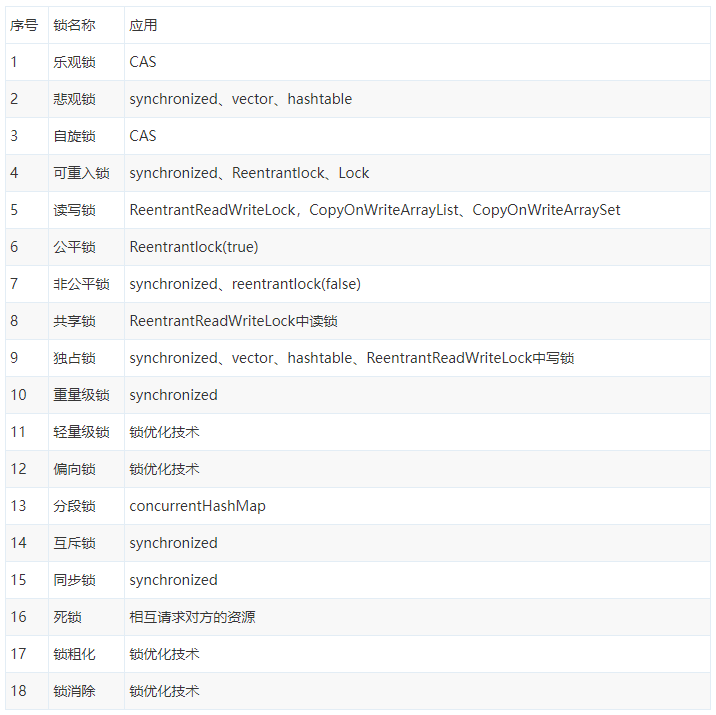

# Java中的锁
[[toc]]

## 锁概念总结



<!-- 
|序号|名称|应用|
|--|--|--|
|1|乐观锁|CAS|
|2|悲观锁|synchronized、vector、hashtable|
|3|自旋锁|CAS|
|4|可重入锁|synchronized、Reentrantlock、Lock|
|5|读写锁|ReentrantReadWriteLock、CopyOnWriteArrayList、CopyOnWriteArraySet|
|6|公平锁|Reentrantlock(true)|
|7|非公平锁|synchronized、Reentrantlock(false)|
|8|共享锁|ReentrantReadWriteLock中读锁|
|9|独占锁|synchronized、vector、hashtable、ReentrantReadWriteLock中写锁|
|10|重量级锁|synchronized|
|11|轻量级锁|锁优化技术|
|12|偏向锁|锁优化技术|
|13|分段锁|ConcurrenHashMap|
|14|互斥锁|synchronized|
|15|同步锁|synchronized|
|16|死锁|相互请求对方的资源|
|17|锁粗化|锁优化技术|
|18|所消除|锁优化技术| 
|19|不可重入锁|| 
-->

## 分下类
|分类|名称|
|--|--|
|锁|[乐观锁 / 悲观锁](#乐观锁-悲观锁)|
|锁|[可重入锁 / 不可重入锁（上没有）](#可重入锁-不可重入锁)|
|锁|[互斥锁(同步锁) / 读写锁](#互斥锁-读写锁)|
|锁|[公平锁 / 非公平锁](#互斥锁-读写锁)|
|锁|[共享锁 / 独占锁](#公平锁-非公平锁)|
|锁|[偏向锁 / 轻量级锁 / 重量级锁](#偏向锁-轻量级锁-重量级锁)|
|锁|[自旋锁](#自旋锁)|
|锁|分段锁|
|锁|同步锁|
|现象|死锁|
|方案|锁粗化|
|方案|所消除|

## 详细定义
### 乐观锁 / 悲观锁
#### 乐观锁
总是假设最好的情况，每次去拿数据的时候都认为别人不会修改，所以不会上锁，但是在更新的时候会判断一下在此期间别人有没有去更新这个数据，可以使用版本号机制和CAS算法实现。

乐观锁适用于多读的应用类型，这样可以提高吞吐量，像数据库提供的类似于write_condition机制，其实都是提供的乐观锁。

在Java中java.util.concurrent.atomic包下面的原子变量类就是使用了乐观锁的一种实现方式CAS实现的。

#### 悲观锁
总是假设最坏的情况，每次去拿数据的时候都认为别人会修改，所以每次在拿数据的时候都会上锁，这样别人想拿这个数据就会阻塞直到它拿到锁。

（共享资源每次只给一个线程使用，其它线程阻塞，用完后再把资源转让给其它线程）。

传统的关系型数据库里边就用到了很多这种锁机制，比如行锁，表锁等，读锁，写锁等，都是在做操作之前先上锁。

Java中synchronized和ReentrantLock等独占锁就是悲观锁思想的实现。

### 可重入锁 / 不可重入锁
#### 可重入锁（递归锁）
可重入锁是一种技术： 任意线程在获取到锁之后能够再次获取该锁而不会被锁所阻塞。

可重入锁的原理： 通过组合自定义同步器来实现锁的获取与释放。

再次获取锁：识别获取锁的线程是否为当前占据锁的线程，如果是，则再次成功获取。获取锁后，进行计数自增，

释放锁：释放锁时，进行计数自减。

广义上的可重入锁指的是可重复可递归调用的锁，在外层使用锁之后，在内层仍然可以使用，并且不发生死锁（前提得是同一个对象或者class），这样的锁就叫做可重入锁。

ava中synchronized和ReentrantLock都是可重入锁

可重入锁的作用： 避免死锁。

面试题1： 可重入锁如果加了两把，但是只释放了一把会出现什么问题？

答：程序卡死，线程不能出来，也就是说我们申请了几把锁，就需要释放几把锁。

面试题2： 如果只加了一把锁，释放两次会出现什么问题？

答：会报错，java.lang.IllegalMonitorStateException。

可重入锁的一个特点: 
```java
synchronized void setA() throws Exception{
   Thread.sleep(1000);
   // 如果不是可重入锁的话，setB可能不会被当前线程执行，可能造成死锁。
   setB();
}
synchronized void setB() throws Exception{
   Thread.sleep(1000);
}
```

ReentrantLock中可重入锁实现，非公平锁的锁获取方法。这里没有看懂，回头补一补

```java
final boolean nonfairTryAcquire(int acquires) {
    final Thread current = Thread.currentThread();
    int c = getState();
    if (c == 0) {
        if (compareAndSetState(0, acquires)) {
            setExclusiveOwnerThread(current);
            return true;
        }
    }
    //就是这里
    else if (current == getExclusiveOwnerThread()) {
        int nextc = c + acquires;
        if (nextc < 0) // overflow
            throw new Error("Maximum lock count exceeded");
        setState(nextc);
        return true;
    }
    return false;
}
```


#### 不可重入锁
不可重入锁，与可重入锁相反，不可递归调用，递归调用就发生死锁。一个经典的写法，使用自旋锁来模拟一个不可重入锁，代码如下
```java
import java.util.concurrent.atomic.AtomicReference;
// 同一线程两次调用lock()方法，如果不执行unlock()释放锁的话，
// 第二次调用自旋的时候就会产生死锁，这个锁就不是可重入的
// 而实际上同一个线程不必每次都去释放锁再来获取锁，这样的调度切换是很耗资源的。
public class UnreentrantLock {
    // 使用原子引用来存放线程
    private AtomicReference owner = new AtomicReference();

    public void lock() {
        Thread current = Thread.currentThread();
        //这句是很经典的“自旋”语法，AtomicInteger中也有
        for (;;) {
            if (!owner.compareAndSet(null, current)) {
                return;
            }
        }
    }

    public void unlock() {
        Thread current = Thread.currentThread();
        owner.compareAndSet(current, null);
    }
}
```

变成可重入锁
```java
import java.util.concurrent.atomic.AtomicReference;

public class UnreentrantLock {

    private AtomicReference owner = new AtomicReference();
    private int state = 0;

    public void lock() {
        Thread current = Thread.currentThread();
        // 在执行每次操作之前，判断当前锁持有者是否是当前对象
        // 采用state计数，不用每次去释放锁。
        if (current == owner.get()) {
            state++;
            return;
        }
        //这句是很经典的“自旋”式语法，AtomicInteger中也有
        for (;;) {
            if (!owner.compareAndSet(null, current)) {
                return;
            }
        }
    }

    public void unlock() {
        Thread current = Thread.currentThread();
        if (current == owner.get()) {
            if (state != 0) {
                state--;
            } else {
                owner.compareAndSet(current, null);
            }
        }
    }
}
```

### 互斥锁 / 读写锁
#### 互斥锁(排它锁)
在访问共享资源之前对进行加锁操作，在访问完成之后进行解锁操作。 加锁后，任何其他试图再次加锁的线程会被阻塞，直到当前进程解锁。

如果解锁时有一个以上的线程阻塞，那么所有该锁上的线程都被编程就绪状态， 第一个变为就绪状态的线程又执行加锁操作，那么其他的线程又会进入等待。 在这种方式下，只有一个线程能够访问被互斥锁保护的资源

#### 读写锁
读写锁既是互斥锁，又是共享锁，read模式是共享，write是互斥(排它锁)的。

读写锁有三种状态：读加锁状态、写加锁状态和不加锁状态

读写锁在Java中的具体实现就是ReadWriteLock

一次只有一个线程可以占有写模式的读写锁，但是多个线程可以同时占有读模式的读写锁。

这也是它可以实现高并发的原因。当其处于写状态锁下，任何想要尝试获得锁的线程都会被阻塞，直到写状态锁被释放；
如果是处于读状态锁下，允许其它线程获得它的读状态锁，但是不允许获得它的写状态锁，直到所有线程的读状态锁被释放；

为了避免想要尝试写操作的线程一直得不到写状态锁，当读写锁感知到有线程想要获得写状态锁时，便会阻塞其后所有想要获得读状态锁的线程。所以读写锁非常适合资源的读操作远多于写操作的情况。

### 公平锁 / 非公平锁
#### 公平锁
公平锁是指多个线程按照申请锁的顺序来获取锁。

#### 非公平锁
非公平锁是指多个线程获取锁的顺序并不是按照申请锁的顺序，有可能后申请的线程比先申请的线程优先获取锁。有可能，会造成优先级反转或者饥饿现象。

对于Java ReentrantLock而言，通过构造函数指定该锁是否是公平锁，默认是非公平锁。非公平锁的优点在于吞吐量比公平锁大。

对于Synchronized而言，也是一种非公平锁。由于其并不像ReentrantLock是通过AQS的来实现线程调度，所以并没有任何办法使其变成公平锁。

### 独享锁 / 共享锁
独享锁和共享锁在去读C.U.T包下的ReeReentrantLock和ReentrantReadWriteLock就会发现，它俩一个是独享一个是共享锁。

#### 独享锁
该锁每一次只能被一个线程所持有。

#### 共享锁
该锁可被多个线程共有，典型的就是ReentrantReadWriteLock里的读锁，它的读锁是可以被共享的，但是它的写锁确每次只能被独占。

另外读锁的共享可保证并发读是非常高效的，但是读写和写写，写读都是互斥的。

独享锁与共享锁也是通过AQS来实现的，通过实现不同的方法，来实现独享或者共享。对于Synchronized而言，当然是独享锁。

### 偏向锁 / 轻量级锁 / 重量级锁
锁的状态：

1. 无锁状态
2. 偏向锁状态
3. 轻量级锁状态
4. 重量级锁状态

#### 偏向锁
偏向锁是指一段同步代码一直被一个线程所访问，那么该线程会自动获取锁。降低获取锁的代价
#### 轻量级
轻量级锁是指当锁是偏向锁的时候，被另一个线程所访问，偏向锁就会升级为轻量级锁，其他线程会通过自旋的形式尝试获取锁，不会阻塞，提高性能。
#### 重量级锁
重量级锁是指当锁为轻量级锁的时候，另一个线程虽然是自旋，但自旋不会一直持续下去，当自旋一定次数的时候，还没有获取到锁，就会进入阻塞，
该锁膨胀为重量级锁。重量级锁会让其他申请的线程进入阻塞，性能降低。

### 自旋锁
CAS算法是乐观锁的一种实现方式，CAS算法中又涉及到自旋锁

#### 什么是自旋锁？
自旋锁（spinlock）：是指当一个线程在获取锁的时候，如果锁已经被其它线程获取，那么该线程将循环等待，然后不断的判断锁是否能够被成功获取，直到获取到锁才会退出循环。

它是为实现保护共享资源而提出一种锁机制。

其实，自旋锁与互斥锁比较类似，它们都是为了解决对某项资源的互斥使用。无论是互斥锁，还是自旋锁，在任何时刻，最多只能有一个保持者，
也就说，在任何时刻最多只能有一个执行单元获得锁。但是两者在调度机制上略有不同。对于互斥锁，如果资源已经被占用，资源申请者只能进入睡眠状态。
但是自旋锁不会引起调用者睡眠，如果自旋锁已经被别的执行单元保持，调用者就一直循环在那里看是否该自旋锁的保持者已经释放了锁，”自旋”一词就是因此而得名。

#### 简单了解下CAS算法
CAS是英文单词Compare and Swap（比较并交换），是一种有名的无锁算法。

无锁编程，即不使用锁的情况下实现多线程之间的变量同步，也就是在没有线程被阻塞的情况下实现变量的同步，所以也叫非阻塞同步（Non-blocking Synchronization）。

CAS算法涉及到三个操作数：
1. 需要读写的内存值 V
2. 进行比较的值 A
3. 拟写入的新值 B

更新一个变量的时候，只有当变量的预期值A和内存地址V当中的实际值相同时，才会将内存地址V对应的值修改为B，否则不会执行任何操作。一般情况下是一个自旋操作，即不断的重试。

#### Java如何实现自旋锁？
```java
public class SpinLock {
    private AtomicReference cas = new AtomicReference();

    public void lock() {
        Thread current = Thread.currentThread();
        // 利用CAS，当第一个线程A获取锁的时候，能够成功获取到，不会进入while循环
        // 如果此时线程A没有释放锁，另一个线程B又来获取锁，此时由于不满足CAS，
        // 所以就会进入while循环，不断判断是否满足CAS，直到A线程调用unlock方法释放了该锁。
        while (!cas.compareAndSet(null, current)) {
            // DO nothing
        }
    }

    public void unlock() {
        Thread current = Thread.currentThread();
        cas.compareAndSet(current, null);
    }
}
```
#### 自旋锁的优点
1. 自旋锁不会使线程状态发生切换，一直处于用户态，即线程一直都是active的；不会使线程进入阻塞状态，减少了不必要的上下文切换，执行速度快
2. 非自旋锁在获取不到锁的时候会进入阻塞状态，从而进入内核态，当获取到锁的时候需要从内核态恢复，需要线程上下文切换。 
（线程被阻塞后便进入内核（Linux）调度状态，这个会导致系统在用户态与内核态之间来回切换，严重影响锁的性能）

#### 自旋锁的缺点
1. 如果某个线程持有锁的时间过长，就会导致其它等待获取锁的线程进入循环等待，消耗CPU。使用不当会造成CPU使用率极高。
2. 上面Java实现的自旋锁不是公平的，即无法满足等待时间最长的线程优先获取锁。不公平的锁就会存在“线程饥饿”问题。
