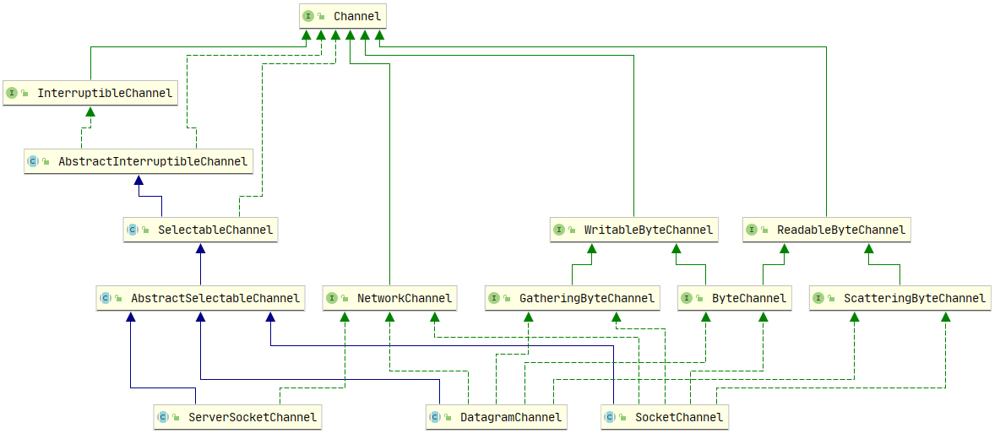

# Java的NIO

[[toc]]

缓冲区（Buffers）

新的Buffer类是常规Java类和通道之间的纽带。原始数据元素组成固定长度的数组，封装在包含状态信息的对象中，存入缓冲区。缓冲区提供了一个汇合点：通道既可以提取放在缓冲区中的数据（写），也可以向缓冲区存入数据供读取（读）。此外，还有一种特殊类型的缓冲区，用于内存映射文件。

通道（Channels）

NOI新引入的最重要的抽象是通道的概念。Channel对象模拟了通信连接，管道既可以是单项的（进或出），也可以是双向的（进或出）。可以把通道想象成连接缓冲区和I/O服务的捷径。

文件锁定和内存映射文件（File locking and memory-mapped files）

新的FileChannel对象包含在java.nio.channels软件保内，体统许多面向文件的新特性，其中最有趣的两个是文件锁定和内存映射文件。

套接字（Sockets）

套接字通道类为使用网络套接字实现交互提供了新方法。套接字通道可工作于非阻塞模式，并可与选择器一同使用。因此，多个套接字可以实现多路传输，管理效率也比java.net提供的传统套接字更高。

三个套接字通道，即ServerSocketChannel、SocketChannel和DatagramChannel

选择器（Selectors）

选择器可实现就绪性选择。Selector类提供了确定一或多个通道当前状态的机制。使用选择器，借助单一线程，就可对数量庞大的活动I/O通道实施监控和维护

正则表达式（Regular expressions）

字符集（Character sets）

java.nio.charsets提供了新类用于处理字符与字符之间的映射关系。可以对字符转换映射方式进行选择，也可以自己创建映射。

## 1.缓冲区

一个Buffer对象时固定数据量的数据的容器。其作用时一个存储器，或者分段运输区，在这里数据可以被存储并在之后用于检索。缓冲区提供了一个汇合点：通道既可以提取放在缓冲区中的数据（写），也可以向缓冲区存入数据供读取（读）。对于每一个非布尔原始数类型都有一个缓冲区类。尽管缓冲区作用于它们存储的原始数据类型，但缓冲区十分倾向于处理字节。非字节缓冲区可以在后台执行从字节到字节的转换，这取决于缓冲区是如何创建的。

缓冲区的工作于通道紧密联系。通道是I/O传输发生是通过的入口，而缓冲区是这些数据传输来的来源或目标。对应离开缓冲区的传输，您想传递出去的数据被置于一个缓冲区，被传送到通道。对于传回缓冲区的传输，一个通通道放置在您所提供的缓冲区中。这种在协同对象（通常是您所写的对象以及一到多个Channel对象）之间进行的缓冲区数据传递是高效数据处理的关键。

### 1.1 Buffer类

家谱


概念上，缓冲区是包在一个对象内的基本数据元素数组。Buffer类相比一个简单数组的优点是它将关于数据的数据内容和信息包含在一个单一的对象中。Buffer类似以及他专有的子类定义了一个用于处理数据缓冲区的API。

#### 1.1.2属性
##### 容量

缓冲区能够容纳的数据元素的最大数量。这一容量在缓冲区创建时被设定，并且永远不能被改变。

##### 上界（Limit）

缓冲区的第一个不能被读或写的元素。或者说，缓冲区现存元素的计数。

##### 位置（Position）

下一个要被读或写的元素的索引。位置会自动有相应的get()和put()方法更新。

##### 标记（Mark）

已备忘位置。调用mark()来设定mark=postion。调用reset()设定postion= mark 。标记在设定前是未定义的(undefined)。

上述四个属性总是遵循以下关系：

0 <= mark <= postion <= limit <= capacity

Buffer类的方法签名


#### 1.1.3存取

缓冲区管理着固定数目的数据元素。但在任何特定的时刻，我们可能只对缓冲区中的一部分元素感兴趣。换句话说，在我们想清空缓冲区之前，我们可能只使用了缓冲区的一部分。这时，我们需要能够追踪添加到缓冲区内的数据元素的数量，放入下一个元素的位置等等。位置属性做到了这一点。它在调用put()时指出了下一个数据元素应该被插入的位置，或者当get()被调用是指出下一个元素应从何处检索。文中所列出的Buffer API并没有包括get()和put()方法。每一个Buffer类都有这两个方法，但他们所采用的参数类型，以及他们返回的数据类型，对没个子类来说都是唯一的，所以他们不能再顶层Buffer类中抽象地声明。他们的定义必须被特定类型的子类所遵从。

对于put，如果位置不小于上界，就会抛出BufferOverflowException异常

对于get，如果位置不小于上界，就会抛出BufferUndeflowException异常。

绝对存取不会影响缓冲区的位置属性，如果提供的索引超出范围（负数或不小于上界）将会抛出IndexOutOfBoundsException异常

#### 1.1.4填充

```java
buffer.put((byte) 'H').put((byte) 'e').put((byte) 'l').put((byte) 'l').put((byte) 'o');
```

将Hello字符的ASCII吗载入一个名为buffer的ByteBuffer对象中。


> 每个字符必须强制转换为byte，不能不强制转换就进行put操作
> 因为存放的是字节不是字符。java中字符内部以Unicode码表示，每个Unicode吗占16位。

我们已经在buffer中存放了一些数据，如果我们想在不丢失位置的情况下进行一些更改怎么办

```java
buffer.put(0,(byte)'M').put((byte)'w');
```

这里通过一次绝对方案的put将0位置的字节代替为十六进制数值0x4d，将0x77放入当前位置（当前位置不会受到绝对put()的影响）的字节，并将位置属性加一。修改后效果如下


#### 1.1.5翻转rewind()方法与flip()相似

我们已经创建了一个缓冲区，并想其中写了数据，现在我们准备将其清空。想把这个缓冲区传递给一个通道，以使内容被全部写出。

如果通道现在在缓冲区上执行get()，那么它将从我们刚刚插入的有用数据之外读取为定义的数据。如果我们将位置值重新设置为0，通道就会从正确的位置开始获取，但是他是怎样知道何时到达我们所插入数据末端的呢？这就是上界属性被引入的目的。上界属性指明了缓冲区有效内容的末端。我们需要将上界属性设置为当前位置，然后将位置重置为0。

手动实现：

```java
buffer.limit(buffer.position()).position(0);
```

API设计者预先设计好方法：

```java
// Flip()方法将一个能够继续添加数据元素的填充状态的缓冲区翻转成一个准备读出元素的释放状态。
buffer.flip();
```

翻转后效果如下


还有一个方法Rewind()

rewind()方法与flip()相似，但不影响上界属性。它只是将位置值设回0。可以使用rewind()后退，重读已经被翻转的缓冲区的数据。

如果将缓冲区翻转两次会怎样？它会大小变为0.

尝试对缓冲区上位置和和上界都为0的get()操作会导致BufferUndeflowException异常。而put()则会导致BufferOverflowException异常

#### 1.1.6释放

如果我们将上节翻转后的缓冲区传入通道，它将取出我们存放在那的数据，从位置开始知道上界结束。

布尔方法hasRemaining()会在释放缓冲区时告诉您是否已经达到缓冲区的上界。以下是一种将数据从缓冲区释放到一个数组的方法

```java
for (int i = 0 ; buffer.hasRemaining() ; i++) {
	myByteArray [i] = buffer.get();
}
```

还有，remaining()方法可以告诉你当前位置到上界还有剩余的数目。也可以使用下面循环释放

```java
int count = buffer.remaining();
for (int i = 0 ; i < count ; i++){
	myByteArray [i] = buffer.get();
}
```

```java
package learn.IO.NIO;

import java.nio.CharBuffer;

/**
 * Buffer（缓冲区） 的填充和释放
 * @author WangWenLei
 * @DATE: 2021/10/12
 **/
public class BufferFillAndDrain {
    public static void main(String[] args) {
        //分配一个新的字符缓冲区。
        //新缓冲区的位置将为零，它的限制将是它的容量，它的标记将是未定义的，并且它的每个元素都将被初始化为零。
        // 它将有一个backing array ，其array offset为零。
        CharBuffer buffer = CharBuffer.allocate(100);
        while(fillBuffer(buffer)){
            buffer.flip();
            drainBuffer(buffer);
            buffer.clear();
        }
    }

    private static void drainBuffer(CharBuffer buffer) {
        while(buffer.hasRemaining()) {
            System.out.println(buffer.get());
            System.out.println();
        }
    }

    private static boolean fillBuffer(CharBuffer buffer) {
        if(index >= strings.length) {
            return false;
        }
        String string = strings[index++];
        for(int i = 0 ; i < string.length(); i++){
            buffer.put(string.charAt(i));
        }
        return true;
    }

    private static int index = 0;
    private static String [] strings = {
            "A random string value",
            "The product of an infinite number of monkeys",
            "Hey hey we're the Monkees",
            "Opening act for the Monkees：JiMin Hendrix",
            ";Scuse me while i kiss this fly",// Sory Jimi ;-)
            "help Me: help Me！"
    };
}
```

打印效果


为什么会出现这种效果，Debug分析一下

断点打在每一次fullBuffer完成准备返回之前


执行可以看到效果，可以看到实际第一次fillBuffer时已经把strings里第一个元素都填充进缓冲区了


翻转完成，上界变为21，位置变为0


然后是我们输出时循环了每一个元素并插入换行符


如果下面这样写会有截然不同的效果


效果如下


#### 1.1.7压缩compact()

调用compact()作用时丢弃已经释放的数据，保留未释放的数据，并使缓冲区对重新填充容量准备就绪。

使用原因：有时只想释放一部分数据，而不是全部，然后重新填充。

给出示例

调用buffer.compact()之前


调用buffer.compact()之后


会看到2-5被复制到0-3位置，位置4和5不受影响。但现在正在或已经超出了当前位置，因此是“死的”。它们可以被之后的put()调用重写。位置已经被设为被复制的数据元素的数目（也就是说，缓冲区现在被定位在缓冲区最后一个“存活”元素后插入数据的位置）。最后，上界属性被设置为容量的值，因此缓冲区可以被再次填满。

#### 1.1.8标记

缓冲区的标记在mark()方法被调用之前是未定义的，调用时标记为当前的值。reset()方法将位置设为当前的标记值。如果标记值未定义，调用reset()将导致InvalidMarkException异常。一些缓冲区方法会抛弃已经设定的标记（rewind(),clear(),以及flip()总是抛弃标记）。如果新设定的值比当前的标记小，调用limit()或position()带有索引参数的版本会抛弃标记。

#### 1.1.9比较

有时候比较两个缓冲区包含的数据很有必要。所有的缓冲区都提供了一个常规的equals()方法用以测试两个缓冲区是否相等，以及一个compareTo()方法用以比较缓冲区。

如果每个缓冲区中剩余的内容相同，那么equals()方法将返回true，否则返回false。因为这个测试是用于严格相等而且是可换向的。比较的2个缓冲区名称可以颠倒，并会产生相同的结果。

两个缓冲区被认为相等的充要条件：

1. 两个对象类型相同。
2. 两个对象剩余同样数量的元素。Buffer的容量不需要相同，而且缓冲区中剩余数据的索引也不必相同。但每个缓冲区中剩余元素的数目（从位置到上界）必须相同
3. 在每个缓冲区中应被get()方法返回的剩余数据元素序列必须一致。

缓冲区也支持用compareTo()方法以词典顺序进行比较。这一方法在缓冲区参数小于、等于、大于引用compareTo()的对象实例时，分别返回负整数，0和正整数。这意味着缓冲区数组可以使用java.util.Arrays.sort()方法按照他们的内容进行排序。

与equals()相似compareTo()不允许不同对象直接进行比较。但compareTo更为严格：如果传入一个类型错误的对象，它会抛出ClassCastException异常。但equals()只会返回false。

比较是针对每一缓冲区内剩余数据进行的，与他们在equals()中的方式相同，直到不相等的元素被发现或者到达上界。如果一个缓冲区在不相等元素发现前已经被耗尽，较短的缓冲区被认为是小于较长的缓冲区。与equals不同，compareTo不可交换。

#### 1.1.10批量移动

缓冲区的设计目的就是为了高效传输数据。一次移动一个元素的效率并不高。

buffer API提供了向缓冲区内外批量移动数据元素的方法：

```java
public abstract class CharBuffer extends Buffer implements Comparable<CharBuffer>, Appendable, CharAequence, Readable {
    
    public CharBuffer get(char[] dst) {
        return get(dst, 0, dst.length);
    }
    public CharBuffer get(char[] dst, int offset, int length) {
        // 检查 (off | len | (off + len) | (size - (off + len))) < 0
        checkBounds(offset, length, dst.length);
        // remaining() 是 limit - position
        if (length > remaining())
            throw new BufferUnderflowException();
        int end = offset + length;
        // 这里还是使用了循环get()
        for (int i = offset; i < end; i++)
            dst[i] = get();
        return this;
    }
    
    // 绝对放置方法
    public abstract CharBuffer put(int index, char c);
    public abstract CharBuffer put(char c);
    public final CharBuffer put(String src) {
        return put(src, 0, src.length());
    }
    public CharBuffer put(String src, int start, int end) {
        checkBounds(start, end - start, src.length());
        if (isReadOnly())
            throw new ReadOnlyBufferException();
        if (end - start > remaining())
            throw new BufferOverflowException();
        // 循环一个一个放进去
        for (int i = start; i < end; i++)
            this.put(src.charAt(i));
        return this;
    }
    public final CharBuffer put(char[] src) {
        return put(src, 0, src.length);
    }
    public CharBuffer put(char[] src, int offset, int length) {
        checkBounds(offset, length, src.length);
        if (length > remaining())
            throw new BufferOverflowException();
        int end = offset + length;
        // 循环一个一个放进去
        for (int i = offset; i < end; i++)
            this.put(src[i]);
        return this;
    }
    public CharBuffer put(CharBuffer src) {
        if (src == this)
            throw new IllegalArgumentException();
        if (isReadOnly())
            throw new ReadOnlyBufferException();
        int n = src.remaining();
        if (n > remaining())
            throw new BufferOverflowException();
        for (int i = 0; i < n; i++)
            put(src.get());
        return this;
    }
}
```

对get()的引用

buffer.get(myArray);等价于buffer.get(myArray,0,myArray.length);

### 1.2创建缓冲区

有7种主要的缓冲区类，每一种都具有一种Java语言中的非布尔类型的原始数据类型。这些类没有一种能够直接实例化。他们都是抽象类，但都包含静态工厂方法来创建相应的新实例。

以CharBuffer类为实例，但对于其6种主要的缓冲区类也是使用的：IntBuffer、DoubleBuffer、ShortBuffer、LongBuffer、FloatBuffer和ByteBuffer。下面创建一个缓冲区的关键方法，对所有的缓冲区类通用（按需替换类名）

#### 创建方法一：allocate(100)

要分配一个容量为100个char变量的CharBuffer，这段代码隐含地从堆空间中分配一个char型数组作为备份存储器存100个char变量。

```java
CharBuffer charBuffer = CharBuffer.allocate(100);
// 看下源码详细实现
public static CharBuffer allocate(int capacity) {
    if (capacity < 0)
        throw new IllegalArgumentException();
    return new HeapCharBuffer(capacity, capacity);
}

// 这是HeapCharBuffer.class里的方法，HeapCharBuffer子类继承了CharBuffer
HeapCharBuffer(int cap, int lim) {            // package-private
    super(-1, 0, lim, cap, new char[cap], 0);
}

// 返回了CharBuffer类调用构造方法
CharBuffer(int mark, int pos, int lim, int cap,char[] hb, int offset)
{
    // 调用父类Buffer的构造方法
    super(mark, pos, lim, cap);
    this.hb = hb;
    this.offset = offset;
}

// 这里是Buffer.class里的方法，CharBuffer子类继承了Buffer
Buffer(int mark, int pos, int lim, int cap) {       // package-private
    if (cap < 0) throw new IllegalArgumentException("Negative capacity: " + cap);
    this.capacity = cap;
    // 调用Buffer里的limit方法
    limit(lim);
    position(pos);
    if (mark >= 0) {
        if (mark > pos) throw new IllegalArgumentException("mark > position: (" + mark
                                                           + " > " + pos + ")");
        this.mark = mark;
    }
}
public final Buffer limit(int newLimit) {
    if ((newLimit > capacity) || (newLimit < 0)) throw new IllegalArgumentException();
    // 给自己的私有成员变量赋值为创建的newLimit
    limit = newLimit;
    // 设置limit与position一致，注：position初始默认为0
    if (position > limit) position = limit;
    // 注：mark初始默认为-1
    if (mark > limit) mark = -1;
    return this;
}
public final Buffer position(int newPosition) {
    if ((newPosition > limit) || (newPosition < 0)) throw new IllegalArgumentException();
    position = newPosition;
    if (mark > position) mark = -1;
    return this;
}
```

#### 创建方法二：wrap (new char [100])

使用自己提供的数组用作缓冲区的备份存储器

```java
char [] myArray = new char [100];
CharBuffer charBuffer =  CharBuffer.wrap (myArray);

//---
public static CharBuffer wrap(char[] array) {
    return wrap(array, 0, array.length);
}
public static CharBuffer wrap(char[] array, int offset, int length){
    try {
        return new HeapCharBuffer(array, offset, length);
    } catch (IllegalArgumentException x) {
        throw new IndexOutOfBoundsException();
    }
}
// 这里是Buffer.class里的方法，CharBuffer子类继承了Buffer
HeapCharBuffer(char[] buf, int off, int len) { // package-private
    // 这里熟悉了，上面创建方法一里以后一致了
    super(-1, off, off + len, buf.length, buf, 0);
}
```

#### 创建方法三：wrap(new char [100],12,42)

带有offset和length作为参数的wrap()方法版本则会构造一个按照您提供的offset和length参数初始位置的上界和缓冲区

```java
CharBuffer charBuffer = CharBuffer.wrap(myArray,12,42);

//----
public static CharBuffer wrap(char[] array,int offset, int length)
{
    try {
        return new HeapCharBuffer(array, offset, length);
    } catch (IllegalArgumentException x) {
        throw new IndexOutOfBoundsException();
    }
}
```

通过allocate()或者wrap()方法创建的缓冲区通常都是间接的（直接缓冲区会在后面）。间接的缓冲区使用备份数组，hasArray()告诉你这个缓冲区是否有一个可存取的备份数组。如果这个方法返回true，array()方法会返回这个缓冲区对象所有的数组存储空间的引用。如果hasArray()方法返回false，不要调用array()方法或者arrayOffse()方法，否则会得到UnsupportedOperationException异常。

arrayOffset()方法

返回缓冲区数据在数组中存储的开始位置的偏移量（从数组头0开始计算）

如果使用三个参数的版本的wrap()方法来创建一个缓冲区，对于这个缓冲区，arrayOffset()会一直返回0

### 1.3复制缓冲区

我们可以创建描述从外部存储到数组总的数据元素的缓冲区对象。但是缓冲区不限于管理数组中的外部数据。他们也能管理其他缓冲区中的外部数据。当一个管理其他缓冲区所包含数据元素的缓冲器被创建时，这个缓冲器被视为视图缓冲器。大多数的视图缓冲器都是ByteBuffer的视图。

视图缓冲器：总是通过调用自己已存在的存储器实例中的方法来创建。（使用已存在存储器实例中的工厂方法意味着，视图对象为原始存储器内部的实现细节私有）数据元素可以直接存取，无论他们是存储在数组还是以其他方式。不需经过原始缓冲区对象的get/put方法。如果原始缓冲区是直接缓冲区，该缓冲区的视图会具有同样的效率优势。

以CharBuffer为例

```java

/**
创建一个共享此缓冲区内容的新字符缓冲区。
新缓冲区的内容将是该缓冲区的内容。 对该缓冲区内容的更改将在新缓冲区中可见，反之亦然； 两个缓冲区的位置、限制和标记值将是独立的。
 
新缓冲区的容量、限制、位置和标记值将与此缓冲区的相同。当且仅当此缓冲区为直接缓冲区时，新缓冲区为直接缓冲区，
且仅当此缓冲区为只读时，新缓冲区为只读缓冲区
*/
public abstract CharBuffer duplicate();

/*
创建一个新的只读字符缓冲区，共享此缓冲区的内容。
新缓冲区的内容将是该缓冲区的内容。 对该缓冲区内容的更改将在新缓冲区中可见； 但是，新缓冲区本身将是只读的，并且不允许修改共享内容。
两个缓冲区的位置、限制和标记值将是独立的。
新缓冲区的容量、限制、位置和标记值将与此缓冲区的相同。
如果此缓冲区本身是只读的，则此方法的行为方式与duplicate方法完全相同。
*/
public abstract CharBuffer asReadOnlyBuffer();

/*
创建一个新的 char 缓冲区，其内容是此缓冲区内容的共享子序列。
新缓冲区的内容将从该缓冲区的当前位置开始。 对该缓冲区内容的更改将在新缓冲区中可见，反之亦然； 两个缓冲区的位置、限制和标记值将是独立的。
新缓冲区的位置将为零，其容量和限制将是该缓冲区中剩余的字符数，其标记将是未定义的。 当且仅当此缓冲区为直接缓冲区时，
新缓冲区为直接缓冲区，且仅当此缓冲区为只读时，新缓冲区为只读缓冲区。
*/
public abstract CharBuffer slice();
```

#### Duplicate()

Duplicate()方法创建了一个与原始缓冲区相似的新缓冲区。两个缓冲区共享数据元素，拥有同样的容量，但每个缓冲区拥有各自的位置，上界和标记属性。对一个缓冲区内的数据元素做的改变会反应在另一个缓冲区上。这一副本缓冲区具有与原始缓冲区同样的数据视图。如果原始的缓冲区只读，或者为直接缓冲区，新的缓冲区将会继承这些属性。

使用下面语句复制一个缓冲区

```java
CharBuffer buffer = CharBuffer.allocate(8);
// 调整位置，这是上限，标记，调整位置
buffer.position(3).limit(6).mark().positon(5);
// 复制
CharBuffer dupeBuffer = buffer.duplicate();
buffer.clear();
```

得到的效果


#### asReadOnlyBuffer()

可以使用asReadOnlyBuffer()方法来生成一个只读的缓冲区视图。这与duplicate()相同，除了这个新的缓冲区不允许使用put()方法，并且isReadOnly()方法将会返回true。只读缓冲区调用put()方法将会返回ReadOnlyBufferException异常。

如果一个只读缓冲区与一个可写缓冲区共享数据，或者有包装好的备份数组，那么对这个可写的缓冲区或直接对这个数组的改变将反应在所有关联的缓冲区上，包括只读缓冲区。

#### slice()

分隔缓冲区与复制相似，但slice()创建一个原始缓冲区的当前位置开始的新缓冲区，并且容量是原始缓冲区的剩余元素数量（limit-positon）。这个新缓冲区与原始缓冲区共享一段数据元素子序列。分割出来的缓冲区也会继承只读和直接属性。

使用下面语句创建分隔缓冲区：

```java
CharBuffer buffer = CharBuffer.allocate(8);
// 设置位置，设置上限
buffer.position(3).limit(5);
// 分隔复制一个新的缓冲区
CharBuffer sliceBuffer = buffer.slice();
```

得到的效果


### 1.4字节缓冲区

所有的基本数据类型都有相应的缓冲区类（布尔类型除外），但字节缓冲区有自己的独特之处。

字节是操作系统及其I/O设备使用的基本数据类型。当在JVM和操作系统间传递数据时，将其他数据类型拆分成构成他们的字节是十分必要的。系统层次的I/O面向字节的性质可以在整个缓冲区的设计以及他们相互配合的服务中感受到。


字节总是八位的，对么？

目前，字节几乎被广泛的认为是八个比特位。但这并非一直是实情。在过去的时代，每个字节可以是3到12之间任何个数或者更多个比特位，最常见的是6到9位。八位的字节来自于市场力量和时间的结合。他之所以实用是因为8位足以表达可用的字符集（至少是英文字符），8是2的三次方（这简化了硬件的设计），八恰好容纳两个十六进制数字，而且8的倍数提供了足够的组合位来存储有效的数值。市场力量是IBM。在1960年首先推出IBM360大型机的使用就是8字节。

#### 字节的顺序

非字节类型的基本类型，除了布尔型都是由组合在一起的几个字节组成的。这些数据类型其大小如下：

#### 各种数据类型的大小

|   |   |
|---|---|
|数据类型|大小（以字节表示）|
|Byte|1|
|Char|2|
|Short|2|
|Int|4|
|Long|8|
|Float|4|
|Double|8|

每个基本数据类型都是以连续字节序列的形式存储在内存中。例如32位的int值0x037fb4c7（十进制的5870099）可能会在下图显示的样子塞入内存字节中（内存地址从左往右增加）。

注意这里是“可能”，尽管字节大小被确定，但字节的顺序问题一直没有被广泛的认同。就分为了大端、小端

大端字节顺序：数字数值的最高字节（大端），位于低位地址，那么系统就是大端字节顺序

最低字节最先保存在内存中，就是小端字节顺序

##### 大端字节顺序


##### 小端字节顺序


Internet的设计者为互联网各种类型的计算机二设计网际协议（IP）时，他们意识到在具有不同内部字节顺序的系统直接传递数据的问题。因此，IP协议规定了使用大端的网络字节顺序。所有在IP分组报文的写一部分中使用的多字节数值必须先在本地主机字节顺序和通用的网络字节顺序之间进行转换。

在java.nio中，直接顺序由ByteOrder类封装。

```java
package java.nio;
public final class ByteOrder{
	private String name;
    private ByteOrder(String name) {
        this.name = name;
    }
    /*
    常量表示大端字节序。 按照此顺序，多字节值的字节按从最重要到最不重要的顺序排列。
    */
    public static final ByteOrder BIG_ENDIAN
        = new ByteOrder("BIG_ENDIAN");
    /*
    常量表示小端字节序。 按照此顺序，多字节值的字节按从最不重要到最重要的顺序排列。
    */
    public static final ByteOrder LITTLE_ENDIAN
        = new ByteOrder("LITTLE_ENDIAN");
    /*
    检索底层平台的本机字节顺序。
	定义此方法以便对性能敏感的 Java 代码可以分配与硬件具有相同字节顺序的直接缓冲区。 
    使用此类缓冲区时，本机代码库通常更有效。
    */
    public static ByteOrder nativeOrder() {
        return Bits.byteOrder();
    }
}
```

这个有意思，看下底层去

```java
private static final ByteOrder byteOrder;

static ByteOrder byteOrder() {
    if (byteOrder == null)
        throw new Error("Unknown byte order");
    return byteOrder;
}

/*
静态方法块：
创建了一个8个长度的内存空间赋值填满
用字节接收。如果是0x01就是大端字节顺序，如果是0x08就是小端字节顺序
*/
static {
    long a = unsafe.allocateMemory(8);
    try {
        unsafe.putLong(a, 0x0102030405060708L);
        byte b = unsafe.getByte(a);
        switch (b) {
            case 0x01: byteOrder = ByteOrder.BIG_ENDIAN;     break;
            case 0x08: byteOrder = ByteOrder.LITTLE_ENDIAN;  break;
            default:
                assert false;
                byteOrder = null;
        }
    } finally {
        unsafe.freeMemory(a);
    }
}
```

每个缓冲区类都具有一个能够通过调用order()查询当前字节顺序的设定。

```java
// 字节类型
public abstract class ByteBuffer extends Buffer implements Comparable<ByteBuffer> {
    public final ByteOrder order() {
        return bigEndian ? ByteOrder.BIG_ENDIAN : ByteOrder.LITTLE_ENDIAN;
    }
}

// 
public abstract class CharBuffer extends Buffer implements Comparable,CharSequence{
    // final 修饰子类不能覆盖
	public final ByteOrder order();
}
```

CharBuffer类里的方法从ByteOrder返回两个常量之一。处理对ByteOrder之外的其他缓冲区类，字节顺序是一个只读属性，并且可能根据缓冲区的创建而采用不同的值。处理ByteBuffer，其他通过分配或包装一个数组所创建的缓冲区将从order()返回与ByteOrder.nativeOrder()相同的数值。这是一位包含在缓冲区中的元素在JVM中将会被作为基本数据直接存取。

ByteBuffer类有所不同，默认字节顺序总是ByteBuffer.BIG_GENDIAN，无论系统固有字节顺序是什么。Java的默认字节顺序是大端字节顺序，这允许类文件等以及串行化的对象可以在任何JVM中工作。如果固有的硬件字节顺序是小端，这会有性能隐患。在使用固有硬件字节顺序时，将ByteBuffer的内容当做其他数据类型存取（很快就会讨论到）很可能高效的多。

ByteBuffer的字符顺序设定可以随时通过调用ByteOrder.BIG_ENDIAN或ByteOrder.LITTL_ENDIAN为参数的order()方法来改变。

如果一个缓冲区被创建为一个ByteBuffer对象的视图，那么order()返回的数值就是视图创建时其创建源头的ByteBuffer的字节顺序设定。视图的字节顺序设定在创建后不能被改变，而且如果原始的字节缓冲区的字节顺序在之后被改变，它也不会受到影响。

#### 直接缓冲区

字节缓冲区跟其他缓冲区类型最明显的不同在于，他们可以为通道所执行的I/O的源头或（和）目标。通道只接受ByteBuffer作为参数。

操作系统在内存区域中进行I/O操作，这些内存区域就操作系统而言，是相连的字节操作。毫无疑问，只有字节缓冲区有资格参与I/O操作。

在JVM中，字节数组可能不会在内存中连续存储，或者无用存储单元收集，可能随时对其进行移动。在Java中，数组是对象，数据存储在对象中的方式根据JVM实现的不同而不同。出于这原因，引入了直接缓冲区的概念。直接缓冲区被用于与通道和固有I/O例程交互。它们通过使用固有代码来告知操作系统直接释放或填充内存区域，对用于通道直接或原始存取内存区域中字节元素的存储尽了最大努力。

直接字节缓冲区通常是I/O操作的最好的选择。在设计方面，他们支持JVM可用的最高效的I/O机制。非直接字节缓冲区可以被传递给通道，但是这样可能导致性能的损耗。通常非直接缓冲不可能成为一个本地I/O操作的目标。如果您向一个通道传递一个非直接ByteBuffer对象用于写入，通道可能会在每次调用中隐含地进行下面的操作：

1. 创建一个临时的直接ByteBuffer对象。
2. 将非直接缓冲区的内容复制到临时缓冲中。
3. 使用临时缓冲区执行低层次I/O操作。
4. 临时缓冲区对象离开作用域 ，并最终成为被回收的无用数据

这可能会导致缓冲区在每个I/O上复制产生大量对象，这种事情都是我们应该极力避免的。

直接缓冲区是I/O的最佳选择，但是可能比创建非直接缓冲区要花费更高的成本。直接缓冲区使用的内存是通过调用本地操作系统方面的代码分配的，绕过了标准JVM堆栈。建立和销毁直接缓冲区会明显比具有堆栈的缓冲区更加破费，这取决于主操作系统以及JVM实现。直接缓冲区的内存区域无不受用于无存储单元收集支配，因为它们位于标准JVM堆栈之外。

使用直接缓冲区或非直接缓冲区的性能权衡会因JVM、操作系统，以及代码设计而产生巨大差异。通过分配堆栈外的内存，您可以使您的应用程序依赖于JVM未涉及的其他力量。当加入其他的移动部分时，确定您正在达到想要的效果。以一条旧的软件行业格言建议您：先使其工作，再加快其运行，这会在不需要您参与许多不必要工作的情况下为您提供所需的性能。

直接ByteBuffer是通过调用具有所需容量的ByteBuffer.allocateDirect()方法产生的，就像我们之前所涉及的allocate()方法一样。注意用一个wrap()方法所创建的被包装的缓冲区总是非直接的。

```java
public abstract class ByteBuffer extends Buffer implements Comparable<ByteBuffer> {
	public static ByteBuffer allocate(int capacity) {
        if (capacity < 0)
            throw new IllegalArgumentException();
        return new HeapByteBuffer(capacity, capacity);
    }
    public static ByteBuffer allocateDirect(int capacity) {
        return new DirectByteBuffer(capacity);
    }
    public abstract boolean isDirect();
}
```

所有的缓冲区都提供isDirect()的boolean方法，来测试特定缓冲区是否为直接缓冲区。虽然ByteBuffer是唯一可以被直接分配的类型，但如果基础缓冲区是一个直接ByteBuffer，对于非字节视图缓冲区，isDirect()可以是true。

#### 视图缓冲区

就像我们已经讨论的那样，I/O基本上可以归结成组字节数据的四处传递。在进行大数据量的I/O操作时，很有可能会使用各种ByteBuffer类去读取文件内容，接收来自网络连接的数据。。。一旦数据达到您的ByteBuffer，您就需要查看它以决定怎么做或者将它发出去之前对它进行一些操作。ByteBuffer类提供了丰富的PAI来创建视图缓冲区。

视图缓冲区通过已经存在的缓冲区对象实例的工厂方法来创建。这种视图对象维护它自己的属性、容量、位置、上界和标记，但是和原来的缓冲区共享数据元素。但是ByteBuffer类允许创建视图来将byte型缓冲区字节数据映射为其他原始类型数据。例如：asLongBuffer()方法将创建一个将8字节型数据当成一个Long型数据来存取的视图缓冲区。

下面列出的每一个工厂方法都在原有的ByteBuffer对象上创建一个视图缓冲区。调用其中的任何一个方法都会创建对应的缓冲区类型，这个缓冲区是基础缓冲区的一个切分，有基础缓冲区的位置和上界决定。新的缓冲区的容量是字节缓冲区中存在的元素数量除以视图类型中组成一个数据类型的字节数。在切分中任何一个超过上界的元素对于这个视图缓冲区都是不可见的。视图缓冲区的第一个元素从创建它的ByteBuffer对象的位置开始（position()方法的返回值）。具有能被自然数整除的数据元素个数的视图缓冲区是一种较好的实现。


下面代码创建了一个ByteBuffer缓冲区的CharBuffer视图：

```java
ByteBuffer byteBuffer = ByteBufffer.allocate(7).order(ByteOrder.BIG_ENDIAN);
CharBuffer charBuffer = byteBuffer.asCharBuffer();
```


使用示例

```java
package com.fang.aos.controller;

import java.nio.Buffer;
import java.nio.ByteBuffer;
import java.nio.ByteOrder;
import java.nio.CharBuffer;

/**
 * @author WangWenLei
 * @DATE: 2021/11/1
 **/
public class BufferCharView {
    public static void main(String[] args) {
        // 创建大端字节属性的 ByteBuffer
        ByteBuffer byteBuffer = ByteBuffer.allocate(7).order(ByteOrder.BIG_ENDIAN);
        // 创建视图
        CharBuffer charBuffer = byteBuffer.asCharBuffer();

        byteBuffer.put(0,(byte) 0);
        byteBuffer.put(1,(byte) 'H');
        byteBuffer.put(2,(byte) 0);
        byteBuffer.put(3,(byte) 'i');
        byteBuffer.put(4,(byte) 0);
        byteBuffer.put(5,(byte) '!');
        byteBuffer.put(6,(byte) 0);

        println(byteBuffer);
        println(charBuffer);
    }

    private static void println(Buffer buffer) {
        System.out.println("pos=" + buffer.position() +
                ",limit=" + buffer.limit() +
                ",capacity=" + buffer.capacity() +
                ":'" + buffer.toString() + "';");
    }
}
```

运行效果：


得到的视图缓冲区，可以使用duplicate()，slice()和asReadOnlyBuffer()方法创建进一步的子视图。

无论何时一个视图缓冲区存取一个ByteBuffer的基础字节，这些字节都会根据这个视图缓冲区的字节顺序设定被包装成一个数据元素。==当一个视图缓冲区被创建时，视图创建的同时它也继承了基础ByteBuffer对象的字节顺序设定。这个视图的字节排序不能再被修改==。

当直接从byte型缓冲区中采集数据时，视图缓冲区拥有提高效率的潜能。如果这个视图的字节顺序和本地机器硬件的字节顺序一致，低等级的（相对于高级语言而言）语言的代码可以直接存取缓冲区中的数据值，而不需要对字节进行包装和解包装。

#### 数据元素视图

ByteBuffer类提供了一种轻量级的机制，可以将字节组合作为多个字节的数据类型来存取。ByteBuffer类为每一个种原始数据类型提供了存取和转化的方法：


这些方法从当前位置开始存取ByteBuffer的字节数据，就好像一个数据元素被存储在那里一样。根据这个缓冲区的当前的有效的字节顺序，这些字节数据会被排列或打乱成需要的原始数据类型。比如说，如果getInt()方法被调用，从当前的位置开始的四个字节会被包装成一个int类型的变量然后作为方法的返回值返回。

举例：

如果一个叫buffer的ByteBuffer对象处于下述状态


buffer.getInt();会返回一个由缓冲区位置1-4的byte数据组成的int型变量的值。实际返回的值取决于缓冲区的当前的字节顺序（byte-order）设置。

更具体的写法是：

```
int value = buffer.order(ByteOrder.BIG_ENDIAN).getInt();// 这将返回 0x3BC5315E
int value = buffer.order(ByteOrder.LITTLE_ENDIAN).getInt();// 将返回0x5E31C53B
```

==如果视图需要获取的原始类型的字节数比缓冲区中存在的字节数多，会抛出BufferUnderflowException。==

#### 存取无符号数据

Java编程语言对无符号数值并没有提供直接供的支持（除了char类型）。但是在许多情况下您需要将无符号的信息转化成数据流或者文件，再或者包装数据来创建文件头或者其他带有无符号数据区域结构化的信息。ByteBuffer类的API对此并没有提供直接的支持，但是要实现并不困难。只需要小心精度的问题。当您必须处理缓冲区中的无符号的数据时下工具类会很有帮助。

```java
package com.fang.aos.controller;

import java.nio.ByteBuffer;

/**
 * 向ByteBuffer对象中获取和存放无符号值的工具类
 * 这里所有的方法都是静态的，并且带有一个ByteBuffer参数
 * 由于java不提供无符号原始类型，每个从缓冲区中读出的无符号值被升到比它大的下一个基本数据类型中。
 * getUnsignedByte()返回一个short类型
 * getUnsignedShort()返回一个int类型
 * getUnsignedInt()返回一个long类型
 * 由于没有基本数据类型存储返回的数据，因此没有getUnsignedLong()
 * 如果需要，返回Biginteger的方法可以执行
 * 同样，存放方法要取一个大于他们所分配的类型的值。
 * @author WangWenLei
 * @DATE: 2021/11/1
 **/
public class Unsigned {
    public static short getUnsignedByte(ByteBuffer bb){
        // 异或：相同为0 不同为1  感觉是填充位的作用
        return ((short) (bb.get() & 0xff));
    }
    public static void putUnsignedByte(ByteBuffer bb, int value){
        bb.put((byte) (value & 0xff));
    }

    public static short getUnsignedByte(ByteBuffer bb,int position){
        // 异或：相同为0 不同为1
        return ((short) (bb.get(position) & 0xff));
    }
    public static void putUnsignedByte(ByteBuffer bb, int position , int value){
        bb.put(position, (byte) (value & 0xff));
    }


    public static int getUnsignedShort(ByteBuffer bb){
        // 异或：相同为0 不同为1
        return ( (bb.getShort() & 0xffff));
    }
    public static void putUnsignedShort(ByteBuffer bb, int value){
        bb.putShort((short) (value & 0xffff));
    }

    public static int getUnsignedShort(ByteBuffer bb,int position){
        // 异或：相同为0 不同为1
        return ( (bb.getShort(position) & 0xffff));
    }
    public static void putUnsignedShort(ByteBuffer bb, int position , int value){
        bb.putShort(position, (short) (value & 0xffff));
    }

    public static long getUnsignedInt(ByteBuffer bb){
        // 异或：相同为0 不同为1
        return ( (long)(bb.getInt() & 0xffffffffL));
    }
    public static void putUnsignedInt(ByteBuffer bb, int value){
        bb.putInt((int) (value & 0xffffffffL));
    }

    public static long getUnsignedInt(ByteBuffer bb,int position){
        // 异或：相同为0 不同为1
        return ( (long)(bb.getInt(position) & 0xffffffffL));
    }
    public static void putUnsignedInt(ByteBuffer bb, int position , int value){
        bb.putInt(position, (int) (value & 0xffffffffL));
    }

}
```

#### 内存映射缓冲区

映射缓冲区是与文件存储的数据元素关联的字节缓冲区，它通过内存映射来访问。映射缓冲区通常是直接存取内存的，只能通过FileChannel类创建。映射缓冲区的用法和直接缓冲区类似，但是MappedByteBuffer对象具有许多文件存取独有的特征。转到3.4节还会讨论文件锁。

## 2.通道

通道（Channel）是java.nio的第二个主要的创新。他们既不是一个扩展也不是一项增强，而是全新、极好的Java I/O服务的直接连接。Channel用于在字节缓冲区和位于通道另一侧实体（通常是一个文件或套接字）之间有效的传输数据。

一个形象的例子：

通道比喻成银行出纳窗口使用的气动导管

传递的信息比喻成您的薪水支票

缓冲区比喻成载体（Carrier）

您将支票放到载体上 -> 载体丢进气动导管中 -> 信息负载通过导管传递到另一侧的银行出纳员

您填充缓冲区 -> 缓冲区“写”到通道中 -> 信息负载通过通道传递到另一次的I/O服务

该过程的回应：

出纳员将收据放到载体上 -> 将载体丢进气动导管中 -> 载体就到了您这侧

I/O服务填充缓冲区 -> 缓冲区“写”到通道中 -> 信息负载通过通道传递您这侧

多数情况下，通道与操作系统的文件描述符（FileDescriptor）和文件句柄（File Handle）有着一对一的关系。虽然通道比文件描述符更广义，但您将经常使用到的多数通道都是连接到开放的文件描述符的。Channel类提供维持平台独立性所需的抽象过程，不过仍然会模拟现代操作系统本身的I/O性能。

通道是一种途径，借住该途径，可以用最小的开销来访问操作系统本身的I/O服务。缓冲区则是通道内部用来发送和接收数据的端点。

Channel类继承的关系要比Buffer类复杂一些。Channel类相互之间的关系更复杂，并且部分channel类依赖于在java.nio.channels.spi子包中定义的类

### 看下FileChannel


### 看下SocketChannel


### 看下ServerSocketChannel


### 看下DatagramChannel


### 最后看下类图层次汇总


加上方法


### 2.1通道基础

首先，我们近距离地看一下基本的Channel接口。下面是Channel接口的完整源码


与缓冲区不同，通道API主要由接口指定。不同的操作系统上通道实现（ChannelImplementation）会有根本性的差异，所以通道API仅仅描述了可以做什么。因此很自然地，通道实现经常使用操作系统本地代码。通道接口允许您以一种受控且可移植的方式来访问底层的I/O服务。

顶层Channel接口看到，对所有通道来说只有两种共同的操作：检查一个通道是否打开（IsOpen()）和关闭一个打开的通道（close()），在类图中所有有趣的东西都是这些Channel接口以及它的子接口的类。

InterruptibleChannel是一个标记接口，当通道被使用时可以标示该通道是可以中断的（Interruptible）。如果通道的线程被中断，那么该通道会以特别的方式工作，关于这一点会在后面讨论。大多数（但非全部）的通道都是可以中断的。

继承了Channel接口的其他接口都是面向字节的字接口，包括WritableByteChannel（可写字节通道）和ReadableByteChannel（可读字节通道）。这正好支持了我们之前所学的：通道只能在字节缓冲区上操作。层次结构表明其他数据类型的通道也可以继承Channel接口。不过非字节实现是不可能的，因为操作系统都是以字节的形式实现底层I/O接口的。

观察类图，会发现类层次结构中有两个类位于一个不同的包：java.nio.channels.spi。这两个类是AbstractInterruptibleChannel和AbstractSelectableChannel，他们分别为可中断的和可选择的通道实现提供所需的常用方法。尽管描述通道行为的接口都是在java.nio.channels包中定义的，不过具体的通道实现却都是从java.nio.channels.spi中的类继承来的。这使得他们可以访问受保护的方法，而这些方法普通的通道用户永远都不会调用。

作为通道的一个使用者，可以放心地忽视SPI包中包含的中间类。这种有点费解的继承层次只会让那些使用新通道的用户感兴趣。SPI包允许新通道实现以一种受控且模块化的方式被植入到Java虚拟机上。这意味着可以使用专为某操作系统、文件系统、或应用程序而优化的通道来使性能最大化。

#### 打开通道

通道的访问是I/O服务的导管。I/O可以分为广义的两大类：File I/O和Stream I/O。那么相应地就有两种类型的通道。他们是文件（file）通道和套接字（Socket）通道。在类图中有一个FileChannel和三个Socket通道类：SocketChannel、ServerSocketChannel和DatagramChannel

通道可以以多种方式创建。Socket通道有可以直接创建新socket通道的工厂方法。但是一个FileChannel对象却只能通过在一个打开的RandomAccessFile、FileInputStream或FilOutputStream对象上调用getChannel()方法类获取。不能直接创建一个FileChannel对象。

```java
public static void main(String[] args) throws IOException {
    SocketChannel sc = SocketChannel.open();
    sc.connect(new InetSocketAddress("localhost",2716));
    ServerSocketChannel ssc = ServerSocketChannel.open();
    ssc.socket().bind(new InetSocketAddress(2716));
    DatagramChannel dc = DatagramChannel.open();
    RandomAccessFile raf = new RandomAccessFile("somefile","r");
    FileChannel fc = raf.getChannel();
}
```

#### 使用通道

我们已经知道通道将数据传输给ByteBuffer对象或者从ByteBuffer对象获取数据进行传输。


一个channel类可能实现了ReadableByteChannel接口，它定义了read()方法，而另一个channel类可能实现了WritableByteChannel接口，它提供了write()方法。实现这两个接口其中之一的类都是单向的，只能在一个方向上传输数据。如果一个类同时实现这两个接口，那么他是双向的，可以双向传输数据。

ByteChannel接口，它同时继承ReadableByteChannel和WritableByteChannel两个接口。ByteChannel接口本身并不定义新的API方法，它是一个聚集了所继承的多接口，并重新命名的便捷接口。根据定义，实现ByteChannel接口的通道同时也会实现ReadableByteChannel和WritableByteChannel两个接口，所以此类通道是双向的。这是简化类定义的语法糖（syntactic sugar），这样使用instanceof操作符测试通道对象更简单了。

语法糖：也译为糖衣语法，是由英国计算机科学家彼得·约翰·兰达（Peter J.Landin）发明的一个术语。指计算机语言中添加的某种语法，这种语法对语言的一些功能并没有影响，但是更方便程序员使用。通常来说使用语法糖能够增加程序的可读性，从而减少代码出错的机会。

这是一种极好的设计技巧，如果您在写您自己的Channel实现的话，您可以适当地实现这些接口。不过对于使用java.nio.channels包中标准通道类的程序员来说，这些接口并没有太大吸引力。file和socket通道都全部实现了这三个接口意味着全部file和socket通道对象都是双向的。sockets一直都是双向的，但files不是。

我们知道，一个文件可以在不同的时候，以不同的权限打开。从FileInputStream对象的getChannel()方法获取的FileChannel对象是只读的，不过从接口声明的角度看确实双向的，因为FileChannel实现ByteChannel接口。在这样一个通道上调用write()方法将抛出未经检查的NonWritableChannelException异常，因为FileInputStream对象总是以read-only的权限打开文件。

通道会连接一个特定I/O服务且通道实例（channel instance）的性能受它所连接的I/O服务的特征限制，记住这一点很重要。一个连接到只读文件的Channel实例不能进行写操作，即使该实例所属类可能有write()方法。基于此，程序员需要知道通道是如何打开的，避免试图尝试一个底层I/O服务不允许的操作。

ByteChannel的read()和write()方法使用ByteBuffer对象作为参数。两种方法均返回已传输的字节数，可能比缓冲区的字节数少甚至可能为零。缓冲区的位置也会发生与传输字节相同数量的前移。如果只进行了部分传输，缓冲区可以被重新提交给通道并从上次中断的地方继续传输。该过程重复进行直到缓冲区的hasRemaining()方法返回false值。

下例子表示如何从一个通道复制数据到另一个通道

通道可以阻塞（blocking）或者非阻塞（nonblocking）模式运行。非阻塞模式的通道永远不会让调用的线程休眠。请求的操作要么立即完成，要么返回一个结果表明未进行任何操作。只有面向流的（stream-oriented）的通道，如sockets和pipes才能使用非阻塞模式。

从类图可以看出，socket通道类继承了SelectableChannel。继承SelectableChannel的类可以和Selector一起使用，后者支持的就绪选择（readiness selection）。将非阻塞I/O和选择器组合起来可以使您的程序利用多路复用I/O（multiplexed I/O）。选择和多路复用将在第四节讨论。怎样将sockets置于非阻塞模式的细节在3.5节

#### 关闭通道

与缓冲区不同，通道不能被重复使用。一个打开的通道即代表一个特定I/O服务的特定连接并封装该连接的状态。当通道关闭时，那个连接会丢失，然后通道将不再连接任何东西。

在Channel顶级接口里提供close()方法。调用该方法，可能会导致在通道关闭I/O服务的过程中线程暂时阻塞，哪怕该通道处于非阻塞模式。通道关闭时的阻塞行为（如果有的话）是高度取决于操作系统或者文件系统的。在一个通道上多次调用close()方法是没有坏处的，但是如果第一个线程在close()方法中阻塞，那么在它完成关闭通道之前，任何其他调用close()方法都会阻塞。后续在该已关闭的通道上调用close()不会产生任何操作，只会立即返回。

可以通过isOpen()方法来测试通道的开放状态。如果返回true值，name该通道可以使用。如果返回false值，那么该通道已关闭，不能再被使用。尝试进行读、写或其他任何需要通道处于打开状态的操作都会导致ClosedChannelException异常。

通道引入了一些与关闭和中断有关的新行为。如果一个通道实现InterruptibleChannel接口，它的行为以下述语义为准：如果一个线程在一个通道上被阻塞并且同时被中断（由调用该被阻塞线程的interrupt()方法的另一个线程中断），那么该通道将被关闭，该阻塞线程会产生一个CloseByInterruptExcepiton异常。

假如一个线程的中断状态被设置，并且该线程试图访问一个通道，那么这个通道将立即被关闭，同时抛出相同的ClosedByInterruptException异常。线程的中断状态在线程的interrupt()方法被调用时会被设置。我们可以使用isInterrupted()来测试某个线程当前的中断状态。当前线程的中断状态可以通过静态的Thread.interrupted()方法清除。

请不要将在Channels上休眠的中断线程同在Selectors上休眠的中断线程混淆。前者会关闭通道，而后者不会。不过，如果您的线程在Selector上休眠时被中断，那么它的中断状态将被设置。假设那个线程接着又访问一个Channel，这该通道会被关闭。

仅仅因为休眠在其上的线程被中断就关闭通道，这看起来似乎过于苛刻。不过这却是NIO架构师们所作出的明确的设计决定。经验表明，想要在所有的操作系统上一致而可靠地处理被中断的I/O操作是不可能的。“在全部平台上提供确定的通道行为”这一需求导致“当I/O操作被中断时总是关闭通道”这一设计选择。这个选择被认为是可接受的，因为大部分时候一个线程被中断就是希望以此来关闭通道。java.nio包中强制使用此行为来避免因操作系统独特性而导致的困境，因为该困境对I/O区域而言及其危险。这也是为了增强健壮性（robustness）而采用的一种经典的权衡。

可中断的通道也可以异步关闭。实现InterruptibleChannel接口的通道可以在任何时候被关闭，即使有另一个被阻塞的线程在等待该通道上的一个I/O操作完成。当一个通道被关闭时，休眠在该通道上所有线程都将被唤醒接收到一个AsychronousCloseException异常。接着通道就被关闭并将不再可用。

1.4.0版本中有几个与中断的通道操作以及异步可关闭性相关的眼中缺陷。这些问题在1.4.1版本中得到解决。在1.4.0版本中，当休眠在一个通道I/O操作上的线程被阻塞或者该通道被另一个线程关闭时，这些线程也许不能确保都能被唤醒。因此在使用依靠该行为的操作时务必小心。

不实现InterruptibleChannel接口的通道一般都是不进行底层本地代码实现的有特殊用途的通道。这些接口也许永远不会阻塞的特殊用途通道，如旧系统数据流的封装包或不能实现可中断语义的writer类等。

### 2.2 Scatter/Gather

通道提供了一种被称为Scatter/Gather的重要新功能（有时也被称为矢量I/O）。Scatter/Gather是一个简单却强大的概念，他是值在多个缓冲区上实现一个简单的I/O操作。对于一个writer操作而言，数据是从几个缓冲区按顺序抽取（称为Gather）并沿着通道发送的。缓冲区本身并不需要具备这种gather的能力（通常他们也没有此能力）。该gather过程的效果就好比全部缓冲区的内容被连接起来，并在发送数据前存放到一个大的缓冲区中。对于read操作而言，从通道读取的数据会按照顺序被散步（称为Scatter）到多个缓冲区，将每个缓冲区填满直至通道中的数据或者缓冲区的最大空间被消耗完。

大多数现代操作系统都支持本地矢量I/O（native vectored I/O）。当您在一个通道上请求一个Scatter/gather操作时，该请求会被翻译为适当的本地调用来直接填充或抽取缓冲区。这是一个很大的进步，因为减少或避免缓冲区拷贝和系统调用。Scatter/Gather应该使用直接的ByteBuffers以从本地I/O获取最大性能优势。

将scatter/gather接口的类图如下。


从上类图可以看到，这两个接口都添加了两种以缓冲区数组作为参数的新方法。另外，每种方法都提供了一种带offset和length参数的形式。先来理解一下怎样使用方法的简单形式。在下面代码中，我们假定channel连接到一个有48字节数据等待读取到socket上

```java
ByteBuffer header = ByteBuffer.allocateDirect(10);
ByteBuffer body = ByteBuffer.allocateDirect(80);
ByteBuffer [] buffers = {header,body};
int bytesRead = channel.read(buffers);
```

一旦read()方法返回，bytesRead就被赋予值48，header缓冲区将会包含前10个从通道读取的字节而body缓冲区则包含接下来的38个字节。通道会自动地将数据Scatter到这两个缓冲区中。缓冲区已经被填充了（尽管此例中body 缓冲区还有空间填充更多数据），那么将需要被flip以便其中数据可以被抽取。在类似这样的例子中，我们可能并不会费劲去flip这个header缓冲区而是以绝对get的方式随机访问它以检查各种header字段；不过body缓冲区会被flip并传递到另一个通道的write()方法上，然后在通道上发送出去。例如

```java
switch (header.getShort(0)) {
    case TYPE_PING:
        break;
    case TYPE_FILE:
        body.flip();
        fileChannel.wirte(body);
        break;
    default:
        logUnknownPacket (header.getShort(0),header.getLong(2),body);
        break;
}
```

同样，很简单地，我们可以用一个gather操作将多个缓冲区的数据合并发送出去。使用相同的缓冲区，我们可以像下面这样汇总数据并在一个socket通道上发送包：

```java
body.clear();
body.put("FOO".getBytes()).flip();
header.clear();
header.putShort(TYPE_FILE).putLong(body.limit()).flip();
long bytesWritten = channel.write(buffers);
```

以上代码从传递给write()方法的buffers数组所引用的缓冲区中采集数据，然后沿着通道发送了总共13个字节

下图描述了一个gather写操作。数据从缓冲区数组引用了每个缓冲区中被采集并组合沿着通道发送的字节流


下图描述了一个Scatter读操作。从通道传输来的数据被Scatter到所列缓冲区，依次填充每个缓冲区（从缓冲区的position出开始到limit出结束）。这里显示的position和limit值是读操作开始之前的。


带offset和length参数版本的read()和write()方法使得我们可以使用缓冲区数组的子集缓冲区。这里的offset值指哪个缓冲区将开始被使用，而不是指数据offset。这里的length参数指示参数要使用的缓冲区数量。举个例子，假设我们有一个五元素的fiveBuffers数组，它已经被初始化并引用了五个缓冲区，下面代码将会写死第二个，第三个和第四个缓冲区的内容：

```java
int bytesRead = channel.write(fiveBuffers,1,3);
```

使用得当的话，Scatter/Gather会是一个及其强大的工具。它允许您委托操作系统来完成辛苦活：将读到的数据分开存放到多个存储桶（bucket）或者将不同的数据块合成一一个整体。这是一个巨大的成就，因为操作系统已经被高度优化来完成此类工作了。它节省了您来回移动数据的工作，也就避免了缓冲区拷贝和减少了您需要编写、调试的代码数量。既然您基本上通过提供数据容器引用来组合数据，那么按照不同组合构成多个缓冲区数组引用数据，各种数据区块就可以以不同的方式来组合了，见下面代码

```java
package com.fang.aos.controller;

import java.io.FileNotFoundException;
import java.io.FileOutputStream;
import java.io.IOException;
import java.io.UnsupportedEncodingException;
import java.nio.ByteBuffer;
import java.nio.channels.FileChannel;
import java.nio.channels.GatheringByteChannel;
import java.util.LinkedList;
import java.util.List;
import java.util.Random;

/**
 * @author WangWenLei
 * @DATE: 2021/11/4
 **/
public class Marketing {
    private static final String DEMORGAPHIV = "D://work/nio.txt";

    public static void main(String[] args) throws IOException {
        int reps = 10;
        if (args.length > 0){
            reps = Integer.parseInt(args[0]);
        }

        FileOutputStream fos = new FileOutputStream(DEMORGAPHIV);
        GatheringByteChannel gatheringChannel = fos.getChannel();
        ByteBuffer[] bs = utterBS(reps);

        while (gatheringChannel.write(bs) > 0){

        }

        System.out.println("Mindshar paradigms synergized to " + DEMORGAPHIV);
        fos.close();
    }

    private static String [] col1 = {
            "jflsdfpoadfoasdoif ","jfsdifjpsidfjpasijfsd","fjsldfjpoasdjfposjadopfjs",
            "fdsafjpsdodijfpasjdfs","fjsdjfoaspdfjpa","djsafjopsdfjpsdf"
    };

    private static String [] col2 = {
            "private ","String","name",
            " = ","fjsdjfoaspdfjpa","wangwenlei"
    };
    private static String [] col3 = {
            "private ","Integer ","age",
            " = ","25","wangwenlei"
    };

    private static String newline = System.getProperty("line.separator");

    private static ByteBuffer [] utterBS (int howMany) throws UnsupportedEncodingException {
        List list = new LinkedList<>();
        for(int i = 0 ; i < howMany ; i++){
            list.add(pickRandom(col1," "));
            list.add(pickRandom(col2," "));
            list.add(pickRandom(col3,newline));
        }
        ByteBuffer [] bufs = new ByteBuffer[list.size()];
        list.toArray(bufs);
        return (bufs);
    }

    private static Random rand = new Random();
    private static ByteBuffer pickRandom(String [] strings,String suffix) throws UnsupportedEncodingException {
        String string = strings[rand.nextInt(strings.length)];
        int total = string.length() + suffix.length();
        ByteBuffer buf = ByteBuffer.allocate(total);
        buf.put(string.getBytes("US-ASCII"));
        buf.put(suffix.getBytes("US-ASCII"));
        buf.flip();
        return (buf);
    }
}

```

### 2.3文件通道

直到现在，我们都还只是在泛泛地讨论通道，比如讨论那些对所有通道都使用的内容。是时候说点具体的了，本节讨论文件通道。FileChannel类可以实现非常常用的read、write以及scatter/gather操作，同时它也提供了很多专用于文件的新方法。这些方法中法的许多都是我们所熟悉的文件操作，不过其他的您可能之前并未接触过。现在我们开始对他们全部予以讨论


文件通道总是阻塞式的，因此不能被置于非阻塞模式。现代操作系统都有复杂的缓存和预取机制，使得本地磁盘I/O操作延迟很少。网络文件系统一般而言延迟会多些，不过却因该优化而化受益。面向流的I/O的非阻塞范例对于面向文件的操作并无多大意义，这是由文件I/O本质上的不同性造成的。对于文件I/O，最强大之处在于异步I/O（asynchronous I/O），它允许一个进程可以从操作系统请求一个或多个I/O操作而不必等待这些操作的完成。发起请求的进程之后会受到它请求的I/O操作已完成的通知。异步I/O是一种高级性能，当前的很多操作系统都还不具备。以后的NIO增强也会把异步I/O纳入考虑范围。

FileChannel对象不能直接创建，一个FileChannel实例只能通过在一个打开的file对象（RandomAccessFile、FileInputStream或FileOuputStream）上调用getChannel()方法获取。调用getChannel()方法会返回一个连接到相同文件的FileChannel对象且该FileChannel对象具有与file对象相同的访问权限，然后您就可以使用该通道对象来利用强大的FileChannel API了

FileChannel对象时线程安全的。多个进程可以在同一个实例上并发调用方法而不会引起任何问题，不过并非所有的操作都是多线程的（multithreaded）。影响通道位置或者影响文件大小的操作，那么其他尝试进行此类操作之一的线程必须等待。并发行为也会受到底层的操作系统或文件系统影响。

同大多数I/O相关的类一样，FileChannel是一个反应Java虚拟机外部一个具体对象的抽象。FileChannel类保证同一个Java虚拟机上的所有实例看到的某个文件的视图均是一致的，但是Java虚拟机却不能对超出它控制范围的因素提供担保。通过一个FileChannel实例看到某个文件的视图与通过一个外部的非Java进程看到的该文件的视图可能是一致的，也可能不一致。多个进程发起的并发文件访问的语义高度取决于底层的操作系统和文件系统。一般而言，由运行在不同Java虚拟机上的FileChannel对象发起的对某个文件的并发访问和由非Java进程发起的对该文件的并发访问是一致的。

#### 访问文件

每个FileChannel对象都同一个文件描述符（file descriptor）有一对一的关系，所以上面列出的API方法与在您最喜欢的POSIX（可移植操作系统接口）兼容的操作系统上的常用文件I/O系统调用紧密对应。名称也许不同，不过常用的suspect（“可疑分子”）都被集中起来。您可能也注意到上面列出API方法同java.io包中RandomAccessFile类方法的相似。本质上讲，RandomAccessFile类提供的是同样的抽象内容。在通道出现之前，底层的文件操作都是通过RandomAccessFile类的方法来实现的。FileChannel模拟同样的I/O服务，因此它的API自然也是很相似的。

为了比较列出FileChannel、RandomAccessFile和POSIX I/O system calls三者在方法上的对应关系。

|   |   |   |
|---|---|---|
|FileChannel|RandomAccessFile|POSIX system call|
|read()|read()|read()|
|write()|write()|write()|
|size()|length(0|fstat()|
|position()|getFilePointer()|lseek()|
|position(long new Position)|seek()|lseek()|
|truncate()|setLength()|ftruncate()|
|force()|getFD().sync()|fsync()|

同底层的文件描述符一样，每个FileChannel都有一个叫“file position”的概念。这个position值决定文件中哪一处的数据接下来将读或写。从这个方面看，FileChannel类同缓冲区很类似，并且Map配到By特Buffer类使得我们可以通过ByteBuffer API来访问文件数据


API清单中看到，有两种形式的position()方法。第一种，不带参数的，返回当前文件的position值。返回值是一个长整型，表示文件中的当前字节位置。第二种形式的position()方法带一个long（长整型）参数并将通道的position设置为指定值。如果尝试将通道position设置为一个负值会导致java.lang.IllegalArgumentException异常，不过可以把position设置到超出文件尾，这样做会把position设置为指定值而不改变文件变大小。假如在将position设置为超出当前文件大小时实现了一个read()方法，那么会返回一个文件尾（end-of-file）条件；倘若此时实现的是一个write()方法这回引起文件增长以容纳写入的字节，具体行为类似于实现一个绝对write()并可能导致出现一个文件空洞（file hole）

>文件空洞：当磁盘上一个文件的分配空间小于他的文件大小时会出现“文件空洞”对于内容稀疏的文件，大多数现代文件系统只为实际写入的数据分配磁盘空间（更精确地说，只为那些写入数据的文件系统页分配空间）。假如数据被写入到文件中非连续的位置上，这将导致文件出现在逻辑上不包含数据的区域（即：空洞）。
 >
> 例如：下面代码会生成如下效果的文件
> 


```java
package com.fang.aos.controller;

import java.io.File;
import java.io.IOException;
import java.io.RandomAccessFile;
import java.io.UnsupportedEncodingException;
import java.nio.ByteBuffer;
import java.nio.channels.FileChannel;

/**
 * @author WangWenLei
 * @DATE: 2021/11/8
 **/
public class FileHole {
    public static void main(String[] args) throws IOException {
        // create a temp file ,open for writing , and get a FilChannel
        File temp = File.createTempFile("holy",null);
        RandomAccessFile file = new RandomAccessFile(temp,"rw");
        FileChannel channel = file.getChannel();
        ByteBuffer byteBuffer = ByteBuffer.allocateDirect(100);
        putData(0,byteBuffer,channel);
        putData(5000000,byteBuffer,channel);
        putData(50000,byteBuffer,channel);
        // Size will report the largest position written

        System.out.println("Wrote temp file '" + temp.getPath() + "' ,size = " + channel.size());
        channel.close();
        file.close();
    }

    private static void putData(int position , ByteBuffer buffer , FileChannel channel) throws IOException {
        String string = "*<-- location " + position;
        buffer.clear();
        buffer.put(string.getBytes("US-ASCII"));
        buffer.flip();
        channel.position(position);
        channel.write(buffer);
    }
}
```

FileChannel位置（position）是从底层文件描述符获得的，该position同时被作为通道引用获取来源的文件对象共享。这意味着一个对象对该position的更新可以被另一个对象看到。

类似于缓冲区get()和put()方法，当字节被read()或write()方法传输时，文件position会自动更新。如果position值达到了文件大小的值（文件大小的值可以通过size()方法返回），read()方法会返回一个文件尾条件值（-1）。可是，与不同缓冲区不同的是如果实现write()方法是position前进到超过文件大小的值，该文件会扩展以容纳新写入的字节。

同样类似于缓冲区，也有带position参数的绝对形式的read()和write()方法。这种绝对形式的方法在返回值时不会改变当前文件的position。由于通道的状态无须更新，因此绝对的读和写可能会更加有效率，操作请求可以直接传递到本地代码。更妙的是，多个线程可以并发访问同一个文件而不会互相产生干扰。这是因为每次调用都是原子性（atomic），并不依靠调用之间系统所记住的状态

当需要减少一个文件的size时，truncate()方法会砍掉您所指定的新size值之外的所有数据。如果当前size大于新seize，超出新size的所有字节都会被悄悄地丢弃。如果提供的新size值大于或等于当前的文件size值，该文件不会被修改。这两种情况下，truncate()都会产生副作用：文件的position会被设置为所提供的新size值。

force()方法告诉通道强制将全部待定的修改都应用到磁盘的文件上。所有的现代文件系统都会缓存数据和延迟磁盘文件更新以提高性能。调用force()方法要求文件的所有待定修改立即同步到磁盘。

如果文件位于一个本地文件系统，那么一旦force()方法返回，即可保证从通道被创建（或上次调用force()）时起的对文件所做的全部修改已经被写入到磁盘。对于关键操作如事务处理来说，这有点非常重要，可以保证数据完整性和可靠的恢复。然而，如果文件位于一个远程的文件系统，如NFS上，不能保证待定修改一定能同步到永久存储器上。因Java虚拟机不能做操作系统或文件系统不能实现的承诺。如果您的程序在面临系统崩溃时必须维持数据完整性，先去验证一下您在使用的操作系统或（和）文件系统在同步修改方面时可以依赖的。

force()方法的布尔型参数表示在方法返回值前文件的元数据（metadata）是否也要被同步更新到磁盘。元数据指文件所有者、访问权限、最后一次修改时间等信息。大多数情形下，该信息对数据恢复而言是不重要的。给force()方法传递false值表示在方法返回前只需要同步文件数据的更改。大多数情形下，同步元数据要求操作系统进行至少一次额外的底层I/O操作。一些大数量事务处理程序可能通过在每次调用force()方法是不要求元数据更新来获取较高的性能提升，同时也不会牺牲数据完整性。

#### 文件锁定

在JDK1.4版本之前，Java I/O模型都未能提供文件锁定（file locking），缺少这一特性让人们很头疼。绝大多数现代操作系统早就有了文件锁定功能，而直到JDK1.4版本发表是Java编程人员才可以使用文件锁（file lock）。在继承许多其他非Java程序时，文件锁显得尤其重要。此外，它在判优（判断多个访问请求的优先级别）一个大系统的多个Java组件发起的访问时也很有价值。

有关FileChannel实现的文件锁定模型的一个重要注意项是：锁的对象时文件而不是通道或线程，这意味着文件锁不适用于判优同一台java虚拟机上的多个线程发起的访问。

如果一个线程在某个文件上获得一个独占锁，然后第二个线程利用一个单独打开的通道来请求该文件的独占锁，那么第二个线程的请求会被批准。但如果两个线程运行在不同的Java虚拟机上，那么第二个线程会阻塞，因为锁最终是由操作系统或文件系统来判优的并且几乎总是在进程级而非线程级上判优。锁都是一个文件关联的，而不是与单个的文件句柄或通道关联。

文件锁旨在进程级别上判优文件访问，比如在主要的程序组件之间或者在集成其他供应商的组件时。如果您需要控制多个Java线程的并发访问，您可能需要实施您自己的、轻量级别的锁方案。那种情形下，内存映射文件（本章后面会进行讲解）可能是一个合适的选择。

看下与文件锁有关的FileChannelAPI I方法：

```java
public abstract class FileChannel extends AbstractChannel implements ByteChannel ,GatheringByteChannel,ScatteringByteChannel{
    public final FileLock lock() throws IOException {
        return lock(0L, Long.MAX_VALUE, false);
    }
    public abstract FileLock lock(long position, long size, boolean shared) throws IOException;
    
    public final FileLock tryLock() throws IOException {
        return tryLock(0L, Long.MAX_VALUE, false);
    }
    public abstract FileLock tryLock(long position, long size, boolean shared) throws IOException;
}
```

带参数形式的lock()方法。锁是在文件内部区域上获取的。调用带参数的Lock()方法会指定文件内部锁定区域的开始position以及锁定区域的size。第三个参数shared表示您想获取的锁是共享上的（参数值为true）还是独占的（参数值为false）。要获得一个共享锁，您必须先以只读权限打开文件，而请求独占锁时则需要写权限。另外，position和size参数的值不能是负数。

锁定区域的范围不一定要限制在文件的size值内，锁可以扩展从而超出文件尾。

不带参数的简单形式的lock()方法是一种在整个文件上请求独占锁的便捷方法，锁定区域等于它能达到的最大范围，方法等价于

```
fileChannel.lock(0L,Long.MAX_VALUE,false);
```

如果您正在请求的锁定范围是有效的，那么lock()方法会阻塞，它必须等待前面的锁被释放。假如您的线程在此情形下被暂停，该线程的行为受中断语义控制。如果通道被另一个线程关闭，该暂停线程将恢复并产生一个AsynchronousCloseException异常。加入该暂停线程被直接中断（通过调用他的interrupt()方法），它将醒来产生一个FileLockInterruptionException异常。如果在调用lock()方法时线程interrupt suatus已经被设置，也会产生FileLockInterruptionException异常。

API列表中tryLock()的两个方法，是lock()方法的非阻塞变体。这两个tryLock()和lock()方法起相同作用，不过如果请求的锁不能立即获取即则会返回null。

lock()和tryLock()方法均返回一个FileLock对象。FileLock类封装一个锁定的文件区域，FileLock对象由FileChannel创建并且总是关联到那个特定的通道实例。可以通过调用channel()方法来查询一个lock对象以判断它是由哪个通道创建的。

```
public abstract class FileLock implements AutoCloseable {

    private final Channel channel;
    private final long position;
    private final long size;
    private final boolean shared;

    /**
     * 初始化这个类的一个新实例

     */
    protected FileLock(FileChannel channel, long position, long size, boolean shared)
    {
        if (position < 0) throw new IllegalArgumentException("Negative position");
        if (size < 0) throw new IllegalArgumentException("Negative size");
        if (position + size < 0) throw new IllegalArgumentException("Negative position + size");
        this.channel = channel;
        this.position = position;
        this.size = size;
        this.shared = shared;
    }

    /**
     * 初始化这个类的一个新实例
     */
    protected FileLock(AsynchronousFileChannel channel, long position, long size, boolean shared)
    {
        if (position < 0) throw new IllegalArgumentException("Negative position");
        if (size < 0) throw new IllegalArgumentException("Negative size");
        if (position + size < 0) throw new IllegalArgumentException("Negative position + size");
        this.channel = channel;
        this.position = position;
        this.size = size;
        this.shared = shared;
    }

    /**
     * 返回在其文件上获取此锁的文件通道。
     */
    public final FileChannel channel() {
        return (channel instanceof FileChannel) ? (FileChannel)channel : null;
    }

    public Channel acquiredBy() {
        return channel;
    }

    /**
     * 返回锁定区域的第一个字节在文件中的位置。锁定区域不需要包含在实际底层文件中，甚至不需要重叠，
     * 因此此方法返回的值可能会超过文件的当前大小
     */
    public final long position() {
        return position;
    }

    /**
     * 以字节为单位返回锁定区域的大小。
     */
    public final long size() {
        return size;
    }

    /**
     * 告诉这个锁是否为共享的。
     */
    public final boolean isShared() {
        return shared;
    }

    /**
     * 告诉这个锁是否与给定的锁范围重叠。
     */
    public final boolean overlaps(long position, long size) {
        if (position + size <= this.position)
            return false;               // That is below this
        if (this.position + this.size <= position)
            return false;               // This is below that
        return true;
    }

    /**
     * 告诉这个锁是否有效。
     */
    public abstract boolean isValid();

    /**
     * 释放锁，如果此锁对象有效，则调用此方法将释放
	 * 如果该锁对象无效则调用此方法没有效果
     */
    public abstract void release() throws IOException;

    public final void close() throws IOException {
        release();
    }

    public final String toString() {
        return (this.getClass().getName()
                + "[" + position
                + ":" + size
                + " " + (shared ? "shared" : "exclusive")
                + " " + (isValid() ? "valid" : "invalid")
                + "]");
    }
```

一个FileLock对象创建之后即有效，知道它的release()方法被调用或它所关联的通道被关闭或Java虚拟机关闭时才会失效。我们可以通过调用isValid()布尔方法来测试一个锁的有效性。一个锁的有效性可能会随着时间而改变，不过它的其他属性——位置（position）、范围大小（size）和独占性（exclusivity）——在创建是即被确定，不会随着时间而改变。

可通过调用isShared()方法来测试一个锁以判断它是共享的还是独占的。如果底层的操作系统或文件系统不支持共享锁，那么该方法将总是false值，即您申请锁时传递的参数值是true。假如您的程序依赖共享锁定行为，请测试返回的确定以确保您得到了您申请的锁的的类型。FileLock对象是线程安全的，多个线程可以并发访问一个锁对象。

可通过调用overlaps()方法来查询一个FileLock对象是否与一个指定的文件区域重叠。这将使您可以迅速判断您拥有的锁是否与一个感兴趣的区域（region of interest）有交叉。不过即是返回值false也不能保证您就一定能在期望的区域上获得一个锁，因为java虚拟机上的其他地方或者外部进程可能已经在期望的区域上有一个或多个锁了。您最好使用tryLock()方法确认一下。

尽管一个FileLock对象时与某一个特定的FileChannel实例关联的，它所代表的锁确是与一个底层文件关联的，而不是与通道关联。因此，如果您在使用完一个锁后而不释放它的话，可能会导致冲突或者死锁。 一旦您成功获取了一个文件锁，如果随后在通道上出现错误的话，请务必释放这个锁。推荐使用类似下面的代码形式：

```
FileLock lock = fileChannel.lock();
try{
	// do something
} catch (IOException e) {
	// do something
} finally {
	lock.release();
}
```

如下代码实现使用共享锁实现了reader进程，使用独占锁实现了writer进程。由于锁是与进程而不是Java线程相关联的，您需要运行该程序的多个拷贝。先从一个writer和两个或更多个readers开始。

```
import java.io.IOException;
import java.io.RandomAccessFile;
import java.nio.ByteBuffer;
import java.nio.IntBuffer;
import java.nio.channels.FileChannel;
import java.nio.channels.FileLock;
import java.util.Random;

/**
 * 这个程序需要在外部 使用java命令运行多次 以读或写来看效果
 * @author WangWenLei
 * @DATE: 2021/11/9
 **/
public class LockTest {
    private static final int SIZEOF_INT = 4;
    private static final int INDEX_START = 0;
    private static final int INDEX_COUNT = 10;
    private static final int INDEX_SIZE = INDEX_COUNT * SIZEOF_INT;
    private ByteBuffer buffer = ByteBuffer.allocate(INDEX_SIZE);
    private IntBuffer indexBuffer = buffer.asIntBuffer();
    private Random rand = new Random();

    public static void main(String[] args) throws IOException, InterruptedException {
        boolean writer = false;
        String filename;
        if (args.length != 2) {
            System.out.println("Usage: [-r | -w ] filename");
            return ;
        }
        writer = args [0].equals("-w");
        filename = args[1];
        RandomAccessFile raf = new RandomAccessFile(filename,(writer) ? "rw" : "r");
        FileChannel fc = raf.getChannel();
        LockTest lockTest = new LockTest();
        if (writer) {
            lockTest.doUpdates(fc);
        } else {
            lockTest.doQueries(fc);
        }
    }

    void doQueries(FileChannel fc) throws IOException, InterruptedException {
        while (true) {
            println("trying fo sharded lock ...");
            // 锁定文件从 0 到 40
            FileLock lock = fc.lock(INDEX_START,INDEX_SIZE,true);
            // 随机一个数
            int reps = rand.nextInt(60) + 20;
            for (int i = 0 ; i < reps ; i++){
                int n = rand.nextInt(INDEX_COUNT);
                int  position = INDEX_START + (n *SIZEOF_INT);
                buffer.clear();
                // 从此通道读取字节序列到给定缓冲区中，从给定文件位置开始
                // 此方法的工作方式与read(ByteBuffer)方法相同，只是从给定的文件位置而不是通道的当前位置开始读取字节。 
                // 此方法不会修改此通道的位置。 如果给定的位置大于文件的当前大小，则不读取任何字节。
                fc.read(buffer,position);
                // 读取随机数对应的索引
                int value = indexBuffer.get(n);
                println("index entry " + n + "=" + value);
                Thread.sleep(100);
            }
            lock.release();

            println("<sleeping>");
            Thread.sleep(rand.nextInt(3000) + 500);
        }
    }

    void doUpdates(FileChannel fc) throws IOException, InterruptedException {
        while (true) {
            println("try for exclusive lock ...");
            FileLock lock = fc.lock(INDEX_START,INDEX_SIZE,false);
            updateIndex (fc);
            lock.release();
            println("<sleeping>");
            Thread.sleep(rand.nextInt(2000) + 500);
        }
    }

    private int idxval = 1;
    private void updateIndex (FileChannel fc) throws InterruptedException {
        indexBuffer.clear();
        for (int i = 0 ; i< INDEX_COUNT ; i++) {
            idxval ++;
            println("Updating index " + i + "=" + idxval);
            indexBuffer.put(idxval);
            Thread.sleep(500);
        }
    }


    private int lastLineLen = 0;
    private void println(String msg) {
        System.out.println("\r ");
        System.out.println(msg);
        for (int i = msg.length() ; i < lastLineLen ; i++) {
            System.out.println(" ");
        }
        System.out.println("\r");
        System.out.flush();
        lastLineLen = msg.length();
    }
}
```

### 2.4内存映射文件

新的FileChannel类提供了一个名为map()的方法，该方法可以在一个打开的文件和一个特殊类型的ByteBuffer之间建立一个虚拟机的内存映射。在FileChannel上调用map()方法会创建一个由磁盘文件支持的虚拟内存映射（virtual memory mapping）并在那块虚拟内存空间外部封装一个mappedByteBuffer对象。

由map()方法返回的MappedByteBuffer对象的行为在多数方面类似一个基于内存的缓冲区，只不过该对象的数据元素存储在磁盘上的一个文件中。调用get()方法会从磁盘文件中获取数据，此数据反映文件的当前内容，即使在映射建立之后已经被外部进程做了修改。通过文件映射看到的数据同您用常规方法读取文件看到的内容是完全一样的。相似的，对映射的缓冲区实现一个put()会更新磁盘上的那个文件（假设对该文件您有写的写权限），并且您做的修改对于该文件的其他阅读者也是可见的。

通过内存映射机制来访问一个文件会比使用常规方法读写高效得多，甚至比使用通道的效率都高。因为不需要做明确的系统调用，那会很消耗时间。更重要的是，操作系统的虚拟内存可以自动缓存内存页（memory ypage）。这些页是用系统内存来缓存的，所以不会消耗java虚拟机内存堆（memory heap）。

一旦一个内存页已经生效（从磁盘上缓存进来），它就能完全的硬件速度再次被访问而不需要再次调用系统命令来获取数据。那些包含索引以及其他需频繁引用或更新内容的巨大而结构化文件能因为内存映射机制而受益非常多。如果同时结合文件锁定来保护关键区域和控制事务原子性，那么您将能了解到内存映射缓冲区如何可以很好地利用。

下面代码看下如何使用内存映射：

```java
public abstract class FileChannel extends AbstractChannel implments ByteChannel,GatheringByteChannel,ScatteringByteChannel{
	public abstract MappedByteBuffer map (MapMode mode,long position , long size) throws IOException;
        public static class MapMode {

        /**
         * Mode for a read-only mapping.
         */
        public static final MapMode READ_ONLY = new MapMode("READ_ONLY");

        /**
         * Mode for a read/write mapping.
         */
        public static final MapMode READ_WRITE = new MapMode("READ_WRITE");

        /**
         * 表示您想要一个“写时拷贝”的映射。这表示您通过put()方法所做的任何修改都会导致产生一个私有的数据拷贝并且该拷贝中的数据
         * 只有MappedByteBuffer实例可以看到。该过程不会对底层文件做任何修改，而且一旦缓冲区被施以垃圾收集动作，那些修改都会丢失
         */
        public static final MapMode PRIVATE = new MapMode("PRIVATE");

        private final String name;

        private MapMode(String name) {
            this.name = name;
        }

        public String toString() {
            return name;
        }

    }
}
```

可以看到，只有一种map()方法来创建一个文件映射。他的参数由mode、position、size。参数position和size同lock()方法的这两个参数是一样的。我们可以创建一个MappedByteBuffer来代表一个文件中字节的某个子范围。例如要映射100到299（包含299）位置的字节，可以使用以如下代码

```java
buffer = fileChannel.mpa(FileChannel.MapMode.READ_ONLY,100,300);
```

如果要映射整个文件则使用

```java
buffer = fileChannel.map(FileChannel.MapMode.READ_ONLY,0,fileChannel.size());
```

与文件锁的范围机制不一一样，映射文件的范围不应超过文件的实际大小。如果您请求一个超出文件大小的映射，文件会被增大以匹配映射的大小。假如您给size参数传递的值的是Integer.MAX_VALUE，文件大小的值会膨胀到2.1GB。即使您请求一个超出文件大小的映射，map()方法也会尝试这样做并且大多数情况下都会抛出一个IOException异常，因为底层的文件不能被修改。该行为同之前讨论的文件“空洞”的行为是一致的。

“写时拷贝”这一技术经常操作系统使用，以在一个进程生成另一个进程时管理虚拟地址空间。使用写时拷贝可以运行父进程和子进程共享内存页直到他们中的一方实际发生修改行为。在处理同一文件的多个映射时也有相同的优势（当然，这需要这底层操作系统的支持）。假设一个文件被多个MappedByteBuffer对象映射并且每个映射都是MapMode.PRIVATE模式，那么这份文件的大部分内容都可以被所有映射共享。

选择使用Mapmode.PRIVATE模式并不会导致您的缓冲区看不到通过其他方式对文件所做的修改。对文件某个区域的修改在使用MapMode.PRIVATE模式的缓冲区中都能反映出来，除非缓冲区已经修改了文件上的同一个区域。内存和文件系统都被划分成了页。当在一个写时拷贝的缓冲区上调用put()方法时，受影响的页会被拷贝，然后更改就会应用到该拷贝中。具体的页面大小取决于具体实现，不过通常都是和底层文件系统件的页面大小是一样的。如果缓冲区还没有对某个页面做出修改，那么这个页就会反映被映射文件的相应文件上的内容。

映射没有unmap()方法，也就是说，一个映射一旦建立之后将保持有效，知道MappedByteBuffer对象被施以垃圾收集动作位置。映射缓冲区没有绑定到创建他们的通道上。关闭相关的FilChannel不会破坏映射，只有丢弃缓冲区对象本身才会破坏映射。

MemoryMappedBuffer直接反应它所关联的磁盘文件。如果映射有效时文件被在结构上修改，就会产生奇怪的行为（当然具体的行为是取决于操作系统和文件系统的）。memoryMappedBuffer有固定的大小，不过它所映射的文件确是弹性的。具体来说，如果映射有效时文件大小变化了，那么缓冲区的部分或全部内容都可能无法访问，并将返回未定义的数据或抛出未检查的异常。关于被内存映射的文件如何受其他线程或外部进程控制这一点，务必小心。

所有的MappedByteBuffer对象都是直接的，这意味着他们占用的内存空间位于Java虚拟机内存堆之外（并且可能不会算作Java虚拟机的内存占用，不过这取决于操作系统的虚拟内存模型）。

```java
public abstract class MappedByteBuffer extends ByteBuffer{
    // 几个独有的方法
	public final MapppedByteBuffer load();
    public final boolean isLoaded();
    public final MappedByteBuffer force();
}
```

内存映射缓冲区如何同scatter/gather结合使用

```java
package learn.IO;

import java.io.*;
import java.net.URLConnection;
import java.nio.ByteBuffer;
import java.nio.MappedByteBuffer;
import java.nio.channels.FileChannel;

/**
 * @author WangWenLei
 * @DATE: 2021/11/9
 **/
public class MappedHttp {
    private static final String OUTPUT_FILE = "MappedHttp.out";
    private static final String LINE_SET = "\r\n";
    private static final String SERVER_ID = "Server:Ronsoft Dummy Server";
    private static final String HTTP_HDR = "HTTP/1.0 200 OK" + LINE_SET + SERVER_ID + LINE_SET;
    private static final String HTTP_404_HDR = "HTTP/1.0 404 Not Found" + LINE_SET + SERVER_ID + LINE_SET;
    private static final String MSG_404 = "Could not open file :";

    public static void main(String[] args) throws IOException {
        if (args.length < 1) {
            System.err.println("usage： filename");
            return;
        }
        String file = args[0];
        ByteBuffer header = ByteBuffer.wrap(bytes(HTTP_HDR));
        ByteBuffer dynhdrs = ByteBuffer.allocate(128);
        ByteBuffer [] gather = {header,dynhdrs,null};
        String contentType = "unknown/unknown";
        long contentLength = -1;
        try {
            FileInputStream fis = new FileInputStream(file);
            FileChannel fc = fis.getChannel();
            MappedByteBuffer filedate = fc.map(FileChannel.MapMode.READ_ONLY,0,fc.size());
            gather[2] = filedate;
            contentLength = fc.size();
            contentType = URLConnection.guessContentTypeFromName(file);
        } catch (IOException e) {
            ByteBuffer buf = ByteBuffer.allocate(128);
            String msg = MSG_404 + e + LINE_SET;
            buf.put(bytes(msg));
            buf.flip();
            gather [0] = ByteBuffer.wrap(bytes(HTTP_404_HDR));
            gather [2] = buf;
            contentLength = msg.length();
            contentType = "text/p;ain";
        }
        StringBuffer sb = new StringBuffer();
        sb.append("Content-Length: " + contentLength);
        sb.append(LINE_SET);
        sb.append(LINE_SET).append(LINE_SET);
        dynhdrs.put(bytes(sb.toString()));
        dynhdrs.flip();
        FileOutputStream fos = new FileOutputStream(OUTPUT_FILE);
        FileChannel out = fos.getChannel();
        while (out.write(gather) > 0) {

        }
        out.close();
        System.out.println("output writen to " + OUTPUT_FILE);
    }

    private static byte [] bytes(String string) throws UnsupportedEncodingException {
        return (string.getBytes("US-ASCII"));
    }
}
```

当Debugger到这个位置，打开这文件


往下执行到这步执行效果，从8192开始插入“这是更过的文件内容”。每个汉字占了3个字节（这中文这还是影响判断啊，还得改成英文）


改成英文版本


往下执行到channel.write(temp,8192);执行效果，从8192开始插入“this is more file content”。


开始之后，什么都没操作第一次打印


把cow的位置设为8，放入“COW”字符


再次查看，没有什么变化，表示FileChannel.MapMode._PRIVATE_对底层文件没有修改，只改变了变自身


把rw位置修改为9，写入“ R/W”。再把位置改为8194（注意：超过一页了）。

发现1：对读写修改对会对底层文件修改，并对其他可见

发现2：使用Mapmode.PRIVATE模式并不会导致您的缓冲区看不到通过其他方式对文件所做的修改。对文件某个区域的修改在使用MapMode.PRIVATE模式的缓冲区中都能反映出来，除非缓冲区已经修改了文件上的同一个区域


同理剩余代码就明了，修改cow的第二页，不会改变文件；修改rw第二页因为cow的第二页被改变所以前ro和rw改变而cow没有改变


#### Channel-to-Channel传输

由于经常需要从一个位置将文件数据批量传输到另一个位置，FileChannel类添加了一些优化方案来提高该传输过程的效率

```java
public abstract class FileChannel extends AbstractChannel implements ByteChannel,GatheringByteChannel,ScatteringByteChannel{
    // 将字节从此通道的文件传输到给定的可写字节通道。
	public abstract long transferTo(long poition,long count,WritableByteChannel traget)throws IOException;
    // 将字节从给定的可读字节通道传输到此通道的文件中
    public abstract long transferFrom(ReadableByteChannel src,long position, long count)throws IOException;
}
```

transferTo()和transferForm()方法允许将一个通道交叉连接到另一个通道，而不需要通过一个中间缓冲区来传递数据。只有FileChannel类有这两个方法，因此channel-to-channel传输中通道之一必须是FileChannel。您不能在socket通道之间直接传输数据，不过socket通道实现WritableByteChannel和ReadableByteChannel接口，因此文件的内容可以容用transferTo()方法传输给一个socket通道，或者也可以用transferForm()方法将数据从一个从socket通道中直接读取到一个文件中。

直接的通道传输不会更新与某个FileChannel关联的position值。请求的数据传输将从position参数指定的位置开始，传输的字节数不超过count参数的值。实际传输的字节数会由方法返回，可能少于您请求的字节数。

对于传输数据来源是一个文件的transferTo()方法，如果position+count的值大于文件的size值，传输会在文件尾的位置终止。假如传输的目的是一个非阻塞模式的socket通道，那么当发送队列（send queue）满了之后传输就可能终止，并且如果传输队列（output queue）已满的话可能不会发送任何数据。类似的，对于transferForm()方法：如果来源src是另外一个FileChannel并且已经到达文件尾，那么传输将提早终止；如果来源src是一个非阻塞socket通道，只有当前处于队列中的数据才会被传输（可能没有数据）。由于网络数据传输的非确定性，阻塞模式的socket也可能会执行部分传输，这取决于操作系统。许多通道实现都是提供他们当前队列中已有的数据而不是等待您请求的全部数据都准备好。（如果传输过程中出现问题，这些方法也可能抛出java.io.IOException异常。

Channel-to-channel传输时可以极其快速的，特别是在底层操作系统提供本地不支持的时候。某些操作系统可以不必通过用户空间传递数据而进行直接的数据传输。对于大量的数据传输，这会是一个巨大的帮助。

使用示例，输出到控制台

```java
package learn.IO.NIO;

import java.io.FileInputStream;
import java.io.FileNotFoundException;
import java.io.IOException;
import java.nio.channels.Channels;
import java.nio.channels.FileChannel;
import java.nio.channels.WritableByteChannel;

/**
 * @author WangWenLei
 * @DATE: 2021/11/10
 **/
public class ChannelTransfer {
    public static void main(String[] args) throws IOException {
        if (args.length == 0) {
            System.err.println("Usage:filename ...");
            return;
        }
        catFiles(Channels.newChannel(System.out), args);
    }

    private static void catFiles(WritableByteChannel target, String[] files) throws IOException {
        for (int i = 0 ; i < files.length ; i++) {
            FileInputStream fis = new FileInputStream(files[i]);
            FileChannel channel = fis.getChannel();
            channel.transferTo(0,channel.size(),target);
            channel.close();
            fis.close();
        }
    }
}
```

### 2.5 Socket通道

学习模拟网络套接字的通道类。Socket通道有与文件通道不同的特征

新的socket通道类可以运行在非阻塞模式并且是可选择的。这两个性能可以激活大程序（如网络服务器和器中间件组件）巨大的可伸缩性和灵活性。本节我们会看到，再也没有为每个Socket连接使用一个线程的必要了，也避免了管理大量线程所需的上下文交换总开销。借助新的NIO类，一个或几个线程就可以管理成百上千的活动socket连接了并且只有很少甚至可能没有性能损失。

所有的Socket通道类（DatagramChannel、SocketChannel和ServerSocketChannel）都继承位于java.nio.channels.spi包中的AbstractSelectableChannel。这意味着我们可以用Selector对象来执行socket通道的就绪选择（readiness selection）。选择和多路复用I/O会在第四章中讨论。

#### 看下类图

不带方法


带上方法


注意DatagramChannel和SocketChannel实现定义读和写功能的接口而ServerSocketChannel不实现。ServerSocketChannel负责监听传入的连接和创建新的SocketChannel对象，它本身从不传输数据。

在具体讨论每一种Socket通道前，先了解Socket和socket通道之间的关系。通道是一个连接I/O服务导管并提供与该服务交互的方法。就某个Socket而言，它不会再次实现与之对应的Socket通道类中的socket协议API，而java.net中已经存在的socket通道都可以被大多数协议操作重复使用。

全部socket通道类（DatagramChannel、SocketChannel和ServerSocketChannel）在被实例化时都会创建一个对等socket对象。这些是我们所熟悉的来自java.net的类（Scoket、ServerSocket和DatagramSocket），他们已经被经更新以识别通道。对等socket可以通过调用socket()方法从一个通道上获取。此外，这三个java.net类现在都有getChannel()方法。

虽然每个Socket通道（在java.nio.channels包中）都有一个关联的java.net socket对象，却并非所有的socket都有一个关联通道。如果您用传统方式（直接实例化）创建一个Socket对象，它就不会有关联的SocketChannel并且它的getChannel()方法总是返回null.

Socket通道将与通信协议相关的操作委托给响应色Socket对象。socket的方法看起来好像在通道类中重复了一遍，但实际上通道类上的方法会有一些新的或者不同的行为。

#### 非阻塞模式

Socket通道可以在非阻塞模式下运行。这个陈述虽然简单却有着深远的含义。传统Java Socket的阻塞性质曾是Java程序可伸缩的最重要的制约之一。非阻塞I/O是许多复杂、高性能的程序构建的基础。

要把一个Socket通道置于非阻塞模式，我们要依靠所有socket通道类的公有超级类：SelectableChannel。下面的方法就是关于通道的阻塞模式的：

```java
public abstract class SelectableChannel extends AbstractChannel implements Channel{
	public abstract SelectableChannel configureBlocking(boolean block) throws IOException;
    public abstract boolean isBlocking();
    public abstract boolean Object blockingLock();
}
```

就绪选择（readiness selection）是一种可以用来查询通道的机制，该查询可以判断通道是否准备好执行一个目标操作，如读或读写。非阻塞I/O和可选择性是紧密相连的，那也是管理阻塞模式的API代码要是在SelectableChannel超级类中定义的原因。SelectableChannel的剩余API将在第四章中讨论

设置或重新设置一个通道的阻塞模式是很简单的，只要调用configureBlocking()方法即可，传递参数值为true则设置为阻塞模式，参数值false值设为非阻塞模式。可以调用isBlocking()方法来法判断某个socket通道当前处于哪种模式。

```java
SocketChannel sc = SocketChannel.open();
sc.configureBlocking(false);
if (!sc.isBlocking()) {
	doSomething (cs);
}
```

非阻塞socket通常被任务是服务端使用的，以为他们使得同时管理很多socket通道变得更容易。但是， 客户端使用一个或个几个非阻塞模式的socket通道也是有益处的，例如：借助非阻塞socket通道，GUI程序可以专注于用户请求并且同时且维护与一个或多个服务器的会话。很多程序上，非阻塞模式都是有用的。

偶尔的，我们也会需要放置socket通道的阻塞模式被更改。API中有一个blockingLock()方法，该方法会返回一个非常透明的对象引用。返回的对象是通道实现修改阻塞模式时内部使用的。只有拥有此对象的锁的线程才能更改通道的阻塞模式（对象的锁是同步的Java密码获取的，它不同于我们在第三节介绍的lock()方法）。对于确保在执行代码的关键部分是socket通道的阻塞模式不会改变以及在不影响其他线程的前提下暂时改变阻塞模式来说，这个方法都是非常方便的。

```java
Socket socket = null;
Object locktObj = serverChannle.blockingLock();
syncronize(lockObj){
	boolean prevState = serverChannle.isBlocking();
    serverChannel.configureBlocking(false);
    socket = serverChannle.accept();
    serverChannel.configureBlocking(prevState);
}

if (socket != null){
	doSomethingWithTheSocket(socket);
}
```

#### ServerSocketChannel

从最简单的ServerSocketChannel开始讨论Socket通道类，看下ServerSocketChannel完整的API：


ServerSocketChannel是一个基于通道的socket监听器。它同我们所熟悉的java.net.ServerSocket执行相同的基本任务，不过它增加了通道语义，因此能够在非阻塞模式下运行。

用静态的open()工厂方法创建一个新的ServerSocketChannel对象，将会返回同一个未绑定的java.net.ServerSocket关联的通道。该对等ServerSocket可以通过在返回的ServerSocketChannel上调用socket()方法来获取。作为ServerSocketChannel的对等体被创建的ServerSocket对象依赖通道实现。这些socket关联的SocketImpl能识别通道。通道不能被封装在随意的socket对象外面。

我看的这本书里说没有bind方法，由于我使用java8里面是有这个方法的这里把源码粘在这

```java
    public ServerSocketChannel bind(SocketAddress var1, int var2) throws IOException {
        synchronized(this.lock) {
            if (!this.isOpen()) {
                throw new ClosedChannelException();
            } else if (this.isBound()) {
                throw new AlreadyBoundException();
            } else {
                InetSocketAddress var4 = var1 == null ? new InetSocketAddress(0) : Net.checkAddress(var1);
                SecurityManager var5 = System.getSecurityManager();
                if (var5 != null) {
                    var5.checkListen(var4.getPort());
                }

                NetHooks.beforeTcpBind(this.fd, var4.getAddress(), var4.getPort());
                Net.bind(this.fd, var4.getAddress(), var4.getPort());
                Net.listen(this.fd, var2 < 1 ? 50 : var2);
                synchronized(this.stateLock) {
                    this.localAddress = Net.localAddress(this.fd);
                }

                return this;
            }
        }
    }
```

同他的对等体java.net.ServerSocket一样，ServerSocketChannel也有accept()方法。一旦您创建了一个ServerSocketChannel并用对等socket绑定了他，然后您就可以在其中一个上调用accept()。如果您选择在ServerSocket上调用accept()方法，那么它会他同任何其他的ServerSocket表现一的的行为：总是阻塞返回一个java.netSocket对象。如果您选择在ServerSocketChannel上调用accept()方法则会返回SocketChannel类型的对象，返回的对象能够在非阻塞模式下运行。假设系统已经有一个安全管理器（security manager），两种形式返回的方法调用都执行相同的安全检查。

如果非阻塞模式被调用，当没有传入连接在等待时，ServerSocketChannel.accept()会立即返回null。正式这种检查连接而不是阻塞的能力实现了可伸缩性并降低了复杂性。可选择性也因此得到实现。我们可以使用一个选择器实例来注册一个ServerSocketChannel对象以实现新连接到达时自动通知的功能。如下演示如何使用一个非阻塞的accept()方法

```java
package learn.IO.NIO;

import java.io.IOException;
import java.net.InetSocketAddress;
import java.nio.ByteBuffer;
import java.nio.channels.ServerSocketChannel;
import java.nio.channels.SocketChannel;

/**
 * 测试无阻塞accept()使用ServerSocketChannel
 * @author WangWenLei
 * @DATE: 2021/11/10
 **/
public class ChannelAccept {
    public static final String GREETING = "Hello Imust be going.\r\n";
    public static void main (String[] args) throws IOException, InterruptedException {
        int port = 1234;
        if(args.length > 0){
            port = Integer.parseInt(args[0]);
        }
        ByteBuffer buffer = ByteBuffer.wrap(GREETING.getBytes());
        ServerSocketChannel ssc = ServerSocketChannel.open();
        ssc.socket().bind(new InetSocketAddress(port));
        ssc.configureBlocking(false);
        while (true) {
            System.out.println("Waiting for connections");
            SocketChannel sc = ssc.accept();
            if (sc == null) {
                Thread.sleep(2000);
            } else {
                System.out.println("Incoming connection from :" + sc.socket().getRemoteSocketAddress());
                buffer.rewind();
                sc.write(buffer);
                sc.close();
            }

        }
    }
}
```

validOps()是同选择器一起使用的。

#### SocketChannel

这个是使用最多的类

Socket和SocketChannel类封装点对点、有序的网络的连接，类似于我们所熟知并喜爱的TCP/IP网络连接。SocketChannel扮演客户端发起同一个监听服务器的连接。直到连接成功，它才能收到数据并且只会从连接到的地址接收（对于ServerSocketChannel，由于涉及到validOps()方法，我们放到第四章检查选择器讨论。）

>虽然每个SocketChannel对象都会创建一个对等的Socket对象，反过来却不成立。直接创建Socket对象不会关联SocketChannel对象，它们的getCannel()方法只返回null

新创建的SocketChannel虽然已打开却是未连接的。在一个未连接的SocketChannel对象上尝试一个I/O操作会导致NotYetConnectedException异常。我们可以通过在通道上直接调用connect()方法或在通道关联的Socket对象上调用connect()来将该socket通道连接。一旦一个socket通道被连接，它将保持连接状态直到被关闭。您可以通过调用布尔型的isConnected()方法来测试某个SocketChannel当前是否已连接。

第二种InetSocketAddress参数形式的open()是在返回之前回进行连接的便捷方法。

```java
SocketChannel socketChannel = SocketChannel.open(new InetSocketAdress("somehost",somePort));
等价于
SocketChannel socketChannel = SocketChannel.open();
socketChannel.connect(new InetSocketAdress("somehost",somePort));
```

如果您选择使用传统方式进行连接——通过在对等Socket对象上调用connect()方法，那么传统的连接语义将使用于此。线程在连接建立好或超时过期之前都将保持阻塞。如果您选择通过在通道上直接调用connect()方法来建立连接并且通道处于阻塞模式（默认模式），那么连接过程实际上是一样的。

在SocketChannel上并没有一种connect()方法可以让您指定超时（timeout）值，当connect()方法在非阻塞模式下调用时SocketChannel提供并发连接：它发起对请求地址的连接并且立即返回值。如果返回的值是true，说明连接立即建立了（这可能是本地环回连接）；如果连接不能立即建立，connect()方法会返回false并且并发地继续连接建立过程。

面向流的socket建立连接状态需要一定的时间，因为两个待连接系统之间必须进行包对话以建立维护流socket所需的状态信息。跨越开放互联网连接到远程系统时会特别耗时。假如某个SocketChannel上当前正由一个并发连接isConnectPending()方法就会返回true值。

调用finishConnect()方法来完成连接过程，该方法任何时候都可以安全的进行调用。假如在一个非阻塞模式的SocketChannel对象上调用finishConnect()方法，将可能出现下列情形之一：

- connect()方法尚未被调用。那么将产生NoConnectionPendingException异常
- 连接建立过程正在进行，尚未完成。那么什么都不会发生，finishConnet()方法会立即返回false值。
- 在非阻塞模式下调用connect()方法之后，SocketChannel又被切换回了阻塞模式。那么如果有必要的话，调用线程会阻塞知道建立完成，finishConnect()方法接着就会返回true值。
- 在初次调用connect()或最后一次调用finishConnect()之后，连接建立过程已经完成。那么SocketChannel对象的内部状态将被更新到已连接状态，finishConnect()方法接着就会返回true值。
- 在初次调用connect()或最后一次调用finishConnect()之后，连接建立过程已经完成。那么SocketChannel对象的内部状态将被更新到已连接状态，finishConnect()方法会返回true值，然后SocketChannel对象就可以被用来传输数据了。
- 连接已建立。那么什么都不会发生，finishConnect()方法会返回true值。

当通道处于中间的连接等待（connection-pending）状态是，您只可以调用finishConnect()、isConnectPending()或isConnected()方法。一旦连接建立过程成完成，isConnect()将返回true。

如果尝试异步连接失败，那么下次调用finishConnect()方法会产生一个适当的经检查的异常以指出问题的性质。通道然后就会被关闭并将不能被连接或再次使用。

Socket通道是线程安全的。并发访问时无需特别措施来保护发起访问的多个线程，不过任何时候都只有一个读操作和一个写操作在进行中。请记住，sockets是面向流的而非包导向的。他们可以保证发送的字节会按照顺序到达但无法承诺维持字节分组。某个发送器可能给一个socket写入了20个字节而接收器调用read()方法时却只收到了其中3个字节。剩下的17个字节还是传输中。由于这个原因，让多个不配合的线程共享某个流socket的同一个侧不是一个好的设计选择。

connect()和finishConnect()方法是互相同步的，并且只要其中一个操作正在进行，任何读或写的方法调用都会阻塞，即使是在非阻塞模式下。如果此情形下您有疑问或不能承受一个读或写操作在某个通道上阻塞，请调用isConnected()方法测试一下连接状态。

#### DatagramChannel

最后一个socket通道是DatagramChannel。正如SocketChannel对应的Socket，ServerSocketChannel对应ServerSocket，每一个DatagramChannel对象也有一个关联的DatagramChannel对象。不过原命名模式在此并未使用：“DatagramSocketChannel”显得有点笨拙，因此采用简洁的“DatagramChannel”名称。

正如SocketChannel模拟连接导向的流协议（如TCP/IP），DatagramChannel则模拟包导向的无连接协议（如UDP/IP）：

创建DatagramChannel的模式和创建其他socket通道一样：调用静态的open()方法来创建一个新的实例。新DatagramChannel会有一个可以通过socket()方法获取的对等DatagramSocket对象。DatagramChannel对象既可以充当服务器（监听者）也可以充当客户端（发送者）。如果您希望新创建的通道负责监听，那么通道必须首先被绑定到一个端口或地址/端口的组合上。绑定DatagramChannel同绑定一个常规的DatagramSocket没有什么区别，都是委托对等socket对象的API实现的

```java
DatagramChannel channel = DatagramChannel.open();
DatagramSocket socket = channel.socket();
socket.bind(new InetSockteAddress(portNmber));
```

### 2.6管道

java.nio.channels包中包含有一个名为Pipe（管道）的类。广义上讲，管道就是一个用来在两个实体之间单向传输数据的导管。管道的概念对Unix（和类Unix）操作系统用户来说很早就熟悉了。Unix系统中，管道被用来连接一个进程的输出和另一个进程的输入。Pipe类实现一个管道的范例，不过它所创建的管道是进程内（在Java虚拟机进程内部）而非进程间使用的。

Pipe类创建一对提供换回机制的Channel对象。这两个通道的远端是连接起来的，以便任何写在SinkChannel对象上的数据都能出现在SourceChannel对象上。

```java
public abstract class Pipe {

    public static abstract class SourceChannel extends AbstractSelectableChannel 
        implements ReadableByteChannel, ScatteringByteChannel
    {
 
        protected SourceChannel(SelectorProvider provider) {
            super(provider);
        }
 
        public final int validOps() {
            return SelectionKey.OP_READ;
        }

    }
 
    public static abstract class SinkChannel extends AbstractSelectableChannel
        implements WritableByteChannel, GatheringByteChannel
    {
 		protected SinkChannel(SelectorProvider provider) {
            super(provider);
        }
 
        public final int validOps() {
            return SelectionKey.OP_WRITE;
        }

    }
 
    protected Pipe() { }
 
    public abstract SourceChannel source();
 
    public abstract SinkChannel sink();
 
    public static Pipe open() throws IOException {
        return SelectorProvider.provider().openPipe();
    }

}
```

管道是一对循环的通道

Pipe实例是通过调用不带参数的Pipe.open()工厂方法创建的。Pipe类定义了两个嵌套的通道类来实现管路。这两个类是Pipe.SourceChannel（管道负责读的一端）和Pipe.SinkChannel（管道负责写的一端）。这两个通道实例是在Pipe对象创建的同时被创建的可以通过在Pipe对象上分别调用source()和sinke()方法来取回。

此时，您可能在想管道到底有什么作用。您不能使用Pipe在操作系统及的进程建立一个类Unix管道（您可以使用SocketChannel来建立）。Pipe的source通道和sink通道提供类似java.io.PipedInputStream和java.io.PipedOutputStream所提供的功能，不过他们可以执行全部的通道语义。请注意，SinkChannel和SourceChannel都继承了AbstractSelectableChannel（所以间接的继承了SelectableChannel），这意味着Pipe通道可以同选择器一起使用。

管道可以被用来仅在同一个Java虚拟机内部传输数据。虽然有更加有效率的方式来在线程之间传输数据，但是使用管道的好处在于封装性。生产者线程和用户线程都能被写到通用的Channel API中。根据给定的通道类型，相同的代码可以被用来写到一个文件、socket管道。选择器可以被用来检查管道上的数据可用性，如同在socket通道上使用那样地简单。这样就运行用户线程使用一个Selector来从多个通道有效地收集数据，并可任意结合网络连接或本地工作线程使用。因此，这些对可伸缩性、冗余度以及可复用性来说无疑都是意义重大的。

Pipes的另一个用处是可以用来辅助测试。一个单元测试框架可以将某个待测试的类链接管道的“写”端并检查管道的“读”端出来的数据。它可以将被测试的类置于通道的“读”端并将受控的测试写进其中。

管路所能承载的数据量是依赖实现的（implementation-dependent）。唯一可以保证的是写到SinkChannel中的字节都能按照同样的顺序在SourceChannel上重现。

如何使用管道

```java
package learn.IO.NIO;


import java.io.IOException;
import java.nio.ByteBuffer;
import java.nio.channels.Channels;
import java.nio.channels.Pipe;
import java.nio.channels.ReadableByteChannel;
import java.nio.channels.WritableByteChannel;
import java.util.Random;

/**
 * @author WangWenLei
 * @DATE: 2021/11/17
 **/
public class PipeTest {
    public static void main(String[] args) throws IOException {
        WritableByteChannel out = Channels.newChannel(System.out);
        ReadableByteChannel workerChannel = sartWorker(10);
        ByteBuffer buffer = ByteBuffer.allocate(100);
        while (workerChannel.read(buffer) > 0){
            buffer.flip();
            out.write(buffer);
            buffer.clear();
        }
    }

    private static ReadableByteChannel sartWorker(int reps) throws IOException {
        Pipe pipe = Pipe.open();
        Worker worker = new Worker(pipe.sink(),reps);
        worker.start();
        return (pipe.source());
    }

    private static class Worker extends Thread{
        WritableByteChannel channel;
        private int reps ;
        Worker(WritableByteChannel channel,int reps){
            this.channel = channel;
            this.reps = reps;
        }

        @Override
        public void run() {
            ByteBuffer buffer = ByteBuffer.allocate(100);
            try {
                for(int i = 0 ; i < this.reps ; i++){
                    doSomeWork(buffer);
                    while (true){
                        if ((channel.write(buffer) > 0)) {

                        }
                    }
                }
                this.channel.close();
            } catch (Exception e) {
                e.printStackTrace();
            }
        }

        private String [] products = {
                "NO good deed goes unpunished",
                "To bu, or what ?",
                "To matter where you go ,there you are",
                "Just say \"Yo\"",
                "My karma ran over my dogma"
        };
        private Random rand = new Random();

        private void doSomeWork(ByteBuffer buffer) {
            int product = rand.nextInt(products.length);
            buffer.clear();
            buffer.put(products[product].getBytes());
            buffer.flip();
        }
    }
}
```

### 2.7通道工具类

NIO通道提供了一个全新的类似流的I/O隐喻，但是我们所熟悉的字节流以及字符读写器仍然存在并被广泛使用。

|   |   |   |
|---|---|---|
|方法|返回|描述|
|newChannel(InputStream in)|ReadableByteChannel|返回一个将从给定的输入流读取数据的通道|
|newChannel(OutputStream out)|WritableByteChannel|返回一个将向给定的输出流写入数据的通道|
|newInputStream(ReadableByteChannel ch)|InputStream|返回一个将从给定的通道读取字节的流|
|newOutputStream(WritableByteChannel ch)|OutputSteam|返回一个将向给定的通道写入字节的流|
|newReader(ReadableByteChannel ch,CharsetDecoder dec,int minBufferCap)|Reader|返回一个reader，它将从的给定的通道读取字节并依据提供的CharsetDecoder对读到的字节进行解码。字符集编码/解码在后面|
|newReader(ReadableByteChannel,String csName)|Reader|返回一个reader，它将从给定的通道读取字节并依据提供的字符集名称将读取到的字节码成字符|
|newWriter(WritableByteChannel ch,CharsetEncoder dec,intminBufferCap)|Writer|返回一个writer，它将使用提供的CharsetEncoder对象对字符编码并写到给定的通道中。|
|newWriter(WritableByteChannel ch,String csName)|Writer|返回一个writer，它将依据提供的字符集名称对字符编码并写到给定的通道中。|

这些方法返回的包封Channel对象可能不会实现InterruptibleChannel接口，他们也可能不是继承自SelectableChannel的。因此，可能无法将这些包封通道同java.nio.channels包中定义的其他通道类型交换使用。

## 3.选择器

选择器提供选择执行已就绪的任务的能力。这使得多元I/O成为可能。就绪选择和多元执行使得单线程能够有效率地同时管理多个I/O通道（channels）。

### 3.1选择器基础

我们从总体开始，然后分解为细节。需要将之前创建的一个或多个可选择的通道注册到选择器对象中。一个表示通道和选择器的键将会被返回。选择键会记住您关心的通道他们也会追踪对应的通道已经就绪。当您调用一个选择器对象的select()方法时，相关的键就会被更新，用来检查所有被注册到该选择器的通道。您可以获取一个键的集合，从而找到当时已经就绪的通道。通过遍历这些键，您可以选择出每个从上次您调用select()开始知道现在，已经就绪的通道。

从最基础的层面来看，选择器提供了询问通道是否已经准备好执行每个I/O操作的能力。

在于SelectableChannel联合使用时，选择器提供了这种服务，但这里面有更多的事情需要去了解。就绪选择的真正价值在于潜在的大量的通道可以同时进行就绪状态的选择


---

#NIO #IO
