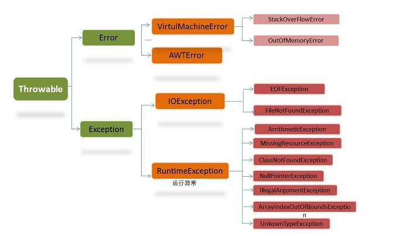

# 异常
异常的种类



## 1.线程的描述

### 1.1状态概述

- 初始(NEW)：新建一个线程的对象，还未调用start方法
- 运行(RUNNABLE)：java线程中将已经准备就绪(Ready)和正在运行中(Running)的两种状态都统称为“Runnable”。准备就绪的线程会被放在线程池中等待被调用
- 阻塞(BLOCKED)：是因为某种的原因而放弃了CPU的使用权，暂时的停止了运行。直到线程进入准备就绪(Ready)状态才会有机会转到运行状态
- 等待(WAITING)：该状态的线程需要等待其他线程做出一些特定的动作（通知或者是中断）
- 超时等待(TIME_WAITING)：该状态和上面的等待不同，他可以在指定的时间内自行返回
- 终止(TERMINATED)：线程任务执行完毕


## 1.2状态详细说明

### 1.2.1. 初始状态(NEW)

实现Runnable接口和继承Thread可以得到一个线程类，new一个实例出来，线程就进入了初始状态。

### 1.2.2运行(RUNNABLE)

#### 1.2.2.1. 就绪状态(RUNNABLE之READY)

就绪状态只是说你资格运行，调度程序没有挑选到你，你就永远是就绪状态。

调用线程的start()方法，此线程进入就绪状态。

当前线程sleep()方法结束，其他线程join()结束，等待用户输入完毕，某个线程拿到对象锁，这些线程也将进入就绪状态。

当前线程时间片用完了，调用当前线程的yield()方法，当前线程进入就绪状态。

锁池里的线程拿到对象锁后，进入就绪状态。

#### 1.2.2.2. 运行中状态(RUNNABLE之RUNNING)

线程调度程序从可运行池中选择一个线程作为当前线程时线程所处的状态。这也是线程进入运行状态的唯一的一种方式。

### 1.2.3. 阻塞状态(BLOCKED)

阻塞状态是线程阻塞在进入synchronized关键字修饰的方法或代码块(获取锁)时的状态。

### 1.2.4. 等待(WAITING)

处于这种状态的线程不会被分配CPU执行时间，它们要等待被显式地唤醒，否则会处于无限期等待的状态。

### 1.2.5. 超时等待(TIMED_WAITING)

处于这种状态的线程不会被分配CPU执行时间，不过无须无限期等待被其他线程显示地唤醒，在达到一定时间后它们会自动唤醒。

### 1.2.6. 终止状态(TERMINATED)

当线程的run()方法完成时，或者主线程的main()方法完成时，我们就认为它终止了。这个线程对象也许是活的，但是它已经不是一个单独执行的线程。线程一旦终止了，就不能复生。

在一个终止的线程上调用start()方法，会抛出java.lang.IllegalThreadStateException异常。

### 1.3等待队列与同步队列

调用obj的wait(), notify()方法前，必须获得obj锁，也就是必须写在synchronized(obj) 代码段内。

与等待队列相关的步骤：


同步队列：

- 线程等待时间到了或被notify/notifyAll唤醒后，会进入同步队列竞争锁，如果获得锁，进入RUNNABLE状态，否则进入BLOCKED状态等待获取锁。
- 当前线程想调用对象A的同步方法时，发现对象A的锁被别的线程占有，此时当前线程进入同步队列。简言之，同步队列里面放的都是想争夺对象锁的线程。
- 当一个线程1被另外一个线程2唤醒时，1线程进入同步队列，去争夺对象锁。
- 同步队列是在同步的环境下才有的概念，一个对象对应一个同步队列。

### 1.4 sleep()、yield()、join()、wait()、notify()、park()

1. Thread.sleep(long millis)，一定是当前线程调用此方法，当前线程进入TIMED_WAITING状态，但不释放对象锁，millis后线程自动苏醒进入就绪状态。作用：给其它线程执行机会的最佳方式。
2. Thread.yield()，一定是当前线程调用此方法，当前线程放弃获取的CPU时间片，但不释放锁资源，由运行状态变为就绪状态，让OS再次选择线程。作用：让相同优先级的线程轮流执行，但并不保证一定会轮流执行。实际中无法保证yield()达到让步目的，因为让步的线程还有可能被线程调度程序再次选中。Thread.yield()不会导致阻塞。该方法与sleep()类似，只是不能由用户指定暂停多长时间。
3. thread.join()/thread.join(long millis)，当前线程里调用其它线程t的join方法，当前线程进入WAITING/TIMED_WAITING状态，当前线程不会释放已经持有的对象锁。线程t执行完毕或者millis时间到，当前线程一般情况下进入RUNNABLE状态，也有可能进入BLOCKED状态（因为join是基于wait实现的）。
4. obj.wait()，当前线程调用对象的wait()方法，当前线程释放对象锁，进入等待队列。依靠notify()/notifyAll()唤醒或者wait(long timeout) timeout时间到自动唤醒。
5. obj.notify()唤醒在此对象监视器上等待的单个线程，选择是任意性的。notifyAll()唤醒在此对象监视器上等待的所有线程。
6. LockSupport.park()/LockSupport.parkNanos(long nanos),LockSupport.parkUntil(long deadlines), 当前线程进入WAITING/TIMED_WAITING状态。对比wait方法,不需要获得锁就可以让线程进入WAITING/TIMED_WAITING状态，需要通过LockSupport.unpark(Thread thread)唤醒。

## 2.InterruptedException异常处理

在了解InterruptedException异常之前应该了解以下的几个关于线程的一些基础知识。而且得知道什么时候会抛InterruptedException异常

当阻塞方法收到中断请求的时候就会抛出InterruptedException异常

而InterruptedException异常从字面意思上就是中断异常，那么什么是中断呢？学习中断之前我们先了解一下具体什么是阻塞

### 2.1线程阻塞

线程阻塞通常是指一个线程在执行过程中暂停，以等待某个条件的触发。而什么情况才会使得线程进入阻塞的状态呢？

- 等待阻塞：运行的线程执行wait()方法，该线程会释放占用的所有资源，JVM会把该线程放入“等待池”中。进入这个状态后，是不能自动唤醒的，必须依靠其他线程调用notify()或notifyAll()方法才能被唤醒
- 同步阻塞：运行的线程在获取对象的同步锁时，若该同步锁被别的线程占用，则JVM会把该线程放入“锁池”中
- 其他阻塞：运行的线程执行sleep()或join()方法，或者发出了I/O请求时，JVM会把该线程置为阻塞状态。当sleep()状态超时、join()等待线程终止或者超时、或者I/O处理完毕时，线程重新转入就绪状态

### 2.3.线程中断

如果我们有一个运行中的软件，例如是杀毒软件正在全盘查杀病毒，此时我们不想让他杀毒，这时候点击取消，那么就是正在中断一个运行的线程。

每一个线程都有一个boolean类型的标志，此标志意思是当前的请求是否请求中断，默认为false。当一个线程A调用了线程B的interrupt方法时，那么线程B的是否请求的中断标志变为true。而线程B可以调用方法检测到此标志的变化。

1. 阻塞方法：如果线程B调用了阻塞方法，如果是否请求中断标志变为了true，那么它会抛出InterruptedException异常。**抛出异常的同时它会将线程B的是否请求中断标志置为false**
2. 非阻塞方法：可以通过线程B的isInterrupted方法进行检测是否请求中断标志为true还是false，另外还有一个静态的方法interrupted方法也可以检测标志。但是静态方法它检测完以后会自动的将是否请求中断标志位置为false。例如线程A调用了线程B的interrupt的方法，那么如果此时线程B中用静态interrupted方法进行检测标志位的变化的话，那么第一次为true，第二次就为false。下面为具体的例子：

```java
/**
 * @program: Test
 * @description:
 **/
public class InterrupTest implements Runnable{

    public void run(){
            try {
                while (true) {
                    Boolean a = Thread.currentThread().isInterrupted();
                    System.out.println("in run() - about to sleep for 20 seconds-------" + a);
                    Thread.sleep(20000);
                    System.out.println("in run() - woke up");
                }
            } catch (InterruptedException e) {
                Thread.currentThread().interrupt();//如果不加上这一句，那么cd将会都是false，因为在捕捉到InterruptedException异常的时候就会自动的中断标志置为了false
                Boolean c=Thread.interrupted();
                Boolean d=Thread.interrupted();
                System.out.println("c="+c);
                System.out.println("d="+d);
            }
    }
    public static void main(String[] args) {
        InterrupTest si = new InterrupTest();
        Thread t = new Thread(si);
        t.start();
        //主线程休眠2秒，从而确保刚才启动的线程有机会执行一段时间
        try {
            Thread.sleep(2000);
        }catch(InterruptedException e){
            e.printStackTrace();
        }
        System.out.println("in main() - interrupting other thread");
        //中断线程t
        t.interrupt();
        System.out.println("in main() - leaving");
    }
}
```

打印的参数如下：

```java
in run() - about to sleep for 20 seconds-------false
in main() - interrupting other thread
in main() - leaving
c=true
d=false
```

现在知道线程可以检测到自身的标志位的变化，但是他只是一个标志，如果线程本身不处理的话，那么程序还是会执行下去，就好比，老师在学校叮嘱要好好学习，具体什么时候，如何好好学习还是看自身。

因此interrupt() 方法并不能立即中断线程，该方法仅仅告诉线程外部已经有中断请求，至于是否中断还取决于线程自己

### 2.3InterruptedException异常的处理

简单的了解了什么是阻塞和中断以后，我们就该了解碰到InterruptedException异常该如何处理了。

#### 不要不管不顾

有时候阻塞的方法抛出InterruptedException异常并不合适，例如在Runnable中调用了可中断的方法，因为你的程序是实现了Runnable接口，然后在重写Runnable接口的run方法的时候，那么子类抛出的异常要小于等于父类的异常。而在Runnable中run方法是没有抛异常的。**所以此时是不能抛出InterruptedException异常**。如果此时你只是记录日志的话，那么就是一个不负责任的做法，因为在捕获InterruptedException异常的时候自动的将是否请求中断标志置为了false。至少在捕获了InterruptedException异常之后，如果你什么也不想做，那么就将标志重新置为true，以便栈中更高层的代码能知道中断，并且对中断作出响应。

**捕获到InterruptedException异常后恢复中断状态**

```java
public class TaskRunner implements Runnable {
    private BlockingQueue<Task> queue;
 
    public TaskRunner(BlockingQueue<Task> queue) { 
        this.queue = queue; 
    }
 
    public void run() { 
        try {
             while (true) {
                 Task task = queue.take(10, TimeUnit.SECONDS);
                 task.execute();
             }
         }
         catch (InterruptedException e) { 
             // Restore the interrupted status
             Thread.currentThread().interrupt();
         }
    }
}
```

## Java线程中run和start方法的区别

### 1.start（）方法来启动线程

真正实现了多线程运行，这时无需等待run方法体代码执行完毕而直接继续执行下面的代码：通过调用Thread类的start()方法来启动一个线程，这时此线程是处于就绪状态，并没有运行。然后通过此Thread类调用方法run()来完成其运行操作的，这里方法run()称为线程体，它包含了要执行的这个线程的内容，Run方法运行结束，此线程终止，而CPU再运行其它线程。

## 2.run（）方法当作普通方法的方式调用

程序还是要顺序执行，还是要等待run方法体执行完毕后才可继续执行下面的代码：而如果直接用Run方法，这只是调用一个方法而已，程序中依然只有主线程--这一个线程，其程序执行路径还是只有一条，这样就没有达到写线程的目的。

Thread对象的run()方法在一种循环下，使线程一直运行，直到不满足条件为止，在你的main()里创建并运行了一些线程，调用Thread类的start（）方法将为线程执行特殊的初始化的过程，来配置线程，然后由线程执行机制调用run（）。如果你不调用start（）线程就不会启动。

因为线程调度机制的行为是不确定的，所以每次运行该程序都会有不同的结果，你可以把你的循环次数增多些，然后看看执行的结果，你会发现main（）的线程和Thread1是交替运行的。

4.还有就是尽管线程的调度顺序是不固定的，但是如果有很多线程被阻塞等待运行，调度程序将会让优先级高的线程先执行，而优先级低的线程执行的频率会低一些。

---
#线程 #异常