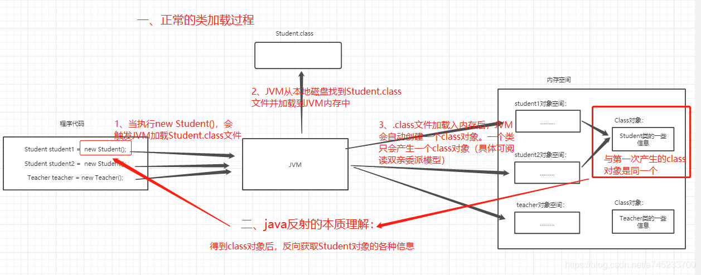

# 反射reflew

## 一、什么是反射

Java反射机制的核心是在程序运行时动态加载类并获取类的详细信息，从而操作类或对象的属性和方法。本质是JVM得到class对象之后，再通过class对象进行反编译，从而获取对象的各种信息。


通的java对象是通过new关键字把对应类的字节码文件加载到内存，然后创建该对象的。

反射是通过一个名为Class的特殊类，用Class.forName("className");得到类的字节码对象，然后用newInstance()方法在虚拟机内部构造这个对象（针对无参构造函数）。

也就是说反射机制让我们可以先拿到java类对应的字节码对象，然后动态的进行任何可能的操作，包括：
* 在运行时判断任意一个对象所属的类
* 在运行时构造任意一个类的对象
* 在运行时判断任意一个类所具有的成员变量和方法
* 在运行时调用任意一个对象的方法
这些都是反射的功能。
使用反射的主要作用是方便程序的扩展。

## 二、原理



## 三、使用

### Java通过反射获取对象并执行方法

```java
import java.lang.reflect.Method;

public class Main {

    public static void main(String[] args) throws Exception {
        // 获取class对象
        Class clzss = Class.forName("xxx.xxx.xx.className");
        // 通过构造器获取对象实例
        Object obj = clzss.getDeclaredConstructor().newInstance();
        // 获取执行方法对象.形参是待执行方法名
        Method method = clzss.getMethod("xxxMethod");
        // 执行方法
        method.invoke(obj);
    }
}

```

### SpringBoot通过反射获取Bean对象，执行方法

```java
import org.junit.runner.RunWith;
import org.springframework.beans.factory.annotation.Autowired;
import org.springframework.boot.test.context.SpringBootTest;
import org.springframework.context.ApplicationContext;
import org.springframework.test.context.junit4.SpringRunner;

import java.lang.reflect.InvocationTargetException;
import java.lang.reflect.Method;

@RunWith(SpringRunner.class)
@SpringBootTest(classes = {XXXXXXXApplication.class})
public class Test {
    @Autowired
    private ApplicationContext applicationContext;

    @org.junit.Test
    public void TestSpringBean() {
        try {
            // 获取class对象
            Class<?> cls = Class.forName("xxx.xxx.xx.className");
            // 获取spring中的bean对象
            Object bean = applicationContext.getBean(cls);
            // 获取mybatis方法.形参是待执行方法名
            Method method = cls.getMethod("xxxMethod", String.class);
            // 执行方法
            String data = "{\"name\":\"cs\"}";
            method.invoke(bean, data);
        } catch (ClassNotFoundException e) {
            e.printStackTrace();
        } catch (NoSuchMethodException e) {
            e.printStackTrace();
        } catch (IllegalAccessException e) {
            e.printStackTrace();
        } catch (InvocationTargetException e) {
            e.printStackTrace();
        }
    }
}
```

---
#反射