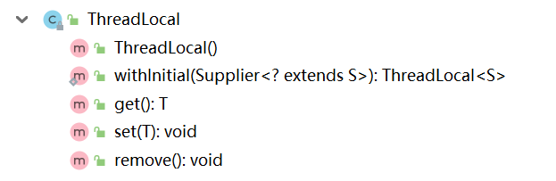
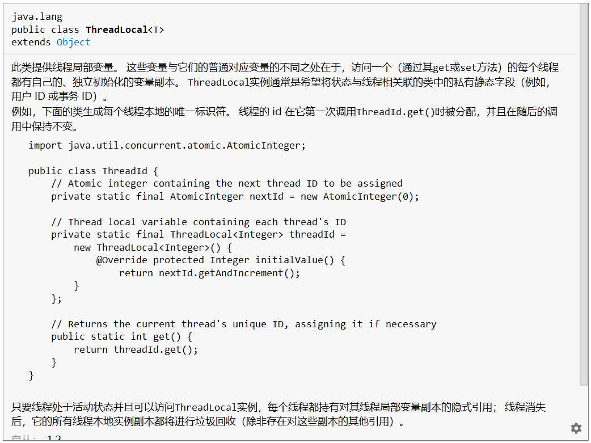
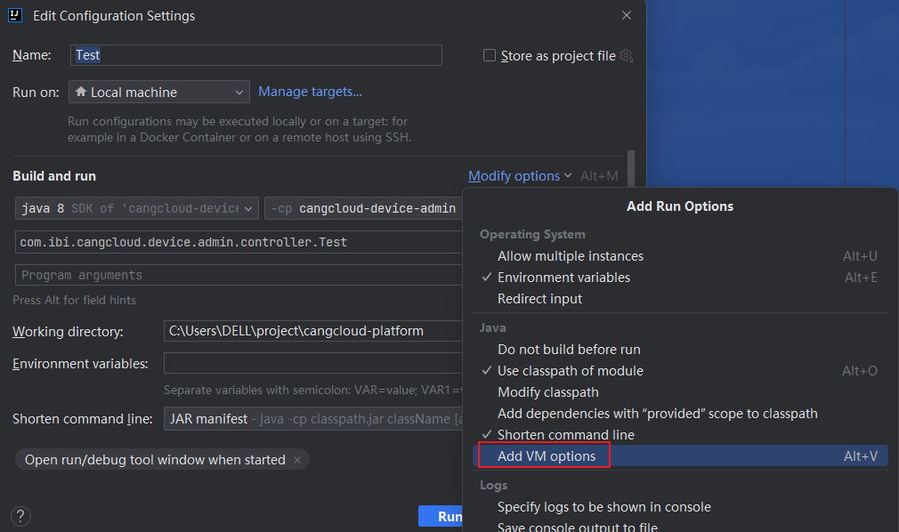
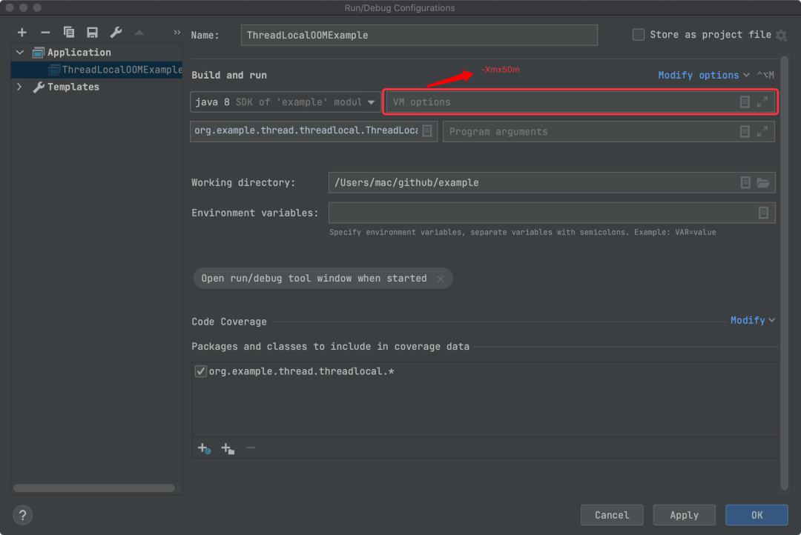
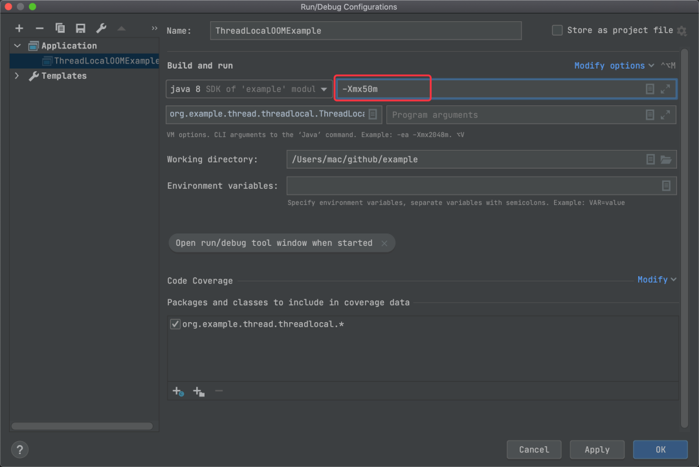
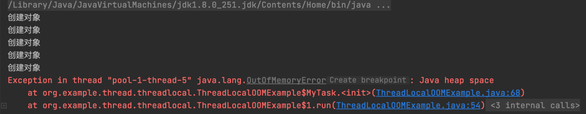
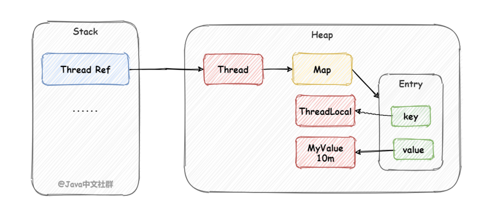
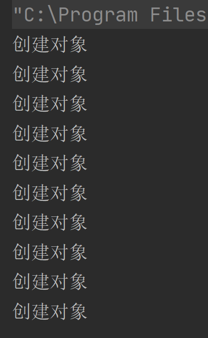

# ThreadLocal正确使用姿势
[[toc]]

## 前言

**ThreadLocal**：线程 + 本地 -> 线程本地变量

虽然写业务代码一般用不到，但它的出镜率可不低。它是开源工具的常客：用于**在线程生命周期内**传递数据。

维持线程封闭性的一种更规范的方法是使用ThreadLocal，这个类能使线程中的某个值与保存值得对象关联起来。


## 正文


### ThreadLocal是什么？

Thread 线程；Local 本地的，局部的。`ThreadLocal`是线程本地变量，只要是本线程内使用都可以使用，线程结束了，那么相应的线程本地变量也就跟着线程消失了。

`ThreadLocal`和`InheritableThreadLocal`均是JDK1.2新增的API，在JDK5后支持到了泛型。它表示**线程局部变量**：为**当前线程**绑定一个变量，这样在线程的生命周期内的**任何地方均**可取出。

说明：`InheritableThreadLocal`继承自`ThreadLocal`，在其基础上扩展了能力：不仅可以在本线程内获取绑定的变量，在**子线程**内亦可获取。（注意：必须是子线程，若是线程池就不行了，因为线程池里的线程是事先初始化好的，并不一定是当前线程的子线程~

ThreadLocal对外开放的方法



分别代表：

- 空的构造方法
- 创建线程局部变量。 变量的初始值是通过调用Supplier的get方法来确定的。

- 设置值：把value和当前线程绑定
- 获取值：获取当前线程绑定的变量值
- 删除值：移除绑定关系

说明：虽然每个绑定关系都是使用的WeakReference，但是还是建议显示的做好remove()移除动作，否则容易造成内存泄漏。



一般我们使用ThreadLocal是作为 `private static final`字段来使用的~


### ThreadLocal怎么用？

知道定义使用就简单了，直接使用示例

创建模拟一个Student对象和当前线程绑定

```java
public class Student {
    private String name = "wCode";
    public String getName() {
        return name;
    }
    public void setName(String name) {
        this.name = name;
    }
    @Override
    public String toString() {
        return "Student{" + "name='" + name + '\'' + '}';
    }
}
```

测试代码

```java
package learn.JDKCode.ThreadLearn.ThreadLocal;

/**
 * @Author Wang WenLei
 * @Date 2021/11/24 21:34
 * @Version 1.0
 **/
public class ThreadLocalMain {
    private static final ThreadLocal<Student> THREAD_LOCAL = new ThreadLocal<>();
    public static void main(String[] args) {
        setDate(new Student());
        getAndPrintData();
    }

    private static void getAndPrintData() {
        Student student = THREAD_LOCAL.get();
        System.out.println("get数据，线程名称：" + Thread.currentThread().getName()
                + "数据为：" + student);
    }

    private static void setDate(Student student){
        System.out.println("set数据，线程名："+Thread.currentThread().getName());
        THREAD_LOCAL.set(student);
    }

}
```

如上便是ThreadLocal的典型使用场景：方法调用间传参，并不一定必须得从方法入参处传进来，还可以通过ThreadLocal来传递，进而该线程生命周期内任何地方均可获取到，非常方便。

> 可以将`ThreadLocal<T>`视为包含了`Map<Thread,T>`对象，其中保存了特定于该线程的值，但ThreadLocal的实现并非如此。这些特定于线程的值保存在Thread对象中，当线程终止后，这些值会作为垃圾回收。


## 使用场景

1. 用于防止对可变的单实例变量或全局变量进行共享，例如数据库连接Connection对象
2. 当某个频繁执行的操作需要一个临时的对象，例如一个缓冲区（对临时缓冲区这种简单对象对性能的提升不大），而同时又希望避免在每次执行时都重新分配该临时对象，就可以使用这项技术。

### 局限性

例子中的典型应用场景，大部分情况下均能正常work。但是，在当前互联网环境下，经常会用到异步方式来提高程序运行效率，比如上述方法调用getAndPrinData()如果比较耗时，我希望异步进行，修改如下：

```java
package learn.JDKCode.ThreadLearn.ThreadLocal;

/**
 * @Author Wang WenLei
 * @Date 2021/11/24 21:34
 * @Version 1.0
 **/
public class ThreadLocalMain {
    private static final ThreadLocal<Student> THREAD_LOCAL = new ThreadLocal<>();
    public static void main(String[] args) throws InterruptedException {
        setDate(new Student());
        Thread t1 = new Thread(ThreadLocalMain::getAndPrintData);
        t1.start();
        // join作用 确保t1执行完成
        t1.join();
        getAndPrintData();
    }

    private static void getAndPrintData() {
        Student student = THREAD_LOCAL.get();
        System.out.println("get数据，线程名称：" + Thread.currentThread().getName()
                + "数据为：" + student);
    }

    private static void setDate(Student student){
        System.out.println("set数据，线程名："+Thread.currentThread().getName());
        THREAD_LOCAL.set(student);
    }

}
```

执行结果

```java
set数据，线程名：main
get数据，线程名称：Thread-0数据为：null
get数据，线程名称：main数据为：Student{name='wCode'}
```

线程名为Thread-0的子线程里并没有获取到是数据，因为它并不是当前线程，这便是ThreadLocal的局限性。

### InheritableThreadLocal向子线程传递数据

它继承自ThreadLocal，所以它能力更强：通过它set进去的数据，不仅本线程内任意地方可以获取，子线程（包括子线程的子线程。。。）内的任意地方也都可以获取到值。

必须是子线程

例子再稍稍小改一下：

```java
package learn.JDKCode.ThreadLearn.ThreadLocal;

/**
 * @Author Wang WenLei
 * @Date 2021/11/24 21:34
 * @Version 1.0
 **/
public class ThreadLocalMain {
    private static final ThreadLocal<Student> THREAD_LOCAL = new InheritableThreadLocal<>();
    public static void main(String[] args) throws InterruptedException {
        setDate(new Student());
        Thread thread = new Thread(ThreadLocalMain::getAndPrintData);
        thread.start();
        thread.join();
        getAndPrintData();
    }

    private static void getAndPrintData() {
        Student student = THREAD_LOCAL.get();
        System.out.println("get数据，线程名称：" + Thread.currentThread().getName()
                + "数据为：" + student);
    }

    private static void setDate(Student student){
        System.out.println("set数据，线程名："+Thread.currentThread().getName());
        THREAD_LOCAL.set(student);
    }

}
```

得到结果

```java
set数据，线程名：main
get数据，线程名称：Thread-0数据为：Student{name='wCode'}
get数据，线程名称：main数据为：Student{name='wCode'}
```

完美~

附加：还有非父子线程、跨线程池之间的数据产地它解决不了，对于这种场景较为复杂，原生JDK并没有“特效类”，一般需要借助阿里巴巴的开源库：TTL（transmittable-thread-local）来搞定

## 开源框架使用示例

### Spring

#### RequestContextHolder

```java
public abstract class RequestContextHolder  {

	private static final boolean jsfPresent =
			ClassUtils.isPresent("javax.faces.context.FacesContext", RequestContextHolder.class.getClassLoader());

	private static final ThreadLocal<RequestAttributes> requestAttributesHolder =
			new NamedThreadLocal<>("Request attributes");

	private static final ThreadLocal<RequestAttributes> inheritableRequestAttributesHolder =
			new NamedInheritableThreadLocal<>("Request context");
    @Nullable
	public static RequestAttributes getRequestAttributes() {
		RequestAttributes attributes = requestAttributesHolder.get();
		if (attributes == null) {
			attributes = inheritableRequestAttributesHolder.get();
		}
		return attributes;
	}
}
```

#### TransactionSynchronizationManager

transaction		美[trænˈzækʃn]		交易

synchronization	美[ˌsɪŋkrənaɪ'zeɪʃ(ə)n]	同步

这个类的作用：

**管理每个订阅者上下文的资源和事务同步的中央委托**。 供资源管理代码使用，但不供典型应用程序代码使用。支持每个key一个资源而不被覆盖，即需要删除一个资源才能为同一个key设置新的资源。 如果同步处于活动状态，则支持事务同步列表。资源管理代码应该通过getResource检查上下文绑定的资源，例如数据库连接。 这样的代码通常不应该将资源绑定到工作单元，因为这是事务管理器的责任。 如果事务同步处于活动状态，则另一个选项是在第一次使用时延迟绑定，以执行跨越任意数量资源的事务。事务同步必须由事务管理器通过initSynchronization()和clearSynchronization()激活和停用。 这由AbstractReactiveTransactionManager自动支持，因此所有标准 Spring 事务管理器都支持。资源管理代码应该只在此管理器处于活动状态时注册同步，这可以通过isSynchronizationActive进行检查； 否则它应该立即执行资源清理。 如果事务同步未处于活动状态，则要么没有当前事务，要么事务管理器不支持事务同步。例如，同步用于在事务中始终返回相同的资源，例如任何给定连接工厂的数据库连接。


## ThreadLocal不能解决共享变量的线程安全问题

如果ThreadLocal绑定的是`Immutable`不可变变量，如字符串等，那结论尚能成立。但若绑定的是**引用类型的变量**，结论就是错的。

```java
package learn.JDKCode.ThreadLearn.ThreadLocal;

/**
 * 展示 ThreadLocal不能解决共享变量的线程安全问题
 * 打印结果
 *  set数据，线程名：main
 *  get数据，线程名称：Thread-0数据为：Student{name='wCode'}
 *  get数据，线程名称：Thread-1数据为：Student{name='www'}
 *  get数据，线程名称：main数据为：Student{name='www'}
 * @Author Wang WenLei
 * @Date 2021/11/24 23:01
 * @Version 1.0
 **/
public class ThreadLocalMain1 {
    private static final ThreadLocal<Student> THREAD_LOCAL = new InheritableThreadLocal<>();
    public static void main(String[] args) throws InterruptedException {
        setDate(new Student());
        Thread t1 = new Thread(() -> {
            Student st = getAndPrintData();
            st.setName("www");

        });
        Thread t2 = new Thread(ThreadLocalMain1::getAndPrintData);
        t1.start();
        t1.join();
        t2.start();
        t2.join();
        getAndPrintData();
    }

    private static Student getAndPrintData() {
        Student student = THREAD_LOCAL.get();
        System.out.println("get数据，线程名称：" + Thread.currentThread().getName()
                + "数据为：" + student);
        return student;
    }

    private static void setDate(Student student){
        System.out.println("set数据，线程名："+Thread.currentThread().getName());
        THREAD_LOCAL.set(student);
    }

}
```

结论：线程`t1`把共享变量Student的name值改过之后，**其他线程再去获取取到的均是改变后的值**。因此使用ThreadLocal并没有达到绝对共享线程安全问题的效果。


## ThreadLocal使用的正确姿势

针对SimpleDataFomat是线程不安全的问题

阿里巴巴规范手册给出使用示范：

```java
package learn.JDKCode.ThreadLearn.ThreadLocal;


import java.text.DateFormat;
import java.text.SimpleDateFormat;
import java.util.Date;

/**
 * 正确使用姿势
 * @Author Wang WenLei
 * @Date 2021/11/24 23:15
 * @Version 1.0
 **/
public class ThreadLocalMain2 {
    private static final ThreadLocal<DateFormat> DATA_FORMAT_THREAD_LOCAL = new InheritableThreadLocal<DateFormat>(){

        /**
         * 返回此线程局部变量的当前线程的“初始值”。 该方法将在线程第一次使用get方法访问变量时被调用，
         * 除非线程之前调用了set方法，在这种情况下，将不会为线程调用initialValue方法。
         * 通常，每个线程最多调用此方法一次，但在后续调用remove后跟get情况下可能会再次调用它。
         */
        @Override
        protected DateFormat initialValue() {
            return new SimpleDateFormat("yyyy-MM-dd");
        }
    };

    public static void main(String[] args) throws InterruptedException {
//        setDate();
        Thread t1 = new Thread(ThreadLocalMain1::getAndPrintData);
        Thread t2 = new Thread(ThreadLocalMain1::getAndPrintData);
        t1.start();
        t1.join();
        t2.start();
        t2.join();
        getAndPrintData();
    }

    private static DateFormat getAndPrintData() {
        DateFormat dateFormat = DATA_FORMAT_THREAD_LOCAL.get();
        System.out.println("get数据，线程名称：" + Thread.currentThread().getName()
                + "数据为：" + dateFormat.format(new Date()));
        return dateFormat;
    }

    private static void setDate(){
        System.out.println("set数据，线程名："+Thread.currentThread().getName());
        DATA_FORMAT_THREAD_LOCAL.set(new SimpleDateFormat("yyyyMMdd"));
    }
}
```

执行结果：

```java
get数据，线程名称：Thread-0数据为：null
get数据，线程名称：Thread-1数据为：null
get数据，线程名称：main数据为：2021-11-24
```

这么处理后再使用DateFormat这个实例，就是绝对安全的。理由是每次调用set方法进行和线程绑定的时候，**都是new一个新的****SimpleDateFormat****实例**，而并非全局共享一个，不存在了数据共享那必然就线程安全喽。

当然你可能会说，这和自己在线程里面每次你自己new一个出来用有什么区别呢？答案是：效果上没任何区别，但是这样方便。比如：可以保持线程里面只有唯一一个SimpleDateFormat对象，你要手动new的话，一不小心就new多个了，消耗内存不说还不好管理。


**可能你还会说**，那只new一个实例，然后哪个方法要用就通过参数传给它就行。答案还是一样的：不嫌麻烦的话，这样做也是能达到效果的。


然而，对于这种全局通用的变量，使用ThreadLocal管理和维护一份即可，大大的降低了维护成本和他人的使用成本。

## ThreadLocal内存溢出演示和原因分析！

#内存溢出
> **什么是内存溢出？**
> 内存溢出（Memory Overflow），指的是在程序运行过程中，申请的内存资源不再被使用，但没有被正确释放，导致占用的内存不断增加，最终耗尽系统的可用内存。当程序尝试分配更多的内存空间时，由于内存不足，会抛出 OutOfMemoryError 异常，导致程序终止或崩溃的现象就叫做内存溢出。

### 内存溢出代码演示
在开始演示 ThreadLocal 内存溢出的问题之前，我们先使用“-Xmx50m”的参数来设置一下 Idea，它表示将程序运行的最大内存设置为 50m，如果程序的运行超过这个值就会出现内存溢出的问题，设置方法如下：
[了解常用调优参数](../../3_jvm/常用Java虚拟机调优参数.md)



设置后的最终效果这样的：


配置完 Idea 之后，接下来我们来实现一下业务代码。在代码中我们会创建一个大对象，这个对象中会有一个 10m 大的数组，然后我们将这个大对象存储在 ThreadLocal 中，再使用线程池执行大于 5 次添加任务，因为设置了最大运行内存是 50m，所以理想的情况是执行 5 次添加操作之后，就会出现内存溢出的问题，实现代码如下：

```java
import java.util.concurrent.LinkedBlockingQueue;
import java.util.concurrent.ThreadPoolExecutor;
import java.util.concurrent.TimeUnit;

publicclass ThreadLocalOOMExample {
    
    /**
     * 定义一个 10m 大的类
     */
    staticclass MyTask {
        // 创建一个 10m 的数组（单位转换是 1M -> 1024KB -> 1024*1024B）
        privatebyte[] bytes = newbyte[10 * 1024 * 1024];
    }
    
    // 定义 ThreadLocal
    privatestatic ThreadLocal<MyTask> taskThreadLocal = new ThreadLocal<>();

    // 主测试代码
    public static void main(String[] args) throws InterruptedException {
        // 创建线程池
        ThreadPoolExecutor threadPoolExecutor =
                new ThreadPoolExecutor(5, 5, 60,
                        TimeUnit.SECONDS, new LinkedBlockingQueue<>(100));
        // 执行 10 次调用
        for (int i = 0; i < 10; i++) {
            // 执行任务
            executeTask(threadPoolExecutor);
            Thread.sleep(1000);
        }
    }

    /**
     * 线程池执行任务
     * @param threadPoolExecutor 线程池
     */
    private static void executeTask(ThreadPoolExecutor threadPoolExecutor) {
        // 执行任务
        threadPoolExecutor.execute(new Runnable() {
            @Override
            public void run() {
                System.out.println("创建对象");
                // 创建对象（10M）
                MyTask myTask = new MyTask();
                // 存储 ThreadLocal
                taskThreadLocal.set(myTask);
                // 将对象设置为 null，表示此对象不在使用了
                myTask = null;
            }
        });
    }
}
```

以上程序的执行结果如下：


### 原因分析
内存溢出的问题和解决方案比较简单，重点在于“原因分析”，我们要通过内存溢出的问题搞清楚，为什么 ThreadLocal 会这样？是什么原因导致了内存溢出？

要搞清楚这个问题（内存溢出的问题），我们需要从 ThreadLocal 源码入手，所以我们首先打开 set 方法的源码（在示例中使用到了 set 方法），如下所示：
```java
public void set(T value) {
    // 得到当前线程
    Thread t = Thread.currentThread();
    // 根据线程获取到 ThreadMap 变量
    ThreadLocalMap map = getMap(t);
    if (map != null)
        map.set(this, value); // 将内容存储到 map 中
    else
        createMap(t, value); // 创建 map 并将值存储到 map 中
}
```

从上述代码我们可以看出 Thread、ThreadLocalMap 和 set 方法之间的关系：**每个线程 Thread 都拥有一个数据存储容器 ThreadLocalMap，当执行 ThreadLocal.set  方法执行时，会将要存储的值放到 ThreadLocalMap 容器中**，所以接下来我们再看一下 ThreadLocalMap 的源码：

```java
staticclass ThreadLocalMap {
    // 实际存储数据的数组
    private Entry[] table;
    // 存数据的方法
    private void set(ThreadLocal<?> key, Object value) {
        Entry[] tab = table;
        int len = tab.length;
        int i = key.threadLocalHashCode & (len-1);
        for (Entry e = tab[i];
                e != null;
                e = tab[i = nextIndex(i, len)]) {
            ThreadLocal<?> k = e.get();
            // 如果有对应的 key 直接更新 value 值
            if (k == key) {
                e.value = value;
                return;
            }
            // 发现空位插入 value
            if (k == null) {
                replaceStaleEntry(key, value, i);
                return;
            }
        }
        // 新建一个 Entry 插入数组中
        tab[i] = new Entry(key, value);
        int sz = ++size;
        // 判断是否需要进行扩容
        if (!cleanSomeSlots(i, sz) && sz >= threshold)
            rehash();
    }
    // ... 忽略其他源码
}
```

从上述源码我们可以看出：**ThreadMap 中有一个 Entry[] 数组用来存储所有的数据，而 Entry 是一个包含 key 和 value 的键值对，其中 key 为 ThreadLocal 本身，而 value 则是要存储在 ThreadLocal 中的值**。

根据上面的内容，我们可以得出 ThreadLocal 相关对象的关系图，如下所示：

也就是说**它们之间的引用关系是这样的：Thread -> ThreadLocalMap -> Entry -> Key,Value，因此当我们使用线程池来存储对象时，因为线程池有很长的生命周期，所以线程池会一直持有 value 值，那么垃圾回收器就无法回收 value，所以就会导致内存一直被占用，从而导致内存溢出问题的发生**。

### 解决方案
ThreadLocal 内存溢出的解决方案很简单，我们只需要在使用完 ThreadLocal 之后，执行 remove 方法就可以避免内存溢出问题的发生了，比如以下代码：
```java
import java.util.concurrent.LinkedBlockingQueue;
import java.util.concurrent.ThreadPoolExecutor;
import java.util.concurrent.TimeUnit;

publicclass App {

    /**
     * 定义一个 10m 大的类
     */
    staticclass MyTask {
        // 创建一个 10m 的数组（单位转换是 1M -> 1024KB -> 1024*1024B）
        privatebyte[] bytes = newbyte[10 * 1024 * 1024];
    }

    // 定义 ThreadLocal
    privatestatic ThreadLocal<MyTask> taskThreadLocal = new ThreadLocal<>();

    // 测试代码
    public static void main(String[] args) throws InterruptedException {
        // 创建线程池
        ThreadPoolExecutor threadPoolExecutor =
                new ThreadPoolExecutor(5, 5, 60,
                        TimeUnit.SECONDS, new LinkedBlockingQueue<>(100));
        // 执行 n 次调用
        for (int i = 0; i < 10; i++) {
            // 执行任务
            executeTask(threadPoolExecutor);
            Thread.sleep(1000);
        }
    }

    /**
     * 线程池执行任务
     * @param threadPoolExecutor 线程池
     */
    private static void executeTask(ThreadPoolExecutor threadPoolExecutor) {
        // 执行任务
        threadPoolExecutor.execute(new Runnable() {
            @Override
            public void run() {
                System.out.println("创建对象");
                try {
                    // 创建对象（10M）
                    MyTask myTask = new MyTask();
                    // 存储 ThreadLocal
                    taskThreadLocal.set(myTask);
                    // 其他业务代码...
                } finally {
                    // 释放内存
                    taskThreadLocal.remove();
                }
            }
        });
    }
}
```

以上程序的执行结果如下：


从上述结果可以看出我们只需要在 finally 中执行 ThreadLocal 的 remove 方法之后就不会在出现内存溢出的问题了。

### remove的秘密
那 remove 方法为什么会有这么大的魔力呢？我们打开 remove 的源码看一下：
```java
public void remove() {
    ThreadLocalMap m = getMap(Thread.currentThread());
    if (m != null)
        m.remove(this);
}
```

从上述源码中我们可以看出，当调用了 remove 方法之后，会直接将 Thread 中的 ThreadLocalMap 对象移除掉，这样 Thread 就不再持有 ThreadLocalMap 对象了，所以即使 Thread 一直存活，也不会造成因为（ThreadLocalMap）内存占用而导致的内存溢出问题了。


---

#Thread