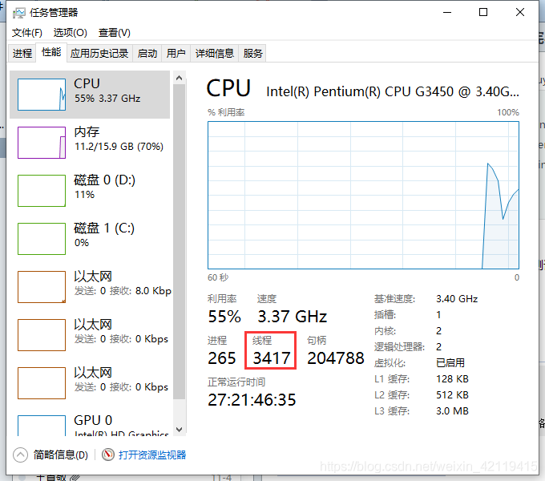
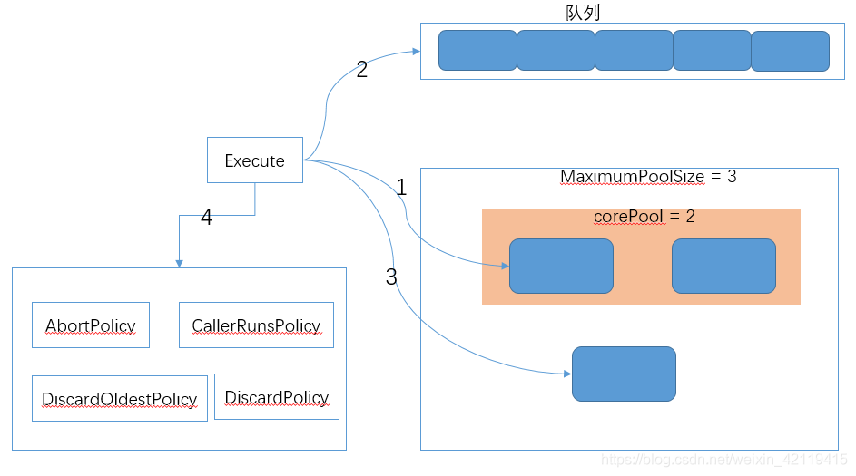
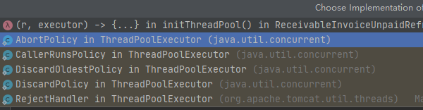
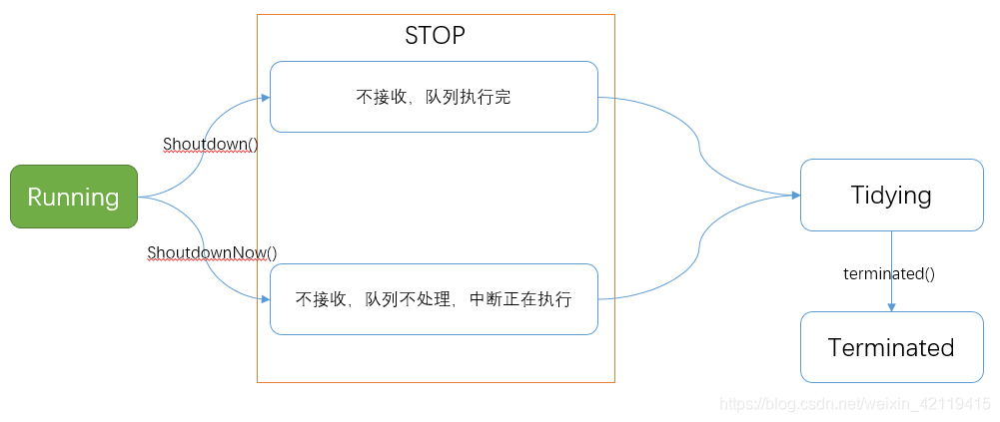

# 线程池
[[toc]]

## 一、写在前面
听到线程池、线程，不禁都为为之端正姿势

## 二、部分基础
### 1、两种线程模型
用户级线程（ULT）：用户程序实现，不依赖操作系统核心，应用提供创建、同步、调度和管理新城的函数来控制用户线程。不需要用户态/内核态之间的切换，速度快，内核对ULT无感知。
内核线程（KLT）：系统内核管理线程，内核保存线程的状态和上下文，线程阻塞不会引起进程阻塞，在多处理器系统上，多线程在处理器上并行运行，线程创建、调度和管理由内核完成，效率要比ULT慢，比进程操作快。
直观感受下内核线程：如果创建的是内核线程，那么这个数字会增多。



Java线程创建是依赖于系统内核，通过JVM调用系统库创建内核线程，内核线程与Java-Thread是1:1关系

### 2、使用线程池的原因
线程创建太麻烦，Java是依赖于内核线程，创建和销毁需要保存线程的状态和切换上下文，是一个小消耗资源的操作。为了避免资源消耗过度需要设法重用线程的执行多任务。线程池就是一个线程缓存，负责对线程进行统一分配、调优与监控。

### 3、什么时候使用线程池
单个任务处理时间比较快
需要处理的任务数量比较大

### 4、线程池的优势
重用存在的线程，减少创建线程、消亡的开销，提升性能
提高响应速度。当任务到达时，任务可以不需要等到线程创建就能立即执行
提高线程管理型，可以统一分配、调优和监控

### 5、包关系
所有的线程都是继承自Executor，Executor是一个超类

ThreadPoolExecutor：比较常用

FrokJoinPool：幂级类

ScheduledTreadPoolExecutor：延时类

ThreadPoolTaskExecutor

ThreadPoolTaskScheduler

### 6、线程池的6个参数
corePoolSize：核心线程池大小
maximumPoolSize：最多能创建多少个线程
keepAliveTime：如果没有工作，最长可以空闲多长时间
unit：时间单位
workQueue：都在工作状态，都阻塞，提供的阻塞队列，处理不过来，就放在阻塞队列。在任意时刻，不管并发多高，永远只有一个线程能够进队或出队，线程是安全的。
handler：阻塞队列已满，且线程数达到最大，所采用的饱和策略

### 7、线程池的工作原理
用工作原理说线程池的几个参数
先上图镇楼



来了通过execute提交过来任务先进入corePool
当corePoll满了进入阻塞队列
当队列满了使用MaximumPoolSize的数量开启线程
当线程超过了MaximumPoolSize的数量，走饱和策略（拒绝策略）

### 8、四种常用的线程池及原理
- newFixedThreadPool (固定数目线程的线程池)
- newCachedThreadPool(可缓存线程的线程池)
- newSingleThreadExecutor(单线程的线程池)
- newScheduledThreadPool(定时及周期执行的线程池)
#### 1.newFixedThreadPool (固定数目线程的线程池)
- 核心线程数和最大线程数大小一样
- 没有所谓的非空闲时间，即keepAliveTime为0
- 阻塞队列为无界队列LinkedBlockingQueue

使用场景：FixedThreadPool 适用于处理CPU密集型的任务，确保CPU在长期被工作线程使用的情况下，尽可能的少的分配线程，即适用执行长期的任务。

**使用注意：使用无界队列的线程池会导致内存飙升吗？**
**会的，newFixedThreadPool使用了无界的阻塞队列LinkedBlockingQueue，如果线程获取一个任务后，任务的执行时间比较长(比如，上面demo设置了10秒)，会导致队列的任务越积越多，导致机器内存使用不停飙升，** 最终导致OOM。

OMM复现，IDE指定JVM参数：-Xmx8m -Xms8m ，然后运行就会报OOM
```java
ExecutorService executor = Executors.newFixedThreadPool(10);
for (int i = 0; i < 10; i++) {
    executor.execute(() -> {
        try {
            Thread.sleep(100000);
        } catch (InterruptedException e) {
            // e
        }
    });
}
```

#### 2.newCachedThreadPool(可缓存线程的线程池)
线程池特点：
- 核心线程数为0
- 最大线程数为Integer.MAX_VALUE
- 阻塞队列是SynchronousQueue
- 非核心线程空闲存活时间为60秒
工作机制：
- 提交任务
- 因为没有核心线程，所以任务直接加到SynchronousQueue队列。
- 判断是否有空闲线程，如果有，就去取出任务执行。
- 如果没有空闲线程，就新建一个线程执行。
- 执行完任务的线程，还可以存活60秒，如果在这期间，接到任务，可以继续活下去；否则，被销毁。

使用场景：用于并发执行大量短期的小任务。

> 极端情况下会创建过多的线程，耗尽 CPU 和内存资源。由于空闲 60 秒的线程会被终止，长时间保持空闲的 CachedThreadPool 不会占用任何资源。

#### 3.newSingleThreadExecutor(单线程的线程池)
线程池特点：
- 核心线程数为1
- 最大线程数也为1
- 阻塞队列是LinkedBlockingQueue
- keepAliveTime为0

工作机制：
- 提交任务
- 线程池是否有一条线程在，如果没有，新建线程执行任务
- 如果有，将任务加到阻塞队列
- 当前的唯一线程，从队列取任务，执行完一个，再继续取，一个人（一条线程）夜以继日地干活。

使用场景：适用于串行执行任务的场景，一个任务一个任务地执行。

### 4.newScheduledThreadPool(定时及周期执行的线程池)
线程池特点：
- 最大线程数为Integer.MAX_VALUE
- 阻塞队列是DelayedWorkQueue
- keepAliveTime为0
- scheduleAtFixedRate() ：按某种速率周期执行
- scheduleWithFixedDelay()：在某个延迟后执行

工作机制：
- 添加一个任务
- 线程池中的线程从 DelayQueue 中取任务
- 线程从 DelayQueue 中获取 time 大于等于当前时间的task
- 执行完后修改这个 task 的 time 为下次被执行的时间
- 这个 task 放回DelayQueue队列中

```java
/**
 创建一个给定初始延迟的间隔性的任务，之后的下次执行时间是上一次任务从执行到结束所需要的时间+* 给定的间隔时间
 */
ScheduledExecutorService scheduledExecutorService = Executors.newScheduledThreadPool(1);
scheduledExecutorService.scheduleWithFixedDelay(()->{
    System.out.println("current Time" + System.currentTimeMillis());
    System.out.println(Thread.currentThread().getName()+"正在执行");
}, 1, 3, TimeUnit.SECONDS);
```

使用场景：周期性执行任务的场景，需要限制线程数量的场景
### 9、线程池常用的阻塞队列及选择
- LinkedBlockingQueue-无界队列
- ArrayBlockingQueue-有界队列
- PriorityBlockingQueue-优先级队列
- SynchronousQueue-同步移交队列（同步队列）
- DelayQueue-延迟队列
#### 1.无界队列LinkdeBlackQueue
队列大小无限制，常用的无界队列LinkdeBlackQueue，使用该队列作为阻塞队列时要尤其小心，当任务耗时较长时，可能会导致大量的新任务在队列中堆积最终导致OOM 1 。Executors.newFixedThreadPool()采用的就是LinkedBlockingQueue

#### 2.有界队列ArrayBlockingQueue和PriorityBlockingQueue
常用的有两类
遵循FIFO原则的队列，例如：ArrayBlockingQueue，是一个用数组实现的有界阻塞队列，按FIFO排序量
优先级队列，例如：PriorityBlockingQueue
使用有界队列时队列大小和线程池大小相互配合，线程池较小有界队列较大时可减少内存消耗，降低CPU的使用率和上下文切换，但有可能会限制系统吞吐量。

#### 3.同步移交队列（同步队列）SynchronousQueue
如果不希望任务在队列中等待而是希望将任务直接移交工作线程，可以使用SynchronousQueue作为等待队列，SyncronousQueue不是一个真正的队列，而是一种线程之间移交的机制。只有在使用无界线程或有饱和策略时才建议使用该队列。
一个不存储元素的阻塞队列，每个插入操作必须等到另一个线程调用移除操作，否则插入操作一直处于阻塞状态，吞吐量通常要高于LinkedBlockingQuene。newCachedThreadPool线程池使用了这个队列

#### 4.延迟队列DelayQueue
是一个任务定时周期的延迟执行的队列。根据指定的执行时间从小到大排序，否则根据插入到队列的先后排序。newScheduledThreadPool线程池使用了这个队列。

[延时队列的使用看文章：Springboot延时队列DeayQueue的使用](延时队列DeayQueue.md)

### 10、饱和策略的选择
Java提供四种，最后一个是Tomcat的



#### 1.默认AbortPolicy
终止策略：使用该策略在饱和时会抛出RejectedExectionExcetion（继承自RuntimeException），调用者可以捕捉该异常自行处理

#### 2.DiscardPoicy
抛弃策略：不做任何处理，相当于直接抛弃任务，看下源码直接就是{}什么都没有做
```java
public void rejectedExecution(Runnable r, ThreadPoolExecutor e) {
}
```
#### 3.DiscardOldestPolicy
抛弃旧任务策略：先将阻塞队列中的头元素出队抛弃，再尝试提交任务。如果此时阻塞队列使用PriorityBlockQueue优先队列，将会导致优先级最高的任务被抛弃，因此不建议将该种策略配合优先级队列使用。
看一下源码
```java
public void rejectedExecution(Runnable r, ThreadPoolExecutor e) {
    if (!e.isShutdown()) {
        e.getQueue().poll();
        e.execute(r);
    }
}
```
#### 4.CallerRunsPolicy
调用者运行：既不抛弃任务也不抛弃异常，直接运行任务的run方法，换言之将任务回退给调用者直接运行。使用该策略时线程池饱和后将由调用线程池的主线程自己来执行任务，因此在执行任务的这段时间里主线程无法再提价新任务，从而使线程池中工作线程有时间将正在处理的任务处理完成。
看下源码：

```java
public void rejectedExecution(Runnable r, ThreadPoolExecutor e) {
    if (!e.isShutdown()) {
        r.run();
    }
}
```

### 11、生命周期




## 三、应用
### 1、创建线程池
本实例是开启5个线程，队列大小设置1000，饱和策略是调用者运行；

```java
ExecutorService pool = new ThreadPoolExecutor(5, 5, 60L, TimeUnit.SECONDS, 
            new LinkedBlockingQueue<>(1000),
            new ThreadPoolExecutor.CallerRunsPolicy());
```
### 2、使用
```java
for(TempStoreInfo item : monoList){
    Runnable runnable = () -> {
        ...
    };
    pool.execute(runnable);
}
```

### 3、停止
常用关闭线程

```java
try {
    pool.shutdown();
    if (!pool.awaitTermination( 1 * 60 * 1000, TimeUnit.MILLISECONDS)) { //设置超时
        // 超时的时候向线程池中所有的线程发出中断(interrupted)。
        log.error("超时了。。。。中断所有子进程，停止所有任务");
        pool.shutdownNow();
    }
} catch (InterruptedException e) {
    // awaitTermination方法被中断的时候也中止线程池中全部的线程的执行。
    pool.shutdownNow();
}
```
>
> OOM：Out Of Memory，在学习JVM虚拟机时有过这个概念.
> 元空间溢出是Out of Memory Error Metaspace，java8后方法区由本地内存管理内地化一份元空间。用作存储类信息（类名、父类、成员变量、方法等）、运行时常量池、类加载器、静态变量。
> 堆内存溢出是Out of Memory heap，存储对象、数组。
> 他们都是OOM ↩︎
>
> FIFO：先进先出队列

### 线程池异常处理
在使用线程池处理任务的时候，任务代码可能抛出RuntimeException，抛出异常后，线程池可能捕获它，也可能创建一个新的线程来代替异常的线程，我们可能无法感知任务出现了异常，因此我们需要考虑线程池异常情况。

虽然没有结果输出，但是没有抛出异常，所以我们无法感知任务出现了异常，所以需要添加try/catch。**我们直接try...catch捕获**

#线程 