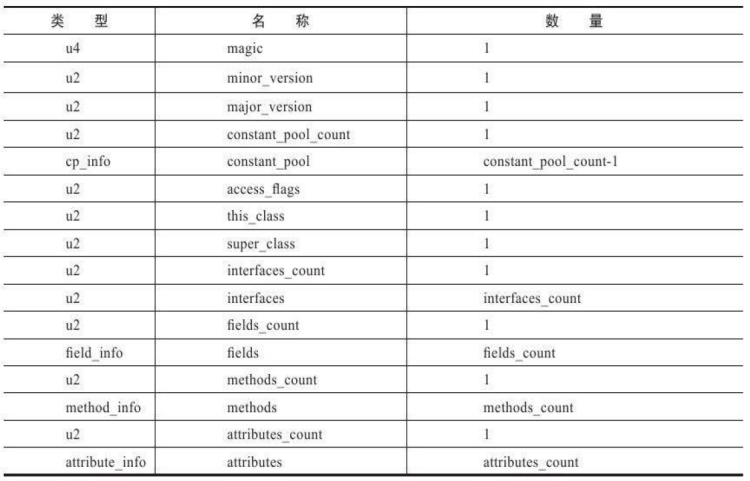
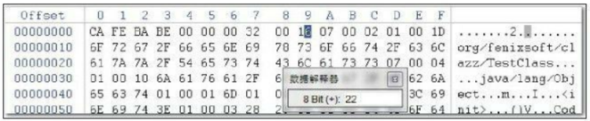
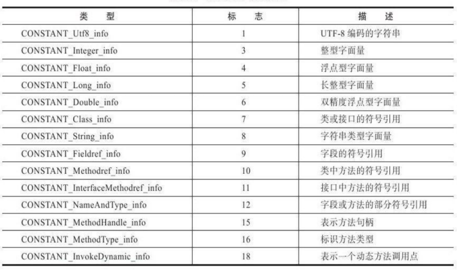
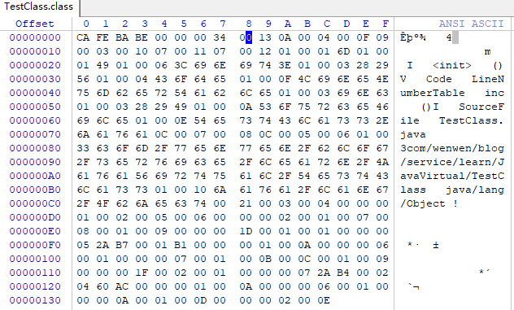

# 类文件结构

>本文出自《Java虚拟机（第二版）》

我使用的是JDK8、64位Win系统，书中版本低于此版本，用到地方会标明

代码编译的结果从本地机器码转变为字节码，是存储格式发展的一小步，却是编程语言发展的一大步。

Java在刚刚诞生时曾经提出一个非常著名的宣传口号“Wirte Once，Run Anywhere”

Java虚拟机不和包括Java在内的任何语言绑定，它只与“Class文件”这种特定的二进制文件格式所关联，Class文件中包含了Java虚拟机指令集和符号表以及若干其他辅助信息。基于安全方面的考虑，Java虚拟机规范要求在Class文件中使用许多强制性的语法和结构化约束，但任一门功能性语言都可以表示为一个能被Java虚拟机所接受的有效的Class文件。作为一个通用的、机器无关的执行平台，任何其他语言的实现者都可以将Java虚拟机作为语言的产品交付媒介。例如，使用Java编译器可以把Java代码编译为存储字节码的Class文件，使用JRuby等其他语言的编译器一样可以把程序代码编译成Class文件。

# Class类的文件结构

将以《Java虚拟机规范（第2版）》（1999年发布，对应于JDK 1.4时代的Java虚拟机）中的定义为主线，这部分内容虽然古老，但它所包含的指令、属性是Class文件中最重要和最基础的。

Class文件是一组以8位字节为基础单位的二进制流，各个数据项目严格按照顺序紧凑地排列在Class文件之中，中间没有添加任何分隔符，这使得整个Class文件中存储的内容几乎全部是程序运行的必要数据，没有空隙存在。当遇到需要占用8位字节以上空间的数据项时，则会按照高位在前的方式分割成若干个8位字节进行存储。

高位在前：

根据Java虚拟机规范的规定，Class文件格式采用一种类似于C语言结构体的伪结构来存储数据，这种伪结构中只有两种数据类型：无符号数和表，后面的解析都要以这两种数据类型为基础，所以这里要先介绍这两个概念。

无符号数属于基本的数据类型，以u1、u2、u4、u8来分别代表1个字节、2个字节、4个字节和8个字节的无符号数，无符号数可以用来描述数字、索引引用、数量值或者按照UTF-8编码构成字符串值。

表是由多个无符号数或者其他表作为数据项构成的复合数据类型，所有表都习惯性地以“_info”结尾。表用于描述有层次关系的复合结构的数据，整个Class文件本质上就是一张表，它由下表所示的数据项构成。



无论是无符号数还是表，当需要描述同一类型但数量不定的多个数据时，经常会使用一个前置的容量计数器加若干个连续的数据项的形式，这时称这一系列连续的某一类型的数据为某一类型的集合。

Class的结构不像XML等描述语言，由于它没有任何分隔符号，所以在表6-1中的数据项，无论是顺序还是数量，甚至于数据存储的字节序（Byte Ordering,Class文件中字节序为Big-Endian）这样的细节，都是被严格限定的，哪个

字节代表什么含义，长度是多少，先后顺序如何，都不允许改变。

## 头4个字节

每个Class文件的头4个字节称为魔数（Magic Number），它的唯一作用是确定这个文件是否为一个能被虚拟机接受的Class文件。Class文件的魔数的获得很有“浪漫气息”，值为：0xCAFEBABE（咖啡宝贝？）

它还有一段很有趣的历史，据Java开发小组最初的关键成员Patrick Naughton所说：“我们一直在寻找一些好玩的、容易记忆的东西，选择0xCAFEBABE是因为它象征着著名咖啡品牌Peet’s Coffee中深受欢迎的Baristas咖啡”，这个魔数似乎也预示着日后“Java”这个商标名称的出现。

## 紧跟着4个字节

紧接着魔数的4个字节存储的是Class文件的版本号：第5和第6个字节是次版本号（Minor Version），第7和第8个字节是主版本号（Major Version）。

Java的版本号是从45开始的，JDK 1.1之后的每个JDK大版本发布主版本号向上加1（JDK 1.0～1.1使用了45.0～45.3的版本号），高版本的JDK能向下兼容以前版本的Class文件，但不能运行以后版本的Class文件，即使文件格式并未发生任何变化，虚拟机也必须拒绝执行超过其版本号的Class文件。

```
package org.fenixsoft.clazz；
public class TestClass{
    private int m;
    public int inc（）{
        return m+1;
    }
}
```

下面是我用JDK8编译的使用WinHex读取的.class文件

二进制，是计算机为了快速方便而采用的一种记数方式，十六进制也是一种常用的记数方式。位（bit）就是一个二进制位，即可表示0和1，而字节(Byte)是计算机更通用的计算单位，1字节等于8位，可以代表256个数字（在编程中可以通过这些数字作为判断），int类型一般为4字节，即32位。一个十六进制数，如0xf，代表16个数字，2的4次方，即4位，所以两个十六进制数如0xff就是一个字节






|   |   |   |   |   |   |
|---|---|---|---|---|---|
|占字节数|前4字节|2字节|2字节|2字节|1字节|
||1-4|5-6|7-8|9-10|11|
|作用|魔数|次版本|主版本|常量池入口，常量池容量计数值||
|占二进制位|32位|8位|8位|8位|8|
|举例16进制|0xCAFEBABE|0x0000|0x0034|0x0013|0x0A|
|转10进制||0|52|19|10|
|含义|标志文件为class|0|JDK1.8|代表常量池中有18项常量  <br>索引值1~18|类中方法的符号引用|

常量池中主要存放两大类常量：字面量（Literal）和符号引用（Symbolic References）。 字面量比较接近于Java语言层面的常量概念，如文本字符串、声明为final的常量值等。而符 号引用则属于编译原理方面的概念，包括了下面三类常量：类和接口的全限定名（Fully Qualified Name）、字段的名称和描述符（Descriptor）、方法的名称和描述符

---
#Java虚拟机