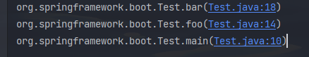
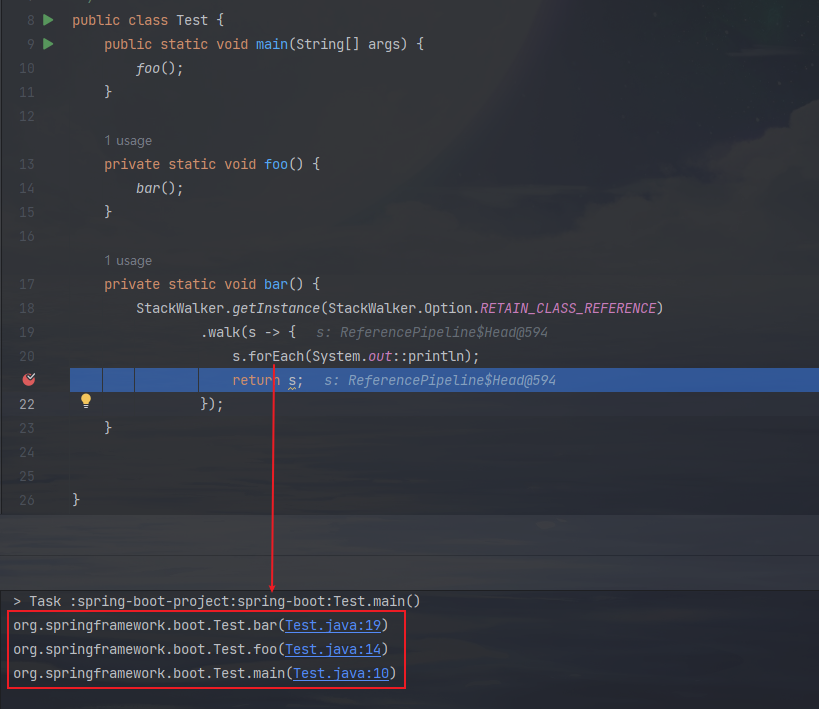
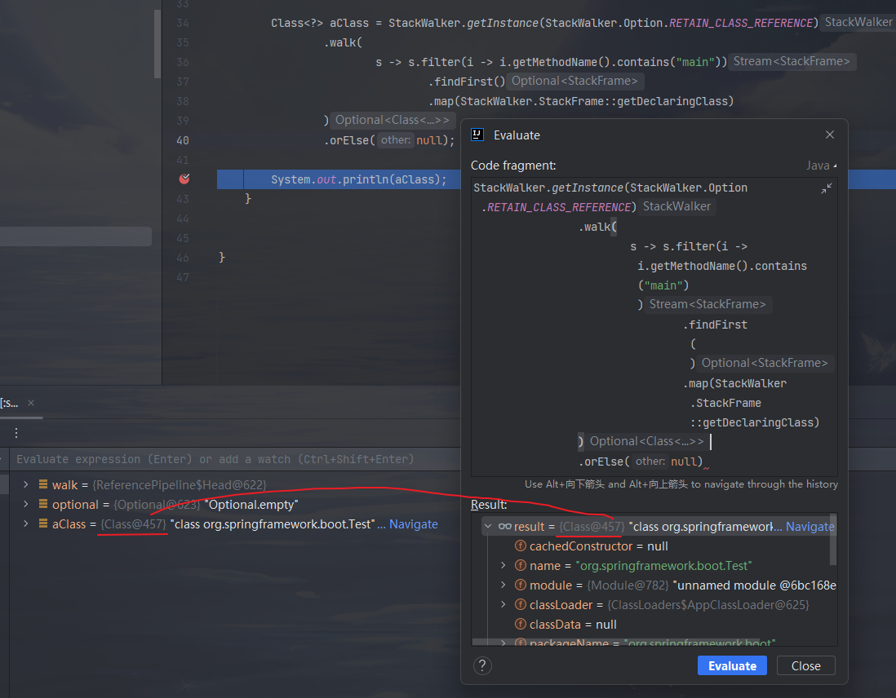

# StockWalker类
[[toc]]

## 类说明

获取调用栈信息，并附带一些操作的一个工具类。

> 看下这类上标记的原著说明：
>
> 堆栈步行者。
> 该方法walk为当前线程打开 StackFrames 的顺序流，然后应用给定的函数遍历StackFrame流。流按顺序报告堆栈帧元素，从表示生成堆栈的执行点的最顶部帧到最底部的帧。当walk方法返回时，StackFrame流将关闭。如果尝试重用关闭的流，IllegalStateException将被抛出。
> StackWalker类中的”Options枚举“决定了要返回的StackFrame对象的信息。默认情况下，反射API和实现类的堆栈帧（Stack Frames）都是被隐藏起来的，在这些Stack Frames中只有类名和方法名是可用的，而没有Class引用。
> StackWalker 是线程安全的。多个线程可以共享单个 StackWalker 对象以遍历其自己的堆栈。创建  StackWalker 时，将根据其请求的选项执行权限检查。在堆栈遍历时不会进行进一步的权限检查。
> 接口说明：
> 例子
>
> 1. 要查找过滤得到所知实现类列表的第一个调用者，请执行以下操作：
>     ```java
>     StackWalker walker = StackWalker.getInstance(Option.RETAIN_CLASS_REFERENCE);
>     Optional<Class<?>> callerClass = walker.walk(s -> s.map(StackFrame::getDeclaringClass)
>                                                  .filter(interestingClasses::contains)
>                                                  .findFirst());
>     ```
>
>     
> 2. 要快照当前线程的前 10 个堆栈帧，
>     ```java
>     List<StackFrame> stack = StackWalker.getInstance().walk(s -> s.limit(10).collect(Collectors.toList()));
>     ```
>
>     除非另有说明，否则将 null 参数传递给此 StackWalker 类中的构造函数或方法将导致引发 NullPointerException
>
> 自从：9

## 描述与使用

在Java9之前，要获得栈信息办法是：获取当前线程并调用其getStackTrace()方法

```java
StackTraceElement[] stackTraceElements = Thread.currentThread().getStackTrace();
```

另一个智能解决方案涉及...抛出异常并从中提取堆栈跟踪信息。但是，无法操纵结果，它只会立即输出：

```java
new Exception().printStackTrace();
```

[JEP-259](http://openjdk.java.net/jeps/259) 提出Stack-Walking API可以解决这些问题。新的API提供了一种使用Stream API惰性地遍历堆栈跟踪的便捷方法。

我们可以像以下一样轻松创建StackWalker实例：

```java
StackWalkerstack = StackWalker.getInstance();
```

还可以定制一点初始化信息：

```java
StackWalkerstack = StackWalker.getInstance(StackWalker.Option.RETAIN_CLASS_REFERENCE);
```

如果我们想要遍历整个堆栈，只需调用forEach（）方法：

```java
stack.forEach(System.out::println);
```


## SpringBoot源码涉及

Java 9之前，SpringBoot 2.7.3代码如下：

```java
private Class<?> deduceMainApplicationClass() {
    try {
        StackTraceElement[] stackTrace = new RuntimeException().getStackTrace();
        for (StackTraceElement stackTraceElement : stackTrace) {
            // 
            if ("main".equals(stackTraceElement.getMethodName())) {
                // 反射得到这个类的实现
                return Class.forName(stackTraceElement.getClassName());
            }
        }
    }
    catch (ClassNotFoundException ex) {
        // Swallow and continue
    }
    return null;
}
```

Java 17，SpringBoot 3.0.5同样一块逻辑代码如下：

```java
private Class<?> deduceMainApplicationClass() {
    return StackWalker.getInstance(StackWalker.Option.RETAIN_CLASS_REFERENCE)
        // 从堆栈顶部遍历，使用完就不能再用这个流，不然会报IllegalStateException
        .walk(this::findMainClass)
        // 如果存在值，则返回该值，否则返回null。
	    .orElse(null);
}

private Optional<Class<?>> findMainClass(Stream<StackFrame> stack) {
    return stack
        // 过滤方法名为main的栈帧
        .filter((frame) -> Objects.equals(frame.getMethodName(), "main"))
        // 取第一个
        .findFirst()
        // 获取此堆栈帧表示的方法的声明 Class ，得到的是一个类的实现
        .map(StackWalker.StackFrame::getDeclaringClass);
}
```

## 实战

### 基础使用一下

```java
public class Test {
	public static void main(String[] args) {
		foo();
	}

	private static void foo() {
		bar();
	}

	private static void bar() {
		StackWalker.getInstance(StackWalker.Option.RETAIN_CLASS_REFERENCE).forEach(System.out::println);
	}
}
```

效果展示：



### 进阶一点

可以发现s相当于就是堆栈流，.walk就可以用流的方式操作进行循环、过滤等操作得到一个返回结果



#### 得到一个Optional

```java
Optional<? extends Class<?>> optional = StackWalker.getInstance(StackWalker.Option.RETAIN_CLASS_REFERENCE)
    .walk(
        s -> s.filter(i -> i.getClassName().contains("main"))
        .findFirst()
        .map(StackWalker.StackFrame::getDeclaringClass)
    );
```

#### 调用栈中包含main函数的类的实例

```java
Class<?> aClass = StackWalker.getInstance(StackWalker.Option.RETAIN_CLASS_REFERENCE)
    .walk(
        s -> s.filter(i -> i.getMethodName().contains("main"))
        .findFirst()
        .map(StackWalker.StackFrame::getDeclaringClass)
    )
    .orElse(null);
```

多调用几次发现都是同一个Class@457，说明getDeclaringClass得到的是同一个




---

完~
