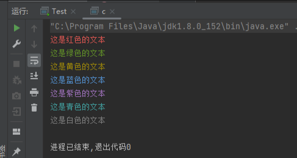
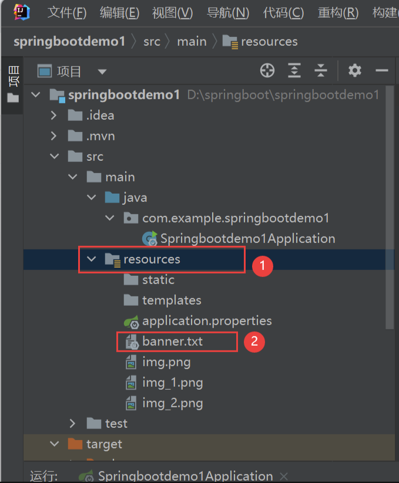
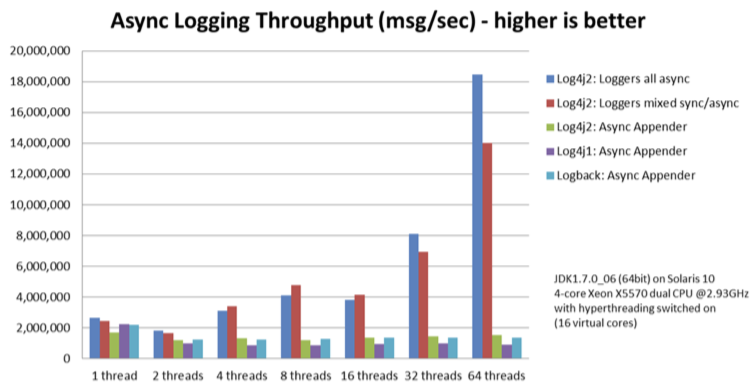
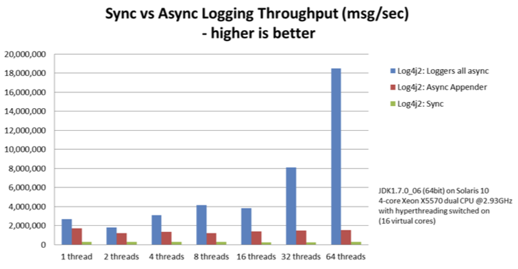

# 日志打印
[[toc]]

## Java在控制台输出不同颜色的文本System.out.println实现

可以根据需要改成以下颜色：

红色：`\033[31m`
绿色：`\033[32m`
黄色：`\033[33m`
蓝色：`\033[34m`
紫色：`\033[35m`
青色：`\033[36m`
白色：`\033[37m`

需要恢复默认颜色可以使用：`\033[0m`

### 示例代码

```java
// 红色
 System.out.println("\033[31m这是红色的文本\033[0m");
 // 绿色
 System.out.println("\033[32m这是绿色的文本\033[0m");
 // 黄色
 System.out.println("\033[33m这是黄色的文本\033[0m");
 // 蓝色
 System.out.println("\033[34m这是蓝色的文本\033[0m");
 // 紫色
 System.out.println("\033[35m这是紫色的文本\033[0m");
 // 青色
 System.out.println("\033[36m这是青色的文本\033[0m");
 // 白色
 System.out.println("\033[37m这是白色的文本\033[0m");
```

### 效果



## SpringBoot修改启动图标（详细步骤）

### 介绍

修改图标就是在资源加载目录（resources）下放一个banner.txt文件。这样运行加载的时候就会扫描到这个文件，然后启动的时候就会显示出来了。

1. 可以自己找定义或者找一个网站提取素材，我在👇这个网站拿一个素材

   > https://www.bootschool.net/ascii-art

2. 选取好喜欢的素材后，点击下载（下载到本地）

3. 下载到本地后（CTRL+C）复制banner.txt文件。在IDEA的springboot项目里面的resource目录（CTRL+V）粘贴



4. 点击运行项目（运行成功）

## Spring Boot 日志配置

### SLF4J

简单日志门面（Simple Logging Facade for Java），它不是一个真正的日志实现，而是一个抽象层（ abstraction layer），它允许在后台使用任意一个日志实现。每一种日志框架都有自己单独的API，要使用对应的框架就要使用其对应的API，这就大大的增加应用程序代码对于日志框架的耦合性。

使用了SLF4J后，对于应用程序来说，无论底层的日志框架如何变，应用程序不需要修改任意一行代码，就可以直接上线了。

### 常用日志框架

下面介绍几个常用的日志框架，推荐Log4j2

#### Log4j

Log4j是Apache的一个Java的日志库，通过使用Log4j，我们可以控制日志信息输送的目的地（控制台、文件、数据库等）；我们也可以控制每一条日志的输出格式；通过定义每一条日志信息的级别，我们能够更加细致地控制日志的生成过程。

#### Logback

Logback，一个“可靠、通用、快速而又灵活的Java日志框架”。logback当前分成三个模块：logback-core，logback- classic和logback-access。logback-core是其它两个模块的基础模块。logback-classic是log4j的一个改良版本。此外logback-classic完整实现SLF4J API使你可以很方便地更换成其它日志系统，如log4j或JDK14 Logging。logback-access模块与Servlet容器（如Tomcat和Jetty）集成，以提供HTTP访问日志功能。请注意，您可以在logback-core之上轻松构建自己的模块。

> [更多了解官网看看](https://logback.qos.ch/index.html)

#### Log4j2

Apache Log4j 2是对Log4j的升级，它比其前身Log4j 1.x提供了重大改进，并提供了Logback中可用的许多改进，同时修复了Logback架构中的一些问题。

现在最优秀的Java日志框架是Log4j2，没有之一。根据官方的测试表明，在多线程环境下，Log4j2的异步日志表现更加优秀。在异步日志中，Log4j2使用独立的线程去执行I/O操作，可以极大地提升应用程序的性能。

#### Log4j1/Logback/Log4j2性能比较

在官方的测试中，Log4j1/Logback/Log4j2三个日志框架的异步日志性能比较如下图所示。

其中，Loggers all async是基于LMAX Disruptor实现的。可见Log4j2的异步日志性能是最棒的。



下图比较了Log4j2框架Sync、Async Appenders和Loggers all async三者的性能。其中Loggers all async表现最为出色，而且线程数越多，Loggers all async性能越好。


