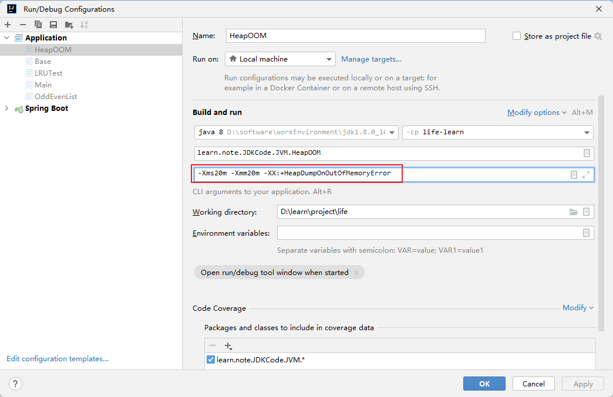
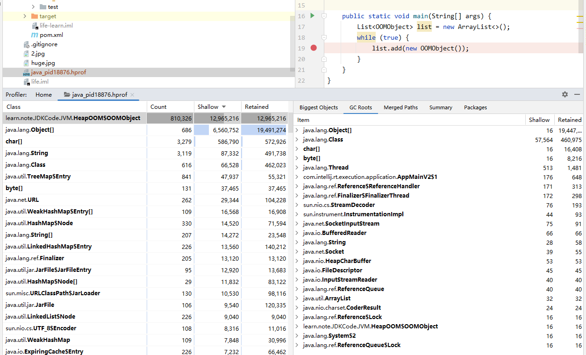

# Java8体验堆溢出

使用的HotSpot JDK8

## 参数准备
> -Xms20m -Xmm20m -XX:+HeapDumpOnOutOfMemoryError



## 代码准备
```java
import java.util.ArrayList;
import java.util.List;

/**
 * @Author Wang WenLei
 * @Date 2022/8/13 11:53
 * @Version 1.0
 **/
public class HeapOOM {
    static class OOMObject {

    }

    public static void main(String[] args) {
        List<OOMObject> list = new ArrayList<>();
        while (true) {
            list.add(new OOMObject());
        }
    }
}
```

## 执行效果
```
Exception in thread "main" java.lang.OutOfMemoryError: Java heap space
	at java.util.Arrays.copyOf(Arrays.java:3210)
	at java.util.Arrays.copyOf(Arrays.java:3181)
	at java.util.ArrayList.grow(ArrayList.java:261)
	at java.util.ArrayList.ensureExplicitCapacity(ArrayList.java:235)
	at java.util.ArrayList.ensureCapacityInternal(ArrayList.java:227)
	at java.util.ArrayList.add(ArrayList.java:458)
	at learn.note.JDKCode.JVM.HeapOOM.main(HeapOOM.java:19)

Process finished with exit code 1
```

## 找到Dump文件

会发现在根目录下生成了一个.hprof结尾的文件，就是Dump文件

在IDEA中直接双击就可以分析查看



第一步首先确认是内存泄漏（memory Leak）还是内存溢出（Memory Overflow）

* 如果是内存泄漏，可以进一步通过工具查看泄漏对象到GC Roots的引用链，找到泄漏对象是通过怎样的引用路径、与哪些GC Roots相关联，才导致垃圾收集器无法回收他们
* 如果不是内存泄漏（内存中的对象确实都是必须存活的），那就应当检查Java虚拟机的堆参数（-Xms与-Xmx—）设置，与机器的内存对比，看看是否还有上调整的空间。
再从代码上检查是否存在某些对象生命周期过长、持有状态时间过长、存储机构设计不合理等情况，尽量减少程序运行期的内存消耗。
