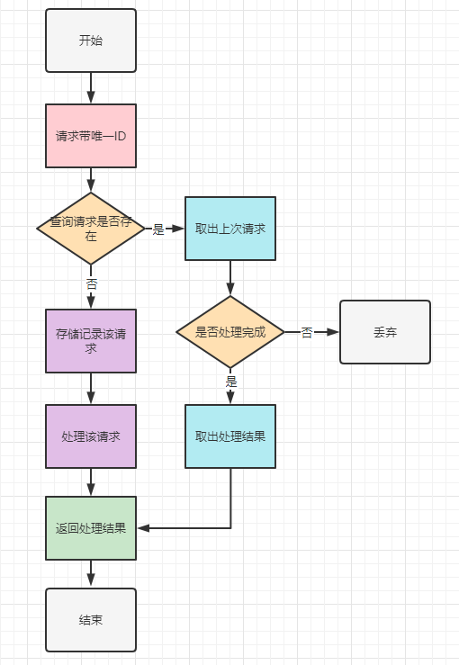
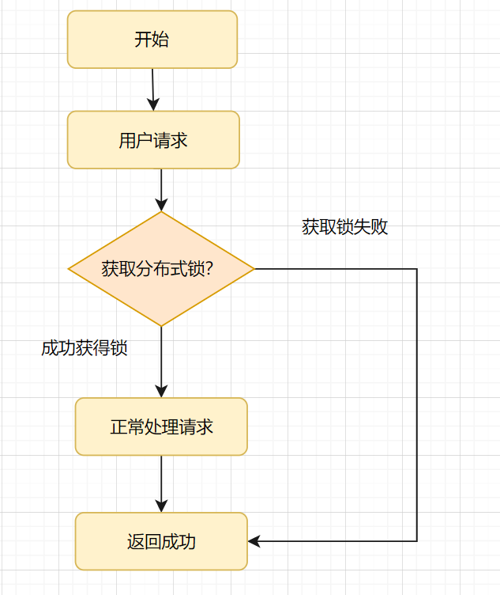

# 如何设计幂等


## 1.什么是幂等
按数学表达式就是
$
f(x) = f( f(x) ) 
$

在计算机学科上，幂等表示一次和多次请求某一个资源应该具有同样的副作用。或者说，多次请求所产生的的影响与一次请求执行的影响效果相同。

## 2.为什么需要幂等
网络情况很复杂，各种情况都有可能出现
* 调用接口超时
* 请求没有发送到
* 服务器对请求没有收到
* 请求到了结果却丢了
* ...

在这种情况情况下，我们是否重试？这样机会产生多次相同的请求。如果是插入数据库数据是否会插入多次？如果是转账是否会多次转账？
如果系统做好幂等控制，那我们在超时重试或者未知重试时，既可以保证流程顺畅又能保证数据正确。

常见需要考虑幂等的情况
* MQ消费者读取消息时，有可能重复消费
* 提交表单双击，发起多次请求
* 转账汇款，下游接口超时重试


## 3.遇到接口超时如何处理？
有2中处理方式：
1. 下游系统提供一个查询接口。如果接口超时了，调用接口查询对应的记录，如果查到成功就走成功流程，如果失败就按失败处理。
2. 下游接口支持幂等，上游系统调用超时，发起重试即可。

两种方案都能解决，但是如果MQ重复消费的场景，方案2处理更妥当。

## 4.如果设计幂等
幂等意味着一条请求的唯一性。不管什么方案设计幂等，都需要一个全局唯一的ID，去标记这个**请求**独一无二。

* 如果利用唯一索引控制幂等，那唯一索引是唯一的
* 如果是利用数据库主键控制幂等，那主键是唯一的
* 如果是悲观锁的方式，底层标记还是全局唯一的ID

### 4.1 全局的唯一ID
全局的唯一ID，我们怎么去生成？
1. 我们可以使用UUID。但UUID的缺点比较明显，它字符串占用空间较大，生成的ID过于随机（没有规律，没有递增），可读性差
2. 使用**雪花算法** ，雪花算法：是一种生成分布式全局唯一ID的算法，生成的ID称为Snowflake IDs。这种算法有Twitter创建，并用于推文的ID
3. 百度的Uidgenerator
4. 美团的Leaf

## 4.2 幂等设计的基本流程
其目的是过滤一下已经收到的请求。当然，请求一定要有一个全局唯一的ID标记。然后怎么判断请求是否之前收到过（把请求存储起来，收到请求时，先查下存储记录，记录存在就返回上次的结果，不存在就处理请求）



## 5.常见幂等实现方案
### 5.1 select+insert+主键/唯一索引冲突
日常开发中，为了实现交易接口幂等，我是这样实现的：

交易请求过来，我会先根据请求的唯一流水号 `bizSeq`字段，先`select`一下数据库的流水表

如果数据已经存在，就拦截是重复请求，直接返回成功；
如果数据不存在，就执行`insert`插入，如果`insert`成功，则直接返回成功，如果`insert`产生主键冲突异常，则捕获异常，接着直接返回成功。

### 5.2 直接insert + 主键/唯一索引冲突
在5.1方案中，都会先查一下流水表的交易请求，判断是否存在，然后不存在再插入请求记录。**如果重复请求的概率比较低**的话，我们可以直接插入请求，利用主键/唯一索引冲突，去判断是重复请求。

### 5.3 状态机幂等
很多业务表，都是有状态的，比如转账流水表，就会有0-待处理，1-处理中、2-成功、3-失败状态。转账流水更新的时候，都会涉及流水状态更新，即涉及状态机。
比如转账成功后，把处理中的转账流水更新为成功状态，SQL这么写：
`update transfr_flow set status=2 where biz_seq=‘666’ and status=1;`

状态机是怎么实现幂等的呢？

第1次请求来时，bizSeq流水号是 666，该流水的状态是处理中，值是 1，要更新为2-成功的状态，所以该update语句可以正常更新数据，sql执行结果的影响行数是1，流水状态最后变成了2。
第2请求也过来了，如果它的流水号还是 666，因为该流水状态已经2-成功的状态了，所以更新结果是0，不会再处理业务逻辑，接口直接返回

### 5.4 抽取防重表
5.1和5.2的方案，都是建立在业务流水表上bizSeq的唯一性上。很多时候，我们业务表唯一流水号希望后端系统生成，又或者我们希望防重功能与业务表分隔开来，这时候我们可以单独搞个防重表。当然防重表也是利用主键/索引的唯一性，如果插入防重表冲突即直接返回成功，如果插入成功，即去处理请求。

### 5.5 token令牌
1. 客户端发起请求，申请获取token。
2. 服务端生成全局唯一的token，保存到redis中（一般会设置一个过期时间），然后返回给客户端。
3. 客户端带着token，发起请求。
4. 服务端去redis确认token是否存在，一般用 redis.del(token)的方式，如果存在会删除成功，即处理业务逻辑，如果删除失败不处理业务逻辑，直接返回结果。

### 5.6 悲观锁(如select for update)
悲观锁如何控制幂等的呢？就是加锁呀，一般配合事务来实现。
伪代码：
```java
    begin;  # 1.开始事务
    select * from order where order_id='666' # 查询订单，判断状态
    if（status !=处理中）{
    //非处理中状态，直接返回；
    return ;
    }
    ## 处理业务逻辑
    update order set status='完成' where order_id='666' # 更新完成
    commit; # 5.提交事务
```

这种场景是非原子操作的，在高并发环境下，可能会造成一个业务被执行两次的问题：
> 当一个请求A在执行中时，而另一个请求B也开始状态判断的操作。因为请求A还未来得及更改状态，所以请求B也能执行成功，这就导致一个业务被执行了两次。

可以使用数据库悲观锁（select ...for update）解决这个问题.
```java
    begin;  # 1.开始事务
    select * from order where order_id='666' for update # 查询订单，判断状态,锁住这条记录
    if（status !=处理中）{
    //非处理中状态，直接返回；
    return ;
    }
    ## 处理业务逻辑
    update order set status='完成' where order_id='666' # 更新完成
    commit; # 5.提交事务
```
* 这里面order_id需要是索引或主键哈，要锁住这条记录就好，如果不是索引或者主键，会锁表的！
* 悲观锁在同一事务操作过程中，锁住了一行数据。别的请求过来只能等待，如果当前事务耗时比较长，就很影响接口性能。所以一般不建议用悲观锁做这个事情。

### 5.7 乐观锁
> 乐观锁：乐观锁在操作数据时,则非常乐观，认为别人不会同时在修改数据，因此乐观锁不会上锁。只是在执行更新的时候判断一下，在此期间别人是否修改了数据。

#### 怎样实现乐观锁呢？
就是给表的加多一列version版本号，每次更新记录version都升级一下（version=version+1）。具体流程就是先查出当前的版本号version，然后去更新修改数据时，确认下是不是刚刚查出的版本号，如果是才执行更新
比如，我们更新前，先查下数据，查出的版本号是version =1
然后使用version =1和订单Id一起作为条件，再去更新。最后更新成功，才可以处理业务逻辑，如果更新失败，默认为重复请求，直接返回。
为什么版本号建议自增的呢？因为乐观锁存在ABA的问题，如果version版本一直是自增的就不会出现ABA的情况啦。

### 5.8 分布式锁
分布式锁实现幂等性的逻辑就是，请求过来时，先去尝试获得分布式锁，如果获得成功，就执行业务逻辑，反之获取失败的话，就舍弃请求直接返回成功。
执行流程如下图所示：


* 分布式锁可以使用Redis，也可以使用ZooKeeper，不过还是Redis相对好点，因为较轻量级。
* Redis分布式锁，可以使用命令SET EX PX NX + 唯一流水号实现，分布式锁的key必须为业务的唯一标识哈
* Redis执行设置key的动作时，要设置过期时间哈，这个过期时间不能太短，太短拦截不了重复请求，也不能设置太长，会占存储空间。

> [关于Redis分布式锁可以看这篇文章](../redis/use/distributedLock.md)
