# 安装
[[toc]]

## Docker安装Rabbit MQ

### 从仓库找到rabbitmq

使用`docker search rabbitmq`命令查看仓库中rabbitmq的版本

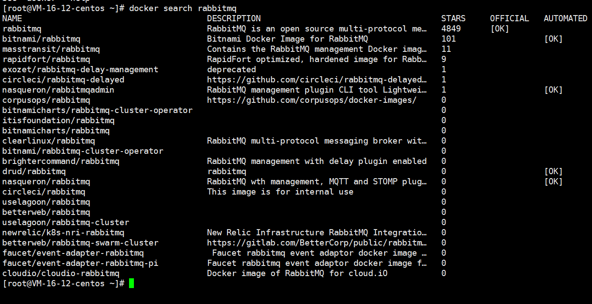

### 使用pull命令拉取镜像

使用`docker pull rabbitmq`，这个命令会拉到最新版本的rabbit mq

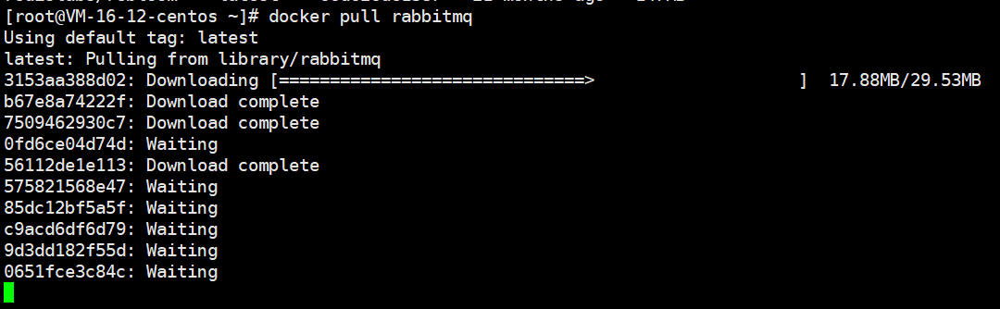

如下为下载成功效果

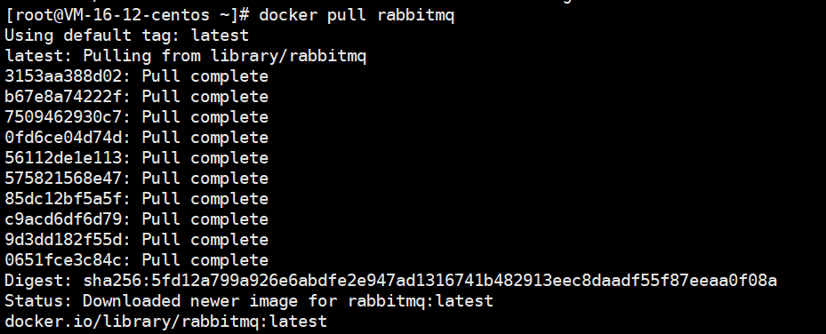

### 查看镜像

使用`docker images`查看本地的镜像列表，

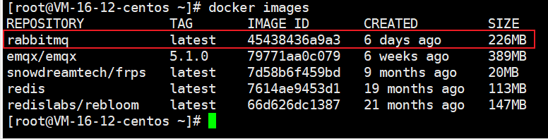

### 启动镜像

使用`docker run -d --hostname my-rabbit --name rabbit -p 15672:15672 -p 5672:5672 rabbitmq`命令后台启动容器

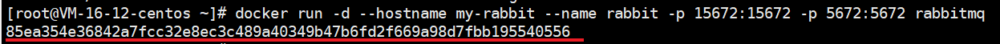

可以看到一串字符，这是一个46个16进制的字符（256位二进制）

> 命令说明：
>
> -p 15672:15672 说明，-p 服务器外网端口：映射的docker内部端口，就是说外网15672映射到docker的15672端口向外提供服务。

用`docker ps`命令查看启动后效果

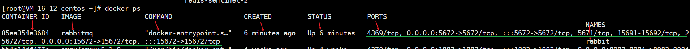

### 查看Rabbit MQ管理端控制台

首先打开防火墙的端口，这个很重要不然访问不了。我这里是腾讯云，找到对应服务器的防火墙添加规则就好

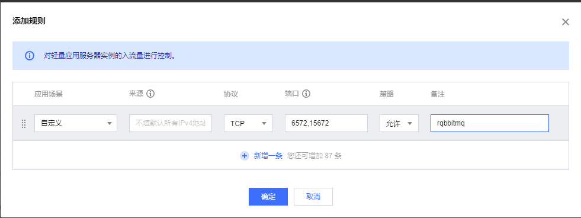

15672端口为管理端服务端，访问ip:15672进入Rabbit MQ管理端

> 默认用户名密码：guest/guest

#### 解决访问15672端口显示服务器拒绝连接

访问ip:15672发现无法访问，使用telnet命令也无法访问

使用 `docker exec -it 85ea354e3684 /bin/bash` 命令

切换到sbin下

cd sbin

安装web插件

rabbitmq-plugins enable rabbitmq_management

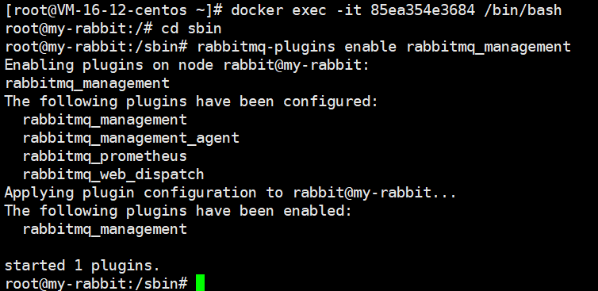

再次访问，可以进入

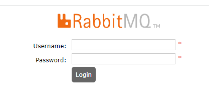

## 安全

RabbitMQ默认账号名是guest，密码也是guest。这意味着访问者无需任何验证就可以登录并访问RabbitMQ。这是一种非常危险和不安全的配置，因为任何人都可以登录并访问您的RabbitMQ服务器并读取或发送数据。

因此，务必在安装RabbitMQ后更改默认账号名和密码。不要使用弱密码，并且强烈建议启用身份验证机制。

### docker修改Rabbit MQ默认密码

上面方式没有直接设置用户密码，通过如下方式进行修改

#### 进入到docker rabbit mq容器内部


#### 查看当前用户列表。

使用命令：`rabbitmqctl list_users`

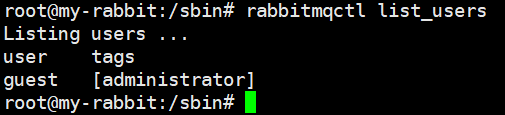
#### 修改密码

命令：`rabbitmqctl change_password [username] '[NewPassword]'`

> username：对应不同用户映射的密码，比如需要修改管理员 admin 的密码那么就填 admin
> NewPassword：直接写你的新密码即可

效果如下：

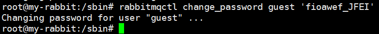

### docker启动时直接设置用户密码

```bash
docker run \
 -e RABBITMQ_DEFAULT_USER=账户 \
 -e RABBITMQ_DEFAULT_PASS=密码 \
 --name mq \
 --hostname mq1 \
 -p 15672:15672 \
 -p 5672:5672 \
 -d \
 rabbitmq:latest
```


---

~完
