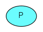
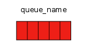
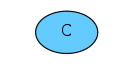
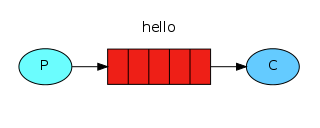
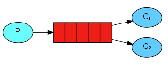
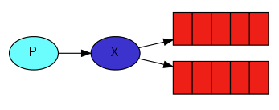

# 基础

## Rabbit MQ常用的五种消息模型

## 角色介绍

生产者（Product）：发送消息的程序

消息队列（queue）：Rabbit MQ服务器中存储消息的队列，可以理解成邮箱的名称

消费者（Customer）：等待接收消息的程序

> 1. 生产者、消费者和代理不必在同一主机上，在大多数应用中它们也不这样做。
>
> 2. 应用程序也可以既是生产者又是消费者。

交换机（Exchange)：

交换机必须确切的知道如何处理它收到的消息，是否应将其附加到特定队列？是否应将其附加到许多队列？或者应该将其丢弃。其规则由交换机类型定义

有几种可用的交换类型：`direct`、`topic`、`headers` 和`fanout`。

### 1. 基本消息模型

Hello Word一个生产者、默认交换机、一个队列、一个消费者

### 2.工作模型

一个生产者 ==> 一个队列 ==> 多个消费者。
一个消息只能被消费一次。

### 3.发布/订阅模型

一个生产者 ==> 一个交换机 ==> 多个列队 ==> 多个消费者

一个消息可以被多个消费者消费

生产者发生消息只能发送到交换机。

这里涉及到完整的Rabbit MQ消息传递模型：核心思想是生产者不直接向队列发送任何消息（实际上，生产者通常根本不知道消息是否会被传递到何队列，相反，生产者只能将消息发送到交换器）。交换机一方面接收生产者的消息，另一方面，它将消息推送到队列中。

