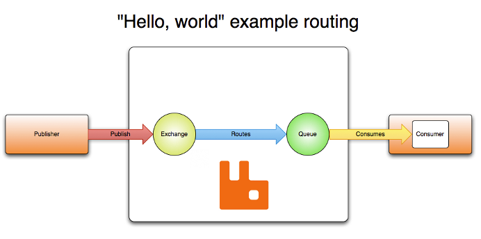
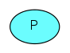
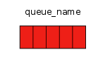
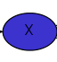
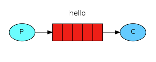
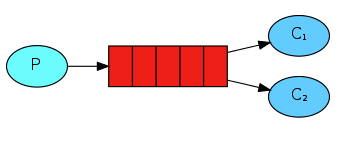
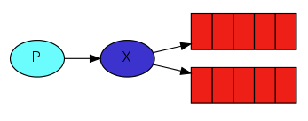
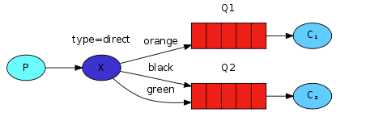
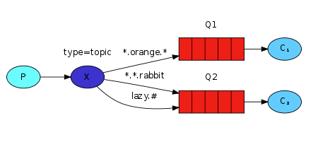

# 基础

## AMQP 0-9-1模型解释

队列、交换器和绑定统称为**AMQP 实体**。

消息被发送到**exchanges**（exchanges比作邮箱或邮局），exchanges使用binding的rules分配副本到**queue**，然后，broker传递消息给订阅这个队列的客户，或客户根据需要从队列拉取消息，

网络不可靠，应用程序可能无法处理消息，因此 AMQP 0-9-1 模型有一个 *消息确认*的概念：当消息传递给消费者时，消费者会自动*通知代理*，或者在应用程序开发人员选择时立即通知代理。这样做。当使用消息确认时，代理仅在收到该消息（或消息组）的通知时才会从队列中完全删除该消息。

### 0.角色介绍

#### 生产者（Product）

发送消息的程序

#### 消息队列（queue）

Rabbit MQ服务器中存储消息的队列，可以理解成邮箱的名称

在使用队列之前，必须先声明它。如果队列尚不存在，则声明队列将导致创建它。如果队列已经存在并且其属性与声明中的属性相同，则声明无效。当现有队列属性与声明中的属性不同时，将引发代码为 406 ( PRECONDITION_FAILED ) 的通道级异常。

##### 队列属性

- Name
- 持久的（Durable） (队列在broker重启后仍然存在)
- 独占的（Exclusive） (仅由一个连接使用，并且当该连接关闭时，该队列将被删除)
- 自动删除（Auto-delete） (当最后一个使用者取消订阅时，将删除至少有一个使用者的队列)
- Arguments (可选; 插件和特定于代理的特性，如消息TTL、队列长度限制等)

##### 队列名称

应用程序可以选择队列名称或让broker为其生成名称。队列名称最多可为 255 个字节的 UTF-8 字符。AMQP 0-9-1 代理可以代表应用程序生成唯一的队列名称。要使用此功能，请传递一个空字符串作为队列名称参数。生成的名称将与队列声明响应一起返回给客户端。

队列名称以“amq”开头。保留供broker内部使用。尝试使用违反此规则的名称声明队列将导致通道级异常，回复代码为 403 ( ACCESS_REFUSED )。

##### 队列持久化

队列可以声明为持久队列或瞬态队列。持久队列的元数据存储在磁盘上，而瞬态队列的元数据尽可能存储在内存中。

> 在持久性很重要的环境和用例中，应用程序必须使用持久队列**并**确保发布将已发布的**消息标记为持久**。

#### 消费者（Customer）

等待接收消息的程序

> 1. 生产者、消费者和代理不必在同一主机上，在大多数应用中它们也不这样做。
>
> 2. 应用程序也可以既是生产者又是消费者。

#### 交换机（Exchange)

交换机必须确切的知道如何处理它收到的消息，是否应将其附加到特定队列？是否应将其附加到许多队列？或者应该将其丢弃。其规则由交换机类型定义

有几种可用的交换类型：`direct`、`topic`、`headers` 和`fanout`。

**exchanges**是消息发送到的 AMQP 0-9-1 实体。**exchanges**接收一条消息并将其路由到零个或多个**queue**中。使用的路由算法取决于 **change_type**和称为**binding**的规则。

##### 四种交换机的交换类型

| 交换机类型(change_type)        | 默认预先声明的名称(Default pre-declared names) |
| :----------------------------- | :--------------------------------------------- |
| 直接交换机（Direct exchange）  | (Empty string) and amq.direct                  |
| 扇出交换机（Fanout exchange）  | amq.fanout                                     |
| 主题交换机（Topic exchange）   | amq.topic                                      |
| 标头交换机（Headers exchange） | amq.match (and amq.headers in RabbitMQ)        |

##### 交换机重要的属性

- name
- durability（交易在broker重启后仍然存在）
- auto-delete（当最后一个队列与其解除绑定时，交换器将被删除）
- arguments（可选，由插件和代理特定功能使用）

### 绑定（Bindings）

Bindings是规则，exchange使用它路由消息到队列。为了指示exchange E 路由到消息到队列Q，队列Q必须绑定到E。

## Rabbit MQ常用的五种消息模型

### 1. 基本消息模型

Hello Word一个生产者、默认交换机、一个队列、一个消费者

使用默认exchange，默认exchange是broker预先声明的没有名称（空字符串）的直接交换。它有一个特殊的属性，这使得它对于简单的应用程序非常有用：创建的每个队列都会使用与队列名称相同的路由键自动绑定到它。

例如，当您声明名称为“search-indexing-online”的队列时，AMQP 0-9-1 代理将使用“search-indexing-online”作为路由键将其绑定到默认交换器（在此示例中）上下文有时称为绑定键）。因此，发布到默认交换器且路由键为“search-indexing-online”的消息将被路由到队列“search-indexing-online”。换句话说，默认交换使得看起来可以将消息直接传递到队列，尽管从技术上来说这并不是正在发生的情况。

### 2.工作模型

一个生产者 ==> 一个队列 ==> 多个消费者。
一个消息只能被消费一次。

### 3.发布/订阅模型-fanout

一个生产者 ==> 一个交换机 ==> 多个列队 ==> 多个消费者

一个消息可以被多个消费者消费

生产者发生消息只能发送到交换机。
::: tip 使用
fanout exchange非常适合消息的广播路由。
:::

这里涉及到完整的Rabbit MQ消息传递模型：核心思想是生产者不直接向队列发送任何消息（实际上，生产者通常根本不知道消息是否会被传递到何队列，相反，生产者只能将消息发送到交换器）。交换机一方面接收生产者的消息，另一方面，它将消息推送到队列中。

fanout exchange将消息路由到与其绑定的所有队列，并且路由键将被忽略。如果 N 个队列绑定到fanout exchange，则当新消息发布到该exchange时，该消息的副本将传递到所有 N 个队列。

### 4.路由模型-direct

在某种场景下，希望不同的消息被不同的队列消费
这个时候我们就要用到direct类型的exchange
生产者向交换机发送消息，交换机根据路由key发送给队列，队列的消费者接收消息

使用direct exchange。direct exchange根据消息路由键将消息传递到队列

* 队列通过路由键 K 绑定到交换机
* 当具有路由密钥 R 的新消息到达直接交换机时，如果 K = R，则交换机将其路由到队列
* 如果多个队列绑定到具有相同路由键 K 的直接交换机，则交换机会将消息路由到 K = R 的所有队列

### 5.主题模型-topic

topic模式和direct路由模式类似，区别在于Topic类型的交换机可以匹配通配符

> 符号(通配符)：
>
> #表示匹配一个或者多个词
> *表示匹配一个词

topic exchange根据消息路由键与用于将队列绑定到交换器的模式之间的匹配，将消息路由到一个或多个队列。

::: tip 使用
主题交换有非常广泛的用例。

每当问题涉及多个消费者/应用程序选择性地选择他们想要接收的消息类型时，就应该考虑使用主题交换。

:::

