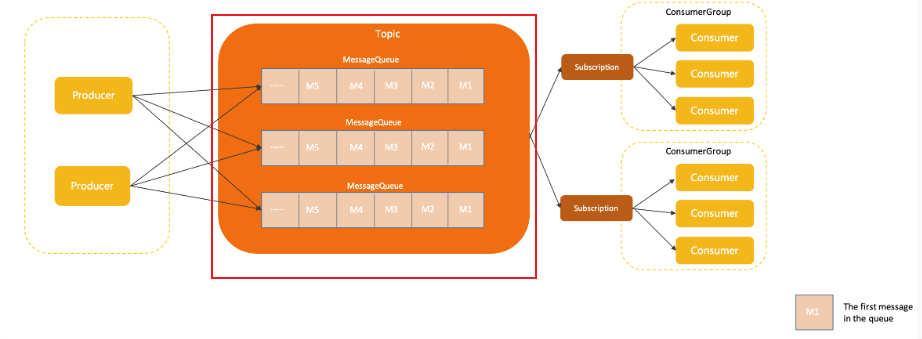
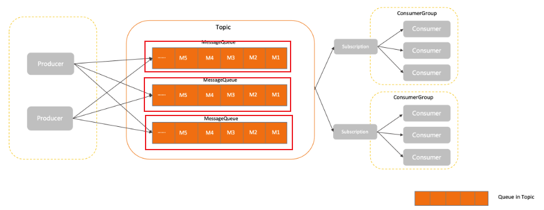
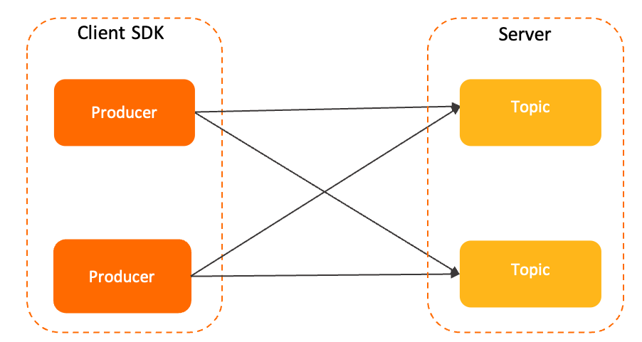
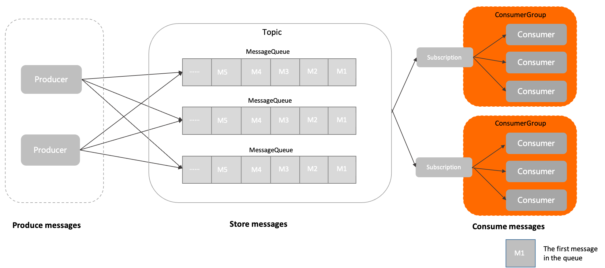

# Rocket MQ组成构件
## 理解Topic
### 定义
topic为主题，是 Apache Rocket MQ 中消息传输和存储的顶层容器，用于标识同一类业务逻辑的消息。

主题的作用主要如下：
* **定义数据的分类隔离：** 在 Apache RocketMQ 的方案设计中，建议将不同业务类型的数据拆分到不同的主题中管理，通过主题实现存储的隔离性和订阅隔离性。
* **定义数据的身份和权限：** Apache RocketMQ 的消息本身是匿名无身份的，同一分类的消息使用相同的主题来做身份识别和权限管理。

主题流程所在位置：

> 主题是一个逻辑概念，并不是实际的消息容器。

主题内部由多个队列组成，消息的存储和水平扩展能力最终是由队列实现的；并且针对主题的所有约束和属性设置，最终也是通过主题内部的队列来实现。

### 内部属性
#### 主题名称
- 定义：主题的名称，用于标识主题，主题名称集群内全局唯一。
- 取值：由用户创建主题时定义。
- 约束：请参见[参数限制](https://rocketmq.apache.org/zh/docs/introduction/03limits)。
	字符建议：字母a~z或A~Z、数字0~9以及下划线（_）、短划线（-）和百分号（%）。  
	长度建议：1~64个字符。  
	系统保留字符：Topic名称不允许使用以下保留字符或含有特殊前缀的字符命名。  
	保留字符: `TBW102 BenchmarkTest SELF_TEST_TOPIC OFFSET_MOVED_EVENT SCHEDULE_TOPIC_XXXX RMQ_SYS_TRANS_HALF_TOPIC RMQ_SYS_TRACE_TOPIC _RMQ_SYS_TRANS_OP_HALF_TOPIC`
	特殊前缀:_ `rmq_sys_ %RETRY% _%DLQ%_ rocketmq-broker-`
#### 队列列表
- 定义：队列作为主题的组成单元，是消息存储的实际容器，一个主题内包含一个或多个队列，消息实际存储在主题的各队列内。更多见[理解消息队列（MessageQueue）](./1_组成构件##什么是Message Queue)。
- 取值：系统根据队列数量给主题分配队列，队列数量创建主题时定义。
- 约束：一个主题内至少包含一个队列。

#### 消息类型
- 定义：主题所支持的消息类型。
- 取值：创建主题时选择消息类型。Apache RocketMQ 支持的主题类型如下：
    - Normal：[普通消息](https://rocketmq.apache.org/zh/docs/featureBehavior/01normalmessage)，消息本身无特殊语义，消息之间也没有任何关联。
    - FIFO：[顺序消息](https://rocketmq.apache.org/zh/docs/featureBehavior/03fifomessage)，Apache RocketMQ 通过消息分组MessageGroup标记一组特定消息的先后顺序，可以保证消息的投递顺序严格按照消息发送时的顺序。
    - Delay：[定时/延时消息](https://rocketmq.apache.org/zh/docs/featureBehavior/02delaymessage)，通过指定延时时间控制消息生产后不要立即投递，而是在延时间隔后才对消费者可见。
    - Transaction：[事务消息](https://rocketmq.apache.org/zh/docs/featureBehavior/04transactionmessage)，Apache RocketMQ 支持分布式事务消息，支持应用数据库更新和消息调用的事务一致性保障。
- 约束：Apache RocketMQ 从5.0版本开始，支持强制校验消息类型，即每个主题只允许发送一种消息类型的消息，这样可以更好的运维和管理生产系统，避免混乱。为保证向下兼容4.x版本行为，强制校验功能默认关闭，推荐通过服务端参数 enableTopicMessageTypeCheck 开启校验。

## 理解Message Queue
### 定义
队列是 Apache RocketMQ 中消息存储和传输的实际容器，也是 Apache RocketMQ 消息的最小存储单元。 Apache RocketMQ 的所有主题都是由多个队列组成，以此实现队列数量的水平拆分和队列内部的流式存储。

队列的主要作用如下：
- 存储顺序性
    队列天然具备顺序性，即消息按照进入队列的顺序写入存储，同一队列间的消息天然存在顺序关系，队列头部为最早写入的消息，队列尾部为最新写入的消息。消息在队列中的位置和消息之间的顺序通过位点（Offset）进行标记管理。
- 流式操作语义
    Apache RocketMQ 基于队列的存储模型可确保消息从任意位点读取任意数量的消息，以此实现类似聚合读取、回溯读取等特性，这些特性是RabbitMQ、ActiveMQ等非队列存储模型不具备的。

构件所处位置

Apache RocketMQ 默认提供消息可靠存储机制，所有发送成功的消息都被持久化存储到队列中，配合生产者和消费者客户端的调用可实现至少投递一次的可靠性语义。
Apache RocketMQ 队列模型和Kafka的分区（Partition）模型类似。在 Apache RocketMQ 消息收发模型中，队列属于主题的一部分，虽然所有的消息资源以主题粒度管理，但实际的操作实现是面向队列。例如，生产者指定某个主题，向主题内发送消息，但实际消息发送到该主题下的某个队列中。

Apache RocketMQ 中通过修改主题队列数量，以此实现横向的水平扩容和缩容。

### 内部属性
读写权限
- 定义：当前队列是否可以读写数据。
- 取值：由服务端定义，枚举值如下
    - 6：读写状态，当前队列允许读取消息和写入消息。
    - 4：只读状态，当前队列只允许读取消息，不允许写入消息。
    - 2：只写状态，当前队列只允许写入消息，不允许读取消息。
    - 0：不可读写状态，当前队列不允许读取消息和写入消息。
- 约束：队列的读写权限属于运维侧操作，不建议频繁修改。
### 版本兼容性[​](https://rocketmq.apache.org/zh/docs/domainModel/03messagequeue#%E7%89%88%E6%9C%AC%E5%85%BC%E5%AE%B9%E6%80%A7 "版本兼容性的直接链接")

队列的名称属性在 Apache RocketMQ 服务端的不同版本中有如下差异：
- 服务端3.x/4.x版本：队列名称由{主题名称}+{BrokerID}+{QueueID}三元组组成，和物理节点绑定。
- 服务端5.x版本：队列名称为一个集群分配的全局唯一的字符串组成，和物理节点解耦。

因此，在开发过程中，建议不要对队列名称做任何假设和绑定。如果您在代码中自定义拼接队列名称并和其他操作进行绑定，一旦服务端版本升级，可能会出现队列名称无法解析的兼容性问题。

## 理解消息Message
### 定义
消息是 Apache RocketMQ 中的最小数据传输单元。生产者将业务数据的负载和拓展属性包装成消息发送到 Apache RocketMQ 服务端，服务端按照相关语义将消息投递到消费端进行消费。

Apache RocketMQ 的消息模型具备如下特点：
- **消息不可变性**
    消息本质上是已经产生并确定的事件，一旦产生后，消息的内容不会发生改变。即使经过传输链路的控制也不会发生变化，消费端获取的消息都是只读消息视图。
    

- **消息持久化**
    Apache RocketMQ 会默认对消息进行持久化，即将接收到的消息存储到 Apache RocketMQ 服务端的存储文件中，保证消息的可回溯性和系统故障场景下的可恢复性。

构件所处位置

1. 消息由生产者初始化并发送到Apache RocketMQ 服务端。
2. 消息按照到达Apache RocketMQ 服务端的顺序存储到队列中。
3. 消费者按照指定的订阅关系从Apache RocketMQ 服务端中获取消息并消费。
### 内部属性
* 主题名称：当前消息所属的主题的名称。集群内全局唯一。==客户端SDK接口获取==
* 消息类型：当前消息的类型。Normal-普通消息、FIFO-顺序消息、Delay-延时消息、Transaction-事务消息==客户端SDK接口获取==
* 消息队列：实际存储当前消息的队列。==服务端指定并填充==
* 消息位点：当前消息存储在队列中的位置。==服务端指定并填充==，取值范围：0~long.Max。
* 消息ID：消息的唯一标识，集群内每条消息的ID全局唯一。==生产者客户端系统自动生成==，固定为数字和大写字母组成的32位字符串。
* 索引Key列表（可选）：消息的索引键，可通过设置不同的Key区分消息和快速查找消息。==生产者客户端定义==
* 过滤标签Tag（可选）：消息的过滤标签。消费者可通过Tag对消息进行过滤，仅接收指定标签的消息。==生产者客户端定义==，一条消息仅支持设置一个标签。
* 定时时间（可选）：定时场景下，消息触发延时投递的毫秒级时间戳。==消息生产者定义==，最大可设置定时时长为40天
* 消息发送时间：消息发送时，生产者客户端系统的本地毫秒级时间戳。==生产者客户端系统填充==，消息发送时间是以客户端系统时钟为准。
* 消息保存时间戳：服务端完成存储时，服务端系统的本地毫秒级时间戳。 对于定时消息和事务消息，消息保存时间指的是消息生效对消费方可见的服务端系统时间。==服务端系统填充==，以服务端系统时钟为准。
* 消费重试次数：消息消费失败后，Apache RocketMQ 服务端重新投递的次数。每次重试后，重试次数加1。==服务端系统标记。首次消费，重试次数为0；消费失败首次重试时，重试次数为1==
* 业务自定义属性：生产者可以自定义设置的扩展信息。==消息生产者自定义，按照字符串键值对设置==
* 消息负载：业务消息的实际报文数据。==由生产者负责序列化编码，按照二进制字节传输。==

消息大小不得超过其类型所对应的限制，否则消息会发送失败。
系统默认的消息最大限制如下：
- 普通和顺序消息：4 MB 
- 事务和定时或延时消息：64 KB

### 使用建议
**单条消息不建议传输超大负载**
作为一款消息中间件产品，Apache RocketMQ 一般传输的是都是业务事件数据。单个原子消息事件的数据大小需要严格控制，如果单条消息过大容易造成网络传输层压力，不利于异常重试和流量控制。

生产环境中如果需要传输超大负载，建议按照固定大小做报文拆分，或者结合文件存储等方法进行传输。

**消息中转时做好不可变设计**
Apache RocketMQ 服务端5.x版本中，消息本身不可编辑，消费端获取的消息都是只读消息视图。 但在历史版本3.x和4.x版本中消息不可变性没有强约束，因此如果您需要在使用过程中对消息进行中转操作，务必将消息重新初始化。

- 正确使用示例如下： 
    ```java
    Message m = Consumer.receive();
    Message m2= MessageBuilder.buildFrom(m);
    Producer.send(m2);
    ```
- 错误使用示例如下：
    ```java
    Message m = Consumer.receive();
    m.update();
    Producer.send(m);
    ```

## 理解生产者
### 定义
生产者是 Apache RocketMQ 系统中用来构建并传输消息到服务端的运行实体。
生产者通常被集成在业务系统中，将业务消息按照要求封装成 Apache RocketMQ 的消息（Message）并发送至服务端。

在消息生产者中，可以定义如下传输行为：
- 发送方式：生产者可通过API接口设置消息发送的方式。Apache RocketMQ 支持同步传输和异步传输。
- 批量发送：生产者可通过API接口设置消息批量传输的方式。例如，批量发送的消息条数或消息大小。
- 事务行为：Apache RocketMQ 支持事务消息，对于事务消息需要生产者配合进行事务检查等行为保障事务的最终一致性。

生产者和主题的关系为多对多关系，即同一个生产者可以向多个主题发送消息，对于平台类场景如果需要发送消息到多个主题，并不需要创建多个生产者；同一个主题也可以接收多个生产者的消息，以此可以实现生产者性能的水平扩展和容灾。



1. 消息由生产者初始化并发送到Apache RocketMQ 服务端。
2. 消息按照到达Apache RocketMQ 服务端的顺序存储到主题的指定队列中。
3. 消费者按照指定的订阅关系从Apache RocketMQ 服务端中获取消息并消费。

### 内部属性
* 客户端ID：生产者客户端的标识，用于区分不同的生产者。集群内全局唯一。==客户端ID由Apache RocketMQ 的SDK自动生成，主要用于日志查看、问题定位等运维场景，不支持修改。==
* 通信参数：
	- 接入点信息（必须）：连接服务端的接入地址，用于识别服务端集群。 接入点必须按格式配置，建议使用域名，避免使用IP地址，防止节点变更无法进行热点迁移。
	- 身份认证信息（可选）：客户端用于身份验证的凭证信息。 仅在服务端开启身份识别和认证时需要传输。
	- 请求超时时间（可选）：客户端网络请求调用的超时时间。取值范围和默认值，默认值：3000毫秒。建议不要超过30000毫秒
* 预绑定主题列表：Apache RocketMQ 的生产者需要将消息发送到的目标主题列表，主要作用如下：
	- 事务消息（必须设置）：事务消息场景下，生产者在故障、重启恢复时，需要检查事务消息的主题中是否有未提交的事务消息。避免生产者发送新消息后，主题中的旧事务消息一直处于未提交状态，造成业务延迟。
	- 非事务消息（建议设置）：服务端会在生产者初始化时根据预绑定主题列表，检查目标主题的访问权限和合法性，而不需要等到应用启动后再检查。若未设置，或后续消息发送的目标主题动态变更， Apache RocketMQ 会对目标主题进行动态补充检验。
* 事务检查器：Apache RocketMQ 的事务消息机制中，为保证异常场景下事务的最终一致性，生产者需要主动实现事务检查器的接口。发送事务消息时，事务检查器必须设置，且需要和预绑定主题列表一起配合使用。
* 发送重试策略：生产者在消息发送失败时的重试策略。

Apache RocketMQ 服务端5.x版本开始，生产者是匿名的，无需管理生产者分组（ProducerGroup）；对于历史版本服务端3.x和4.x版本，已经使用的生产者分组可以废弃无需再设置，且不会对当前业务产生影响。

### 使用建议
**不建议单一进程创建大量生产者**
Apache RocketMQ 的生产者和主题是多对多的关系，支持同一个生产者向多个主题发送消息。对于生产者的创建和初始化，建议遵循够用即可、最大化复用原则，如果有需要发送消息到多个主题的场景，无需为每个主题都创建一个生产者。

**不建议频繁创建和销毁生产者**
Apache RocketMQ 的生产者是可以重复利用的底层资源，类似数据库的连接池。因此不需要在每次发送消息时动态创建生产者，且在发送结束后销毁生产者。这样频繁的创建销毁会在服务端产生大量短连接请求，严重影响系统性能。

正确示例
```java
Producer p = ProducerBuilder.build();
for (int i =0;i<n;i++){
    Message m= MessageBuilder.build();
    p.send(m);
 }
p.shutdown();
```

典型错误示例
```java
for (int i =0;i<n;i++){
    Producer p = ProducerBuilder.build();
    Message m= MessageBuilder.build();
    p.send(m);
    p.shutdown();
  }
```

## 理解消费者分组（ConsumerGroup)
### 定义
消费者分组是 Apache RocketMQ 系统中承载多个消费行为一致的消费者的负载均衡分组。

和消费者不同，消费者分组并不是运行实体，而是一个逻辑资源。在 Apache RocketMQ 中，通过消费者分组内初始化多个消费者实现消费性能的水平扩展以及高可用容灾。

在消费者分组中，统一定义以下消费行为，同一分组下的多个消费者将按照分组内统一的消费行为和负载均衡策略消费消息。

* 订阅关系：Apache RocketMQ 以消费者分组的粒度管理订阅关系，实现订阅关系的管理和追溯。
* 投递顺序性：Apache RocketMQ 的服务端将消息投递给消费者消费时，支持顺序投递和并发投递，投递方式在消费者分组中统一配置。
* 消费重试策略： 消费者消费消息失败时的重试策略，包括重试次数、死信队列设置等。

消费者分组所在位置

### 内部属性
* 消费者分组名称：消费者分组的名称，用于区分不同的消费者分组。集群内全局唯一。==消费者分组由用户设置并创建。==
	字符建议：支持字母a~z或A~Z、数字0~9以及下划线（`_`）、短划线（`-`）和百分号（`%`）。  
	长度建议：1~64个字符。  
	系统保留字符：ConsumerGroup不允许使用以下保留字符或含有特殊前缀的字符命名。  
	保留字符：`_DEFAULT_CONSUMER_ DEFAULT_PRODUCER _TOOLS_CONSUMER_ FILTERSRV_CONSUMER ___MONITOR_CONSUMER_ CLIENT_INNER_PRODUCER _SELF_TEST_P_GROUP_ SELF_TEST_C_GROUP _CID_ONS-HTTP-PROXY_ CID_ONSAPI_PERMISSION _CID_ONSAPI_OWNER_ CID_ONSAPI_PULL _CID_RMQ_SYS_TRANS_ `
	特殊字符：`CID_RMQ_SYS_ CID_HOUSEKEEPING`
* 投递顺序性：消费者消费消息时，Apache RocketMQ 向消费者客户端投递消息的顺序。==Apache RocketMQ 提供顺序投递和并发投递两种方式。==，默认并发投递
* 消费重试策略：重试策略包括：
	- 最大重试次数：表示消息可以重新被投递的最大次数，超过最大重试次数还没被成功消费，消息将被投递至死信队列或丢弃。
	- 重试间隔：Apache RocketMQ 服务端重新投递消息的间隔时间。 最大重试次数和重试间隔的取值范围及默认值。，请参见[参数限制](https://rocketmq.apache.org/zh/docs/introduction/03limits)。
	- ==重试间隔仅在PushConsumer消费类型下有效==
* 订阅关系：当前消费者分组关联的订阅关系集合。包括消费者订阅的主题，以及消息的过滤规则等。订阅关系由==消费者动态注册到消费者分组==中，Apache RocketMQ 服务端会持久化订阅关系并匹配消息的消费进度。

在 Apache RocketMQ 领域模型中，消费者的管理通过消费者分组实现，同一分组内的消费者共同分摊消息进行消费。因此，为了保证分组内消息的正常负载和消费，Apache RocketMQ 要求同一分组下的所有消费者以下消费行为保持一致：
- 投递顺序
- 消费重试策略


