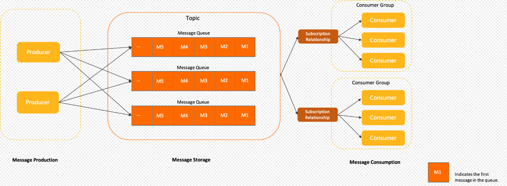

# Rocket MQ
[[toc]]
## 概述
文章摘自官网，系统架构图

### 消息生产
生产者（Producter）：Apache RocketMQ 中用于产生消息的运行实体，一般集成于业务调用链路的上游。生产者是轻量级匿名无身份的。
### 消息存储
* 主题（Topic）Apache RocketMQ 消息传输和存储的分组容器，主题内部由多个队列组成，消息的存储和水平扩展实际是通过主题内的队列实现的。
* 队列（MessageQueue）：Apache RocketMQ 消息传输和存储的实际单元容器，类比于其他消息队列中的分区。 Apache RocketMQ 通过流式特性的无限队列结构来存储消息，消息在队列内具备顺序性存储特征。
* 消息（Message）：Apache RocketMQ 的最小传输单元。消息具备不可变性，在初始化发送和完成存储后即不可变。
### 消息消费
* 消费者分组（ConsumerGroup）：Apache RocketMQ 发布订阅模型中定义的独立的消费身份分组，用于统一管理底层运行的多个消费者（Consumer）。同一个消费组的多个消费者必须保持消费逻辑和配置一致，共同分担该消费组订阅的消息，实现消费能力的水平扩展。
* 消费者（Consumer）：Apache RocketMQ 消费消息的运行实体，一般集成在业务调用链路的下游。消费者必须被指定到某一个消费组中。
* 订阅关系（Subscription）：Apache RocketMQ 发布订阅模型中消息过滤、重试、消费进度的规则配置。订阅关系以消费组粒度进行管理，消费组通过定义订阅关系控制指定消费组下的消费者如何实现消息过滤、消费重试及消费进度恢复等。

> Apache RocketMQ 的订阅关系除过滤表达式之外都是持久化的，即服务端重启或请求断开，订阅关系依然保留。

## 消息传输模型概述
### 点对点模型
具备特点：
* 消费匿名：消息上下游沟通的唯一的身份就是队列，下游消费者从队列获取消息无法申明独立身份。
* 一对一通信：基于消费匿名特点，下游消费者即使有多个，但都没有自己独立的身份，因此共享队列中的消息，每一条消息都只会被唯一一个消费者处理。因此点对点模型只能实现一对一通信。
### 发布订阅模型
具备特点：
- 消费独立：相比队列模型的匿名消费方式，发布订阅模型中消费方都会具备的身份，一般叫做订阅组（订阅关系），不同订阅组之间相互独立不会相互影响。
- 一对多通信：基于独立身份的设计，同一个主题内的消息可以被多个订阅组处理，每个订阅组都可以拿到全量消息。因此发布订阅模型可以实现一对多通信。

点对点模型和发布订阅模型各有优势，点对点模型更为简单，而发布订阅模型的扩展性更高。 Apache RocketMQ 使用的传输模型为发布订阅模型，因此也具有发布订阅模型的特点。

> 当前版本5.0

[组成构件](1_组成构件.md)