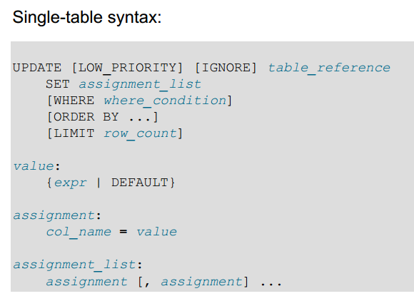
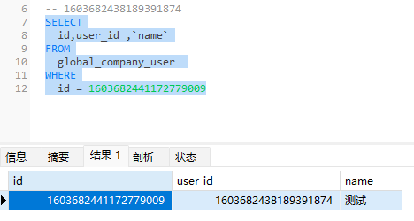
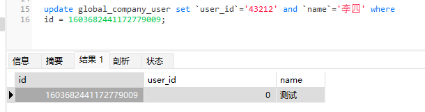
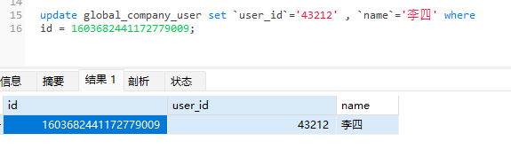

# 基础语法
[[toc]]

## 查询

```sql
select 字段 from 表名 where 条件 group by 分组 having 分组筛选 limit 分页
```

内连接、右连接、左连接

## 增加

## 修改
MySQL官方文档的update语法：



看到assignment_list的格式是以逗号分隔的col_name=value列表，一下子豁然开朗，开发同学想要的多字段更新语句应该字段用逗号分开

### MySQL中update和select关联使用
例子1：
```sql
-- 更新多个字段的时候，在set后面用逗号分隔即可。
UPDATE A LEFT JOIN( SELECT id,NAME FROM B ) c ON A.id = c.id SET A.name = c.name;

```

例子2：
```sql
update stock_daily b 
	inner join stock_daily a on a.id = b.id  
set 
	b.`year` = DATE_FORMAT( DATE_SUB(STR_TO_DATE(CAST(a.day AS CHAR),'%Y%m%d'), INTERVAL 1 DAY), '%Y' ),  
	b.`month` = DATE_FORMAT( DATE_SUB(STR_TO_DATE(CAST(a.day AS CHAR),'%Y%m%d'), INTERVAL 1 DAY), '%Y%m' ),  
	b.`day` = DATE_FORMAT( DATE_SUB(STR_TO_DATE(CAST(a.day AS CHAR),'%Y%m%d'), INTERVAL 1 DAY), '%Y%m%d' )
```

### 使用过程中的非常经典的“坑”

**坑点：**

在MySQL里面update一条记录，语法都正确的，但记录并没有被更新

**复现：**

先创建一个模拟的数据




**有问题的SQL：**
```sql
update global_company_user set `user_id`='43212' and `name`='李四' where 
id = 1603682441172779009; 
```

执行后效果：

> name的值没有变，但user_id变成了0！



**修正的SQL：**

> 在一条UPDATE语句中，如果要更新多个字段，字段间不能使用“AND”，而应该用逗号分隔。

```sql
update apps set owner_code='43212' , owner_name='李四' where 
owner_code='13245' and owner_name='张三';  
```




## 删除


## 常用的函数
| 函数格式 | 参数 | 返回 | 示例 |
| ---- | ---- | ---- | ---- |
| now() |  | 当前时间 |  |
| STR_TO_DATE(str, format) |  | 将字符串转换为日期格式 |  |
| DATE_SUB(date,INTERVAL expr type) | _date_ 参数是合法的日期表达式。<br>_expr_ 参数是您希望添加的时间间隔 |  |  |
| DATE_FORMAT(date,format); |  | 数据库日期格式转化为string |  |
|  |  |  |  |

### STR_TO_DATE中format
`str`为待转换的字符串，`format`为表示日期格式的字符串。下面是一些常用的日期格式代号：
- %Y：四位数的年份（如：2022）
- %y：两位数的年份（如：22）
- %m：两位数的月份（01~12）
- %d：两位数的日期（01~31）
- %H：两位数的小时（00~23）
- %i：两位数的分钟（00~59）
- %s：两位数的秒钟（00~59）


### DATE_SUB中type 参数
可以是下列值：  

|Type 值|
|---|
|MICROSECOND|
|SECOND|
|MINUTE|
|HOUR|
|DAY|
|WEEK|
|MONTH|
|QUARTER|
|YEAR|
|SECOND_MICROSECOND|
|MINUTE_MICROSECOND|
|MINUTE_SECOND|
|HOUR_MICROSECOND|
|HOUR_SECOND|
|HOUR_MINUTE|
|DAY_MICROSECOND|
|DAY_SECOND|
|DAY_MINUTE|
|DAY_HOUR|
|YEAR_MONTH|