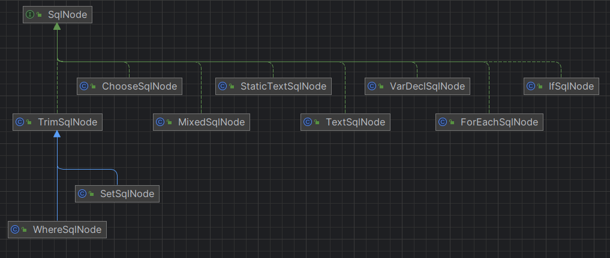
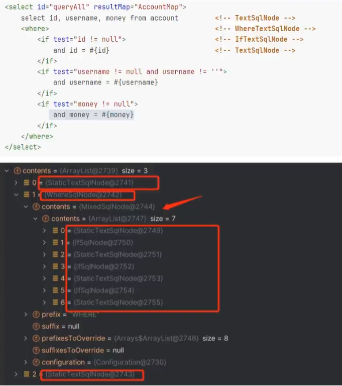

# Mybatis SQL动态解析原理

## 前言

核心步骤在这，这个类在`org.apache.ibatis.scripting.xmltags`包下

```java
public class DynamicSqlSource implements SqlSource {  
  
  private final Configuration configuration;  
  private final SqlNode rootSqlNode;  
  
  public DynamicSqlSource(Configuration configuration, SqlNode rootSqlNode) {  
    this.configuration = configuration;  
    this.rootSqlNode = rootSqlNode;  
  }  
  
  @Override  
  public BoundSql getBoundSql(Object parameterObject) {  
    // 构造上下文，保存所有相关信息的类，用于关联上下文使用
    DynamicContet context = new DynamicContext(configuration, parameterObject);  
    // 解析 替换xml中的where、if...等得到一个 带select * from user where id = #{id} 的对象
    rootSqlNode.apply(context);  
    SqlSourceBuilder sqlSourceParser = new SqlSourceBuilder(configuration);  
    Class<?> parameterType = parameterObject == null ? Object.class : parameterObject.getClass();  
    SqlSource sqlSource = sqlSourceParser.parse(context.getSql(), parameterType, context.getBindings());  
    BoundSql boundSql = sqlSource.getBoundSql(parameterObject);  
    context.getBindings().forEach(boundSql::setAdditionalParameter);  
    return boundSql;  
  }  
  
}
```

## 关键接口SqlNode

看下这个接口的实现，在这些实现中可以看到经常用到的if、where、forEach等



| 实现类 | 作用 |
| ---- | ---- |
| MixedSqlNode | 将内部的sqlNode集合遍历一遍，调用apply方法，一个递归过程 |
| StaticTextSqlNode | 负责拼接文本 |
| WhereSqlNode | 处理and关键字，以及两边的空格 |
| IfSqlNode | 使用Ognl判断test中的表达式对标签进行过滤 |

举个例子：



## 1.MixedSqlNode

循环遍历调用内部所有SqlNode节点的apply方法

```java
public class MixedSqlNode implements SqlNode {  
  private final List<SqlNode> contents;  
  
  public MixedSqlNode(List<SqlNode> contents) {  
    this.contents = contents;  
  }  
  
  @Override  
  public boolean apply(DynamicContext context) {  
    contents.forEach(node -> node.apply(context));  
    return true;  
  }  
}
```


## 2.StaticTextSqlNode

把SqlNode里的字符串拼接到上下文的StringJoiner变量里。

> StringJoiner是上下文（DynamicContext）里的一个变量，用来记录解析完成的SQL字符串。

追到再底层会发现就是一个StringBuilder，然后这个.appendSql()就是在调用StringBuilder的.append()方法。

```java
public class StaticTextSqlNode implements SqlNode {  
  private final String text;  
  
  public StaticTextSqlNode(String text) {  
    this.text = text;  
  }  
  
  @Override  
  public boolean apply(DynamicContext context) {  
    context.appendSql(text);  
    return true;  
  }  
  
}
```


## 3.IfSqlNode

需要判断test表达式是否满足条件，如果满足，则处理内部sqlNode，否则丢弃节点。==这就是if标签生效的原因==

```java
public class IfSqlNode implements SqlNode {  
  // 表达式解析器
  private final ExpressionEvaluator evaluator;  
  // 传入需要解析的字符串
  private final String test;  
  // if里有可能有其他 SqlNode
  private final SqlNode contents;  
  
  public IfSqlNode(SqlNode contents, String test) {  
    this.test = test;  
    this.contents = contents;  
    this.evaluator = new ExpressionEvaluator();  
  }  
  
  @Override  
  public boolean apply(DynamicContext context) {  
    // 第一个参数是 表达式字符
    // 第二个参数是 从上下文获取绑定的对象参数 parameter
    if (evaluator.evaluateBoolean(test, context.getBindings())) {  
      contents.apply(context);  
      return true;  
    }  
    return false;  
  }  
  
}
```

看下表达式解析器如何生效的，使用Ognl表达式判断表达式是否成立

```java
public class ExpressionEvaluator {  
  // 调用到这里，进入调用。判断表达式是否成立
  public boolean evaluateBoolean(String expression, Object parameterObject) {  
    // 使用Ognl获取表达式的值
    Object value = OgnlCache.getValue(expression, parameterObject);  
    // 值如果是布尔类型直接返回
    if (value instanceof Boolean) {  
      return (Boolean) value;  
    }  
    // 如果是数值类型看是否是0
    if (value instanceof Number) {  
      return new BigDecimal(String.valueOf(value)).compareTo(BigDecimal.ZERO) != 0;  
    }  
    return value != null;  
  }     
}
```

Ognl类里代码

```java
public static Object getValue(String expression, Object root) {  
  try {  
    Map context = Ognl.createDefaultContext(root, MEMBER_ACCESS, CLASS_RESOLVER, null);  
    return Ognl.getValue(parseExpression(expression), context, root);  
  } catch (OgnlException e) {  
    throw new BuilderException("Error evaluating expression '" + expression + "'. Cause: " + e, e);  
  }  
}
```

## 4.WhereSqlNode

```java
public class WhereSqlNode extends TrimSqlNode {  
  // 需要处理where的前缀
  private static List<String> prefixList = Arrays.asList("AND ","OR ","AND\n", "OR\n", "AND\r", "OR\r", "AND\t", "OR\t");  
  
  public WhereSqlNode(Configuration configuration, SqlNode contents) {  
    super(configuration, contents, "WHERE", prefixList, null, null);  
  }  
  
}
```

继承了 TrimSqlNode，先从apply看起

```java
public class TrimSqlNode implements SqlNode {  
  
  private final SqlNode contents;  
  private final String prefix;  
  private final String suffix;  
  private final List<String> prefixesToOverride;  
  private final List<String> suffixesToOverride;  
  private final Configuration configuration;  
  
  public TrimSqlNode(Configuration configuration, SqlNode contents, String prefix, String prefixesToOverride, String suffix, String suffixesToOverride) {  
    this(configuration, contents, prefix, parseOverrides(prefixesToOverride), suffix, parseOverrides(suffixesToOverride));  
  }  
  
  protected TrimSqlNode(Configuration configuration, SqlNode contents, String prefix, List<String> prefixesToOverride, String suffix, List<String> suffixesToOverride) {  
    this.contents = contents;  
    this.prefix = prefix;  
    this.prefixesToOverride = prefixesToOverride;  
    this.suffix = suffix;  
    this.suffixesToOverride = suffixesToOverride;  
    this.configuration = configuration;  
  }  

  // 先从这看
  @Override  
  public boolean apply(DynamicContext context) {  
    // 构造一个上下文DynamicContext的增强子类
    FilteredDynamicContext filteredDynamicContext = new FilteredDynamicContext(context);  
    // 执行where里sqlNode的apply
    boolean result = contents.apply(filteredDynamicContext);  
    // 针对封装的这个上下文做一些处理，去掉前缀和后缀。
    // 原来的DynamicContext里没有这个方法，写一个内部类继承DynamicContext，这样就能在原来的基础上增强，做一些处理
    filteredDynamicContext.applyAll();  
    return result;  
  }  
  
  private static List<String> parseOverrides(String overrides) {  
    if (overrides != null) {  
      final StringTokenizer parser = new StringTokenizer(overrides, "|", false);  
      final List<String> list = new ArrayList<>(parser.countTokens());  
      while (parser.hasMoreTokens()) {  
        list.add(parser.nextToken().toUpperCase(Locale.ENGLISH));  
      }  
      return list;  
    }  
    return Collections.emptyList();  
  }  
  
  private class FilteredDynamicContext extends DynamicContext {  
    private DynamicContext delegate;  
    private boolean prefixApplied;  
    private boolean suffixApplied;  
    private StringBuilder sqlBuffer;  
  
    public FilteredDynamicContext(DynamicContext delegate) {  
      super(configuration, null);  
      this.delegate = delegate;  
      this.prefixApplied = false;  
      this.suffixApplied = false;  
      this.sqlBuffer = new StringBuilder();  
    }  

    // 做的增强处理
    public void applyAll() {  
      // 得到拼接的sql，trim一下。去掉前后空格
      sqlBuffer = new StringBuilder(sqlBuffer.toString().trim());  
      // 都给转成大写
      String trimmedUppercaseSql = sqlBuffer.toString().toUpperCase(Locale.ENGLISH);  
      // 
      if (trimmedUppercaseSql.length() > 0) {  
        // 处理前缀，去掉前面的包含的指定的前缀
        applyPrefix(sqlBuffer, trimmedUppercaseSql);  
        // 处理后缀，去掉后面的包含指定的后缀
        applySuffix(sqlBuffer, trimmedUppercaseSql);  
      }  
      delegate.appendSql(sqlBuffer.toString());  
    }  
  
    @Override  
    public Map<String, Object> getBindings() {  
      return delegate.getBindings();  
    }  
  
    @Override  
    public void bind(String name, Object value) {  
      delegate.bind(name, value);  
    }  
  
    @Override  
    public int getUniqueNumber() {  
      return delegate.getUniqueNumber();  
    }  
  
    @Override  
    public void appendSql(String sql) {  
      sqlBuffer.append(sql);  
    }  
  
    @Override  
    public String getSql() {  
      return delegate.getSql();  
    }  

    // 处理前缀
    private void applyPrefix(StringBuilder sql, String trimmedUppercaseSql) { 
      // 用来判断是否已经处理过，初始值为false处理过改为true 
      if (!prefixApplied) {  
        prefixApplied = true;  
        // 前缀集合
        if (prefixesToOverride != null) {  
          // 循环前缀集合
          for (String toRemove : prefixesToOverride) {  
            // 转大写的字符串包含前缀集合中的字符
            if (trimmedUppercaseSql.startsWith(toRemove)) {  
              // 删掉 包含的这个几个字符
              sql.delete(0, toRemove.trim().length());  
              break;  
            }  
          }  
        }  
        // 如果需要拼接前缀，拼接一个空格再把指定的前缀拼接上，在where中拼接的是 where
        if (prefix != null) {  
          sql.insert(0, " ");  
          sql.insert(0, prefix);  
        }  
      }  
    }  

    // 处理后缀
    private void applySuffix(StringBuilder sql, String trimmedUppercaseSql) {  
      // 用来判断是否已经处理过，初始值为false处理过改为true 
      if (!suffixApplied) {  
        suffixApplied = true;  
        // where中没有处理需要处理的后缀，这个suffixesToOverride是null
        if (suffixesToOverride != null) {  
          // 有需要处理的后缀处理后缀
          for (String toRemove : suffixesToOverride) {  
            // 结尾为指定字符，去掉指定字符
            if (trimmedUppercaseSql.endsWith(toRemove) || trimmedUppercaseSql.endsWith(toRemove.trim())) {  
              int start = sql.length() - toRemove.trim().length();  
              int end = sql.length();  
              sql.delete(start, end);  
              break;  
            }  
          }  
        }  
        // 如果需要拼接后缀，拼接一个空格再把指定的后缀拼接上
        if (suffix != null) {  
          sql.append(" ");  
          sql.append(suffix);  
        }  
      }  
    }  
  }  
}
```