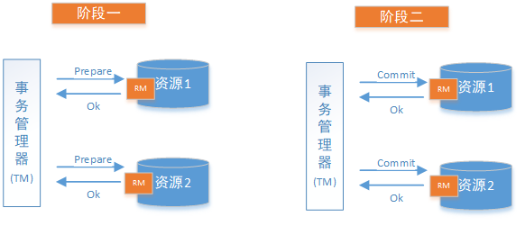
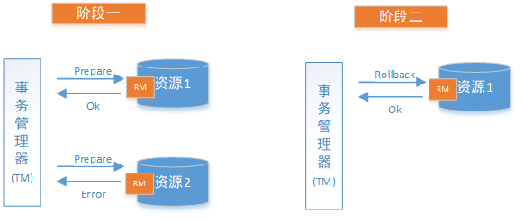

# 分布式数据库的两阶段提交协议
## 1.背景
在分布式系统中，为了保证数据的高可用，通常，我们会将数据保留多个副本，这些副本会放置在不同的物理的机器上。为了对用户提供正确的增删改查等操作的响应，需要保证这些放置在不同物理机器上的副本是一致的。

## 2.分布式事务
分布式事务是指会涉及到操作多个数据库的事务。其实就是将对同一库事务的概念扩大到了对多个库的事务。目的是为了保证分布式系统中的数据一致性。分布式事务处理的关键是必须有一种方法可以知道事务在任何地方所做的所有动作，提交或回滚事务的决定必须产生统一的结果（全部提交或全部回滚）。

## 3.如何实现分布式事务？
由于存在事务机制，可以保证每个独立节点上的数据操作可以满足ACID。但是，相互独立的节点之间无法准确的知道其他节点中的事务执行情况。所以从理论上讲，两台机器理论上无法达到一致的状态。
如果想让分布式部署的多台机器中的数据保持一致性，那么就要保证在所有节点的数据写操作，要么全部都执行，要么全部的都不执行。但是，一台机器在执行本地事务的时候无法知道其他机器中的本地事务的执行结果。所以他也就不知道本次事务到底应该commit还是roolback。所以，常规的解决办法就是引入一个“协调者”的组件来统一调度所有分布式节点的执行。

## 4.两阶段提交协议
二阶段提交的算法思路可以概括为： 参与者将操作成败通知协调者，再由协调者根据所有参与者的反馈情报决定各参与者是否要提交操作还是中止操作。
两阶段指的是：
第一阶段：voting phase 投票（准备）阶段
第二阶段：commit phase 提交（执行）阶段

### 投票阶段
事务协调者给每个参与者发送Prepare消息，每个参与者要么直接返回失败(如权限验证失败)，要么在本地执行事务，写本地的redo和undo日志，但不提交。
投票阶段三个步骤：
1. 协调者节点向所有参与者节点询问是否可以执行提交操作(vote)，并开始等待各参与者节点的响应。
2. 参与者节点检查事务权限，执行询问发起为止的所有事务操作，并将Undo信息和Redo信息写入日志。
3. 各参与者节点响应协调者节点发起的询问。如果参与者节点的事务操作实际执行成功，则它返回一个”同意”消息；如果参与者节点的事务操作实际执行失败，则它返回一个”中止”消息。

### 提交阶段
如果协调者收到了参与者的失败消息或者超时，直接给每个参与者发送回滚(Rollback)消息；否则，发送提交(Commit)消息；参与者根据协调者的指令执行提交或者回滚操作，释放所有事务处理过程中使用的锁资源。

下图展示了2PC的两个阶段，分成功和失败两个情况说明：

成功情况：

失败情况：

## 5.两阶段提交协议的缺点
* 执行过程中，所有参与节点都是事务阻塞的。当参与者占有公共资源时，其他第三方节点访问公共资源不得不处于阻塞状态。
* 由于协调者的重要性，一旦协调者发生故障。参与者会一直阻塞下去。尤其在第二阶段，协调者发生故障，那么所有的参与者还都处于锁定事务资源的状态中，而无法继续完成事务操作。
* 在两阶段提交的阶段二中，当协调者向参与者发送commit请求之后，发生了局部网络异常或者在发送commit请求过程中协调者发生了故障，这回导致只有一部分参与者接受到了commit请求。而在这部分参与者接到commit请求之后就会执行commit操作。但是其他部分未接到commit请求的机器则无法执行事务提交。于是整个分布式系统便出现了数据不一致性的现象。

---
#数据库 #分布式