# 星空
[[toc]]

## 夏季的星空

### 夏季大三角

在夏天抬头看，可以看到3颗非常亮的星，银河两岸的织女星（天琴座)α星）、牛郎星（也叫牛郎星、天鹰座α星）和银河之中的天津四（天鹅座α星）所构成的“夏季大三角”。银河是夏季星空的重要标志是从东北地平线向南方地平线延伸的光带，极为壮美，但只有在天气晴朗且无灯光干扰的郊外才有可能看到。

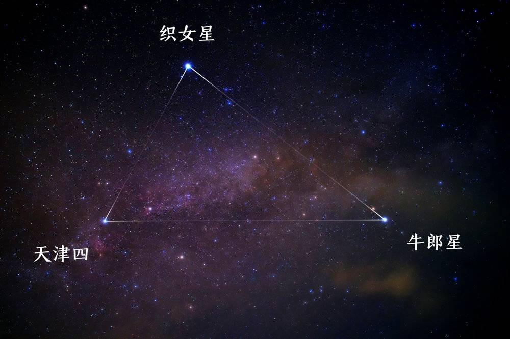

他们所在的星座，分别为天琴座、

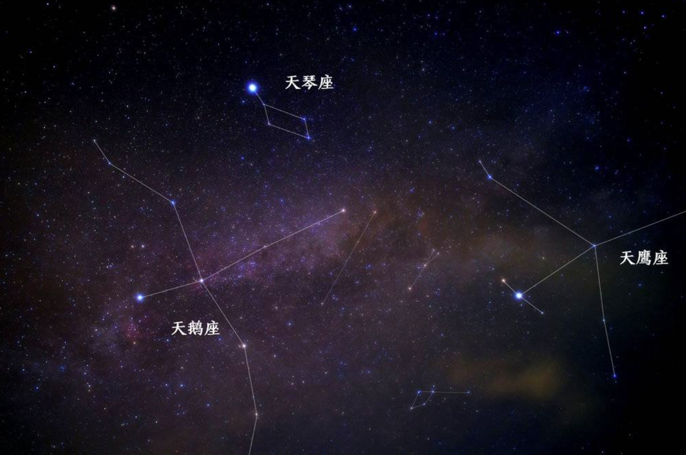

找到织女星就能找到天琴座，在织女星偏南一些的位置，我们可以看见4颗星可以构成一个四边形，希腊人把它们想象成一把竖琴，所以叫它天琴座。

另外这个四边形在中国传说故事中也代表着织女织布的梭子，与牛郎隔河相望。

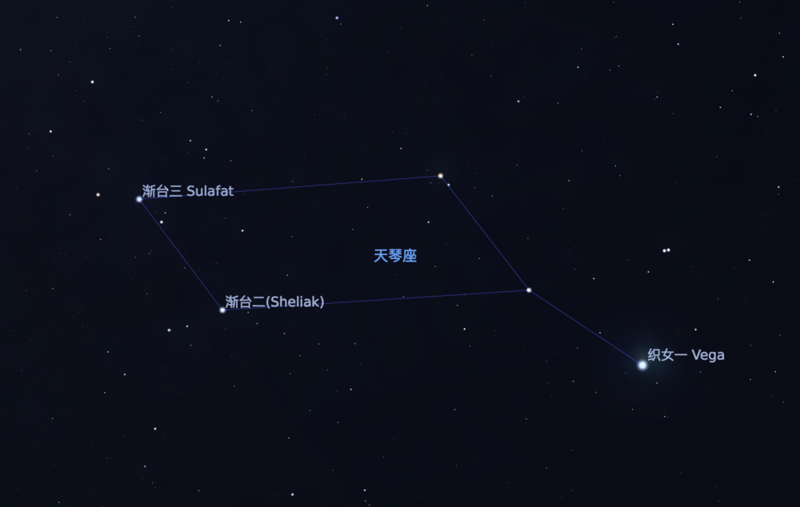

### 蛇夫座

欣赏完“夏季大三角”的风采，在心宿二和夏季大三角之间，有一颗比较亮的星，与牛郎和织女构成一个等腰三角形。这颗星就是蛇夫座α星，中国古代称为“候”。而候所处的星座就是蛇夫座。

蛇夫座是星座中惟一与其他星座（巨蛇座）直接连在一起，同时蛇夫座也是唯一同时横跨天球赤道、银道和黄道的星座。所以在天文学上，于1928年国际天文学联合会的国际天文学会议中，它被认定为黄道上的第十三个星座。

> 所以《铁甲小宝》中的第十三颗和平星代表的就是蛇夫座——没卵用知识一则

### 天蝎座

再往南看，南方低空天蝎座的心宿二，火红通亮，格外明显，中国古代称其为“大火星”。它是全天第14亮的一颗红超巨星，也是为数不多在天空中呈现红色的星球。它的辐射能量大部分集中在光谱的红外部分，故呈现红色。我们大约在每年的5月31日前后整夜都能见到心宿二，这时它处在与太阳相冲的相对位置上。在这段时间，心宿二在黄昏时东升而于黎明时西没。心宿二在**西方星座文化**中位于天蝎座内部，因其红色的光芒和所处的位置也被称为“蝎心”。(因为天蝎座是南方星座，而且整个星座非常巨大，所以我们在北半球观测的时候有时会受到地表地形的影响，存在看不完整的情况)

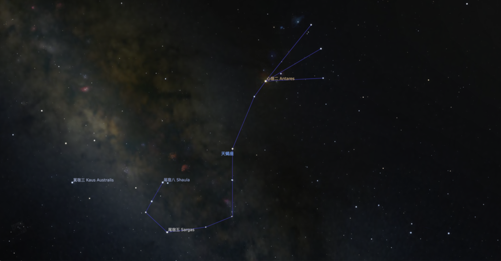

在**中国星空文化**中，它是东方“苍龙七宿”中“心宿”的第二颗星，所以我们成它为称为心宿二，又称为“大火”，古时说的火星指的就是心宿二而不是现在的Mars。成语“七月流火”即是大火星西行，天气将寒之意。（这里的七月是周朝的周历）。而现在我们的火星在那个时候被称为“荧惑”，“荧惑守心”这个词指的是，火星运转到“苍龙七宿”中的“心宿”附近。在心宿一，心宿二和心宿三附近发生了“留”的现象，火星和心宿二这两颗红色的星球闪耀当空，据说是“大凶”。上一次荧惑守心是2016年，下一次是2048年。

说到苍龙七宿，每到农历二月之后，“角宿一”和“角宿二”会缓缓从东方地平线上升起。它们代表着苍龙七宿的龙头部位，所以才有“二月二，龙抬头。”的说法。

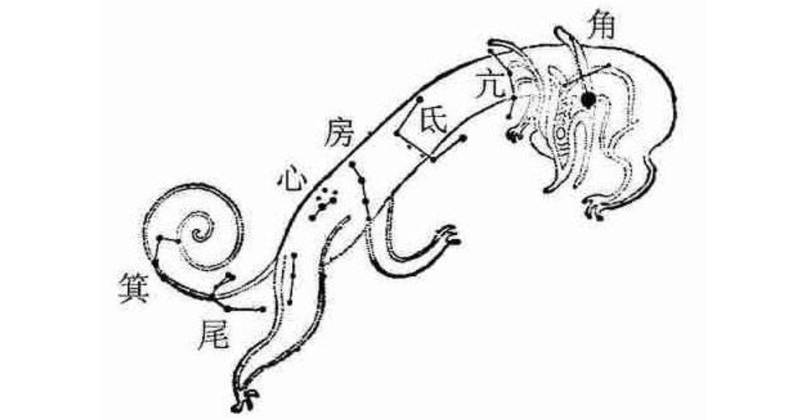

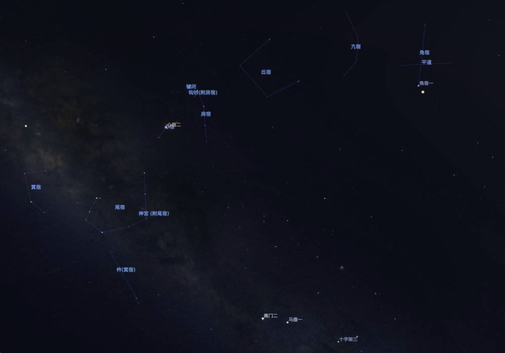

### 人马座及附近星座

从心宿二向东可以找到人马座，就是人们常说的射手座，其中的六颗星组成南斗六星，与西北方天空的北斗七星遥遥相对，常言所说的“北斗七，南斗六”就来源于此。

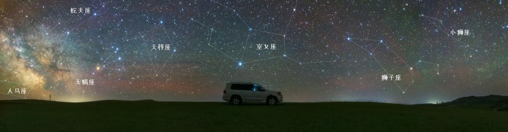

再把视野转向西方，在未来的半个月左右，当太阳落山，暮色低垂，在西方的低空可以看到一个巨大的反问号，这就是大名鼎鼎的狮子座。在狮子座，也有亮星格外引人注目，那就是狮子座的主星轩辕十四。

在亮星较少的春季天空中，轩辕十四可算是“春星之王”了。但随着夏季的到来，“夏季大三角”逐渐登陆夜空，成为主角。

### 银河

夏夜，在空气通透且远离光污染的地方还可以看到璀璨的银河，银河从“夏季大三角”里向外延伸，横贯南北。尤其是天蝎座、人马座之间的区域，是银河最灿烂的部分，不仅明亮，而且色彩丰富。

关于银河，从入夏开始，银河就已经逐渐可以看见了，从天蝎座、人马座开始，划过夏日大三角，将牛郎织女双星分隔开来，到仙后座，天空被一分为二，景象应当是非常壮观的。

对于一个正常人来说，上面的画面几乎是有生之年，因为真的实在不容易看到。

> 以上是比较明亮好找的星体，在城市中也是这些星体最易于辨识。如果对流星雨感兴趣的话，可以留意一下每年8月初的英仙座流星雨，它与象限仪座流星雨、双子座流星雨并称为年度三大流星雨，观测之前需要先对照一下星图做准备。另外有的时候我们也可以看到太阳系内的天体和人造卫星，由于系内的天体和卫星运行并不规律，有兴趣的各位可以提前做一下准备工作。

对自己视力有信心的朋友可以找一下十二星座。找星座需要注意的是：最好与目标的星座间隔左右各一个季度以上（也就是你的星座月份+3个月和+6个月之间），因为如果间隔太少甚至正处在你的星座日期内，太阳此刻在黄道面刚好是运行到这个星座，星座是与太阳同升同落的，不可能观测得到。

其实冬季的星空比夏季更加璀璨，全天最亮的天狼星，猎户座的参宿四，参宿七、毕宿五，南河三北河三等等，亮度很高的一些星星集中出现。

## 理解地球公转

地球公转的时间是一年，沿着轨道面自西向东转。黄赤交角的存在，意味着地球在绕太阳公转过程中，自转轴对地球轨道面是倾斜的。由于地轴与赤道平面是垂直的，地轴与地球轨道面交角应是90°减23°26′为66°34′。即地球无论公转到什么位置，这个倾角是保持不变的（我们在北半球可以通过北极星找到北）。公转示意图如下

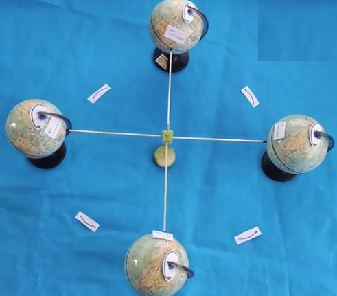

春分

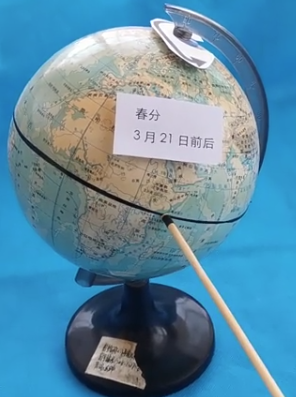

夏至

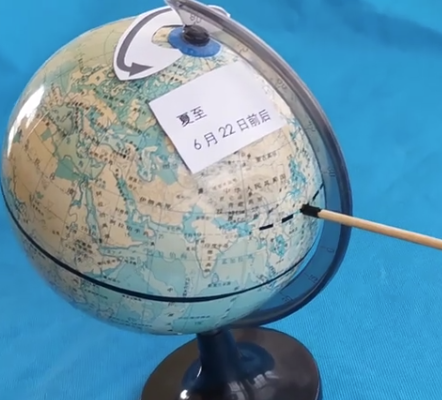

秋分

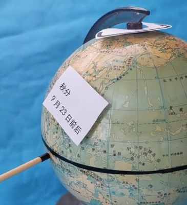

冬至

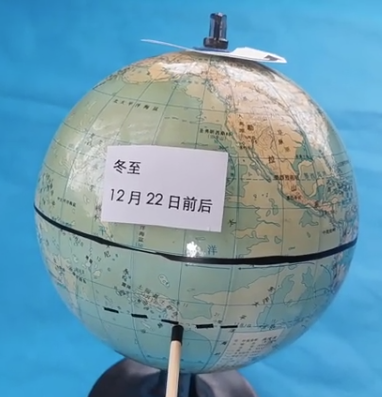

## 二十四节气与星象

中国的星象文化源远流长、博大精深，廿四节气最初是依据斗转星移制定，北斗七星循环旋转，这斗转星移与季节变换有着密切的关系。

北极星位于地球地轴的北端，在北斗七星中的天璇与天枢连线的五倍延长线上。由于地球的自转，而北极星正好处在天球转动的轴上，所以相对不动，而在轴边上的北斗星看起来就像围绕着北极星转一样，这就产生了“斗转星移”。

北斗七星是北半球（中国位于北半球）的重要星象，斗转星移时中国相应地域的自然节律亦在渐变，因此成为上古时代中国古人判断节气变化的依据。

现行的“二十四节气”是依据太阳在回归黄道上的位置制定，即把太阳周年运动轨迹划分为24等份，每15°为1等份，每1等份为一个节气，共二十四个节气。廿四节气不仅在农业生产方面起着指导作用，同时还影响着古人的衣食住行，甚至是文化观念。在历史发展中，廿四节气被列入农历，成为农历的一个重要部分。

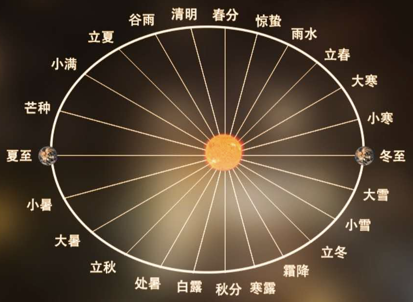

《二十四节气歌》

春雨惊春清谷天，夏满芒夏暑相连。

秋处露秋寒霜降，冬雪雪冬小大寒。

每月两节不变更，最多相差一两天。

上半年来六廿一，下半年是八廿三。

立春：开始进入春天，过了立春，万物复苏。一年四季从此开始。

雨水：春风遍吹，冰雪融化，空气湿润，雨水增多，所以叫雨水。

惊蛰：天气转暖，蛰伏在泥土里的冬眠动物苏醒过来开始活动，叫做惊蛰。过冬的虫卵开始孵化。

春分：太阳在赤道上方。是春季90天的中分点，南北两半球昼夜相等，所以叫春分。越冬作物进入生长阶段。

清明：气候清爽温暖，草木始发新枝芽，万物开始生长，农民忙于春耕春种。

谷雨：雨水生五谷的意思，雨水滋润大地五谷得以生长，谷雨就是雨生百谷。

立夏：进入夏天，万物旺盛。气温显著升高，炎署将临，雷雨增多，农作物进入旺季生长。

小满：大麦、冬小麦等夏收作物，已经结果、籽粒饱满，但尚未成熟，所以叫小满。

芒种：最适合播种有芒谷类作物，如晚谷、黍、稷等。芒指有芒作物，种指种子。芒种有指有芒作物成熟。

夏至：太阳在夏至点，北半球正午太阳最高。是北半球白昼最长、夜黑最短的一天，进入到炎热的季节

小暑：天气很热，还不到最热的时候。这时已是初伏前后。

大暑：一年中最热的节气，正值勤二伏前后，长江流域的许多地方经常出现40度的高温天气，雨水多。

立秋：秋天开始，秋高气爽，月明风清。气温由最热逐渐下降。

处暑：夏季火热已到头。暑气就要散了。是气候变凉的象征，表示暑天终止。

白露：天气转凉，地面水汽结露。

秋分：昼夜几乎相等。北半球开始昼短夜长。这一天刚好是秋季90天的一半，因而称秋分。

寒露：露水更多，气温更低。气温主键转冷，水汽凝成白色露珠。

霜降：天气已冷，开始有冻霜，所以叫霜降。

立冬：冬季的开始。一年的田间操作结束。作物收割之后收藏起来。我国黄河中、下游地区将结冰。

小雪：气温下降，开始降雪。还不到大学纷飞时节。所以叫小雪，北方，已进入封冻季节。

大雪：大雪前后，黄河流域一带渐有积雪。北方已经是千里冰封，万里雪飘的严冬。

冬至：阳光几乎直射南回归线，北半球白昼最短，黑夜最长，进入数九寒天。

小寒：进入寒冷的季节，冷气积久而寒，天气寒冷但还没有到达极点。

大寒：寒冷到了极点。大寒前后是一年中最冷的季节。正值三九刚过，四九之初。

