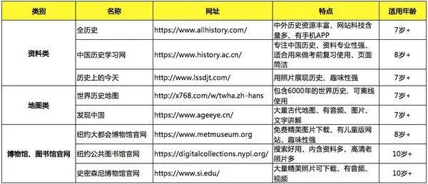

# 网站收集

[全历史](https://www.allhistory.com/)

[世界历史地图](http://x768.com/w/twha.zh-hans)

[发现中国](https://www.ageeye.cn/)

[中国国家图书馆 · 中国国家数字图书馆 · 国家典籍博物馆 (nlc.cn)](https://www.nlc.cn/web/index.shtml)

[纽约大都会博物馆](https://www.metmuseum.org)

[纽约公共图书馆](https://digitalcollections.nypl.org/)

[史密森尼博物馆](https://www.si.edu/)

