# 安装Jupyter Notebook

[文章摘自](https://zhuanlan.zhihu.com/p/33105153)加自己实际操作

## 前言
需要准备python环境

## 使用pip命令安装

### 1. 把pip升级到最新版本
```python
pip3 install --upgrade pip
```

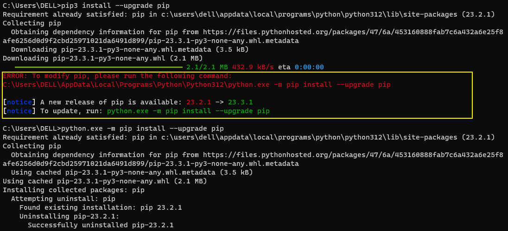

这里报了个错，根据指示使用如下命令
```python
python.exe -m pip install --upgrade pip
```

> 老版本的pip在安装Jupyter Notebook过程中或面临依赖项无法同步安装的问题。因此**强烈建议**先把pip升级到最新版本


### 2. 安装Jupyter Notebook
```python
pip3 install jupyter
```

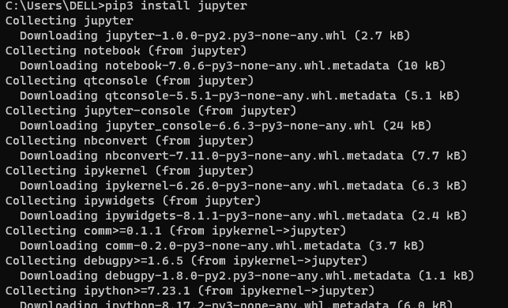

这里等待一阵儿，需要下载些依赖

### 3. 运行Jupyter Notebook

#### 0. 帮助

如果你有任何jupyter notebook命令的疑问，可以考虑查看官方帮助文档，命令如下：

```text
jupyter notebook --help
```

或

```text
jupyter notebook -h
```

#### 1. 启动

##### 默认端口启动

在终端中输入以下命令：

```bash
jupyter notebook
```

执行命令之后，在终端中将会显示一系列notebook的服务器信息，同时浏览器将会自动启动Jupyter Notebook。

启动过程中终端显示内容如下：

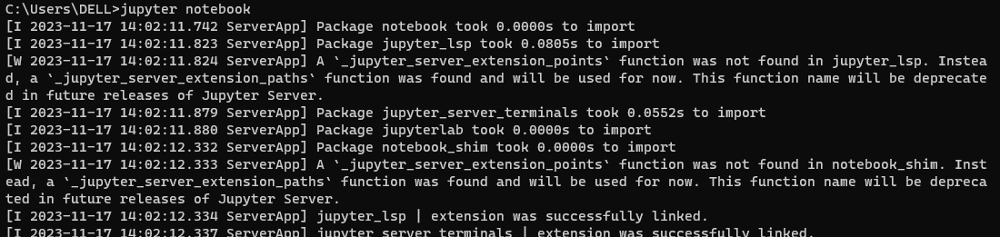

> 之后在Jupyter Notebook的所有操作，都请保持终端**不要关闭**，因为一旦关闭终端，就会断开与本地服务器的链接，你将无法在Jupyter Notebook中进行其他操作

浏览器地址栏中默认地将会显示：`http://localhost:8888`。其中，“localhost”指的是本机，“8888”则是端口号。

如果同时启动了多个Jupyter Notebook，由于默认端口“8888”被占用，因此地址栏中的数字将从“8888”起，每多启动一个Jupyter Notebook数字就加1，如“8889”、“8890”……

##### 指定端口启动
```python
jupyter notebook --port <port_number>
```

<port_number>”是自定义端口号，直接以数字的形式写在命令当中，数字两边不加尖括号“<>”

##### 启动服务器但不打开浏览器

如果你只是想启动Jupyter Notebook的服务器但不打算立刻进入到主页面，那么就无需立刻启动浏览器。在终端中输入：

```text
jupyter notebook --no-browser
```

此时，将会在终端显示启动的服务器信息，并在服务器启动之后，显示出打开浏览器页面的链接。当你需要启动浏览器页面时，只需要复制链接，并粘贴在浏览器的地址栏中，轻按回车变转到了你的Jupyter Notebook页面。

#### 运行界面

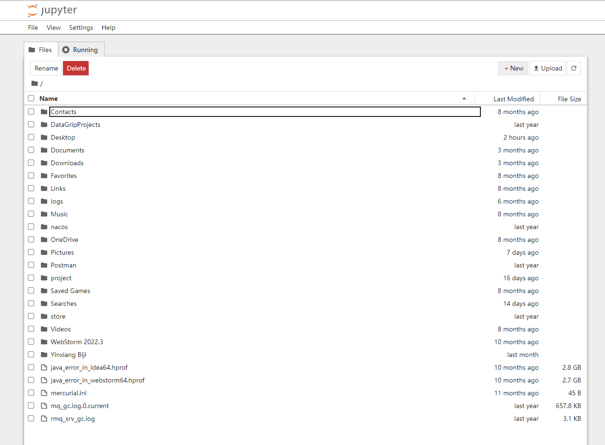

> 这里边的文件夹全都是你的家目录里的目录文件

#### 设置Jupyter Notebook文件存放位置
1. 创建文件夹/目录
创建一个文件夹或目录，复制下路径

2. 配置文件路径
获取配置文件所在路径的命令
```python
jupyter notebook --generate-config
```

> 这条命令虽然可以用于查看配置文件所在的路径，但主要用途是是否将这个路径下的配置文件**替换**为**默认配置文件**。 如果你是第一次查询，那么**或许**不会出现下图的提示；若文件已经存在或被修改，使用这个命令之后会出现询问“Overwrite /Users/raxxie/.jupyter/jupyter_notebook_config.py with default config? \[y/N\]”，即“用默认配置文件覆盖此路径下的文件吗？”，如果按“y”，则完成覆盖，那么之前所做的修改都将失效；如果只是为了查询路径，那么一定要输入“N”

找到这个文件
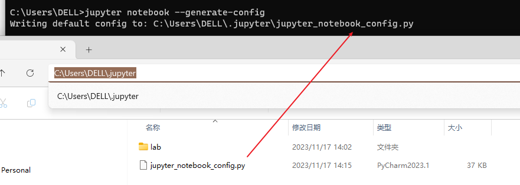

3. 查找关键词

进入配置文件后查找关键词“c.NotebookApp.notebook_dir”。
> 这里显示 的关键字是  c.ServerApp.notebook_dir 

4. 编辑配置文件，把创建文件夹或目录粘贴到等号后单引号内
5. 取消#注释
6. 保存退出
7. 重启服务

打开查看，没有其余文件，为设置成功。

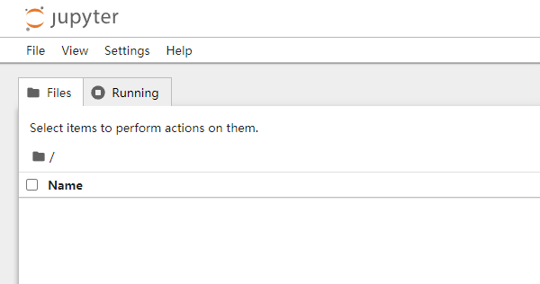
## Jupyter Notebook的基本使用

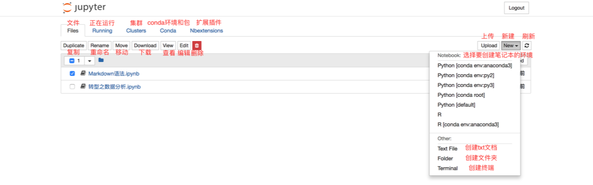

此时你的界面当中应该还没有“Conda”和“Nbextensions”类目。不要着急，这两个类目将分别在“五、拓展功能”中的“1.关联Jupyter Notebook和conda的环境和包——‘nb_conda’”和“2.Markdown生成目录”中安装。

Files页面是用于管理和创建文件相关的类目。

对于现有的文件，可以通过勾选文件的方式，对选中文件进行复制、重命名、移动、下载、查看、编辑和删除的操作。

同时，也可以根据需要，在“New”下拉列表中选择想要创建文件的环境，进行创建“ipynb”格式的笔记本、“txt”格式的文档、终端或文件夹。如果你创建的环境没有在下拉列表中显示，那么你需要依次前往“拓展功能小节”中的“1.关联Jupyter Notebook和conda的环境和包——‘nb_conda’”和“增加内核小节“——‘ipykernel’中解决该问题。


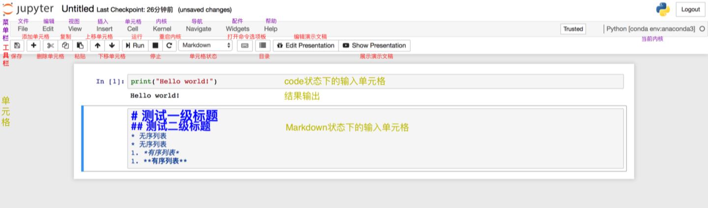
上图展示的是笔记本的基本结构和功能。根据图中的注解已经可以解决绝大多数的使用问题了！

工具栏的使用如图中的注解一样直观，在此不过多解释。需要特别说明的是“单元格的状态”，有Code，Markdown，Heading，Raw NBconvert。其中，最常用的是前两个，分别是代码状态，Markdown编写状态。Jupyter Notebook已经取消了Heading状态，即标题单元格。取而代之的是Markdown的一级至六级标题。而Raw NBconvert目前极少用到，此处也不做过多讲解。

菜单栏涵盖了笔记本的所有功能，即便是工具栏的功能，也都可以在菜单栏的类目里找到。然而，并不是所有功能都是常用的，比如Widgets，Navigate。Kernel类目的使用，主要是对内核的操作，比如中断、重启、连接、关闭、切换内核等，由于我们在创建笔记本时已经选择了内核，因此切换内核的操作便于我们在使用笔记本时切换到我们想要的内核环境中去。由于其他的功能相对比较常规，根据图中的注解来尝试使用笔记本的功能已经非常便捷，因此不再做详细讲解。

### 快捷键

找到help找到keyboard shortcuts
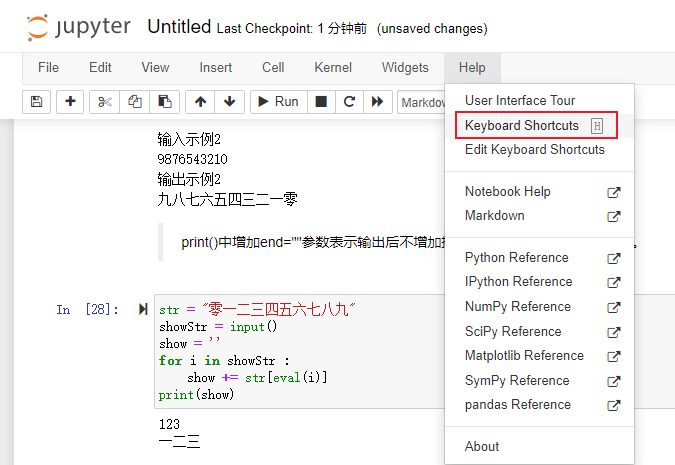
或者直接在命令模式按 H 字母
### 笔记本重命名的两种方式

1. 笔记本内部重命名
在使用笔记本时，可以直接在其内部进行重命名。在左上方“Jupyter”的图标旁有程序默认的标题“Untitled”，点击“Untitled”然后在弹出的对话框中输入自拟的标题，点击“Rename”即完成了重命名。

2. 笔记本外部重命名
若在使用笔记本时忘记了重命名，且已经保存并退出至“Files”界面，则在“Files”界面勾选需要重命名的文件，点击“Rename”然后直接输入自拟的标题即可。

### Running页面

Running页面主要展示的是当前正在运行当中的终端和“ipynb”格式的笔记本。若想要关闭已经打开的终端和“ipynb”格式的笔记本，仅仅关闭其页面是无法彻底退出程序的，需要在Running页面点击其对应的“Shutdown”。

## 拓展功能

### 关联Jupyter Notebook和conda的环境和包——“nb_conda”☆

[conda的安装](https://zhuanlan.zhihu.com/p/44398592)

1. 安装

```text
conda install nb_conda
```

执行上述命令能够将你conda创建的环境与Jupyter Notebook相关联，便于你在Jupyter Notebook的使用中，在不同的环境下创建笔记本进行工作。

2. 使用
- 可以在Conda类目下对conda环境和包进行一系列操作。
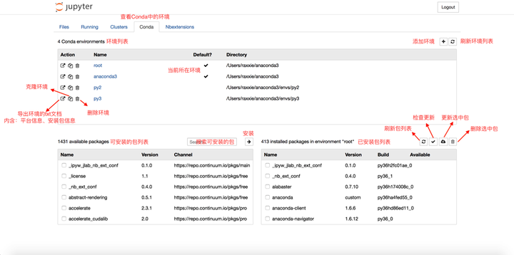
* 可以在笔记本内的“Kernel”类目里的“Change  kernel”切换内核。
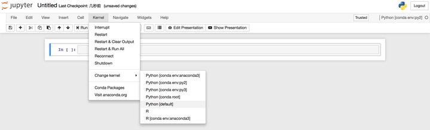
3. 卸载
```text
canda remove nb_conda
```

执行上述命令即可卸载nb_conda包。

### Markdown生成目录
- 不同于有道云笔记的Markdown编译器，Jupyter Notebook无法为Markdown文档通过特定语法添加目录，因此需要通过安装扩展来实现目录的添加。

```text
conda install -c conda-forge jupyter_contrib_nbextensions
```

- 执行上述命令后，启动Jupyter Notebook，你会发现导航栏多了“Nbextensions”的类目，点击“Nbextensions”，勾选“Table  of Contents”
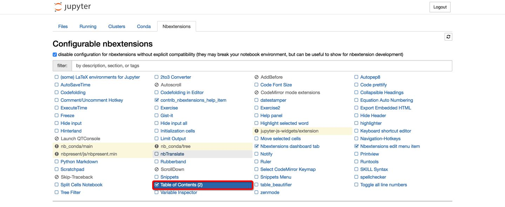

#### 遇到的问题

有一个新的conda版本存在
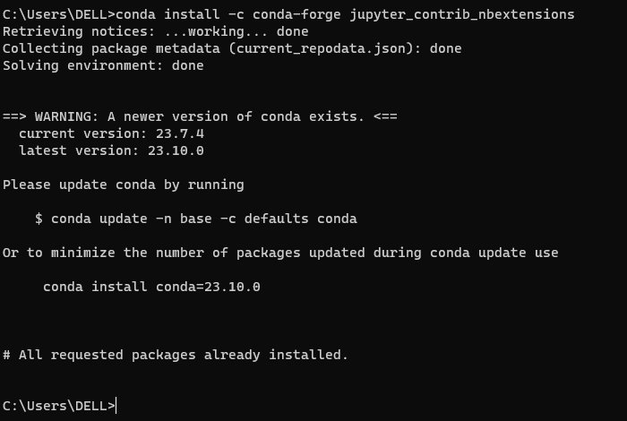
按照意见执行下命令
```python 
conda update -n base -c defaults conda
```

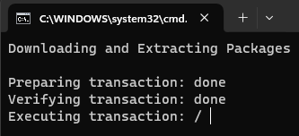

#### 显示不全

首先依次敲三个命令
conda remove jupyter_nbextensions_configurator
conda install -c conda-forge jupyter_nbextensions_configurator
conda install -c conda-forge jupyter_contrib_nbextensions
重新运行jupyter，如果发现还是没有变化，就再依次敲下面两个命令
jupyter contrib nbextension install --user
jupyter nbextensions_configurator enable --user


## **增加内核——“ipykernel” ☆**

### 1. 使用场景

- 场景一：同时用不同版本的Python进行工作，在Jupyter Notebook中无法切换，即“New”的下拉菜单中无法使用需要的环境。
- 场景二：创建了不同的虚拟环境（或许具有相同的Python版本但安装的包不同），在Jupyter Notebook中无法切换，即“New”的下拉菜单中无法使用需要的环境。

接下来将分别用“命令行模式”和“图形界面模式”来解决以上两个场景的问题。顾名思义，“命令行模式”即在终端中通过执行命令来一步步解决问题；“图形界面模式”则是通过在Jupyter Notebook的网页中通过鼠标点击的方式解决上述问题。

其中，“图形界面模式”的解决方法相对比较简单快捷，如果对于急于解决问题，不需要知道运行原理的朋友，可以直接进入“3. 解决方法之图形界面模式”来阅读。

“命令行模式”看似比较复杂，且又划分了使用场景，但通过这种方式来解决问题可以更好的了解其中的工作原理，比如，每进行一步操作对应的命令是什么，而命令的执行是为了达到什么样的目的，这些可能都被封装在图形界面上的一个点击动作来完成了。对于想更深入了解其运作过程的朋友，可以接着向下阅读。

## 2. 解决方法之命令行模式

### 同时使用不同版本的Python

### ⑴ 在Python 3中创建Python 2内核

### ⒜ pip安装
- 首先安装Python 2的ipykernel包。

```text
python2 -m pip install ipykernel
```

- 再为**当前用户**安装Python 2的内核（ipykernel）。

```text
python2 -m ipykernel install --user
```

- 注意：“--user”参数的意思是针对当前用户安装，而非系统范围内安装。

### ⒝ conda安装

- 首先创建Python版本为2.x且具有ipykernel的新环境，其中“<env_name>”为自定义环境名，环境名两边不加尖括号“<>”。

```text
conda create -n <env_name> python=2 ipykernel
```

- 然后切换至新创建的环境。

```text
Windows: activate <env_name>
Linux/macOS: source activate <env_name>
```

- 为**当前用户**安装Python 2的内核（ipykernel）。

```text
python2 -m ipykernel install --user
```

- 注意：“--user”参数的意思是针对当前用户安装，而非系统范围内安装。