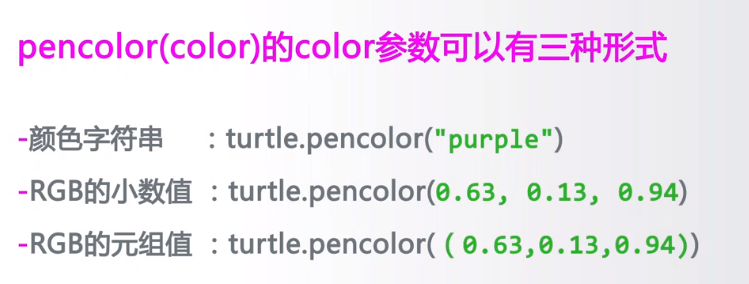

# turtle库的使用

这是一个图形绘制库

## 画笔控制

成对出现

### RGB色彩体系

## 画笔运动控制函数
### 绝对坐标

### 相对坐标

前行：forward简称fd
后退：简称bk
弧形：circle，第一个参数半径，第二个参数绘制多少角度（没有第二个参数绘制圆形）

> 理解circle
> 第一个参数不是圆的中心，是两条红线的交叉处。以海龟头朝向为x轴正方向，垂直海龟左侧为半径的正数大小，海龟右侧为半径的负数大小
> 
> 第二个参数，行进方向和，行进角度。正数头朝向行进，负数倒着行进。
### 运行方向
setheading简称seth

> 这个角度是绝对角度，即直角坐标的方向，不论海龟在什么角度，再次设值都是依据直角坐标

向左或向右

### 绘制一个汉字

.write('年', font=("Arial", 18, "normal")) # 字体
.pencolor("blue") # 颜色
.fd(40) # 大小
## 绘制七段数码管

