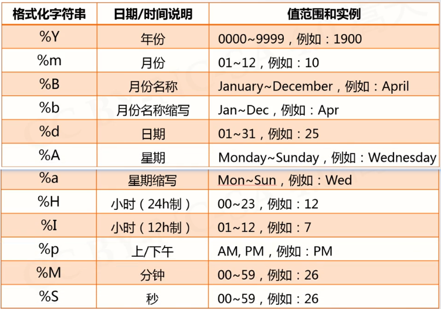

# time库的使用
 import time
 
## 获取时间
.time()函数：获取当前时间戳，很长的浮点数。1970年1月1日0点0分开始到当前时刻为止秒为单位的数值

.ctime()：获取当前时间并以易读的方式标识返回字符串

.gmtime()：获取当前时间，标识计算机可以处理的时间

## 时间格式化
### 时间转字符串
.strftime(tpl, ts)：tpl是格式化模板字符串，用来定义输出效果。ts是计算机内部事件类型变量

```ptyhon
import time

t = time.gmtime()
time.strftime('%Y-%m-%d %H:%M:%S', t)
```

输出：'2023-11-19 07:10:21'



### 字符串转时间
.strptime(timeStr, '%Y-%m-%d %H:%M:%S')：str字符串形式的时间值，模板

## 程序计时应用
程序计时指测量起止动作所经历时间的过程
python时间库提供一个非常精准的测量时间的方法
.perf_counter()：可以获取CPU以其频率运行的时钟，这个时间一般采用纳秒计算非常精准。单位为妙。这个计数值起点不确定，连续调用差值才有意义

```python
import time
star = time.perf_counter()
end = time.perf_counter()
print(end - star)
```


.sleep(x)：程序停止x秒