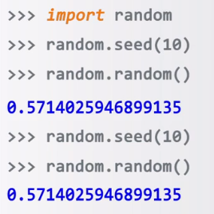

## random模块的使用

是使用随机数的Python标准库

伪随机数：采用梅森旋转算法生成的（伪）随机序列中元素
计算机不能产生真正的随机数，所以伪随机数被称为随机数

## 基本函数

随机数种子产生，随机数种子确定了随机数序列。种子给一次就行。

* .seed(a = None)：初始化给定的随机数种子，默认为当前系统时间。给几产生几个随机序列
* .random()：生成一个\[0.0, 1.0\]之间的随机小数

> 为什么使用种子：因为只要种子相同，下次运行程序还是这个序列，可以复现
> 
> 只要我们重新设置seed下次random的值是一样的。
## 扩展函数

* .randint(a, b)：生成一个\[a, b\]之间的整数
* .getrandbits(m, n \[, k\])：生成一个\[m, n) 之间以k为步长的随机整数
* .uniform(k)：生成k比特长的随机整数
* .randrange(a, b)：生成一个\[a，b\]之间的随机小数，浮点类型16位小数
* .choice(seq)：从序列seq中随机选择一个元素
* .shuffle(seq)：将序列seq中元素随机排列，返回打乱后的序列
