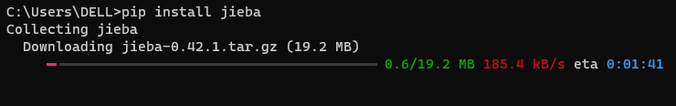
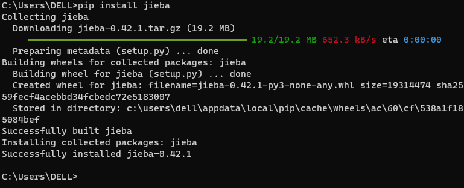
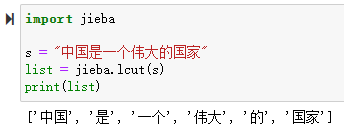
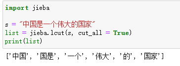
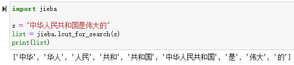

# jieba库的使用

是优秀的中文分词第三方库，中文文本需要通过分词获得单个词语

## 安装

```python
pip install jieba
```

安装过程


安装完成

## 原理
通过中文词库方式来识别分词的，利用一个中文词库，确定汉字之间的关联概率
通过汉字间概率大的组成词组，形成分词结果
除了分词，用户还可以添加自定义的词组，从而更适应某些领域

## 使用
有三种模式：精确模式、全模式、搜索引擎模式

精确模式：把文本精确的切分开，不存在冗余单词。是最常用的分词模式
全模式：把文本所有可能的词语都扫描出来，有冗余
搜索引擎模式：在精确模式基础上，对长词再次切分

### 常用函数

* jieba.lcut(s)：精确模式，返回一个列表类型的分词结果
	
* jieba.lcut(s, cut_all = True)：全模式，返回一个列表类型的分词结果，存在冗余
	
* jieba.lcut_for_search(s)：搜索引擎模式，返回一个列表类型的分词结果，存在冗余
	
* jieba.add(w)：向分词字典增加新词w
