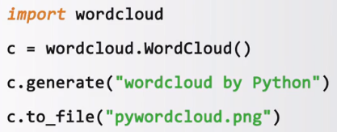

# 词云库的使用
## 安装
```python
pip install wordcloud
```

## 基本使用
wordcloud库把词云当做一个WordCloud对象，可以根据文本中词语出现的频率等参数绘制词云。绘制词云的形状、尺寸和颜色都可以设定。
```python
w = wordcloud.WordCloud()

wordcloud.WordCloud(width=600) # 默认宽度400px
wordcloud.WordCloud(height=400) # 默认高度200px
wordcloud.WordCloud(min_font_size=10) # 默认4号
wordcloud.WordCloud(max_font_size=20) # 默认根据高度自动调节
wordcloud.WordCloud(font_step=2) # 步进间隔，默认为1
wordcloud.WordCloud(font_path="msyh.tcc") # 指定字体文件的路径，默认None，这里设置微软雅黑
wordcloud.WordCloud(max_words=20) # 词云最大显示数量
wordcloud.WordCloud(stop_words={"Python"}) # 词云排除词列表，不显示的单词列表
```

## 常用方法
* w.generate(txt)：向WordCloud对象w中加载文本txt
* w.to_file(filename)：将词云输出为图像文件，.png或.jpg格式

## 使用步骤
1. 配置对象参数
2. 加载词云文本
3. 输出词云文件



## 设置指定形状
需要使用imread，把文件读取出来
```python
form scipy.misc improt imread
mk = imread("pic.png")
w = wordcloud.WordCloud(mask=mk)
```