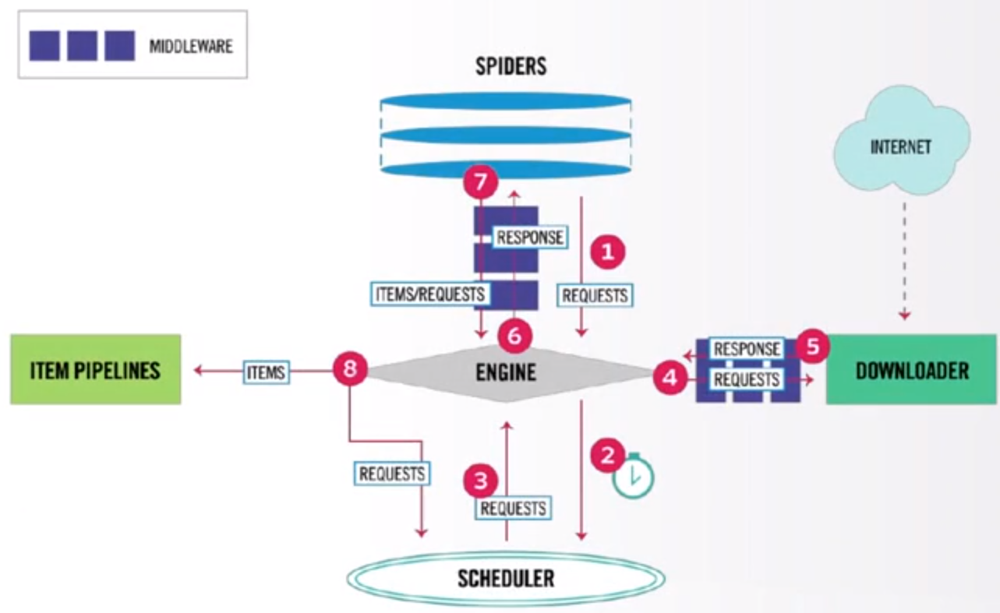
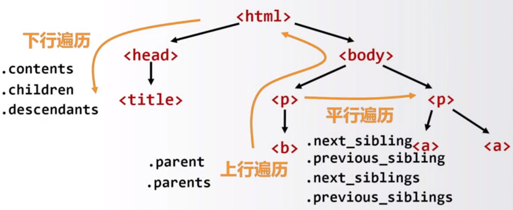
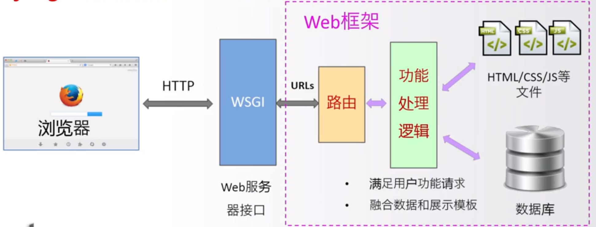
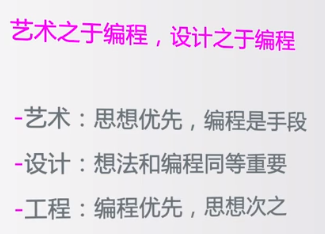

# Web解析到网络空间

## 网络爬虫Request
* 提供了简单易用的类HTTP协议网络爬虫功能
* 支持连接池、SSL、Cookies、HTTP(S)代理等
* 是Python最主要的页面级网络爬虫功能库

> [Request官网地址：http://www.python-requests.org/](http://www.python-requests.org/)

### 网络爬虫框架Scrapy
* 提供了构建网络爬虫系统的框架功能，是功能半成品
* 支持批量和定时网页抓取、提供数据处理流程等
* 是Python最主要且最专业的网络爬虫框架

包含若干组件和部分

> [官网地址：https://scrapy.org](https://scrapy.org)

### 强大的Web页面爬取系统pyspider
* 提供了完整的网页爬取系统构建功能
* 支持数据库后端、消息队列、优先级、分布式架构等
* 是Python最重要的网络爬虫第三方类库
是建立建设专业级Web网络爬虫系统的重要支持技术
> [官网地址：http://docs.pyspider.org](http://docs.pyspider.org)

## Web页面信息提取

### HTML和XML的解析库Beautiful Soup
* 提供了解析HTML和XML等Web信息的功能
* 又名beautifulsoup4或bs4，可以加载多种解析引擎
* 常与网络爬虫库搭配使用，例如Scrapy、Request等

将所有的HTML页面以树形结构进行组织，使用正则表达式定点获取某些信息
> [学习正则表达式](https://blog.csdn.net/weixin_42119415/article/details/118079457)

> 官网地址：[https://www.crummy.com/software/BeautifulSoup/bs4](https://www.crummy.com/software/BeautifulSoup/bs4)

### 正则表达式解析和处理功能库Re
* 提供了定义和解析正则表达式的一批通用功能
* 可用于各类场景，包括定点的Web信息提取
* 是Python最主要的标准库之一，无需安装

> [官网地址：http://docs.python.org/3.6/library/re.html](http://docs.python.org/3.6/library/re.html)

### 提取文章类型Web页面的功能库Python-Goose
* 提供了对Web页面中文章信息/视频等元数据的提取功能
* 针对特定类型Web页面，应用覆盖较广
* 也是Python最主要的Web信息提取库
> [官网地址：https://github.com/grangier/python-goose](https://github.com/grangier/python-goose)

## Web网站开发

### 最流行的Web应用框架Django
* 提供了构建Web系统的基本应用框架
* 采用MTV模式：模型mode、模板template、视图views
* 是Python最重要的Web应用框架，略为复杂的应用框架

> 官方网站：https://www.djangoproject.com

### 规模适中的Web应用框架Pyramid
* 提供了简单方便构建Web系统的应用框架
* 不大不小，规模适中、适合快速构建并适度扩展类应用
* 是Python产品级Web应用框架，起步简单可扩展性好

### Web应用开发微框架Flask
* 提供了最简单构建Web系统的应用框架
* 特点：简单、规模小、快速
* 几个页面的网站用Flask非常适合

## 网络应用开发
### 微信公众号开发框架WeRoBot
* 提供了解析微信服务器消息及反馈消息的功能（从微信服务器获取消息并解析这些消息，也能向微信服务器反馈消息）
* 是建立微信机器人的重要技术手段
> 官网地址：https://github.com/offu/WeRoBot

### 百度AI开发平台接口
* 提供了访问百度AI服务的Python功能接口
* 语音、人脸、OCR、NLP、知识图谱、图像搜索等领域

### 二维码生成第三方库MyQR
* 提供了生成二维码的系列功能
* 基本二维码、艺术二维码和动态二维码

## 图形用户界面
###  PyQt5
* 提供了创建Qt5程序的Python API接口
* Qt是非常成熟的跨平台桌面应用开发系统，完备的GUI。
* 背后有成熟的工业链条
> [官方网站：https://www.riverbankcomputing.com/software/pyqt](https://www.riverbankcomputing.com/software/pyqt)

### wxPython
* 提供专用于Python的跨平台GUI开发框架
* 理解数据类型与索引的关系，操作索引即操作数据
* 是Python最主要的数据分析功能库，基于Numpy开发
### PyGObject
* 整合了GTK+、WebKitGTK+等库的功能
* GTK+：跨平台的一种用户图形界面GUI框架
* Anaconda采用该库构建GUI
> [官方网站：https://pygobject.readthedocs.io](https://pygobject.readthedocs.io)

## 游戏开发
### 简单的游戏开发功能库PyGame
* 提供了简单基于SDL的简单游戏开发功能及实现引擎
* 理解游戏对外部输入的响应机制及角色构建和交互机制
* Python游戏入门最主要的第三方库
> [官方网站：http://www.pygame.org](http://www.pygame.org)

### 开源、跨平台的3D渲染和游戏开发库Panda3D
* 一个3D游戏引擎，提供Python和C++两种接口
* 支持很多先进特性：法线贴图、光泽贴图、卡通渲染等
* 由迪士尼和卡耐基梅隆大学共同开发
> 官方网站：http://www.panda3d.org

### 构建2D游戏和图形界面交互式应用的框架cocos2d
* 提供了基于OpenGL的游戏开发图形渲染功能
* 支持GPU加速，采用树形结构分层管理游戏对象类型
* 适用于2D专业级游戏开发
> [官方网站：http://www.python.cocos2d.org/](http://www.python.cocos2d.org/)

## 虚拟现实

### 树莓派上开发VR应用VR Zero
* 提供大量与VR开发相关功能
* 针对树莓派的VR开发库，支持设备小型化，配置简单化
* 非常适合初学者实践VR开发及应用
> [官方网站：https://github.com/WayneKeenan/python-verzero](https://github.com/WayneKeenan/python-verzero)

### pyovr
Oculus Rift的Python开发接口
* 针对Oculus VR设备的Python开发库
* Oculus VR是成熟VR设备，提供全套的文档，工业级应用设备
* Python+虚拟现实领域探索的一种思路
> [官方网站：https://github.com/cmvruns/pyovr](https://github.com/cmvruns/pyovr)

### 基于Python的通用VR开发引擎Vizard
* 专业的企业级虚拟现实开发引擎
* 提供详细的官方文档
* 支持多种主流VR硬件设备，具有一定通用性
> (官方网站：http://www.worldviz.com/vizard-virtual-reality-software)(http://www.worldviz.com/vizard-virtual-reality-software)

## 图形艺术

### 迭代艺术Quads
* 对图片进行四分迭代，形成像素风格
* 可以生成动图或静图图像
* 简单易用，具有很高的展示度
> [官方网站：https://github.com/fogleman/Quads](https://github.com/fogleman/Quads)

### ASCII艺术库ascii_art
* 将普通图片转换为ASCII艺术风格
* 输出纯文本或彩色
* 可图片格式输出
> [官方网站：https://github.com/jontonsoup4/ascii_art](https://github.com/jontonsoup4/ascii_art)

### 海龟绘图体系turtle
turtle

---

[[toc]]

