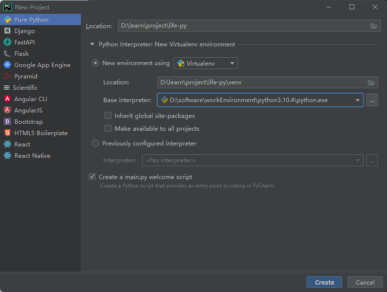
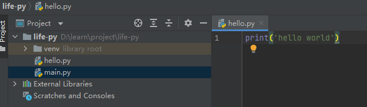
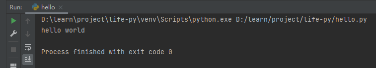
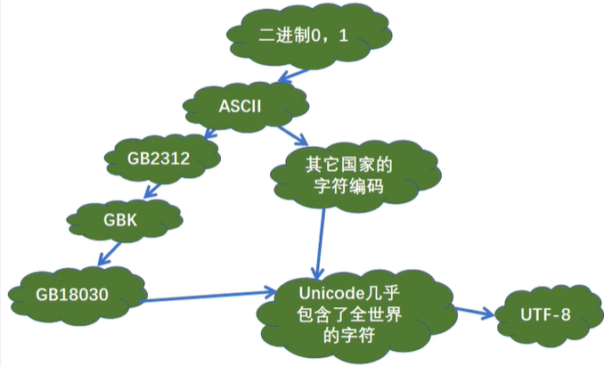
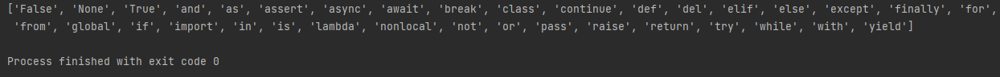
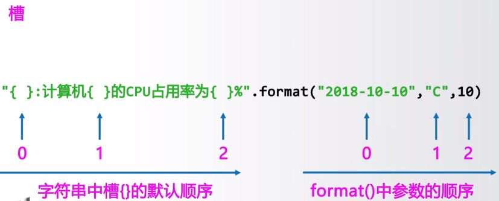
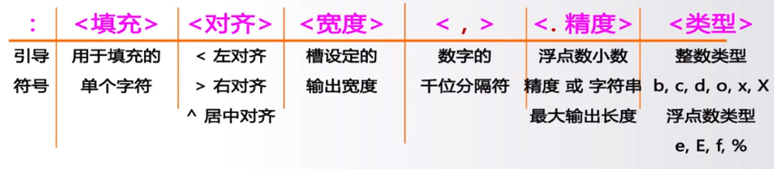
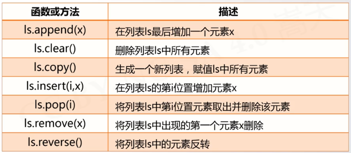
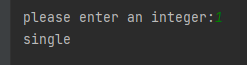
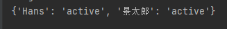

# 基础
[[toc]]

## 开启新的征程



##  Hello Python（输出函数）

输出函数



```python
# 井号是行注释
# 输出字符串
print('hello world')

print("hello world")

# 含有运算符表达式
print(3 + 1)

# 将数据输出到文件中
fp = open('./text.txt','a+') # a+就是没有这个文件就创建
print('hello world',file=fp)
fp.close()

# 不换行输出
print('hello','world','Python')
```

右键运行，效果如下




## 转义字符

反斜杠+想要实现的转义功能首字母

```python
\n 换行
\r tab
\t 回车
\b 退一个字符

\ 一个\
\\ 两个\
\' 一个'
```


## 原字符

不希望字符串的转义字符起作用，就使用原字符：在字符串之前加r或R

```python
print(r'hello \n world')
```

> 注意：以后一个字符不能是一个反斜杠


## 二进制与字符编码




```python
print(chr(0b100111001))
```


## 标识符和保留字

查看python中的所有保留字

```python 
import keyword
print(keyword.kwlist)
```



['False', 'None', 'True', 'and', 'as', 'assert', 'async', 'await', 'break', 'class', 'continue', 'def', 'del', 'elif', 'else', 'except', 'finally', 'for', 'from', 'global', 'if', 'import', 'in', 'is', 'lambda', 'nonlocal', 'not', 'or', 'pass', 'raise', 'return', 'try', 'while', 'with', 'yield']

|保留字|作用|
|--|--|
|and||
|as||
|assert||
|break||
|class||
|continue||
|def||
|elif||
|else||
|except||
|finally||
|for||
|from||
|if||
|import||
|in||
|is||
|lambda||
|not||
|or||
|pass||
|raise||
|return||
|try||
|while||
|with||
|yield||
|del||
|global||
|nonlocal||
|True||
|Flase||
|None||

### 标识符

标识符：变量、函数、类、模块和其他对象的名字

规则：

* 包含字母、数字、下划线
* 不能以数字开头
* 不能是保留字
* 严格区分大小写


## 数据类型
### 数字类型

##### 整数类型
与数学中整数概念，没有取值范围限制，有正整数和负整数
标识类型：
1. 十进制
2. 二进制，以0B或0b开头
3. 八进制，以0O或0o开头
4. 十六进制，以0X或0x开头

> pow(x,y)：计算x的y次方，想算多大算多大
#### 浮点类型
与数学中实数的概念一致，带有小数点及小数的数字
浮点数值范围和小数精度都存在限制，但常规计算可忽略

原因
> 取值范围数量级约为
> $$-10^{308} 至 10^{308}$$
> 精度数量级，53位二进制
> $$10^{-16}$$

使用注意
> 浮点间的运算存在不确定尾数问题
> round(x,d)：对x四舍五入，d是小数截取位数

科学计数法表示
$$
<a>e<b>表示 a * 10^b
$$

#### 复数类型

#### 操作运算符
 * a+b：加法
 * \a-b：减法
 * a\*b：乘法
 * a/b：除法
 * a//b：整除
 * +a：
 * -a：a的负值
 * a%b：余数
 * a \*\* b：幂运算，a的b此幂。b是小数时开方运算
 * a+=b：a = a+b
 * a-=b：a = a-b
 * a\*=b：a = a*b
 * a/=b：a = a/b
 * a//=b：a = a//b
 * a%=b：a = a%b
 * a\*\*=b：a = a\*\*b

> 不同类型数字运算生成结果为“最宽”类型。整数=>浮点数=>复数

#### 数值运算函数
* abs(x)：x的绝对值
* divmod(x,y)：商余，同时输出商和余数。结果为二元数组
* pow(x,y\[,z\])：幂余，z可省略。等价于(x\*\*y)%z
* round(x\[,d\])：四舍五入，默认是保留0位小数
* max(x1,x2,...,xn)：最大
* min(x1,x2,...,xn)：最小
* int(x)：将x变成整数。小数或字符串变成数字
* float(x)：将x变成浮点数
* complex(x)：将x变成复数，增加虚数部分

### 字符串类型
字符串序号体系

* 索引：返回字符串中单个字符`tempStr[-1]`
* 切片：返回字符串中一段字符子串 `TempStr[0,-1]`
	* <字符串>\[M:N\]，缺失M表示至开头，缺失N表示至结尾
	* <字符串>\[M:N:K\]，根据步长对字符串切片。K为-1时可以逆序字符串

两类四种表示方法
1. 一对单引号或双引号，只能表示单行字符串
2. 一对三单引号或一对三双引号，可表示多行字符串

#### 操作符
* x + y ：形成一个新的字符串
* x * n：复制n次字符串x
* x in s：如果x是s的子串，就返回True，否则返回False

#### 处理函数
* len(x)：长度，返回字符串x的长度
* str(x)：任意类型x所对应的字符串形式
* hex(x)或oct(x)：整数x的十六进制或八进制小写形式字符串
* chr(u)和ord(x)：u为Unicode编码返回字符格式。x为字符格式，返回对应的Unicode编码

#### 方法
* .lower()或.upper()：全大写或全消息
* .split(sep=None)：切割方法，返回一个列表
* .count(sub)：返回子串sub在str个数
* .replace(old, new)：返回字符串的副本，替换
* .center(width\[,fillchar\])：字符串str根据宽度with居中，fillchar填充
* .strip(chars)：从str中去掉其中在左侧和右侧chars中列出的字符
* .join(iter)：在iter变量除最后元素外每个元素后增加一个str

#### 字符串类型的格式化
 

### 组合数据类型
#### 集合类型
1. 集合类型定义： 多个元素的无序组合，元素之间没有顺序，不存在相同元素，不可变
	用{}标识
	```python
	# 使用{}建立集合
	A = {"python",123,("python",123)}
	# 使用set()建立集合
	B = set("pypy123")
	
	# 生成后只有2个元素 "python", 123
	C = {"python", 123, "python", 123}
	```
2. 集合操作符
	* S | T：并
	* S - T：差
	* S & T：交
	* S ^ T：补
	* S <= T 或 S < T ： 返回True/False，判断S和T的子集关系
	* S >= T 或 S > T ：返回True/False，判断S和T的包含关系
	增强操作符，通过操作符更新集合S
	* S |= T
	* S -= T
	* S &= T
	* S ^= T

3. 集合处理方法
	* .add(x)：如果x不在集合S中，将x增加到S
	* .discard(x)：移除S中元素x，如果x不在集合S中，不报错
	* remove(x)：移除S中元素x，如果不在抛出KeyError异常
	* clear()：移除S中所有元素
	* .pop()：随机弹出一个元素，更新S，若S为空报KeyError异常
	* .copy()：返回集合S的一个副本
	* len(S)：返回集合S的元素个数
	* x in S：判断S中元素x，x在集合S中返回True，否则返回False
	* x not in S：判断x不在S中
	* set(x)：将其他类型变量x转换为集合类型

4. 集合类型应用场景
	数据去重

#### 序列类型
具有先后关系的一组序列，可以使用下标返回。序列是基类，一般用他衍生出来的类型：字符串、列表、元组。
有正向递增和反向递减序号
* in
* not in
* s + t
* s * n
* 索引
* 切片

函数和方法
* len()
* min() ：要课比较
* max()：要可比较
##### 列表类型
用`[]`表示，采用逗号分隔元素。可以随意修改。也可以用list()创建



可以使用in片段一个元素是否在列表中
##### 元组类型
创建后不可修改，用()表示，用逗号隔开 。

### 字典类型

{}包裹，用逗号分割一个个键值对数据，可也以使用dict()创建

操作
.keys() 返回键的列表，可以用for in来操作，但不能当列表来操作
.values() 返回值的列表，可以用for in来操作，但不能当列表来操作
.item() 返回字典所有键值对的信息
.get(k, \<default \>) 键k存在，返回响应的值，k不存在返回 default 值
.pop(k, \<default \>) 键k存在，取出相应值并返回，不存在返回 default 值
.popitem() 随机从字典中取出一个键值对，以元组形式返回
.clear() 删除所有键值对
del d\[k\] 删除字典d中键k对应的数据值
in 判断是否在字典里
len(d) 返回字典d中元素的个数
## 输入输出
### 输入
格式为：
<变量> = input(<提示信息字符串>)
```python
TempStr = input("请输入温度")
```
### 输出

#### 语法
print(<拟输出字符串或字符串变量>)

```python
print('hello python')
```

#### 格式化输出
{}标识槽，后续变量填充到槽中
```python
print("转换后的温度是{:.2f}C".format(1.2323212))
```

#### 不换行
> print()中增加end=""参数表示输出后不增加换行，多个print()可以连续输出。

### 重置

前面加上\\r，作用是在打印字符串之前使光标退回到当前行的行首
## 流程控制工具

### if语句

```python
x = int (input("please enter an integer:"))
if x < 0:
    x = 0
    print("Negative changed to zero")
elif x == 0:
    print('Zero')
elif x == 1:
    print("single")
else:
    print('More')
```



if 语句包含零个或多个 `elif`子句及可选的 `else`子句。关键字 '`elif`' 是 'else if' 的缩写，适用于避免过多的缩进。`if` ... `elif` ... `elif` ... 序列可以当作其他语言中 `switch` 或 `case` 语句的替代品。

### for语句

Python 的 `for` 语句不迭代算术递增数值（如 Pascal），或是给予用户定义迭代步骤和暂停条件的能力（如 C），而是迭代列表或字符串等任意序列，元素的迭代顺序与在序列中出现的顺序一致。 例如：

```python
import keyword
for w in keyword.kwlist:
    print(w,len(w))
```

遍历集合时修改集合的内容，会很容易生成错误的结果。因此不能直接进行循环，而是应遍历该集合的副本或创建新的集合：

```python
users = {'Hans': 'active', 'Éléonore': 'inactive', '景太郎': 'active'}
for user,status in users.copy().items():
    if status == 'inactive':
        del users[user]
print(users)
```

这里user,status会相当于一次获取2个元素分别给到user和status



### range()函数

内置函数 `range()` 常用于遍历数字序列，该函数可以生成算术级数：

```python
for i in range(5):
    print(i)

>>>
0
1
2
3
4
```

生成的序列不包含给定的终止数值；`range(10)` 生成 10 个值，这是一个长度为 10 的序列，其中的元素索引都是合法的。range 可以不从 0 开始，还可以按指定幅度递增（递增幅度称为 '步进'，支持负数）：

```python
list(range(5, 10))
# [5, 6, 7, 8, 9]
list(range(0, 10, 3))
# [0, 3, 6, 9]
list(range(-10, -100, -30))
# [-10, -40, -70]
```

`range()` 和 `len()`组合在一起，可以按索引迭代序列：

```python
a = ['Mary', 'had', 'a', 'little', 'lamb']
for i in range(len(a)):
    print(i,a[i])
>>>
0 Mary
1 had
2 a
3 little
4 lamb
```

不过，大多数情况下，[`enumerate()`](https://docs.python.org/zh-cn/3.10/library/functions.html#enumerate) 函数更便捷

如果只输出 range，会出现意想不到的结果：

```
>>> range(10)
range(0, 10)
```

range()返回对象的操作和列表很像，但其实这两种对象不是一回事。迭代时，该对象基于所需序列返回连续项，并没有生成真正的列表，从而节省了空间。

这种对象称为可迭代对象 iterable，函数或程序结构可通过该对象获取连续项，直到所有元素全部迭代完毕。`for`语句就是这样的架构，`sum()`是一种把可迭代对象作为参数的函数：

```
>>> sum(range(4))  # 0 + 1 + 2 + 3
6
```

### while循环
```python
while <条件> :
	<语句块>
```
### 循环中的break、continue语句及else子句

break语句和C中类似，用于跳出最近的for或while循环

循环语句支持else子句；for循环中，可迭代对象中的元素全部循环完毕，或while循环的条件为假时，执行该子句；break语句终止循环时，不执行该子句。

```python
for n in range(2,10):
    for x in range(2,n):
        if n % x == 0:
            print(n,'equals',x,'*',n//x)
            break
    else:
        print(n,'is a prime number')
        
>>>
2 is a prime number
3 is a prime number
4 equals 2 * 2
5 is a prime number
6 equals 2 * 3
7 is a prime number
8 equals 2 * 4
9 equals 3 * 3

```

（没错，这段代码就是这么写。仔细看：else 子句属于 for 循环，不属于 if 语句。）

与 if 语句相比，循环的 else 子句更像 try 的 else 子句： try 的 else 子句在未触发异常时执行，循环的 else 子句则在未运行 break 时执行。

> else语句块作为“正常”完成循环的奖励

continue 语句也借鉴自 C 语言，表示继续执行循环的下一次迭代：

```python
for num in range(2,10):
    if num % 2 == 0:
        print("Found an even number", num)
        continue
    print("Found an odd number", num)
>>>
Found an even number 2
Found an odd number 3
Found an even number 4
Found an odd number 5
Found an even number 6
Found an odd number 7
Found an even number 8
Found an odd number 9
```

### pass语句

语句不执行任何操作。语法上需要一个语句，但程序不实际执行任何动作时，可以使用该语句。

例如：

```
>>> while True:
...     pass  # Busy-wait for keyboard interrupt (Ctrl+C)
...
```

下面这段代码创建了一个最小的类：

```
>>> class MyEmptyClass:
...     pass
...
```

`pass`还可以用作函数或条件子句的占位符，让开发者聚焦更抽象的层次。此时，程序直接忽略 `pass`：

```
>>> def initlog(*args):
...     pass   # Remember to implement this!
...
```

### match语句

最简单的形式是将一个目标值与一个或多个字面值进行比较：

```python
def http_error(status):
    match status:
        case 400:
            return "Bad request"
        case 404:
            return "Not found"
        case 418:
            return "I'm a teapot"
        case 401 | 403 | 404:
    		return "Not allowed"
        case _:
            return "Something's wrong with the internet"
```

注意最后一个代码块：“变量名” `_` 被作为 *通配符* 并必定会匹配成功。 如果没有 case 语句匹配成功，则不会执行任何分支。

使用 `|` （“ or ”）在一个模式中可以组合多个字面值：

模式的形式类似解包赋值，并可被用于绑定变量：

```python
# point is an (x, y) tuple
match point:
    case (0, 0):
        print("Origin")
    case (0, y):
        print(f"Y={y}")
    case (x, 0):
        print(f"X={x}")
    case (x, y):
        print(f"X={x}, Y={y}")
    case _:
        raise ValueError("Not a point")
```

请仔细研究此代码！ 第一个模式有两个字面值，可以看作是上面所示字面值模式的扩展。但接下来的两个模式结合了一个字面值和一个变量，而变量 **绑定** 了一个来自目标的值（`point`）。第四个模式捕获了两个值，这使得它在概念上类似于解包赋值 `(x, y) = point`。

如果使用类实现数据结构，可在类名后加一个类似于构造器的参数列表，这样做可以把属性放到变量里：

```python
class Point:
    x: int
    y: int

def where_is(point):
    match point:
        case Point(x=0, y=0):
            print("Origin")
        case Point(x=0, y=y):
            print(f"Y={y}")
        case Point(x=x, y=0):
            print(f"X={x}")
        case Point():
            print("Somewhere else")
        case _:
            print("Not a point")
```

可在 dataclass 等支持属性排序的内置类中使用位置参数。还可在类中设置 `__match_args__` 特殊属性为模式的属性定义指定位置。如果它被设为 ("x", "y")，则以下模式均为等价的，并且都把 `y` 属性绑定到 `var` 变量：

```
Point(1, var)
Point(1, y=var)
Point(x=1, y=var)
Point(y=var, x=1)
```

读取模式的推荐方式是将它们看做是你会在赋值操作左侧放置的内容的扩展形式，以便理解各个变量将会被设置的值。 只有单独的名称（例如上面的 `var`）会被 match 语句所赋值。 带点号的名称 (例如 `foo.bar`)、属性名称（例如上面的 `x=` 和 `y=`）或类名称（通过其后的 "(...)" 来识别，例如上面的 `Point`）都绝不会被赋值。

模式可以任意地嵌套。例如，如果有一个由点组成的短列表，则可使用如下方式进行匹配：

```python
match points:
    case []:
        print("No points")
    case [Point(0, 0)]:
        print("The origin")
    case [Point(x, y)]:
        print(f"Single point {x}, {y}")
    case [Point(0, y1), Point(0, y2)]:
        print(f"Two on the Y axis at {y1}, {y2}")
    case _:
        print("Something else")
```

为模式添加成为守护项的 `if` 子句。如果守护项的值为假，则 `match` 继续匹配下一个 case 语句块。注意，值的捕获发生在守护项被求值之前：

```python
match point:
    case Point(x, y) if x == y:
        print(f"Y=X at {x}")
    case Point(x, y):
        print(f"Not on the diagonal")
```

match 语句的其他特性：

- 与解包赋值类似，元组和列表模式具有完全相同的含义，并且实际上能匹配任意序列。 但它们不能匹配迭代器或字符串。

- 序列模式支持扩展解包操作：`[x, y, *rest]` 和 `(x, y, *rest)` 的作用类似于解包赋值。 在 `*` 之后的名称也可以为 `_`，因此，`(x, y, *_)` 可以匹配包含至少两个条目的序列，而不必绑定其余的条目。

- Mapping patterns: `{"bandwidth": b, "latency": l}` captures the `"bandwidth"` and `"latency"` values from a dictionary. Unlike sequence patterns, extra keys are ignored. An unpacking like `**rest` is also supported. (But `**_` would be redundant, so it is not allowed.)

- 使用 `as` 关键字可以捕获子模式：

  ```python
  case (Point(x1, y1), Point(x2, y2) as p2): ...
  ```

  将把输入的第二个元素捕获为 `p2` (只要输入是包含两个点的序列)

- 大多数字面值是按相等性比较的，但是单例对象 `True`, `False` 和 `None` 则是按标识号比较的。

- 模式可以使用命名常量。 这些命名常量必须为带点号的名称以防止它们被解读为捕获变量:

  ```python
  from enum import Enum
  class Color(Enum):
      RED = 'red'
      GREEN = 'green'
      BLUE = 'blue'
  
  color = Color(input("Enter your choice of 'red', 'blue' or 'green': "))
  
  match color:
      case Color.RED:
          print("I see red!")
      case Color.GREEN:
          print("Grass is green")
      case Color.BLUE:
          print("I'm feeling the blues :(")
  ```

### 程序异常处理

```python
try:
	<语句块1>
except <异常类型，可以省略>: 
	<语句块1>
```

高级用法
```python
try:
	<语句块>
except:
	<语句块，发生异常执行>
else:
	<语句块，不发生异常执行>
finally:
	<语句块，发不发生异常都执行>
```
## 定义函数

定义函数的关键字`def`，后跟函数名与货号内的形参列表。

```python
def fib(n):    # write Fibonacci series up to n
    """Print a Fibonacci series up to n."""
     a, b = 0, 1
     while a < n:
         print(a, end=' ')
         a, b = b, a+b
     print()
```

return语句返回函数的值。return语句不带表达式参数时，返回None。函数执行完毕退出也返回None

函数的调用obj.methodname，obj是对象（也可以是表达式），methodname是对象类型定义的方法名。不同类型定义不同的方法，不同类型的方法名可以相同，且不会引起歧义。

### 默认值参数

为参数指定默认值非常有用。调用函数时，可以使用比定义时更少的参数：

```python
def ask_ok(prompt, retries=4, reminder='Please try again!'):
    while True:
        ok = input(prompt)
        if ok in ('y', 'ye', 'yes'):
            return True
        if ok in ('n', 'no', 'nop', 'nope'):
            return False
        retries = retries - 1
        if retries < 0:
            raise ValueError('invalid user response')
        print(reminder)
```

该函数可以用以下方式调用：

- 只给出必选实参：`ask_ok('Do you really want to quit?')`
- 给出一个可选实参：`ask_ok('OK to overwrite the file?', 2)`
- 给出所有实参：`ask_ok('OK to overwrite the file?', 2, 'Come on, only yes or no!')`

本例还使用了关键字 `in`，用于确认序列中是否包含某个值。

默认值在 *定义* 作用域里的函数定义中求值。

**重要警告：** 默认值只计算一次。默认值为列表、字典或类实例等可变对象时，会产生与该规则不同的结果。

### 关键字参数

kwarg=value 形式的 关键字参数 也可以用于调用函数。函数示例如下：

```python

def parrot(voltage, state='a stiff', action='voom', type='Norwegian Blue'):
    print("-- This parrot wouldn't", action, end=' ')
    print("if you put", voltage, "volts through it.")
    print("-- Lovely plumage, the", type)
    print("-- It's", state, "!")
```

该函数接受一个必选参数（`voltage`）和三个可选参数（`state`, `action` 和 `type`）。该函数可用下列方式调用：

```
parrot(1000)                                          # 1 positional argument
parrot(voltage=1000)                                  # 1 keyword argument
parrot(voltage=1000000, action='VOOOOOM')             # 2 keyword arguments
parrot(action='VOOOOOM', voltage=1000000)             # 2 keyword arguments
parrot('a million', 'bereft of life', 'jump')         # 3 positional arguments
parrot('a thousand', state='pushing up the daisies')  # 1 positional, 1 keyword
```

以下调用函数的方式都无效：

```
parrot()                     # required argument missing
parrot(voltage=5.0, 'dead')  # non-keyword argument after a keyword argument
parrot(110, voltage=220)     # duplicate value for the same argument
parrot(actor='John Cleese')  # unknown keyword argument
```

函数调用时，关键字参数必须跟在位置参数后面。所有传递的关键字参数都必须匹配一个函数接受的参数（比如，`actor` 不是函数 `parrot` 的有效参数），关键字参数的顺序并不重要。这也包括必选参数，（比如，`parrot(voltage=1000)` 也有效）。不能对同一个参数多次赋值，下面就是一个因此限制而失败的例子：

```python
>>> def function(a):
...     pass
...
>>> function(0, a=0)
Traceback (most recent call last):
  File "<stdin>", line 1, in <module>
TypeError: function() got multiple values for argument 'a'
```

最后一个形参为 `**name` 形式时，接收一个字典（详见 [映射类型 --- dict](https://docs.python.org/zh-cn/3.10/library/stdtypes.html#typesmapping)），该字典包含与函数中已定义形参对应之外的所有关键字参数。`**name` 形参可以与 `*name` 形参（下一小节介绍）组合使用（`*name` 必须在 `**name` 前面）， `*name` 形参接收一个 [元组](https://docs.python.org/zh-cn/3.10/tutorial/datastructures.html#tut-tuples)，该元组包含形参列表之外的位置参数。例如，可以定义下面这样的函数：

```python
def cheeseshop(kind, *arguments, **keywords):
    print("-- Do you have any", kind, "?")
    print("-- I'm sorry, we're all out of", kind)
    for arg in arguments:
        print(arg)
    print("-" * 40)
    for kw in keywords:
        print(kw, ":", keywords[kw])
```

该函数可以用如下方式调用：

```
cheeseshop("Limburger", "It's very runny, sir.",
           "It's really very, VERY runny, sir.",
           shopkeeper="Michael Palin",
           client="John Cleese",
           sketch="Cheese Shop Sketch")
```

输出结果如下：

```
-- Do you have any Limburger ?
-- I'm sorry, we're all out of Limburger
It's very runny, sir.
It's really very, VERY runny, sir.
----------------------------------------
shopkeeper : Michael Palin
client : John Cleese
sketch : Cheese Shop Sketch
```

注意，关键字参数在输出结果中的顺序与调用函数时的顺序一致。

### 特殊参数

默认情况下，参数可以按位置或显式关键字传递给 Python 函数。为了让代码易读、高效，最好限制参数的传递方式，这样，开发者只需查看函数定义，即可确定参数项是仅按位置、按位置或关键字，还是仅按关键字传递。

函数定义如下：

```python
def f(pos1, pos2, /, pos_or_kwd, *, kwd1, kwd2):
      -----------    ----------     ----------
        |             |                  |
        |        Positional or keyword   |
        |                                - Keyword only
         -- Positional only
```

`/` 和 `*` 是可选的。这些符号表明形参如何把参数值传递给函数：位置、位置或关键字、关键字。关键字形参也叫作命名形参。


* 位置或关键字参数：函数定义中未使用 `/` 和 `*` 时，参数可以按位置或关键字传递给函数。
* 位置参数：特定形参可以标记为 *仅限位置*。*仅限位置* 时，形参的顺序很重要，且这些形参不能用关键字传递。仅限位置形参应放在 `/` （正斜杠）前。`/` 用于在逻辑上分割仅限位置形参与其它形参。如果函数定义中没有 `/`，则表示没有仅限位置形参。`/` 后可以是 *位置或关键字* 或 *仅限关键字* 形参。
* 关键字参数：把形参标记为 *仅限关键字*，表明必须以关键字参数形式传递该形参，应在参数列表中第一个 *仅限关键字* 形参前添加 `*`。

#### 使用示例

请看下面的函数定义示例，注意 `/` 和 `*` 标记：

\>>>

```python
>>> def standard_arg(arg):
...     print(arg)
...
>>> def pos_only_arg(arg, /):
...     print(arg)
...
>>> def kwd_only_arg(*, arg):
...     print(arg)
...
>>> def combined_example(pos_only, /, standard, *, kwd_only):
...     print(pos_only, standard, kwd_only)
```

第一个函数定义 `standard_arg` 是最常见的形式，对调用方式没有任何限制，可以按位置也可以按关键字传递参数：

\>>>

```python
>>> standard_arg(2)
2

>>> standard_arg(arg=2)
2
```

第二个函数 `pos_only_arg` 的函数定义中有 `/`，仅限使用位置形参：

\>>>

```python
>>> pos_only_arg(1)
1

>>> pos_only_arg(arg=1)
Traceback (most recent call last):
  File "<stdin>", line 1, in <module>
TypeError: pos_only_arg() got some positional-only arguments passed as keyword arguments: 'arg'
```

第三个函数 `kwd_only_args` 的函数定义通过 `*` 表明仅限关键字参数：

\>>>

```python
>>> kwd_only_arg(3)
Traceback (most recent call last):
  File "<stdin>", line 1, in <module>
TypeError: kwd_only_arg() takes 0 positional arguments but 1 was given

>>> kwd_only_arg(arg=3)
3
```

最后一个函数在同一个函数定义中，使用了全部三种调用惯例：

\>>>

```python
>>> combined_example(1, 2, 3)
Traceback (most recent call last):
  File "<stdin>", line 1, in <module>
TypeError: combined_example() takes 2 positional arguments but 3 were given

>>> combined_example(1, 2, kwd_only=3)
1 2 3

>>> combined_example(1, standard=2, kwd_only=3)
1 2 3

>>> combined_example(pos_only=1, standard=2, kwd_only=3)
Traceback (most recent call last):
  File "<stdin>", line 1, in <module>
TypeError: combined_example() got some positional-only arguments passed as keyword arguments: 'pos_only'
```

下面的函数定义中，`kwds` 把 `name` 当作键，因此，可能与位置参数 `name` 产生潜在冲突：

```python
def foo(name, **kwds):
    return 'name' in kwds
```

调用该函数不可能返回 `True`，因为关键字 `'name'` 总与第一个形参绑定。例如：

\>>>

```python
>>> foo(1, **{'name': 2})
Traceback (most recent call last):
  File "<stdin>", line 1, in <module>
TypeError: foo() got multiple values for argument 'name'
>>>
```

加上 `/` （仅限位置参数）后，就可以了。此时，函数定义把 `name` 当作位置参数，`'name'` 也可以作为关键字参数的键：

```python
def foo(name, /, **kwds):
    return 'name' in kwds
>>> foo(1, **{'name': 2})
True
```

换句话说，仅限位置形参的名称可以在 `**kwds` 中使用，而不产生歧义。

### 作用范围

* 组合数据类型如果在函数中没有被创建，那么使用的是全局变量
* 组合数据类型如果在函数中被创建，那么使用的不是是全局变量
### 常用的函数
#### 评估函数eval()
去掉参数最外侧引号并执行余下的语句的函数。

> 能将任何字符串形式的信息变成python语句

```python
eval("1") # 数字1
eval("1+2") # 数字3
eval('"1+2"') # 字符串'1+2'
```

## 解包实参列表

函数调用要求独立的位置参数，但实参在列表或元组里时，要执行相反的操作。例如，内置的 [`range()`](https://docs.python.org/zh-cn/3.10/library/stdtypes.html#range) 函数要求独立的 *start* 和 *stop* 实参。如果这些参数不是独立的，则要在调用函数时，用 `*` 操作符把实参从列表或元组解包出来：

\>>>

```python
>>> list(range(3, 6))            # normal call with separate arguments
[3, 4, 5]
>>> args = [3, 6]
>>> list(range(*args))            # call with arguments unpacked from a list
[3, 4, 5]
```

同样，字典可以用 `**` 操作符传递关键字参数：

\>>>

```python
>>> def parrot(voltage, state='a stiff', action='voom'):
...     print("-- This parrot wouldn't", action, end=' ')
...     print("if you put", voltage, "volts through it.", end=' ')
...     print("E's", state, "!")
...
>>> d = {"voltage": "four million", "state": "bleedin' demised", "action": "VOOM"}
>>> parrot(**d)
-- This parrot wouldn't VOOM if you put four million volts through it. E's bleedin' demised !
```

## Lambda表达式

[`lambda`](https://docs.python.org/zh-cn/3.10/reference/expressions.html#lambda) 关键字用于创建小巧的匿名函数。`lambda a, b: a+b` 函数返回两个参数的和。Lambda 函数可用于任何需要函数对象的地方。在语法上，匿名函数只能是单个表达式。在语义上，它只是常规函数定义的语法糖。与嵌套函数定义一样，lambda 函数可以引用包含作用域中的变量：

```
>>> def make_incrementor(n):
...     return lambda x: x + n
...
>>> f = make_incrementor(42)
>>> f(0)
42
>>> f(1)
43
```

上例用 lambda 表达式返回函数。还可以把匿名函数用作传递的实参：

```
>>> pairs = [(1, 'one'), (2, 'two'), (3, 'three'), (4, 'four')]
>>> pairs.sort(key=lambda pair: pair[1])
>>> pairs
[(4, 'four'), (1, 'one'), (3, 'three'), (2, 'two')]
```

## 文档字符串

以下是文档字符串内容和格式的约定。

第一行应为对象用途的简短摘要。为保持简洁，不要在这里显式说明对象名或类型，因为可通过其他方式获取这些信息（除非该名称碰巧是描述函数操作的动词）。这一行应以大写字母开头，以句点结尾。

文档字符串为多行时，第二行应为空白行，在视觉上将摘要与其余描述分开。后面的行可包含若干段落，描述对象的调用约定、副作用等。

Python 解析器不会删除 Python 中多行字符串字面值的缩进，因此，文档处理工具应在必要时删除缩进。这项操作遵循以下约定：文档字符串第一行 *之后* 的第一个非空行决定了整个文档字符串的缩进量（第一行通常与字符串开头的引号相邻，其缩进在字符串中并不明显，因此，不能用第一行的缩进），然后，删除字符串中所有行开头处与此缩进“等价”的空白符。不能有比此缩进更少的行，但如果出现了缩进更少的行，应删除这些行的所有前导空白符。转化制表符后（通常为 8 个空格），应测试空白符的等效性。

### 文件的使用
文件是数据的抽象和集合
* 由单一特定编码组成的文件，如UTF-8
* 由于存在编码，也被看成是存储着长字符串

#### 文件的打开关闭
文件的操作步骤：打开-操作-关闭

```python
# 打开 第一个参数文件的路径，第二个参数打开模式。赋值给一个变量称为句柄
# 一般用 / 代替 路径中的 \ 
a = open('a.txt') # 只能读不能写
a = open('a.txt', 'rt') # 只能读不能写，与上面一个意思
a = open('a.txt', 'w') # 覆盖写
a = open('a.txt', 'a+') # 追加写且程序能够读取文件
a = open('a.txt', 'x') # 创建写
a = open('a.txt', 'b') # 二进制读
a = open('a.txt', 'wb') # 二进制写覆盖模式

a.read(size)
a.readline(size)
a.readlines(hint)

a.write(s)
a.writelines(lines)
a.seek(offset)

# 文件关闭
a.close()
```

* ‘r’ ：只读模式，默认值。如果文件不存在，返回FileNotFoundError
*  ‘w’：覆盖写模式，文件不存在则创建，存在则完全覆盖
* ‘x’：创建写模式，文件不存在则创建，文件存在，则返回FileExistsError
* ‘a’：追增写模式，文件不存在则创建，存在则在文件后面追加
* ‘b’：二进制文件模式
* ‘t’：文本文件模式，默认值
* ‘+’：与r/w/x/a一同使用，在原功能的基础上增加同时读写功能

#### 文件内容的读取
* .read(size=-1)：读入全部内容，如果给出参数，读取前size长度
* .readline(size=-1)：读入一行，如果给出参数，读入该行前size长度
* readlines(hint=-1)：读入文件所有行，以每行为元素形成列表，如果给出参数，读入前hint行
#### 数据的文件写
 * .write(s)：向文件写入一个字符串或字符流
 * .writelines(lines)：将一个元素权威字符串的列表写入文件
 * .seek(offset)：改变当前文件操作指针的位置，offset含义0-文件开头；1-当前位置；2-文件结尾

## 函数注解

[函数注解](https://docs.python.org/zh-cn/3.10/reference/compound_stmts.html#function) 是可选的用户自定义函数类型的元数据完整信息（详见 [**PEP 3107**](https://www.python.org/dev/peps/pep-3107) 和 [**PEP 484**](https://www.python.org/dev/peps/pep-0484) ）。

[标注](https://docs.python.org/zh-cn/3.10/glossary.html#term-function-annotation) 以字典的形式存放在函数的 `__annotations__` 属性中，并且不会影响函数的任何其他部分。 形参标注的定义方式是在形参名后加冒号，后面跟一个表达式，该表达式会被求值为标注的值。 返回值标注的定义方式是加组合符号 `->`，后面跟一个表达式，该标注位于形参列表和表示 [`def`](https://docs.python.org/zh-cn/3.10/reference/compound_stmts.html#def) 语句结束的冒号之间。 下面的示例有一个必须的参数，一个可选的关键字参数以及返回值都带有相应的标注:

```python
>>> def f(ham: str, eggs: str = 'eggs') -> str:
...     print("Annotations:", f.__annotations__)
...     print("Arguments:", ham, eggs)
...     return ham + ' and ' + eggs
...
>>> f('spam')
Annotations: {'ham': <class 'str'>, 'return': <class 'str'>, 'eggs': <class 'str'>}
Arguments: spam eggs
'spam and eggs'
```


## 模块

退出 Python 解释器后，再次进入时，之前在 Python 解释器中定义的函数和变量就丢失了。因此，编写较长程序时，建议用文本编辑器代替解释器，执行文件中的输入内容，这就是编写 *脚本* 。随着程序越来越长，为了方便维护，最好把脚本拆分成多个文件。编写脚本还一个好处，不同程序调用同一个函数时，不用每次把函数复制到各个程序。

为实现这些需求，Python 把各种定义存入一个文件，在脚本或解释器的交互式实例中使用。这个文件就是 *模块* ；模块中的定义可以 *导入* 到其他模块或 *主* 模块（在顶层和计算器模式下，执行脚本中可访问的变量集）。

模块是包含 Python 定义和语句的文件。其文件名是模块名加后缀名 `.py` 。在模块内部，通过全局变量 `__name__` 可以获取模块名（即字符串）。例如，用文本编辑器在当前目录下创建 `fibo.py` 文件，输入以下内容：

```python
# Fibonacci numbers module

def fib(n):    # write Fibonacci series up to n
    a, b = 0, 1
    while a < n:
        print(a, end=' ')
        a, b = b, a+b
    print()

def fib2(n):   # return Fibonacci series up to n
    result = []
    a, b = 0, 1
    while a < n:
        result.append(a)
        a, b = b, a+b
    return result
```

```python
import fibo

fibo.fib(50)
```

```python
from fibo import fib, fib2
fib(500)
```

```
# 少用
from fibo import *
```

```
# 把 as 后的名称与导入模块绑定
import fibo as fib
fib.fib(50)
```

```
from fibo import fib as fibonacci
fibonacci(50)
```

### 以脚本的方式执行模块                       

```
python fibo.py <arguments>
```

这项操作将执行模块里的代码，和导入模块一样，但会把 `__name__` 赋值为 `"__main__"`。 也就是把下列代码添加到模块末尾：

```python
if __name__ == "__main__":
    import sys
    fib(int(sys.argv[1]))
```

既可以把这个文件当脚本使用，也可以用作导入的模块， 因为，解析命令行的代码只有在模块以 “main” 文件执行时才会运行：

```
$ python fibo.py 50
0 1 1 2 3 5 8 13 21 34
```

导入模块时，不运行这些代码：

```
import fibo
```

这种操作常用于为模块提供便捷用户接口，或用于测试（把模块当作执行测试套件的脚本运行）。
### import基础语法

import <库名>

> 不会出现函数重名问题

### 使用不用带库名

使用 from和import保留字完成 from <库名> import <函数名> form <库名> import *

## PyInstaller库的使用

将.py文件转换为win或mac的可执行文件
它是一个第三方库，需要额外安装
```cmd
pip install pyinstaller
```

去到.py文件下，进入cmd执行指令
```cmd
pyinstaller -F <文件名.py>
```
常用参数
* -h 帮助
* --clean 清理生成的临时文件
* -D,--onedir 默认值，生成在dist文件夹
* -F,--onefile 在dist文件夹中只生成独立的打包文件
* -i <图标文件名称.ico> 指定打包程序使用图标(ico)文件


## 更大的Python世界

python123.io

python社区 https://pypi.org/  可以搜索任何主题的第三方库

### pip安装方法
99% 以上的安装方法，需要链接网络
```python
pip install -U
pip uninstall
pip download
pip show 
pip search
pip list
```

### 集成安装方法
Anaconda开发集成环境，包含800+依赖环境

### 第三方库文件安装方法
pip下载后需要编译在安装，有的第三方作者没有上传编译后的包

> http://www.lfd.uci.edu/~gohlke/ypthonlibs/

这个网页提供了一匹没有编译的包的安装方法