# python
[[toc]]

## 简介

* 跨平台程序设计语言
* 解释型语言
* 交互式语言
* 面向对象

## 环境安装

### 解析器

https://www.python.org/

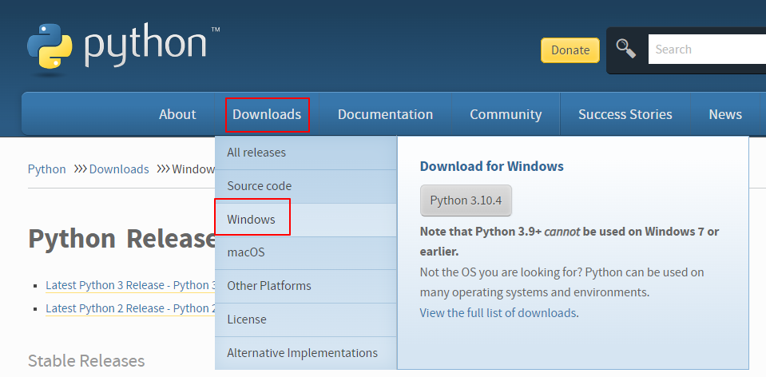

安装windows环境，最新版本吧

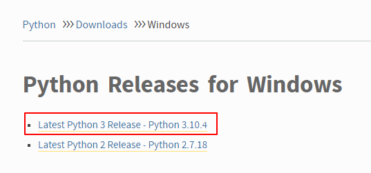

点击进入找到file，我这里操作系统是64位。

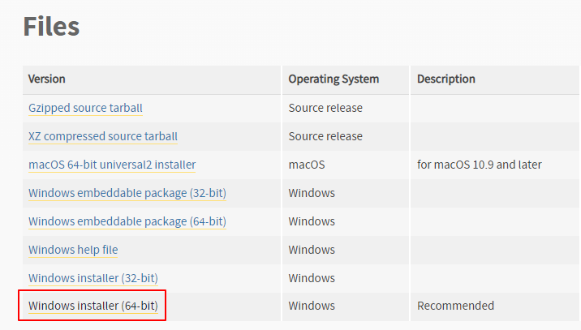

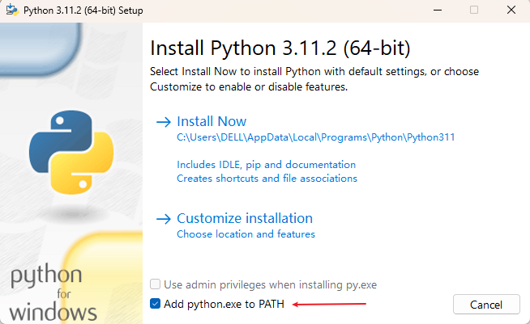

> 特别要注意勾上`Add python.exe to PATH`，然后点“Install Now”即可完成安装。这个截图是我后不补上去的

选择好自己的文件夹，一路向下就好

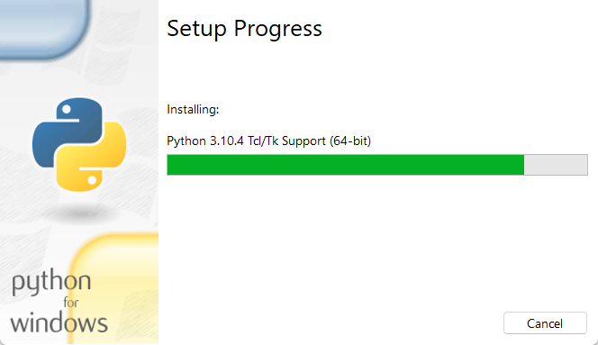

显示这样就成了

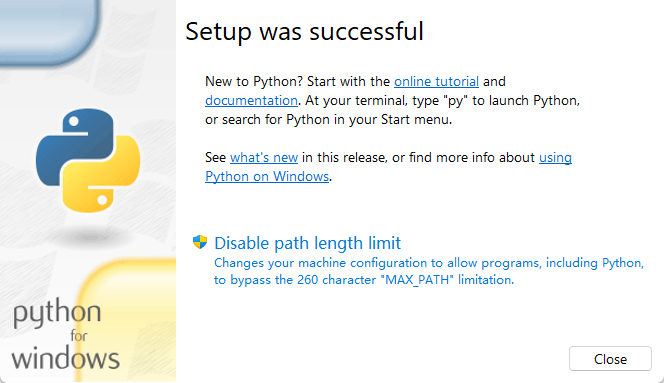

cmd敲python命令会跳转到应用商店，解决办法：在电脑搜索框输入应用执行别名，将应用安装程序取消就可以了，取消之后就可以恢复正常了。
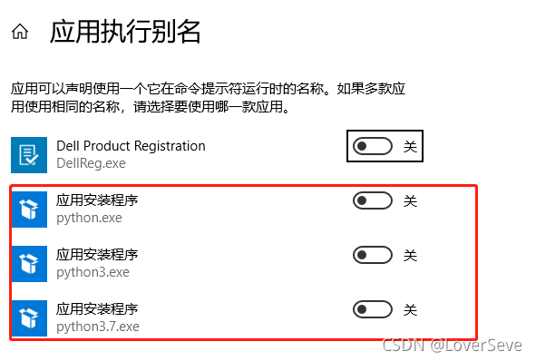
### 初体验

打开这个

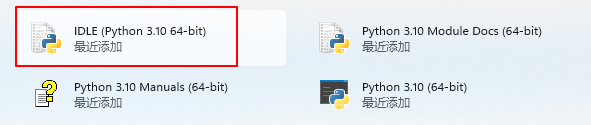

输入

`'hello python'`

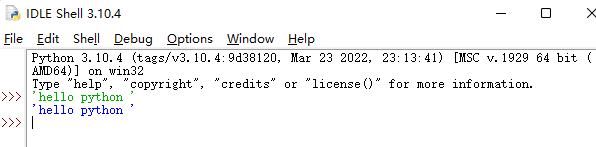

### IDE

使用PyCharm，官网下载即可

https://www.jetbrains.com/pycharm/download/#section=windows

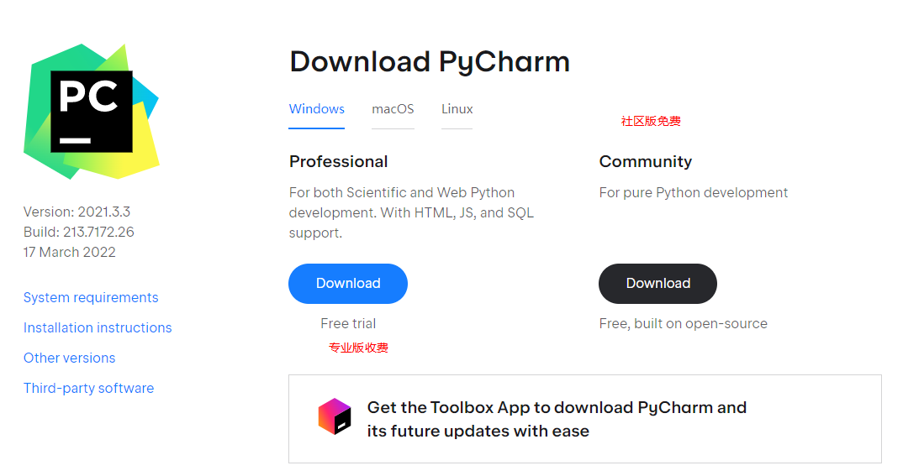

完成安装

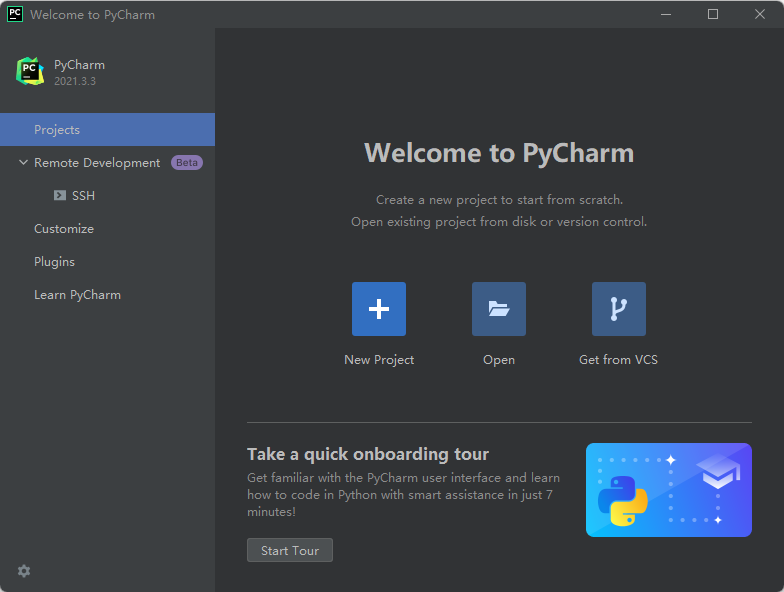

