# Redis环境搭建

## 0.前期准备

### 0.1.使用Xshell链接上服务器
我这里是双十一买了3年的最基础版本的服务器

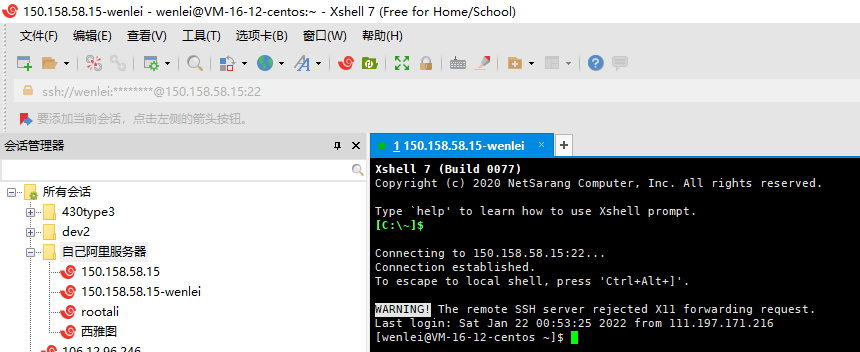

### 0.2.准备服务器环境
在服务器上安装好Docker

## 1.启动体验
### 1.1.查询redis列表
`docker search redis`
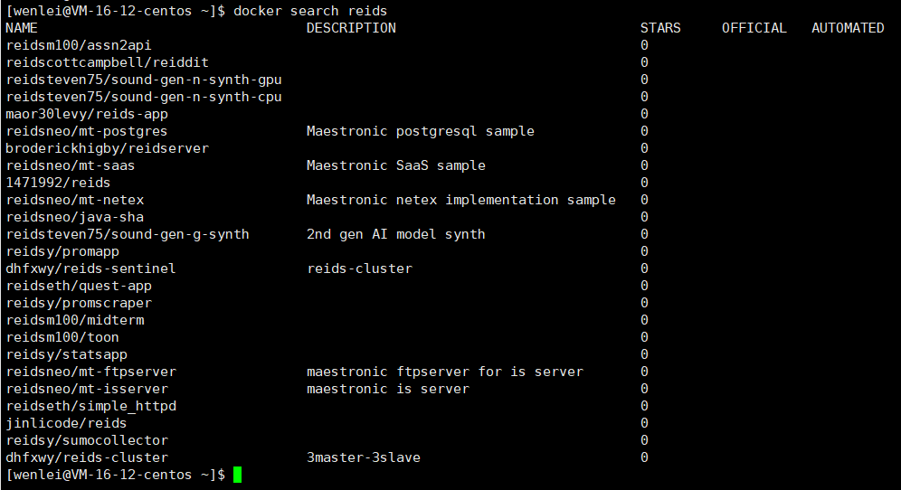

### 1. 2.拉取最新版本
`docker pull redis:latest`
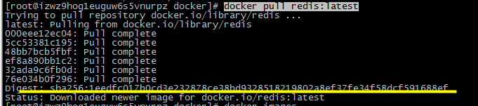
出现如上字样，标志拉去成功

### 1. 3.查看Redis镜像
`docker images` 查看全部镜像命令
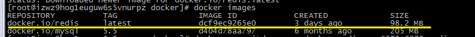

### 1. 4.开始运行Redis
`docker run -itd --name docker-redis -p 6379:6379 redis`
docker-redis为自己命名的docker容器名
-p表示docker6379的端口映射给自己服务器6379端口，这个是必须的不然无法访问
`docker ps` 查看docker运行中的容器，加上-a可以查看所有容器
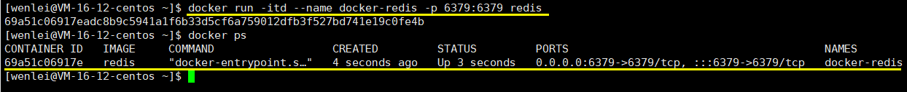

### 1. 5.使用通过 redis-cli 连接测试使用 redis 服务
`docker exec -it docker-redis /bin/bash`
`redis-cli`
`ping`
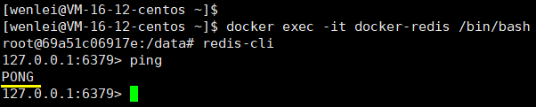
可以看到可以使用redis了
使用`shutdown`退出docker-cli
再使用exit退出

::: tip 提示
如果有密码会提示：(error) NOAUTH Authentication required.
那么使用
$> auth “yourpassword”
ok
来获取权限
:::

## 2.远程链接
上面的方法是可以链接也能使用了，但是说：这个感觉不对呀，我平常不是这样使用的。用的远程连接访问呀！
所以大部分都会采用远程连接的方式，这时就需要使用配置文件启动，方法如下：
### 2.1配置文件准备
先从redis的官网吧配置文件下载下来 [点击这里-->](http://download.redis.io/redis-stable/redis.conf)
### 2.2修改配置文件
修改配置文件，很重要的三个地方
```
#bind 127.0.0.1  --这里一定要把bind 127.0.0.1 注释掉，表示除了127.0.0.1以外也可以连接
#redis配置外网访问：--这里由yes改为no，表示可以除内网以外可以连接
protected-mode no
#配置密码--这里可以配置密码
requirepass root2
```
### 2.3配置文件上传到服务器
修改完配置，把这个文件用工具上传到服务器（我这里用的WinSCP）
::: warning 注意
我这里不是用的root登录的服务器，而是用root创建了一个wenlei的用户。

使用了wenlei登录的服务器
:::

在用户目录下创建了一个software文件夹，把配置文件放在了个文件夹下
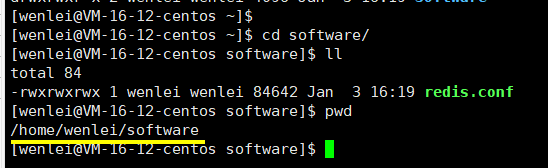

### 2.4启动Redis
`docker run -v /home/wenlei/software/redis.conf:/usr/local/etc/redis/redis.conf --name myredis -d -p 6379:6379 redis redis-server /usr/local/etc/redis/redis.conf`
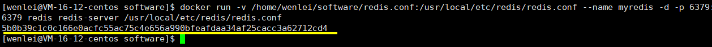

启动命令说明
* -v
    冒号":"前面的目录是宿主机（服务器）目录，后面的目录是容器内目录
* -p
    冒号":"前面的宿主机端口，后面的是容器内端口

这篇文章对其做了描述 [关于Docker目录挂载的总结](https://www.cnblogs.com/ivictor/p/4834864.html)

OK大功告成~

### 2.5是可视化远程链接
工具下载地址 [百度云链接](https://pan.baidu.com/s/1IfIoXDKzVPHFy9zcJmVrRQ)
提取码 ：51bl

链接方式:
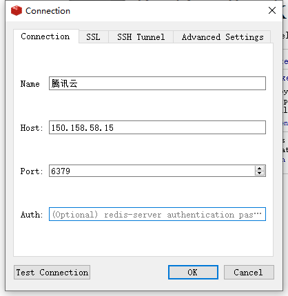

进入后效果：
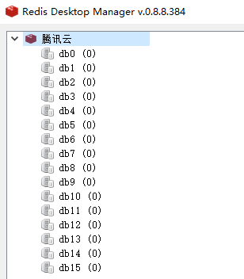

## 3.在Java中使用Redis

### 3.1准备
SpringBoot项目搭建
### 3.2引入依赖
```xml
<dependency>
    <groupId>org.springframework.boot</groupId>
    <artifactId>spring-boot-starter-data-redis</artifactId>
</dependency>
```
### 3.3在application.properties中配置redis参数
```yml
# Redis数据库索引
  redis:
    # redis数据库索引(默认为0)，我们使用索引为3的数据库，避免和其他数据库冲突
    database: 3
    # redis服务器地址（默认为loaclhost）
    host: XX.XXX.XXX.XXX
    # redis端口（默认为6379）
    post: 6379
    # redis访问密码（默认为空）
    # password: XXXX
    # redis连接超时时间（单位毫秒）
    timeout: 0
    # redis连接池配置
    pool:
      # 最大可用连接数（默认为8，负数表示无限）
      max-active: 8
      # 最大空闲连接数（默认为8，负数表示无限）
      max-idle: 8
      # 最小空闲连接数（默认为0，该值只有为正数才有用）
      min-idle: 0
      # 从连接池中获取连接最大等待时间（默认为-1，单位为毫秒，负数表示无限）
      max-wait: -1
```
### 3.4编写配置类
```java
package ink.poesy.life.config;

import com.fasterxml.jackson.annotation.JsonAutoDetect;
import com.fasterxml.jackson.annotation.PropertyAccessor;
import com.fasterxml.jackson.databind.ObjectMapper;
import org.springframework.cache.annotation.CachingConfigurerSupport;
import org.springframework.cache.annotation.EnableCaching;
import org.springframework.context.annotation.Bean;
import org.springframework.context.annotation.Configuration;
import org.springframework.data.redis.connection.RedisConnectionFactory;
import org.springframework.data.redis.core.*;
import org.springframework.data.redis.serializer.Jackson2JsonRedisSerializer;
import org.springframework.data.redis.serializer.StringRedisSerializer;

/**
 * redis 配置类
 * @ClassName RedisConfig
 * @Author wwl
 * @Date 2020/9/13 16:05
 * @Version 1.0
 **/
@Configuration
@EnableCaching//开启注解
public class RedisConfig extends CachingConfigurerSupport {
    /**
     * retemplate相关配置
     * @param factory
     * @return
     */
    @Bean
    public RedisTemplate<String ,Object> redisTemplate(RedisConnectionFactory factory){
        RedisTemplate<String,Object> template = new RedisTemplate<>();
        //配置连接工厂
        template.setConnectionFactory(factory);

        //使用Jackson2JsonRedisSerializer来序列化和反序列化redis的value值（默认使用JDK的序列化方式）
        Jackson2JsonRedisSerializer jacksonSeial = new Jackson2JsonRedisSerializer(Object.class);

        ObjectMapper om = new ObjectMapper();
        //指定要序列化的域，field，get和set，以及修饰符范围，ANY是都有包括private和public
        om.setVisibility(PropertyAccessor.ALL, JsonAutoDetect.Visibility.ANY);
        // 指定序列化输入的类型，类必须是非final修饰的，final修饰的类，比如String,Integer等会跑出异常
        om.enableDefaultTyping(ObjectMapper.DefaultTyping.NON_FINAL);
        jacksonSeial.setObjectMapper(om);

        // 值采用json序列化
        template.setValueSerializer(jacksonSeial);
        //使用StringRedisSerializer来序列化和反序列化redis的key值
        template.setKeySerializer(new StringRedisSerializer());

        // 设置hash key 和value序列化模式
        template.setHashKeySerializer(new StringRedisSerializer());
        template.setHashValueSerializer(jacksonSeial);
        template.afterPropertiesSet();

        return template;
    }

    @Bean
    public HashOperations<String,String ,Object> hashOperations(RedisTemplate<String,Object> redisTemplate){
        return redisTemplate.opsForHash();
    }

    /**
     * 对redis字符串类型数据操作
     *
     * @param redisTemplate
     * @return
     */
    @Bean
    public ValueOperations<String, Object> valueOperations(RedisTemplate<String, Object> redisTemplate) {
        return redisTemplate.opsForValue();
    }

    /**
     * 对链表类型的数据操作
     *
     * @param redisTemplate
     * @return
     */
    @Bean
    public ListOperations<String, Object> listOperations(RedisTemplate<String, Object> redisTemplate) {
        return redisTemplate.opsForList();
    }

    /**
     * 对无序集合类型的数据操作
     *
     * @param redisTemplate
     * @return
     */
    @Bean
    public SetOperations<String, Object> setOperations(RedisTemplate<String, Object> redisTemplate) {
        return redisTemplate.opsForSet();
    }

    /**
     * 对有序集合类型的数据操作
     *
     * @param redisTemplate
     * @return
     */
    @Bean
    public ZSetOperations<String, Object> zSetOperations(RedisTemplate<String, Object> redisTemplate) {
        return redisTemplate.opsForZSet();
    }


}
```

### 3.5编写工具类
```java
package ink.poesy.life.util;


import org.springframework.beans.factory.annotation.Autowired;
import org.springframework.data.redis.core.RedisTemplate;
import org.springframework.stereotype.Component;
import org.springframework.util.CollectionUtils;

import java.util.List;
import java.util.Map;
import java.util.Set;
import java.util.concurrent.TimeUnit;


/**
 * @ClassName RedisUtil
 * @Author wwl
 * @Date 2020/9/13 17:08
 * @Version 1.0
 **/
@Component
public class RedisUtil {

    @Autowired
    private RedisTemplate<String, Object> redisTemplate;

    public RedisUtil(RedisTemplate<String, Object> redisTemplate) {
        this.redisTemplate = redisTemplate;
    }

    /**
     * 指定缓存失效时间
     * @param key 键
     * @param time 时间(秒)
     * @return
     */
    public boolean expire(String key,long time){
        try {
            if(time>0){
                redisTemplate.expire(key, time, TimeUnit.SECONDS);
            }
            return true;
        } catch (Exception e) {
            e.printStackTrace();
            return false;
        }
    }

    /**
     * 根据key 获取过期时间
     * @param key 键 不能为null
     * @return 时间(秒) 返回0代表为永久有效
     */
    public long getExpire(String key){
        return redisTemplate.getExpire(key,TimeUnit.SECONDS);
    }

    /**
     * 判断key是否存在
     * @param key 键
     * @return true 存在 false不存在
     */
    public boolean hasKey(String key){
        try {
            return redisTemplate.hasKey(key);
        } catch (Exception e) {
            e.printStackTrace();
            return false;
        }
    }

    /**
     * 删除缓存
     * @param key 可以传一个值 或多个
     */
    @SuppressWarnings("unchecked")
    public void del(String ... key){
        if(key!=null&&key.length>0){
            if(key.length==1){
                redisTemplate.delete(key[0]);
            }else{
                redisTemplate.delete(CollectionUtils.arrayToList(key));
            }
        }
    }

    //============================String=============================
    /**
     * 普通缓存获取
     * @param key 键
     * @return 值
     */
    public Object get(String key){
        return key==null?null:redisTemplate.opsForValue().get(key);
    }

    /**
     * 普通缓存放入
     * @param key 键
     * @param value 值
     * @return true成功 false失败
     */
    public boolean set(String key,Object value) {
        try {
            redisTemplate.opsForValue().set(key, value);
            return true;
        } catch (Exception e) {
            e.printStackTrace();
            return false;
        }
    }

    /**
     * 普通缓存放入并设置时间
     * @param key 键
     * @param value 值
     * @param time 时间(秒) time要大于0 如果time小于等于0 将设置无限期
     * @return true成功 false 失败
     */
    public boolean set(String key,Object value,long time){
        try {
            if(time>0){
                redisTemplate.opsForValue().set(key, value, time, TimeUnit.SECONDS);
            }else{
                set(key, value);
            }
            return true;
        } catch (Exception e) {
            e.printStackTrace();
            return false;
        }
    }

    /**
     * 递增
     * @param key 键
     * @param delta 要增加几(大于0)
     * @return
     */
    public long incr(String key, long delta){
        if(delta<0){
            throw new RuntimeException("递增因子必须大于0");
        }
        return redisTemplate.opsForValue().increment(key, delta);
    }

    /**
     * 递减
     * @param key 键
     * @param delta 要减少几(小于0)
     * @return
     */
    public long decr(String key, long delta){
        if(delta<0){
            throw new RuntimeException("递减因子必须大于0");
        }
        return redisTemplate.opsForValue().increment(key, -delta);
    }

    //================================Map=================================
    /**
     * HashGet
     * @param key 键 不能为null
     * @param item 项 不能为null
     * @return 值
     */
    public Object hget(String key,String item){
        return redisTemplate.opsForHash().get(key, item);
    }

    /**
     * 获取hashKey对应的所有键值
     * @param key 键
     * @return 对应的多个键值
     */
    public Map<Object,Object> hmget(String key){
        return redisTemplate.opsForHash().entries(key);
    }

    /**
     * HashSet
     * @param key 键
     * @param map 对应多个键值
     * @return true 成功 false 失败
     */
    public boolean hmset(String key, Map<String,Object> map){
        try {
            redisTemplate.opsForHash().putAll(key, map);
            return true;
        } catch (Exception e) {
            e.printStackTrace();
            return false;
        }
    }

    /**
     * HashSet 并设置时间
     * @param key 键
     * @param map 对应多个键值
     * @param time 时间(秒)
     * @return true成功 false失败
     */
    public boolean hmset(String key, Map<String,Object> map, long time){
        try {
            redisTemplate.opsForHash().putAll(key, map);
            if(time>0){
                expire(key, time);
            }
            return true;
        } catch (Exception e) {
            e.printStackTrace();
            return false;
        }
    }

    /**
     * 向一张hash表中放入数据,如果不存在将创建
     * @param key 键
     * @param item 项
     * @param value 值
     * @return true 成功 false失败
     */
    public boolean hset(String key,String item,Object value) {
        try {
            redisTemplate.opsForHash().put(key, item, value);
            return true;
        } catch (Exception e) {
            e.printStackTrace();
            return false;
        }
    }

    /**
     * 向一张hash表中放入数据,如果不存在将创建
     * @param key 键
     * @param item 项
     * @param value 值
     * @param time 时间(秒)  注意:如果已存在的hash表有时间,这里将会替换原有的时间
     * @return true 成功 false失败
     */
    public boolean hset(String key,String item,Object value,long time) {
        try {
            redisTemplate.opsForHash().put(key, item, value);
            if(time>0){
                expire(key, time);
            }
            return true;
        } catch (Exception e) {
            e.printStackTrace();
            return false;
        }
    }

    /**
     * 删除hash表中的值
     * @param key 键 不能为null
     * @param item 项 可以使多个 不能为null
     */
    public void hdel(String key, Object... item){
        redisTemplate.opsForHash().delete(key,item);
    }

    /**
     * 判断hash表中是否有该项的值
     * @param key 键 不能为null
     * @param item 项 不能为null
     * @return true 存在 false不存在
     */
    public boolean hHasKey(String key, String item){
        return redisTemplate.opsForHash().hasKey(key, item);
    }

    /**
     * hash递增 如果不存在,就会创建一个 并把新增后的值返回
     * @param key 键
     * @param item 项
     * @param by 要增加几(大于0)
     * @return
     */
    public double hincr(String key, String item,double by){
        return redisTemplate.opsForHash().increment(key, item, by);
    }

    /**
     * hash递减
     * @param key 键
     * @param item 项
     * @param by 要减少记(小于0)
     * @return
     */
    public double hdecr(String key, String item,double by){
        return redisTemplate.opsForHash().increment(key, item,-by);
    }

    //============================set=============================
    /**
     * 根据key获取Set中的所有值
     * @param key 键
     * @return
     */
    public Set<Object> sGet(String key){
        try {
            return redisTemplate.opsForSet().members(key);
        } catch (Exception e) {
            e.printStackTrace();
            return null;
        }
    }

    /**
     * 根据value从一个set中查询,是否存在
     * @param key 键
     * @param value 值
     * @return true 存在 false不存在
     */
    public boolean sHasKey(String key,Object value){
        try {
            return redisTemplate.opsForSet().isMember(key, value);
        } catch (Exception e) {
            e.printStackTrace();
            return false;
        }
    }

    /**
     * 将数据放入set缓存
     * @param key 键
     * @param values 值 可以是多个
     * @return 成功个数
     */
    public long sSet(String key, Object...values) {
        try {
            return redisTemplate.opsForSet().add(key, values);
        } catch (Exception e) {
            e.printStackTrace();
            return 0;
        }
    }

    /**
     * 将set数据放入缓存
     * @param key 键
     * @param time 时间(秒)
     * @param values 值 可以是多个
     * @return 成功个数
     */
    public long sSetAndTime(String key,long time,Object...values) {
        try {
            Long count = redisTemplate.opsForSet().add(key, values);
            if(time>0) {
                expire(key, time);
            }
            return count;
        } catch (Exception e) {
            e.printStackTrace();
            return 0;
        }
    }

    /**
     * 获取set缓存的长度
     * @param key 键
     * @return
     */
    public long sGetSetSize(String key){
        try {
            return redisTemplate.opsForSet().size(key);
        } catch (Exception e) {
            e.printStackTrace();
            return 0;
        }
    }

    /**
     * 移除值为value的
     * @param key 键
     * @param values 值 可以是多个
     * @return 移除的个数
     */
    public long setRemove(String key, Object ...values) {
        try {
            Long count = redisTemplate.opsForSet().remove(key, values);
            return count;
        } catch (Exception e) {
            e.printStackTrace();
            return 0;
        }
    }
    //===============================list=================================

    /**
     * 获取list缓存的内容
     * @param key 键
     * @param start 开始
     * @param end 结束  0 到 -1代表所有值
     * @return
     */
    public List<Object> lGet(String key, long start, long end){
        try {
            return redisTemplate.opsForList().range(key, start, end);
        } catch (Exception e) {
            e.printStackTrace();
            return null;
        }
    }

    /**
     * 获取list缓存的长度
     * @param key 键
     * @return
     */
    public long lGetListSize(String key){
        try {
            return redisTemplate.opsForList().size(key);
        } catch (Exception e) {
            e.printStackTrace();
            return 0;
        }
    }

    /**
     * 通过索引 获取list中的值
     * @param key 键
     * @param index 索引  index>=0时， 0 表头，1 第二个元素，依次类推；index<0时，-1，表尾，-2倒数第二个元素，依次类推
     * @return
     */
    public Object lGetIndex(String key,long index){
        try {
            return redisTemplate.opsForList().index(key, index);
        } catch (Exception e) {
            e.printStackTrace();
            return null;
        }
    }

    /**
     * 将list放入缓存
     * @param key 键
     * @param value 值
     * @return
     */
    public boolean lSet(String key, Object value) {
        try {
            redisTemplate.opsForList().rightPush(key, value);
            return true;
        } catch (Exception e) {
            e.printStackTrace();
            return false;
        }
    }

    /**
     * 将list放入缓存
     * @param key 键
     * @param value 值
     * @param time 时间(秒)
     * @return
     */
    public boolean lSet(String key, Object value, long time) {
        try {
            redisTemplate.opsForList().rightPush(key, value);
            if (time > 0) {
                expire(key, time);
            }
            return true;
        } catch (Exception e) {
            e.printStackTrace();
            return false;
        }
    }

    /**
     * 将list放入缓存
     * @param key 键
     * @param value 值
     * @return
     */
    public boolean lSet(String key, List<Object> value) {
        try {
            redisTemplate.opsForList().rightPushAll(key, value);
            return true;
        } catch (Exception e) {
            e.printStackTrace();
            return false;
        }
    }

    /**
     * 将list放入缓存
     * @param key 键
     * @param value 值
     * @param time 时间(秒)
     * @return
     */
    public boolean lSet(String key, List<Object> value, long time) {
        try {
            redisTemplate.opsForList().rightPushAll(key, value);
            if (time > 0) {
                expire(key, time);
            }
            return true;
        } catch (Exception e) {
            e.printStackTrace();
            return false;
        }
    }

    /**
     * 根据索引修改list中的某条数据
     * @param key 键
     * @param index 索引
     * @param value 值
     * @return
     */
    public boolean lUpdateIndex(String key, long index,Object value) {
        try {
            redisTemplate.opsForList().set(key, index, value);
            return true;
        } catch (Exception e) {
            e.printStackTrace();
            return false;
        }
    }

    /**
     * 移除N个值为value
     * @param key 键
     * @param count 移除多少个
     * @param value 值
     * @return 移除的个数
     */
    public long lRemove(String key,long count,Object value) {
        try {
            Long remove = redisTemplate.opsForList().remove(key, count, value);
            return remove;
        } catch (Exception e) {
            e.printStackTrace();
            return 0;
        }
    }

}
```
### 3.6编写接口controller
```java
package ink.poesy.life.controller;

import ink.poesy.life.util.RedisUtil;
import lombok.extern.slf4j.Slf4j;
import org.springframework.beans.factory.annotation.Autowired;
import org.springframework.web.bind.annotation.GetMapping;
import org.springframework.web.bind.annotation.RequestMapping;
import org.springframework.web.bind.annotation.RequestParam;
import org.springframework.web.bind.annotation.RestController;

/**
 * @ClassName RedisController
 * @Author wwl
 * @Date 2020/9/13 17:16
 * @Version 1.0
 **/
@Slf4j
@RequestMapping("/redis")
@RestController
public class RedisController {
    private static int ExpireTime = 60;   // redis中存储的过期时间60s

    @Autowired
    private RedisUtil redisUtil;

    @GetMapping("/set")
    public boolean redisSet(@RequestParam("key")String key,@RequestParam("value")String vale){
        return redisUtil.set( key,vale);
    }

    @RequestMapping("get")
    public Object redisget(String key){
        return redisUtil.get(key);
    }

    @RequestMapping("/expire")
    public boolean expire(String key){
        return redisUtil.expire(key,ExpireTime);
    }
}
```
### 3.7调用接口试下
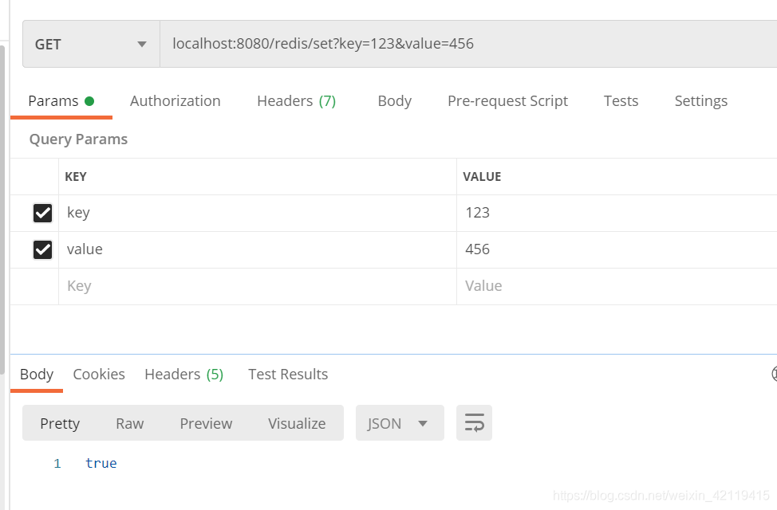

### 3.8可视化工具看下
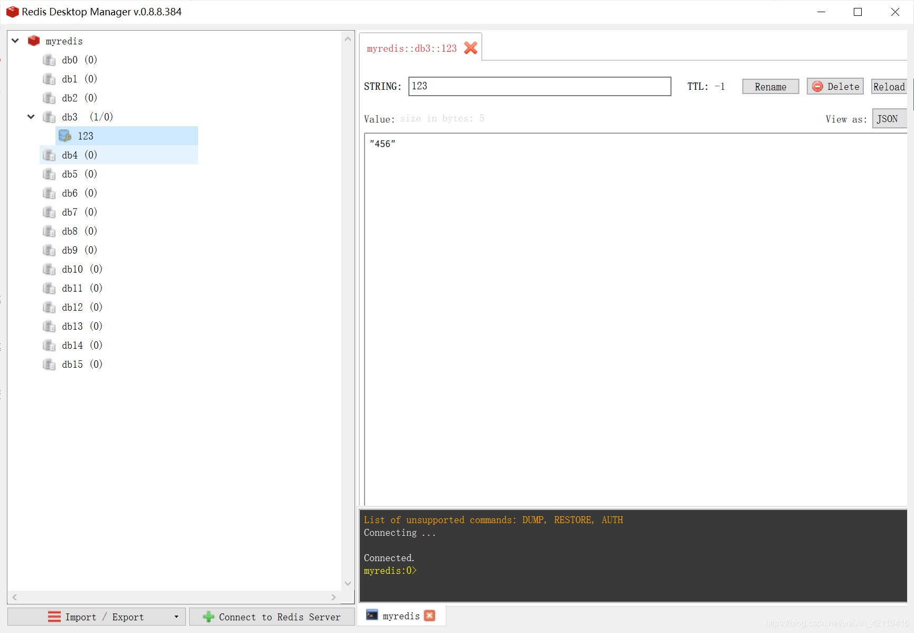

### 3.9调用get接口看看
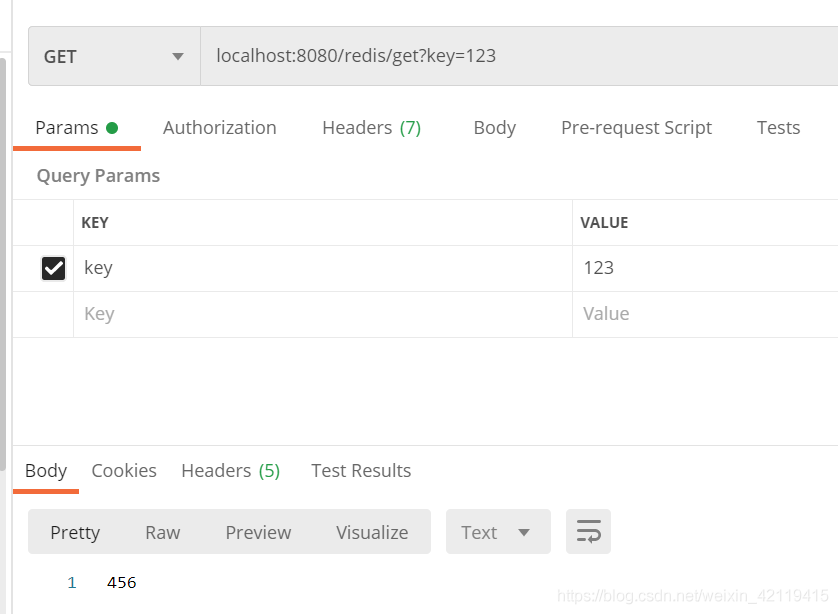

----
本节完~
