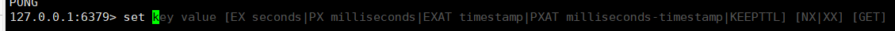
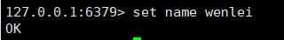
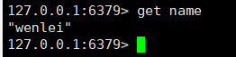
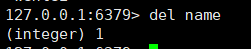
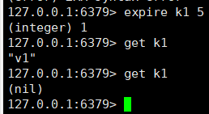
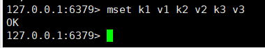
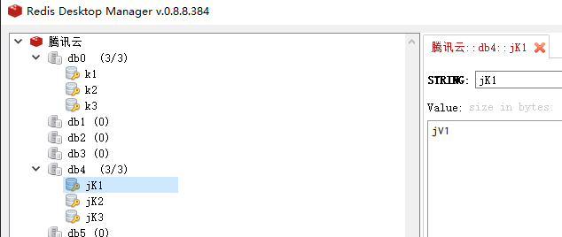
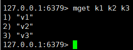
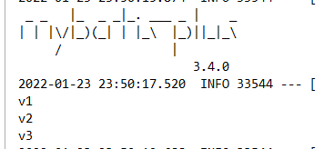

# Redis基础数据类型——string(字符串)
[[toc]]

## 单个键值对

### 插入
输入set查看提示



输入命令：`set name wenlei`


```java
@SpringBootTest
class SetString {
    @Autowired
    RedisUtil redisUtil;
    @Test
    void setString(){
        redisUtil.set("aaa","aaa");
    }
}
```

### 获取
输入命令：`get name`


```java
@SpringBootTest
class SetString {
    @Autowired
    RedisUtil redisUtil;
    @Test
    void setString(){
        System.out.println(redisUtil.get("aaa"));
    }
}
```

### 删除


```java
@SpringBootTest
class SetString {
    @Autowired
    RedisUtil redisUtil;
    @Test
    void setString(){
        redisUtil.del("aaa");
    }
}
```
### 过期


```java
public boolean set(String key, Object value, long time) {
    try {
        if (time > 0) {
            redisTemplate.opsForValue().set(key, value, time, TimeUnit.SECONDS);
        } else {
            set(key, value);
        }
        return true;
    } catch (Exception e) {
        e.printStackTrace();
        return false;
    }
}
```

## 批量键值对
### 批量插入


```java
@SpringBootTest
class SetString {
    @Autowired
    RedisUtil redisUtil;
    @Test
    void setString(){
        Map<String,String> map = new HashMap<>();
        map.put("jK1","jV1");
        map.put("jK2","jV2");
        map.put("jK3","jV3");
        redisUtil.mSet(map);
    }
}

@Component
public class RedisUtil {

    @Autowired
    private RedisTemplate<String, Object> redisTemplate;

    public void mSet(Map<String,String> map) {
        redisTemplate.executePipelined(new RedisCallback<String>() {
            @Override
            public String doInRedis(RedisConnection connection) throws DataAccessException {
                if (map != null) {
                    map.forEach((key,value) -> {
                        connection.set(key.getBytes(),value.getBytes());
                    });
                }
                return null;
            }
        });
    }

    public RedisUtil(RedisTemplate<String, Object> redisTemplate) {
        this.redisTemplate = redisTemplate;
    }
}
```
#### 插入效果展示
db4是java插入，db1是CLI插入



### 批量查询

```java
@SpringBootTest
class SetString {
    @Autowired
    RedisUtil redisUtil;
    @Test
    void setString(){
        List<String> keys = new ArrayList<>();
        keys.add("jK1");
        keys.add("jK2");
        keys.add("jK3");
        List<Object> objects = redisUtil.mGet(keys);
        for (int i = 0 ; i < objects.size() ; i++) {
            System.out.println((String)objects.get(i));
        }
    }
}

public List<Object> mGet(List<String> keys) {
    List<Object> list = redisTemplate.executePipelined(new RedisCallback<String>() {
        @Override
        public String doInRedis(RedisConnection connection) throws DataAccessException {
            for (String key : keys) {
                connection.get(key.getBytes());
            }
                return null;
        }
    });
    return list;
}
```

::: danger 注意
Java的RedisConfig中的序列化配置会影响插入和查询

遇到
`
org.springframework.data.redis.serializer.SerializationException: Could not read JSON
`
问题

修改配置类：`redisTemplate.setValueSerializer(new StringRedisSerializer());`
:::

### 批量删除
```java
@SpringBootTest
class SetString {
    @Autowired
    RedisUtil redisUtil;
    @Test
    void setString(){
        redisUtil.del("jK1","jK2","jK3");
    }
}
```

### 字符串描述
Redis的字符串是动态字符串，是可以修改的字符串，内部结构的实现类似于Java的ArrayList，采用预分配冗余空间的方式来减少内存的频繁分配。
当字符串长度小于1M时，扩容都是加倍现有的空间。
如果字符串长度超过1M时，扩容一次只会扩1MB的空间。
注意：字符串的最大长度为512M

#### embstr VS raw
Redis 的字符串有两种存储方式，在长度特别短时，使用embstr形式存储。而长度超过44字节时，使用raw形式存储。

```c
// Redis对象头结构
struct RedisObject {
    int4 type;              // 4bit
    int4 encoding;          // 4bit
    int24 lru;              //3字节
    int32 refcount;         //4字节
    void *ptr;              //8字节
}
// Redis字符串 就是Simple Dynamic String
struct SDS{
    int8 capacity;          // 1字节
    int8 len;               // 1字节
    int8 flags;             // 1字节
    byte[] content;         // 内联数组长度为capacity
}
```

所以留给content的长度最多只有45字节（64-19），字符串又是NULL结尾所以就44字节是界限。

---
完~
