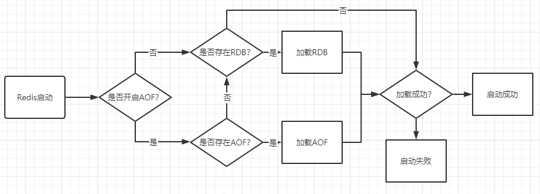

---
---
# Redis
[[toc]]

## Redis所有命令集合
[Redis所有命令集合](http://doc.redisfans.com/)

## Redis数据类型的应用

* String：最基本数据类型，最大512M。缓存、计数器、共享用户session、分布式锁、分布式系统的全局序列号
* list：按照添加顺序保持顺序的字符串列表。栈、队列、阻塞队列、最新列表
* set：无序的字符串结合，不存在重复元素。用户标签、好友/关注/粉丝/感兴趣的人集合、随机展示、黑/白名单、抽奖小程序
* sorted set：已排序的字符串集合，不允许重复。标签、共同好友/喜好、统计网站的独立IP、统计点赞/取消点赞、排行榜。
* hash：key-value对的集合，特别适合用于存储对象。存储对象、电商购物车
* bitmap：更细化的一种操作，以bit为单位
* hyperloglog：基于概率的数据结构，为V2.8.9新增
* geo：存储地理位置信息，对这些信息进行操作，V3.2新增
* stream：流，相当于消息队列的topic，为5.0新增
## Redis内存淘汰机制

* volatile-lru：针对设置了过期时间的key，使用lru（最近最少使用）算法进行淘汰
* allkeys-lru：针对所有key使用lru算法进行淘汰
* volatile-lfu：针对设置了过期时间的key，进行lfu（最不经常使用）算法进行淘汰
* allkeys-lfu：针对所有key使用lfu算法进行淘汰
* volatile-random：针对设置了过期时间的key，使用随机淘汰机制进行淘汰
* allkeys-random：针对所有的key使用随机淘汰机制进行淘汰
* volatile-ttl：针对设置了过期时间的key，越早过期的越先被淘汰
* noeviction：不会淘汰任何数据，当使用空间超过maxmemory值时，再有请求来是返回错误。
## Redis挂了怎么办？

Redis是基于内存的非关系型K-V数据库，既然它是基于内存的，如果Redis服务器挂了，数据就会丢失。为了避免数据丢失了，Redis提供了持久化，即把数据保存到磁盘。
Redis提供了RDB和AOF两种持久化机制，它持久化文件加载流程如下：

RDB持久化，是指在指定的时间间隔内，执行指定次数的写操作，将内存中的数据集快照写入磁盘中，它是Redis默认的持久化方式。执行完操作后，在指定目录下会生成一个dump.rdb文件，Redis 重启的时候，通过加载dump.rdb文件来恢复数据。
* 优点
    - 适合大规模的数据恢复场景，如备份，全量复制等

* 缺点
    - 没办法做到实时持久化/秒级持久化。
    - 新老版本存在RDB格式兼容问题

AOF持久化，采用日志的形式来记录每个写操作，追加到文件中，重启时再重新执行AOF文件中的命令来恢复数据。它主要解决数据持久化的实时性问题。默认是不开启的。

* 优点
    - 数据一致性和完整性很高
* 缺点
    - AOF记录的越多，文件越大，数据恢复变慢
